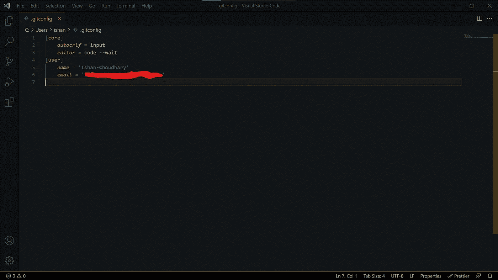
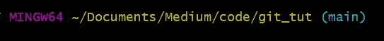
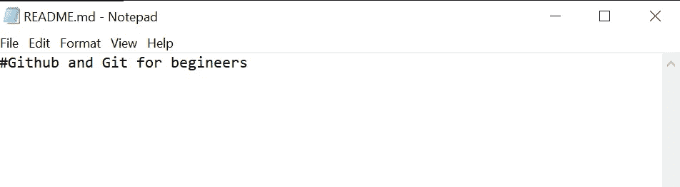
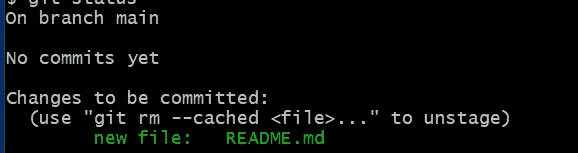

# 面向初学者的 GitHub 和 Git 第 1 部分

> 原文：<https://levelup.gitconnected.com/github-and-git-for-beginners-part-1-97b531618af9>


罗曼·辛克维奇在 [Unsplash](https://unsplash.com/s/photos/git?utm_source=unsplash&utm_medium=referral&utm_content=creditCopyText) 上拍摄的照片

今天的博客将是关于 GitHub 和 Git 基础的两部分系列的第一部分。GitHub 是一款版本控制软件，是所有程序员的必备技能。GitHub 被许多不同的公司使用，比如微软、苹果等等。这是他们的[网站](https://github.com/)。

一个例子是你在代码中犯了一个错误，导致整个程序崩溃。在这种情况下，您可以使用 GitHub 从本质上回到您的代码工作的地方。在您的编程之旅中，还有更多的特性可以帮助您。

在我们继续之前，我强烈建议您学习终端或命令提示符的基本命令。我们需要这些。

先说 Git。你可以认为 Git 基本上是 GitHub 的命令行版本。您可以使用 Git 将本地代码的更改发送到 GitHub 存储库。稍后我会在博客中解释什么是存储库。

所以要开始，你需要做两件主要但相对容易的事情。第一个是在 github.com 创建一个帐户，第二个是安装 Git。点击[这个链接](https://git-scm.com/downloads)进行安装。macOS 和 Linux 用户不必安装 Git，因为它已经是内置的了。

在 windows 中安装 Git 也会安装另一个名为 git bash 的应用程序。我强烈推荐 windows 用户使用 git bash，这样你就可以使用 macOS 命令了。现在我们都建立了。我们需要配置一些东西。首先，打开您的终端或命令提示符或 git bash，这取决于您所在的操作系统和您的偏好。然后键入:

```
git config --global user.name "Your Github username here"
git config --global user.email "Your email linked to github here"
git config --global core.editor "Your primary editor"
```

下面是一个例子(我使用 VScode 作为我的主要编辑器):

```
git config --global user.name Ishan-Choudhary
git config --global user.email your-email@gmail.com
git config --global core.editor "code --wait"
```

这使 Git 知道哪个 GitHub 帐户正在被使用，以及您的主要代码编辑器。接下来要设置的是 autocrlf。现在，什么是 autocrlf？这是一个处理你上传到 GitHub 的文件行尾的配置。在 windows 中，行尾用两个唯一的字符标记。一个是回车符或' \r '，另一个是换行符或\n，在 macOS 或 Linux 系统中，仅使用换行符或\n 来标记行尾。例如:

```
#ON WINDOWS
Hello \r\n
Hi#ON MAC/LINUX
Hello \n
Hi
```

如果我们不对 Git 进行适当的配置来处理行尾，这将会导致一些问题。这种配置称为“autocrlf”。例如，假设两个用户正在使用一个 GitHub 存储库，并且他们没有配置 autocrlf。一个用 Mac，一个用 Windows。现在，Windows 用户在文件中新建一行，然后将更改上传到他的 GitHub 存储库中。现在，Mac 用户想要查看更改，因此该用户将文件下载到她的文件夹中并查看它:

```
#WHAT THE WINDOWS USER SEE's
Hello \r\n
Hi
#WHAT THE MAC USER SEE's
Hello \r
Hi
```

mac 用户看到这一点是因为，对他们来说，行尾只意味着' \n '。因此' \n '将被删除，但' \r '将保留。同样，如果 Mac 用户新建一行，对他来说，也只会是换行或者' \n '。但是，当 windows 用户看到同一个文件时，他不会有任何新行，因为对于 windows 用户，新行用回车和换行符或' \r\n '标记。

所以如果你用的是 windows。类型:

```
git config --global core.autocrlf true
```

如果您使用的是 Mac 或 Linux，请键入:

```
git config --global core.autocrlf input
```

就像这样，您已经配置了 Git，如果 windows 用户从 GitHub 下载文件，它会自动添加一个' \r '，该文件最后是由 Mac/Linux 机器编辑的。如果 Mac 用户从 GitHub 下载了 windows 机器上一次编辑过的文件，请删除“\r”。

好了，为了对我们的配置进行最后的检查，让我们打开配置文件。所以键入:

```
git config --global --edit
```

应该会弹出这样的内容:



我使用 Visual Studio 代码作为我的主要编辑器，所以我得到一个这样的窗口。对于选择了不同编辑器的人，可能会弹出不同的窗口。但是，除了 autocrlf 字段因操作系统而异之外，内容应该大致相同。如果你想改变什么，你可以在这里改变。完成更改后，关闭窗口。

至此，Git 设置完毕，现在是时候学习一些命令来使用 GitHub 和 Git 了。

好的，首先，让我们创建一个新的存储库。存储库是包含所有文件的文件夹。在此文件夹中本地进行的更改将在 GitHub 网站上创建的存储库中更新。因此，导航到您的项目文件夹。打开您的终端，或右键单击并选择“Git Bash here”类型:

```
git init
```

您应该会收到以下消息:

```
Initialized empty Git repository in /path/to/project_folder/.git
```

这意味着建立了一个储存库。的。git 是项目的配置文件夹。也说明这是一个储存库。如果您正在使用 Git Bash，您还应该看到类似这样的内容:



请参见写在目录后面的“主”文本。这说明你在主支。什么是分支？想象一棵树。一棵树有许多树枝。你可以把你的 git 库想象成一个有许多分支的树，你可以在不改变原始代码的情况下添加新的特性，这样即使那个分支中的代码中断了，你的“主”或者“主”分支仍然有添加特性之前的代码。默认情况下，存储库总是包含一个“主”或“主”分支。我们也可以创建新的分支。

现在让我们创建一个样本文件。通常，每当我们创建一个存储库时，我们都会向其中添加一个名为“README.md”的文件。这个文件将告诉您安装存储库的步骤以及存储库是什么。所以键入:

```
touch README.md
echo "#GitHub and Git for beginners" >> README.md
```

在 echo 之后，你可以放任何你想要的信息。“#”键用于指定标题文本，这就是我将文章标题放在那里的原因。运行该命令后，不应弹出任何消息，但如果您检查 README.md 文件(可以用记事本打开它)



好了，现在关闭“README.md”，让我们将这些更改保存到 Git。因此，要保存更改，您必须首先将文件添加到临时区域。临时区域是代码第一次发送的地方，这样，如果您在一个小组中工作，其他人可以在我们提交更改之前检查该代码。所以要做到这一点:

```
git add .
```

“.”告诉添加整个文件夹。如果您只想添加特定文件，请键入相同的命令，但不要键入“.”键入文件名。现在，让我们看看我们是否已经将文件添加到临时区域。类型:

```
git status
```

您应该会看到这样结果:



这告诉我们 README.md 文件已经添加到临时区域。现在是提交变更的时候了。提交是您保存的代码的快照，以便您可以随时返回。例如，如果您的代码崩溃，这是有益的。

所以键入:

```
git commit -m "YOUR COMMIT MESSAGE"
```

提交消息是您添加的文本消息，用于解释您所做的更改。如果您喜欢在编辑器中而不是在终端中编写此消息。类型:

```
git commit
```

您之前声明的默认代码编辑器将会打开，并且会出现如下文本:

```
*# Please enter the commit message for your changes. Lines starting**# with '#' will be ignored, and an empty message aborts the commit.**#**# On branch main**#**# Initial commit**#**# Changes to be committed:**#   new file:   README.md**#*
```

在最后一个“#”符号下键入您的消息，然后保存并关闭文件。一旦你关闭了它，无论你现在已经改变了什么，它们都将被提交。

好了，这就是我的博客。在本博客的下一部分，我们将最终把我们的代码与 GitHub 合并，并学习其他命令。请关注我，了解本博客的第 2 部分。

感谢阅读！

编辑:[点击此链接](/github-and-git-for-beginners-part2-3c732f93fbe3)阅读本博客的第二部分