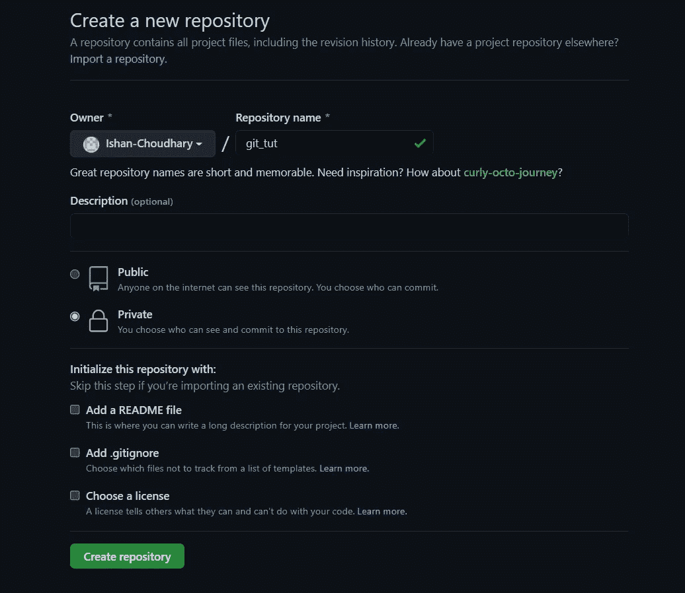
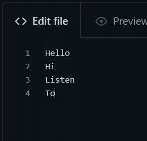

# 面向初学者的 GitHub 和 Git 第 2 部分

> 原文：<https://levelup.gitconnected.com/github-and-git-for-beginners-part2-3c732f93fbe3>


照片由[扬西·敏](https://unsplash.com/@yancymin?utm_source=medium&utm_medium=referral)在 [Unsplash](https://unsplash.com?utm_source=medium&utm_medium=referral) 上拍摄

大家好，欢迎来到 GitHub 和 Git 初学者系列的第二部分。在今天的博客中，我们将把我们的代码与 git 合并，并更深入地探索分支。

在上一篇博客中，我们提交了所有的修改。如果你还没有读过，那么点击这个链接查看一下[。现在是时候将这些更改发送到我们的 GitHub 库了。首先用你的账户登录 GitHub，你应该会看到这样的内容:](/github-and-git-for-beginners-part-1-97b531618af9)


单击“新建”按钮，然后为您的存储库命名。选择“私有”,这样只有您和其他拥有该存储库链接的人才能查看它。它应该是这样的:



单击创建存储库。您应该进入这样一个页面:


你可以看到，就在首页上，有一些步骤是关于如何使用 git 从命令行创建一个新的存储库，如何在本地创建一个新的存储库并将其导入到 GitHub 中，如何导入一个现有的本地存储库，以及如何从另一个存储库导入代码。我们将使用第二个。

所以你需要做的就是打开本地 GitHub 库的文件夹。然后打开终端，输入以下命令:


对你来说,“git 远程添加原点”之后会有一个不同的链接。因为您的存储库和帐户将有不同的名称。此外，我强烈建议您不要**复制**命令，而是**键入**命令，因为有时会出现错误。

一旦你完成了这些，只要刷新你的 GitHub 页面，你应该会看到这样的内容:


现在让我解释一下这些命令。“git remote add origin”基本上将本地初始化的存储库连接到 GitHub 存储库。这意味着现在您的存储库是远程存储库，而不是本地存储库。“git branch -M main”将您带到主分支。如果您还记得，您的存储库就像一棵树，其中有一个默认分支，您可以创建其他分支。这个默认分支称为“main”，在某些情况下称为“master”。

在进入最后一个命令之前，让我们理解什么是“推送提交”。通过“提交”,您基本上保存了代码在那个时间点的快照。通过推送，您将提交或“快照”发送到 git hub。它还会发送您的本地存储库的内容，并在 GitHub 中更新它

现在，最后一个命令‘git push-u origin main’告诉 git 发送代码的快照以及包含代码的文件夹的内容。例如，您有一个包含“README.md”文件的文件夹。现在这个文件也会被发送到 GitHub。

现在让我们来看看如何制作新的分支。因此，要创建新的分支，只需键入:

```
git checkout -b new_branch
```

分支名称不能包含空格。我刚刚创建了一个名为 new_branch 的分支，当你创建一个分支时，你也进入了这个分支。因此，如果您正在使用 git bash，您应该会看到类似这样的内容:


分支名称用青色书写。你所有的文件将保持不变，但现在如果你创建一个新文件或添加任何新文件，它将被限制在那个分支。不会在其他任何分支出现。让我们来看看实际情况。首先，我将打开 VsCode，因为它集成了 git，所以我们可以看到变化。我将创建一个名为“test.txt”的新文件:


你们都可以看到文件的内容。我已经在“new_branch”分支上创建了这个文件。现在提交更改，然后切换分支并查看结果:


他们的你有它！该文件保留在它被提交到的分支，即“新分支”。

我们已经看到了如何将所有更改推送到我们的 GitHub 存储库。你只要说:

```
git push origin 'branch name'
```

现在，如果我们检查 GitHub:


在那里！我们的改变。如果你在 GitHub 中切换分支，你可以点击写有分支名称的下拉框。您将看到主分支中没有 test.txt 文件。

分支主要用于，例如，当您在项目中创建一个新特性，但是担心更改会破坏您的代码，并且还希望确保保留没有新特性的原始代码时。就做一个新的分支。因为默认分支中的所有文件都将被复制到新分支中，所以您可以开始进行更改了。一旦你确定一切正常。是时候将 ***合并*** 默认分支和你的工作分支了。要合并分支，只需转到默认分支，并键入:

```
git merge 'branch name'
```

你必须在这个分支上，这个分支需要有另一个分支合并到其中。所以我在 new_branch 中有 test.txt 文件。一旦您合并了分支，您将会看到，test.txt 将会出现在主分支中，而 new_branch 将保持不变。

现在我们如何通过 GitHub**提取**我们所做的改变。假设我去了我的存储库，对 test.txt 进行了修改。你可以在 GitHub 上对存储库中的文件进行修改，方法是点击你想要编辑的文件，然后点击铅笔按钮:


然后更改文件并提交它:



做出改变


向下滚动并找到此按钮以提交更改

写下你想要的提交名。没有必要放入提交描述，尽管您可以这样做。现在单击绿色的提交更改按钮。更改已提交。

如果你在笔记本电脑里看到你的文本文件。变化还没有发生。这是因为这个文件夹不知道 GitHub 站点上发生了什么变化。因此，我们需要**将更改**到我们的文件夹中。

转到您的终端，切换到您提交的分支:

```
git checkout branch_name_here
```

您将会得到如下消息:


现在让我们撤回我们的提交。类型:

```
git pull
```

然后查看更改后的文件。对我来说是 test.txt:


基本上就是这样。你已经做出了改变。现在最后一件事是**如何**看到你所有的提交。为此，只需在您的终端上键入:

```
git log
```

你会得到这样的结果:


就是这样！你已经学会了如何使用 GitHub 和 Git。我没有向您展示所有的命令；但是我所展示的已经足够让你开始在项目中使用 GitHub 了。这是关于如何使用 GitHub 的两部分博客的结尾。

不管怎样，这一次就这样了。如果你认为其他人会发现这很有用，请分享它，并关注我以获得更多这样的教程。

感谢阅读！