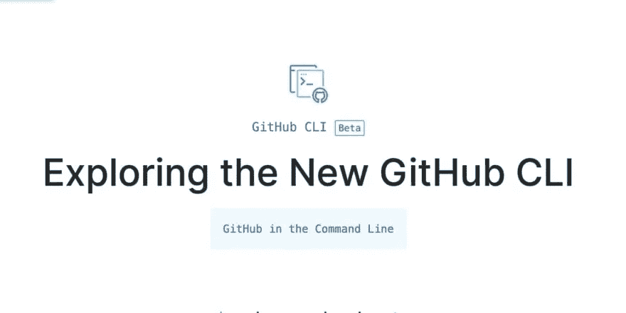

# Github CLI —将 Github 带到命令行

> 原文：<https://levelup.gitconnected.com/github-cli-bring-github-to-the-command-line-af5d69a27bb5>



如果你是一个非常活跃的 Github 用户，Github CLI 是你可以马上开始使用的有用工具之一。

你可以在这里 访问 [**回购。**](https://github.com/cli/cli)

这仍然是在测试阶段，但你仍然可以使用它。它将 PRs、问题和 Github 的其他有用特性带到命令行中。

我将介绍一些我认为非常有用的命令。你也可以使用这个工具。

## 列出拉取请求

您可以列出回购的所有 pr。

有一些选项可用于筛选带有受让人、基本分支机构和标签的 PRs。

**例句**:

```
**gh pr list --label "WIP, help"** // List PRs with the provided labels**gh pr list --base "master"** // List PRs with master as base**gh pr list --assignee "john"** // List PRs with respective assignee
```

## 创建拉取请求

使用 CLI 创建 PR 非常简单。这能让你真正富有成效。

```
gh pr create
```

上面的命令是一个非常基本的选项。这将创建一个以 ***主*** 为基础分支，以 ***当前分支*** 为目标分支的 PR。

还有其他选项来改变基本分支、标记、分配人员等

**示例**:

```
**gh pr create --base develop** // Here ***develop*** is the base branch**gh pr create --title "PR title"** // Create a PR with title**gh pr create --reviewer "john, arya"** // Assign reviewers**gh pr create --label "prod, help"** // Assign labels
```

## 查看拉式请求更改

```
gh pr diff <PR number/url> **Example** gh pr diff 3
```

上述命令将显示各个 PR 的差异。如果你想在公关方面做些小的改变，这将会派上用场。

## 制造问题

从 CLI 创建一个简单的问题经常会派上用场。

```
gh issue create **--title** "Search not working" **--body** "Search in main dashboard is not working"
```

上述命令将创建一个具有各自标题和正文的新问题。

还有其他有用的选择

**例题**

```
**gh issue create --label "help, priority"** // You can assign multiple labels**gh issue create --assignee "john, arya"** // You can assign people
```

## 上市问题

```
gh issue list
```

这将列出所有问题。

**例题**

```
**gh issue list --label "help, priority"** // List issues by labels**gh issue list --assignee "john, arya"** // List issues by assignees**gh isssue list --author "srebalaji"** // Lists issues by people who created the issue
```

## 创作主旨

这是我的最爱之一。您可以从命令行本身创建一个公共或私有要点。

```
gh gist create main.js
```

上面的命令将用给定的文件创建一个私有 gist。

默认情况下，gists 是私有的。

其他选项，

```
**gh gist create --public main.js** // Creating a public gist**gh gist create main.js -d "NodeJS example"** // Creating a gist with a description**gh gist create main.py copy.py home.py** // Creating a gist with multiple files
```

Github CLI 是您可以使用的非常有用的命令行工具。我已经用了几个星期了，我可以说它非常有用。当然，有一些小问题，但我相信在即将到来的版本中会得到解决。

如果你经常使用 Github，强烈推荐。

感谢您的阅读:)

> 如果你已经来了这么久，那么我想你会对 Git 更感兴趣。可以订阅我的简讯[**GitBetter**](https://gitbetter.substack.com/)**获取 Git 的招数、技巧、高级话题。**