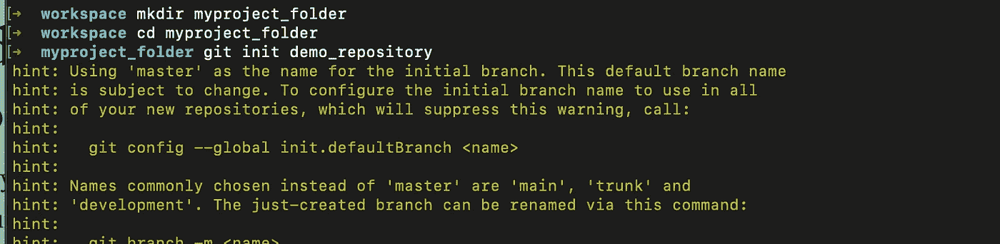
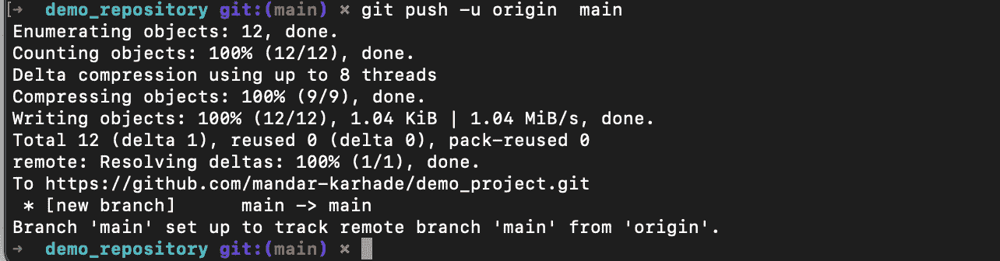

# 开始版本控制之旅的 Github 命令:第 1 部分

> 原文：<https://levelup.gitconnected.com/github-commands-to-start-your-version-control-journey-part-1-cae9cec5bffa>

在本教程中，我假设你已经设置了 github 帐户。如果没有，请花 5 分钟在本地设置您的帐户。

[](https://medium.com/@thinkbot/step-by-step-setting-github-account-for-the-first-time-8a04887c709d) [## 分步操作:首次设置 Github 帐户

### 当您在一台新机器上设置 git 时，您应该做一些事情。Github 有很棒的文档，但是…

medium.com](https://medium.com/@thinkbot/step-by-step-setting-github-account-for-the-first-time-8a04887c709d) 

现在让我们从一些基本的开始。

## 创建新的存储库

我们想要创建一个新的存储库。我建议您创建一个文件夹来存放您的存储库。就我而言，我保留了通用名，但可以随意编辑。在这里，git init 创建一个名为 repository 的文件夹。附加信息是，默认初始分支的名称是 master，可以使用配置选项进行更改，如下所示。(稍后将详细介绍分支)

```
mkdir myproject_folder
cd myproject_folder 
**git init** demo_repository
```



## 你的第一次承诺

只是为了演示，我创建了一个文本文件“abcd.txt”并提交了我的第一次提交。预期的输出是 git 理解我们提交了当前状态，并且提交成功。在命令 git commit **-m** 中，选项允许我们添加一个与提交相关的注释。之后你可以在 github 上看到所有这些提交，这样你就可以知道在提交过程中你做了什么。这对于确保评论信息丰富非常重要。

```
cd demo_repository
touch "abcd.txt"
git commit -m "my first commit"
```


但是如你所见，未被跟踪的文件显示 abcd.txt 目前未被跟踪！在下一步中，我们将要求 git 跟踪该文件。

## 正在添加要提交的文件

让我们使用 git add 命令将文件添加到 git 跟踪的文件中。现在我们需要提交变更。让我们添加注释:添加这个新提交的原因。

```
git add abcd.txt
git commit -m "Oops! previous commit was blank. Added the file to commit"
```


现在我们看到 1 个文件被更改，没有插入(如果一个文件被更改并且添加了一些文本，它将在这里显示为正数，删除部分显示为负数)。

git add 的一个特点是将目录中的所有文件添加到一个提交中。人们可以使用:

```
git add *
```

但是我建议不要这么做。建议只添加您想要进行版本控制的文件。这样，如果您在同一个目录中保存一些敏感信息，如凭证或一些粗略的文件，如试验输出，它们就不会被提交。

在这里，我添加了两个文件，然后将它们同时添加到提交中。


## 克隆目录

你并不总是需要从头开始。也许你在 github 上看到了一个好项目，你需要在本地克隆它，这样你就可以开始编辑代码并为开源世界做出贡献。让我们在 kaggle 存储库上尝试一下。从代码(绿色) >本地> HTTPS 中复制 url 并使用 git 克隆。

```
git clone [https://github.com/Kaggle/kaggle-api.git](https://github.com/Kaggle/kaggle-api.git)
```


正如您所看到的 git 克隆，克隆了 kaggle 存储库(repo)。当我检查文件夹 myproject_folder 时，我现在看到两个文件夹。一个用于 demo_repository，其中 abcd.txt a.txt 和 b.txt，另一个用于 kaggle-api repo。

## 看到什么改变了

假设您想知道文件中发生了什么变化。我将在 abcd.txt 文件中添加两行文本，然后运行 git diff。Git diff 输出显示 abcd.txt 中没有删除任何内容。并增加了 2 行。如果更改了多个文件，它将显示每个文件的摘要。Git diff 显示了自上次提交以来的变化。


## 显示 git 状态

git status 命令有助于显示当前状态。目前，状态显示两个文件都已修改。git diff 显示最后一行是在上次提交后添加到 abcd.txt 中的。


git 差分输出


## 从 git 中删除文件

假设我们不打算将 b.txt 包含到 git 中，但是我们不小心包含了。要删除该文件，我们可以运行 git rm filename 命令。如果文件没有被修改，用户可以删除它。在这里，我们的意思是删除意味着从跟踪文件移动到未跟踪。为了实现它，我们将不得不使用缓存选项。使用 cached 从 git 中删除文件时，文件会保留在文件夹中。只是让它不被跟踪，如第二个截图所示。


## 查看版本历史

Git log 命令允许您查看变更的整个版本历史。下面是所有提交的日志的样子。每个日志都有一个提交散列、哪个分支(Head -> master)、作者、日期时间和提交注释。


## 显示当前提交和有效的更改。

git show 是深入了解所有变化的另一种方式。它显示了最近一次提交的每个文件操作、添加、删除和提交散列。


## 将回购推送到 git 服务器

到目前为止，每次提交都是本地提交。我们需要把它推到云/服务器上，这样我们就可以和其他有机会处理你创建的文件的人合作

到了[https://github.com/new](https://github.com/new)。创建新的存储库。在下一个屏幕上，您应该会看到从命令行推送现有存储库的选项(就像我们已经做的那样)。

```
git remote add origin [https://github.com/mandar-karhade/demo_project.git](https://github.com/mandar-karhade/demo_project.git)
git branch -M main
git push -u origin main
```

就是这样，你应该能看到这样的输出。git remote 将远程存储库 url 添加到本地配置中。Git branch 创建一个名为 main 的分支。git push 将 u(名为 main 的上游分支)连接到本地分支起点。这个设置只需要做一次。稍后当我们学习 Git pull 和 git push 命令时，这个引用被隐式地用于连接本地和远程分支。



我猜我们将需要这个系列是多部分的。！下一部分见。

如果这篇文章对你有帮助，请通过长时间按住喜欢按钮来分享一些爱。

请 [***成为会员***](https://ithinkbot.com/membership) 和[***订阅***](https://ithinkbot.com/subscribe) 获取更简洁的教程。