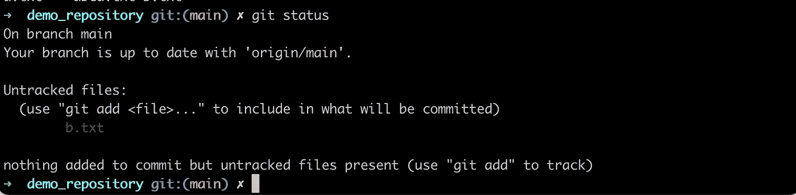
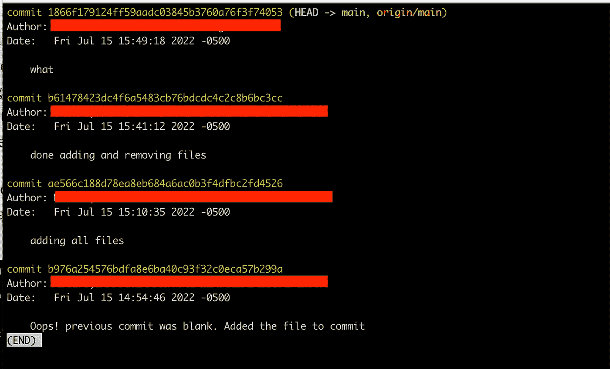
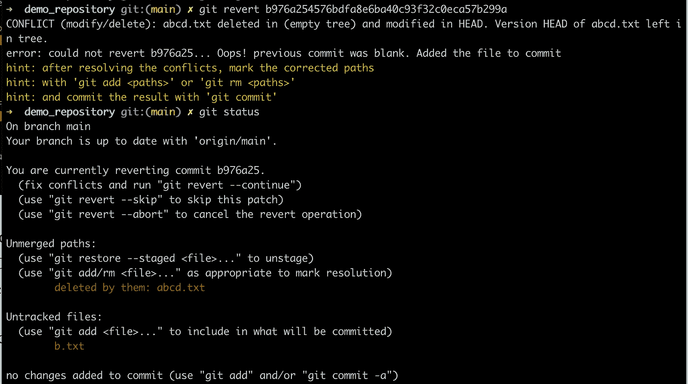
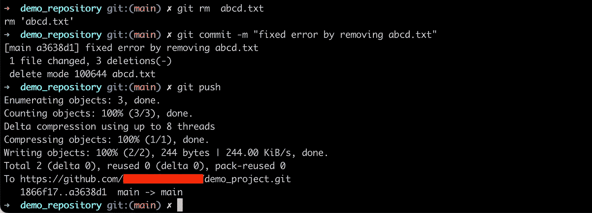
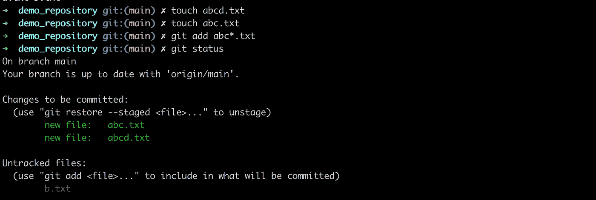
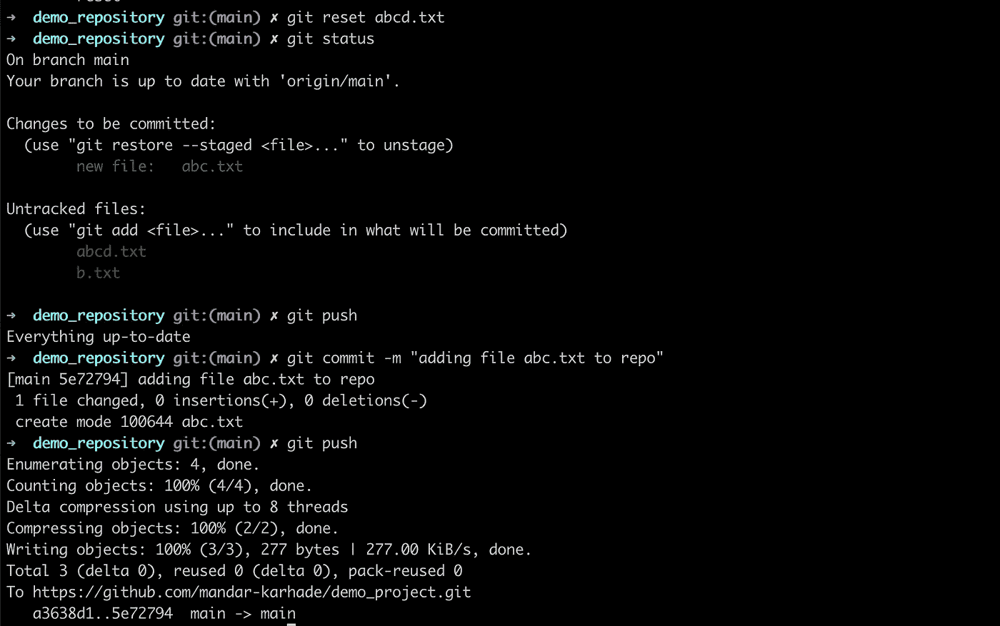

# 开始版本控制之旅的 Github 命令:第 2 部分

> 原文：<https://levelup.gitconnected.com/github-commands-to-start-your-version-control-journey-part-2-c8599bdc0253>

在这一部分中，我们将处理所有常见的场景，在这些场景中，我们想要“修复”一些“问题”！

**请从这篇文章开始**

[](https://ithinkbot.com/github-commands-to-start-your-version-control-journey-part-1-cae9cec5bffa) [## 开始版本控制之旅的 Github 命令:第 1 部分

### 在本教程中，我们将学习让你开始使用 github 的命令

ithinkbot.com](https://ithinkbot.com/github-commands-to-start-your-version-control-journey-part-1-cae9cec5bffa) 

现在我们已经在第 1 部分中设置了 git 快速提醒一下，我们有两个文件存放的地方。第一个是本地(您的计算机)，第二个是远程(在云上)。当您对文件进行更改时，它们总是先在本地进行。这些提交(当您使用`git commit -m “comment”` 提交时)总是本地的。这就是为什么即使没有互联网你也可以在上面工作。使用 git push 将您的提交推送到云/远程是一个好习惯—

在我们开始之前，这是我们目前的状态。我们有 1 个未更改的跟踪文件和作为未跟踪文件的`b.txt`。



与仓库的云版本/远程版本相比，git push 显示一切都是最新的。


Git 日志显示以前的提交及其详细信息(提交)分支为`HEAD`，远程分支为`origin/main`



每次提交都用一个 40 个字符的哈希来标识(最后一个哈希`b976a254576bdfa8e6ba40c93f32c0eca57b299a`)。每个散列都是唯一的，这就是 git 跟踪每次提交的方式。

## 哎呀，我犯了一个错误:

假设我们提交了一个文件更改，然后发现我们需要恢复——可以使用 git revert 来恢复到之前的版本，如下所示。恢复后可能会出现错误(也如下所示)。



这是因为`HEAD`指的是您的本地环境，而`b976a`是您(通过`pull`合并的)分支顶端的 SHA。所以，Git 不知道是删除文件还是保留文件。您应该首先确认是否要保留该文件。这将是暂存文件(如果您想保留它)(`add`)或删除文件(`rm`)。最后，创建一个`commit`来解决冲突。在这里，我演示了删除文件以修复远程和本地分支之间的合并冲突。



## 正在本地还原更改

现在，假设我们有一个问题，我们只需要向提交添加 1 个文件，但我们意外地添加了 2 个文件。让我们创建两个文件`abc.txt`和`abcd.txt` ，并用 regex 在 git 上添加它们



现在我们需要删除`abcd.txt`，因为我们不打算添加它。我们使用 git reset 命令来实现。Git reset `<filename>`允许您从阶段变更中移除该文件。一旦我们通过 git add `<filename>`将文件添加到 repo 中，它就变成了 staged。Staged 字面意思是这些文件中的更改被跟踪，并且是每次提交时生成的散列的一部分。如下图所示，我们重置了`abcd.txt`。然后被推。由于我们没有提交任何更改，git 恢复了“`Everything up-to-date`”。因此，我们提交了变更，然后将变更推送到远程存储库。



## 从远程恢复更改

比方说，您将变更推送到远程存储库，然后需要移除它。您可以从存储库中删除该文件，并提交这些更改。但是请记住，远程上的前一次提交仍将该文件作为历史记录。如果有提交给 remote 的敏感内容，您也想从 remote 分支中删除，那么您将不得不做更多的工作。

你将需要 BFG 工具。

这里是 https://rtyley.github.io/bfg-repo-cleaner/ BFG 的主要文档:[](https://rtyley.github.io/bfg-repo-cleaner/)

**例如，要删除包含敏感数据的文件(`passwords.txt)`)并保持最新提交不变，请运行:**

```
$ bfg --delete-files passwords.txt
```

**敏感数据删除后，您必须将您的更改强制推送到 GitHub。强制推送会重写存储库历史记录，从而从提交历史记录中删除敏感数据。如果强制推送，可能会覆盖其他人基于其工作的提交。**

```
$ git push --force
```

**参见 [BFG 回购清洗器](https://rtyley.github.io/bfg-repo-cleaner/)的文档，了解完整的用法和下载说明。**

**最后一点，当您创建一个存储库时，您不应该在默认情况下处理主分支，而应该总是创建一个新的分支。更多关于分支的内容将在下一篇第 3 部分中讨论(仅针对分支)。考虑存储库的结构(在第 4 部分会有更多的介绍)。有许多可用的模板。创建结构后，将敏感文件添加到`.gitignore`列表中。我建议使用一种通用模式来识别所有敏感文件，理想情况下，您永远不应该提交这些文件。**

**有两种基本防御。**

1.  ****切勿使用** `**git add ***`添加文件夹中的所有文件**
2.  ****总是将敏感文件添加到** `**.gitignore**`**

********

**如果我帮助你摆脱了困境，请+50 英镑并订阅。**

**在这里看看如何加速你的熊猫**

**[](https://ithinkbot.com/deeper-dive-alternatives-to-our-beloved-pandas-polars-part-1-e34d31398006) [## 更深的潜水:我们心爱的熊猫的替代品(极地第一部分)

### 熊猫几乎不需要它自己的介绍。它是最常用的数据操作库之一。熊猫…

ithinkbot.com](https://ithinkbot.com/deeper-dive-alternatives-to-our-beloved-pandas-polars-part-1-e34d31398006) 

请 [***成为会员***](https://ithinkbot.com/membership)*[***订阅***](https://ithinkbot.com/subscribe) 获取更多简明教程。***