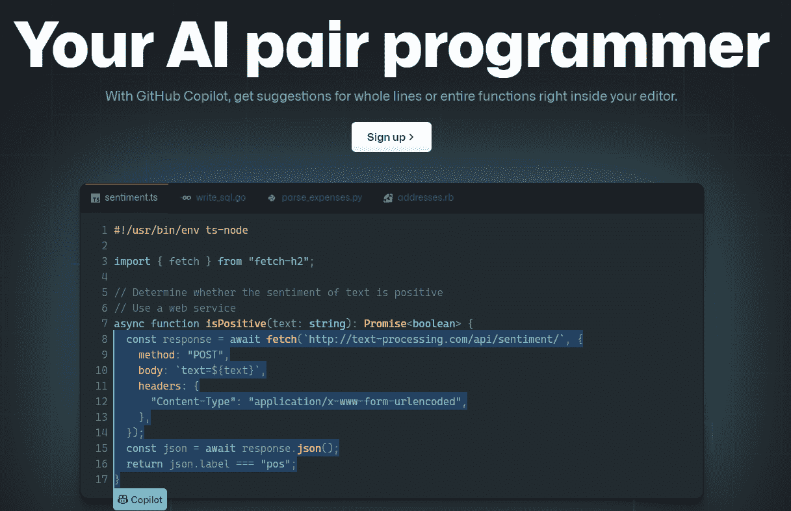

# GitHub Copilot——它是来抢你饭碗的吗？

> 原文：<https://levelup.gitconnected.com/github-copilot-is-it-here-to-steal-your-job-c06cdf1b0ca9>

保罗·花冈在 [Unsplash](https://unsplash.com/s/photos/github?utm_source=unsplash&utm_medium=referral&utm_content=creditCopyText) 上的照片

GitHub Copilot 于 2021 年 6 月 29 日公布。它旨在通过提供建议来简化开发人员编写代码的方式。这有点像编码的自动填充。AI 程序员作为技术预览版发布。GitHub 将其限制在一小组测试人员中。

作为一名拥有六年多完整堆栈经验和计算机科学学位的资深开发人员，我设法获得了批准。我试用过 GitHub Copilot，发现它对提高我的工作效率非常有帮助。

副驾驶程序仍然是新的，所以它不是没有一些缺陷。公众的总体反应也是喜忧参半。一些人担心使用人工智能的道德问题，人工智能是根据公众提交的开发者代码进行培训的。开发人员还担心 Copilot 和类似的概念可能会夺走他们的工作。

【https://www.youtube.com/post/UgzKmPDYMCTGw-T7v3V4AaABCQ 

那么，GitHub Copilot 是要抢你的工作，还是帮助你更高效地完成工作呢？以下是您应该了解的关于这个新工具的内容。

# 什么是 GitHub Copilot？

GitHub Copilot 是一种帮助编写代码的人工智能(AI)工具。它在你写的时候提供建议，让你更快地编码。这些建议可能包括单行或整个函数。GitHub Copilot 依赖于 GitHub 上公开托管的代码。该工具在 GitHub 上托管的超过 2800 万个公共存储库上进行了培训，其中包括数十亿行代码。

Copilot 理解广泛的编程语言和框架。您可以将它用于 Python、JavaScript、Ruby、TypeScript 等等。GitHub 也保证了 Copilot 工作迅速。它作为一个扩展与 Visual Studio 代码集成，允许建议实时出现。您甚至可以循环浏览建议并手动编辑代码。

[https://copilot.github.com/](https://copilot.github.com/)

# GitHub Copilot 会取代 Dev Jobs 吗？

一些开发者担心 GitHub Copilot 的有效性。令人担忧的是，副驾驶可能最终会取代 Devs。过去，人们担心 WordPress 等 CMS 平台会取代 Dev jobs。现在，人们担心人工智能将取代开发人员的工作。

幸运的是，GitHub Copilot 不会消除对开发人员的需求。继续关注好的想法，而不是担心人工智能系统取代你的工作。人们仍然需要知道如何编程，因为 Copilot 不是一个完美的工具。没有人的参与，GitHub Copilot 无法开发整个项目。

开发人员编写问题的解决方案。目前没有人工智能可以把这种感觉从你身上夺走，这就是为什么 GitHub 的工具被称为“Copilot”。你仍然控制着代码和副驾驶的协助。

## GitHub Copilot 可以不经允许使用你的代码吗？

如前所述，GitHub Copilot 训练来自公共存储库的代码，其中可能包括您已经上传到平台的项目。GitHub 的首席执行官表示，在公开可用的代码上培训 Copilot 是机器学习社区中公平使用的一个例子。

一些开发者质疑 GitHub Copilot 的合法性。然而，过去的例子表明，GitHub 将轻松赢得任何法律挑战。2016 年，美国最高法院支持谷歌对其谷歌图书数据库合理使用的主张。

谷歌下载并索引了 2000 多万本书，创建了一个在线文学数据库。最高法院裁定，该数据库是原创作品的变革，对用户有益。GitHub Copilot 也对其训练的原始代码进行了改造，对程序员有益。

# 开发者应该如何应对 GitHub Copilot？

虽然 Copilot 并不完美，但它可以节省时间。它也有可能通过机器学习变得更加擅长编码。开发人员还应该考虑为潜在的人力减少做准备。GitHub Copilot 可能允许软件开发团队用更少的开发人员完成项目。

如果 Copilot 最终限制了对开发人员的需求，以下提示可能有助于您保持工作稳定性:

*   切换到无代码解决方案
*   了解最新的流行语言和框架
*   多样化你的技能
*   拥抱 GitHub Copilot 的力量

如果你对允许 GitHub Copilot 潜在使用你的代码没有任何顾虑，可以考虑申请加入等候名单。您应该自己测试软件，探索它提供的优势。

## 切换到无代码解决方案，以避免编写代码

你不需要写代码来开发软件。您可以使用无代码开发，而不是编写代码。无代码开发解决方案，如 Web-flow，为开发软件、Web 应用程序和网站提供了一个图形用户界面(GUI)。

无代码平台通常是为没有编程经验的人设计的。然而，开发人员也从这些解决方案中受益。您无需从头开始编写大量代码。你可以花更多的时间在软件开发的其他领域，比如设计和测试。您获得的额外时间可以帮助您开发更好的软件解决方案。

## 跟踪流行语言和框架的变化

即使使用无代码开发解决方案，您可能仍然需要编写脚本或编辑代码，以确保软件满足您的需求。想要保持竞争力的开发人员应该继续关注流行编程语言和框架的所有变化。

使用 GitHub Copilot 还可以帮助您了解最常用的语言。该软件继续在广泛的编程语言和新上传的存储库上进行训练。Copilot 可能会一直关注 Python、JavaScript 和其他流行语言的最新变化。

# 多样化你的技能，而不是依赖编码

编码不应该是你对软件开发团队的唯一贡献。让你的技能多样化，这样你就能承担更多的责任。通过一些额外的培训，您可能有资格担任各种其他角色，例如:

*   质量保证工程师
*   项目管理人
*   商业分析员
*   敏捷教练
*   设计师
*   DevOps 工程师
*   数据库管理员

扩展到软件开发的其他领域，成为任何软件开发项目中有价值的一员。您作为开发人员的一些技能可以直接转移到质量保证、数据库管理和开发运维中。作为一名业务分析师、项目经理或 Scrum master，可能需要获得额外的认证，甚至重返校园。

开发者也可以考虑做设计师。发展你的设计技能可以打开软件开发之外的新工作机会的大门，比如网站设计、UX 设计和 UI 设计。

## 使用 GitHub Copilot 节省编写代码的时间

除了前面的建议，你还可以尝试使用 GitHub Copilot。享受 Copilot 的优势。在软件公开后使用它可能会帮助你花更少的时间写代码。

它还可以提高最终产品的效率，减少测试的需求。随着 GitHub Copilot 变得更加有效，它将更好地为更多的情况提供无错代码。

# 结论

GitHub Copilot 可能会改变软件开发社区的游戏规则。一些开发者担心副驾驶会抢了他们的饭碗。但是，定制软件总是需要的。

人工智能不太可能取代对高技能人才的需求。继续发展你的编码技能。你可能还想探索软件开发中的其他角色，以保持更好的可雇佣性。不要只是编码，让你的技能多样化，以适应更广泛的工作。