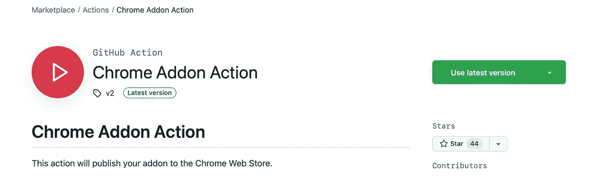
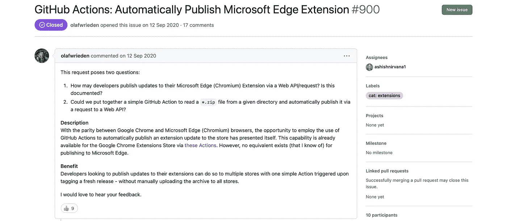
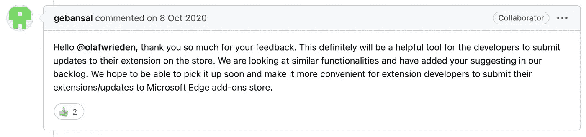
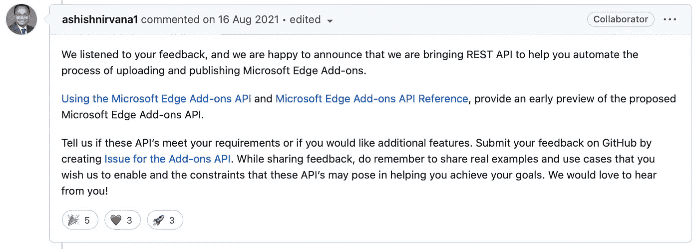
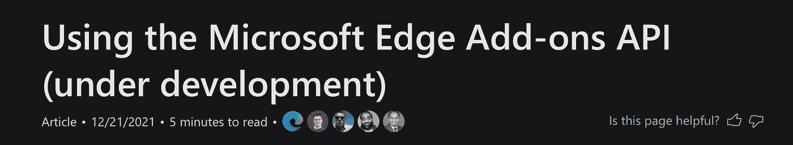

# 微软 API 的 GitHub 问题:科技巨头如何构建我的 API 请求

> 原文：<https://levelup.gitconnected.com/github-issue-to-microsoft-api-how-the-tech-giant-built-my-api-request-834ca207b4f1>

照片由 [Richy Great](https://unsplash.com/@richygreat?utm_source=medium&utm_medium=referral) 在 [Unsplash](https://unsplash.com?utm_source=medium&utm_medium=referral) 上拍摄

这是我与微软 Edge 开发团队的奇妙经历的故事，他们构建了我的 API 功能请求，以使世界各地的开发人员更容易访问插件。

2020 年中期我有了一个想法，(现在基于 Chromium 的)微软 Edge 浏览器刚刚发布；随之而来的是一个充满可能性的世界。

# 它是如何开始的…

大约在同一时间，我构建了我的第一个浏览器扩展，并决定将其发布到 Chrome 网络商店。体验进行得很顺利，我按照[的指示](https://developer.chrome.com/docs/webstore/publish/)创建了我的开发者账户，添加了极其重要的 *manifest.json* 文件来提供我的元数据信息，然后我就离开了。🚀

通过 GitHub Actions，我发现了每当我在 GitHub 中标记一个新版本时，自动打包并发布一个新版本的扩展到 Web 商店的能力。这太棒了——我感觉自己像一个真正敏捷的开发者，在 GitHub Actions 中利用了 [Chrome 网络商店 API](https://developer.chrome.com/docs/webstore/using_webstore_api/) 。

[https://github.com/marketplace/actions/chrome-addon-action](https://github.com/marketplace/actions/chrome-addon-action)

我意识到许多企业都依赖于我们都知道的现在已被弃用的微软 ie 浏览器。该公司正在转向新版本的 Edge(在我看来，这是谷歌 Chrome 不断增长的市场份额中的一个好消息)。

我也想在微软 Edge 插件商店[上扩展我的插件。部分原因也是为了了解 Edge 生态系统是如何工作的。令我惊讶的是，我的 Google Chrome 部署几乎不需要任何改变，我只是简单地按照这些步骤进行，我的扩展就这样准备好了等待批准。🎉](https://microsoftedge.microsoft.com/addons/Microsoft-Edge-Extensions-Home)

但是……当我试图通过 GitHub Actions 自动发布新版本时，我遇到了一个问题:

GitHub 上没有边缘扩展发布操作:(

哇哦。😤

# 接下来发生了什么？

我保持冷静，在微软 Edge 开发者 GitHub 账户上打开了一个功能请求，很友好地问。在这里，您可以[查看问题](https://github.com/MicrosoftDocs/edge-developer/issues/900)，或者从截图中阅读。

很长一段时间，这个问题没有任何进展，一个月过去了，仍然..没什么。突然，我醒悟到一条评论中提到:

哇！微软 Edge 团队也认为这是一个好主意😅其他外部开发人员开始参与到这个线程中来，很快这个特性就获得了动力。

随着 2020 年接近尾声，我的开发重点发生了变化，我不再那么热衷于学习浏览器扩展。2021 年来了，我搬到了一个新的国家，开始了一份新的工作，讽刺的是，在微软，我看到自己在云领域的成长超过了编码。

与此同时，我静静地观察着帖子中的评论，因为想法被反复讨论，最终事情发生了:

微软建立了我的 API 理念！！🤩

我们做到了！谢谢大家！

我欣喜若狂，一年前我发现了一个特性，它可以让许多开发人员和 DevOps 专业人员的生活变得更加轻松。我有一个很好的经验来表达这个建议，并从社区中获得反馈。以下是我最重要的三条经验。

！这是官方的！

# 3 吸取的教训

1.  如果你有一个想法来改善一个平凡的过程，你可能不是一个人。不要害怕。成为开始对话的人，让社区参与进来以获得支持(或者被引导到正确的方向)。
2.  优秀的开发人员经常寻求反馈。如果你有机会提出你的观点，比如“告诉我们这些 API 是否满足你的需求，或者你是否想要更多的特性”；花一点时间尝试一下，看看缺少了什么。
3.  耐心点！微软不是一天建成这个 API 的，你的也不会。如果你想把事情做好,“它在路线图上”的回答是绝对可以接受的。跟踪这个 GitHub 问题超过 11 个月，让我不时质疑它是否值得打开。直到一天早上，那个令人满意的回复出现在收件箱里。🚀

我们被教导要庆祝小小的胜利；因此，在分享这个故事时，我希望能激发你分享你的创意来改善这个平凡的世界。

你将如何影响？