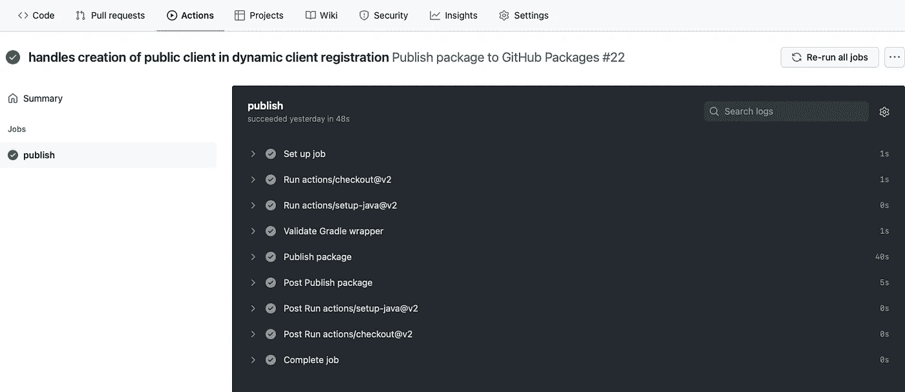

# GitHub 包:发布和消费 Spring Gradle 项目的工件

> 原文：<https://levelup.gitconnected.com/github-packages-publish-and-consume-artifacts-of-a-spring-gradle-project-e91d86a5ea1e>

从分叉的存储库中创建依赖项

由 [Roman Synkevych](https://unsplash.com/@synkevych?utm_source=medium&utm_medium=referral) 在 [Unsplash](https://unsplash.com?utm_source=medium&utm_medium=referral) 上拍摄

## **简介**

在本教程中，我们将看到如何使用 Gradle 将工件发布到 GitHub 包中。之后，我们将尝试把它作为一个依赖项使用——在一个 Maven 项目上。

以下是我们将经历的主要事情:

*   在 Gradle 项目上使用`maven-publish`
*   创建 GitHub 动作工作流来对事件做出反应并触发工件的发布
*   使用发布的工件作为 Maven 项目的依赖项

对于上下文，我们将使用 spring-authorization-server 的分叉版本(spring 官方项目之一)。好奇为什么？故事时间到了。最近，我正在进行 OAuth 的动态客户端注册，我需要创建公共客户端(用于 spa)。不幸的是，在撰写本文时，它似乎还不被支持(除非我遗漏了什么)。

以上是我创作的问题。这里有一个[参考链接](https://github.com/spring-projects/spring-authorization-server/issues/625)。不管怎样，这就是为什么——所以，把它放在一边，让我们继续这个教程。

## **在 Gradle 项目上使用 maven-publish**

正如我们所见，`spring-authorization-server`有一个名为`spring-security-oauth2-authorization-server`的子项目，它包含自己的 Gradle 文件。由于这个项目包含源文件，让我们将`maven-publish`应用到它的 Gradle 文件中:

我们只包括了要点的相关部分；但是，作为参考，我们可以在这里找到实际的 Gradle 文件。

## 创建 GitHub 操作工作流程

现在让我们通过创建一个 yml 文件来定义工作流。在我们的例子中，我们将其命名为 gradle-publish-workflow.yml:

对于一个简单的演示，我们已经配置了触发器，在每次推送到`experimental/github-packages`分支时发布工件；然而，也可以在每个版本中限制这一点。

接下来，让我们尝试模拟并观察它的运行。

太好了！既然我们已经成功地发布了工件——让我们检查一下我们的包:

请注意，之前在我们的 Gradle 文件中，我们已经为版本添加了一个唯一的字符串标识符(“emyasa”)，以便稍后我们在测试它时能够区分我们的依赖项。

## **使用发布的工件作为 Maven 项目的依赖项**

首先，像往常一样，让我们复制 pom.xml 上的依赖关系:

接下来，由于 GitHub 不允许对包进行未经认证的访问(即使项目本身是一个公共 repo)，我们必须生成一个个人访问令牌(PAT)。然后，让我们将它与 GitHub 包的存储库配置一起包含在我们的 maven settings.xml 中:

剩下唯一要做的事情就是运行 maven install，现在我们已经完成了！

和往常一样，源代码可以从 [GitHub](https://github.com/emyasa/spring-authorization-server/tree/experimental/github-packages) 获得。

**寻找更多相关文章？你不妨看看这些:**

 [## OAuth 2.0:Spring Boot 的授权代码流

### 学习什么，什么时候，如何。

medium.com](https://medium.com/javarevisited/oauth-2-0-authorization-code-flow-in-spring-boot-d8ff393f316d)  [## AWS:使用 LocalStack 在本地运行 S3 触发的 Lambda

### 在不离开本地环境的情况下测试您的代码

levelup.gitconnected.com](/aws-run-an-s3-triggered-lambda-locally-using-localstack-ac05f03dc896)