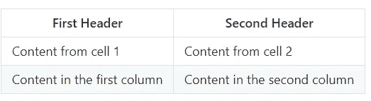

# Github 自述文件备忘单

> 原文：<https://levelup.gitconnected.com/github-readme-cheatsheet-617dff61fa23>

## 对于所有疯狂的开发者来说，谁想让他们的项目脱颖而出


[**来源**](https://github.com/)

Github 是程序员和技术爱好者分享和展示他们的工作的唯一平台，通过创建一个存储库并向他们提交他们的工作。Github 中的每个存储库都必须包含一个自述文件。repo 中的自述文件包含有关安装、工作、在本地服务器上开发以及将来使用的所有信息。对于每一个技术爱好者来说，学会如何撰写完美的自述文件是非常重要的。

在这个博客中，我将与你分享一份 GitHub Readme 的备忘单，其中包含了所有的基本内容和大部分高级内容。

让我们首先从自述文件的基础开始。

# -:基础:-

## 1.标题

要在自述文件中创建标题，我们需要使用`#`。可以通过一起添加多个`#`来改变标题的大小。`#`的数字越大，标题越小。

```
Symbol    Tag       Example
`#`       <h1>      # h1 heading
`##`      <h1>      # h2 heading
`###`     <h3>      # h3 heading
`####`    <h4>      # h4 heading
`#####`   <h5>      # h5 heading
`######`  <h6>      # h6 heading
```

使用 html 的

# —

###### 标签也有类似的方法。

```
<h1> h1 heading</h1>
<h4> h4 heading</h4>
```

## 2.粗体和斜体文本

我们需要使用`*`符号。

```
Actions Syntax                        ExampleBold - **Text**                       Bold TextItalic - *Text*                       *Italic Text*Bold+Italic - ***Text***              *Bold+Italic Text*
```

## 3.列表

为了创建一个无序列表，我们可以为每个列表点使用`*`或`-`。

示例:

```
Action               Result
*                     Bullet Point 1 Using *
-                     Bullet Point 2 Using -
```

为了创建一个有序列表，我们可以简单地使用`1.`等等`2.`、`3.`等等。

## 4.向文本添加链接

语法:`[Text](Link)`


## 5.添加图像

步骤:
1。把你的形象放在同一个回购里。
2。打开图像并复制路径
3。语法:

``

运筹学

```
![alt text][logo][logo]: path_to_image
```

## 6.大宗报价

可以使用`>`插入块引号。

```
> This is a sample BlockQuote
```


## 7.内嵌代码

要添加内联代码，您需要使用重音符。
例子:这是一个`inline code` Github 自述文件的例子。

## 8.语法突出显示

```
```python
for i in range(0,100):
  if i>50:
      print(i)
  elif i<50:
      print(i*i)
```
```


## 9.桌子

```
First Header | Second Header
------------ | -------------
Content from cell 1 | Content from cell 2
Content in the first column | Content in the second column
```



## 10.罢工投掷

```
~~content~~
```


## 11.换行符

```
<br>
or
<br/>
```

## 12.水平标尺

要在 Readme 中添加水平线，我们可以使用`---`或`***`或`<hr>`。

```
***
```


# -:预付款:-

## 1.自定义宽度和高度图像

为了增加图片的高度和宽度，我们可以使用 HTML 中的标签。

```
<a href="LINK_TO_REPO">
    
  </a>
```

## 2.添加 GIF

第一步:从 Giphy 下载 GIF 或者创建你自己的 GIF

第二步:上传 GIF 到你的回购

第三步:使用自定义宽度代码并插入 GIF

```
<a href="LINK_TO_REPO">
  
</a>
```

## 3.向图像添加链接

```
[][link][link](ACTUAL_LINK)
```

## 4.添加超链接或标签

```
[Basics](#basics)    

# Basics 
...
...
..
```

该链接将重定向并滚动到自述文件中的`basics`部分。

## 5.减价徽章

**单徽章**

```

```


**多个徽章**

```
<p>
%20-%23E4405F.svg?&style=for-the-badge&logo=Instagram&logoColor=white"/>


</p>
```


*   [查看所有减价徽章](https://github.com/Ileriayo/markdown-badges)
*   [查看所有盾徽](https://shields.io/)

## 6.表情符号

点击这里查看表情列表[](https://github.com/ikatyang/emoji-cheat-sheet/blob/master/README.md)

*****找到备忘单的 README.md 文件*** [***这里***](https://github.com/Abhayparashar31/Readme-Cheatsheet)**

> *****感谢阅读😃*****