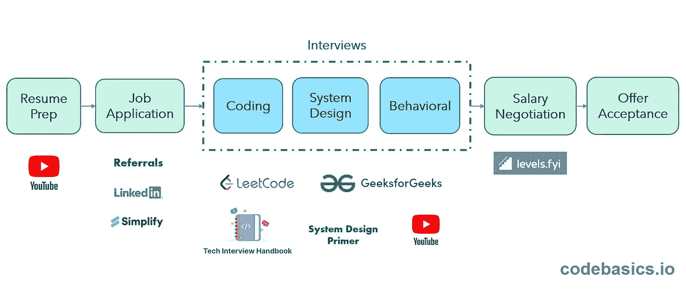
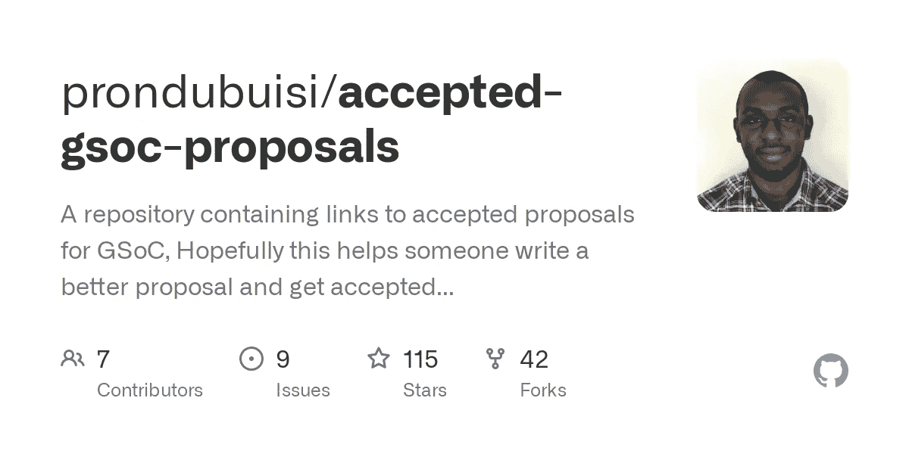
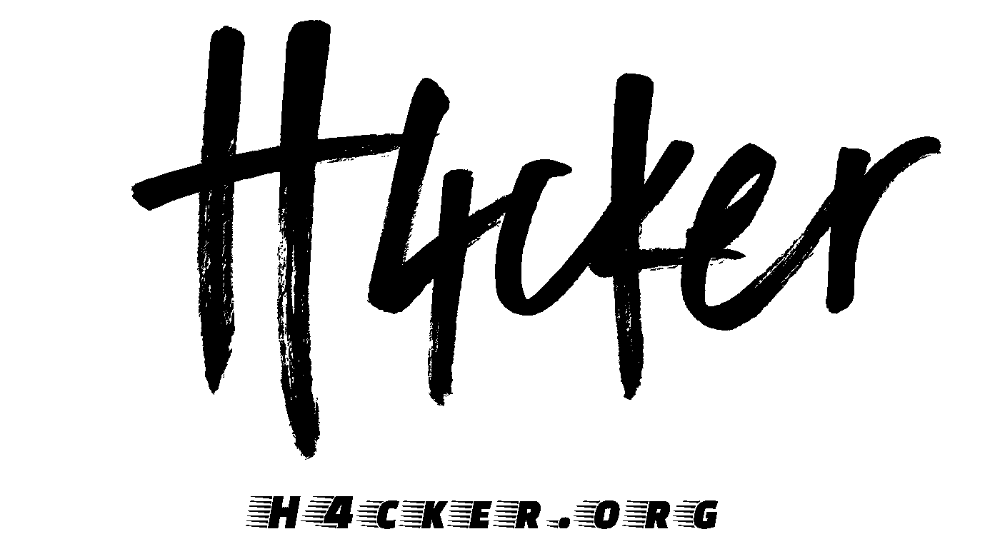
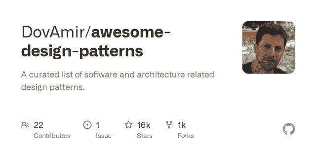
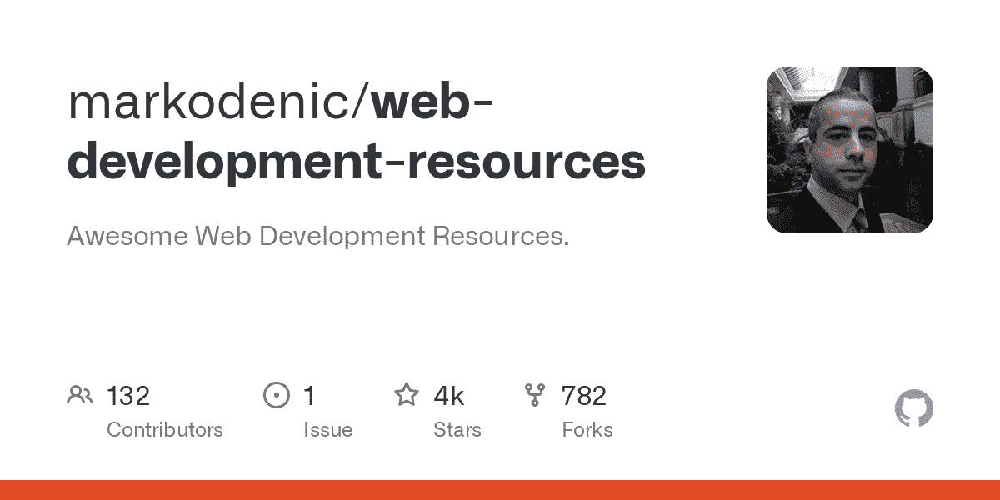
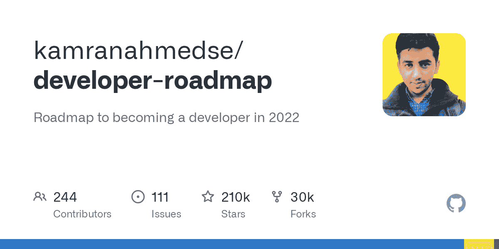
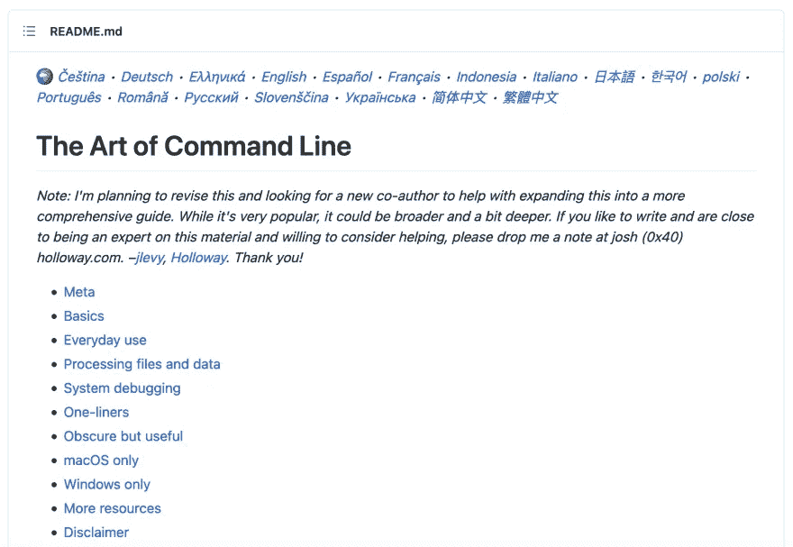

# 你应该关注的 GitHub 库。

> 原文：<https://levelup.gitconnected.com/github-repositories-you-should-keep-an-eye-on-a7b50f8ba60e>

GitHub 用于存储、跟踪和协作软件项目。您可以展示您的作品，分享重要信息，了解最新动态，并与 **GitHub** 社区保持联系。

> GitHub 是一个互联网托管服务，使用 Git 进行软件开发和版本控制。它为每个项目提供了 Git plus 访问控制、bug 跟踪、软件特性请求、任务管理、持续集成和 wikis 的分布式版本控制。— [维基百科](https://en.wikipedia.org/wiki/GitHub)

在本文中，我将列出一些有用的 GitHub 库，它们可以帮助您完成下面的 FAANG 采访，让您进入开源领域，提供无限的资源，或者让您随时了解最新情况。我会尽可能涵盖不同的领域。

RealToughCandy.com[摄影](https://www.pexels.com/photo/industry-internet-connection-technology-11035544/)

让我们深入了解一下…

# 1.FAANG 面试准备指南

你需要一份快速而详细的指南来指导你在大型科技公司找到工作吗？这个知识库包含了你需要的一切，从简历准备指南，工作申请，行为面试，薪资谈判，到更多资源的链接。
链接: [**Codebasics 面试准备**](https://github.com/codebasics/interview-help/blob/main/sde-interview-prep.md)

## 编码面试大学

这个库包含了成为软件工程师的一个很好的学习计划。其内容包括选择编程语言、数据结构和算法书籍、面试准备书籍、编码问题练习、编码问题等。注意这是一个软件工程的学习计划，而不是网络开发。
链接:[编码面试大学 ](https://github.com/jwasham/coding-interview-university)

面试准备

# 2.接受 GSoC 提案

在我上一篇[文章](https://medium.com/@emereninicynthia/you-might-find-these-open-source-internships-and-programs-interesting-cb2be57b8a56)中，我将 GSoC(谷歌代码之夏)列为你可能感兴趣的付费开源实习项目之一。加入这个项目的一个要求是写一份能被接受的提案，而大多数申请人很难做到这一点。不要担心，这个资源库包含了一个不同项目和组织的已接受提案的列表，我相信如果你想尝试这个项目，它会指导你。
链接: [**接受提案**](https://github.com/prondubuisi/accepted-gsoc-proposals)

[接受 GSoC 提案](https://github.com/prondubuisi/accepted-gsoc-proposals)

# 3.区块链开发资源

有些区块链解决方案和资源有时很难获得。这个库是学习区块链发展的免费资源的精选列表。有了广泛的话题，它一定会帮助你在区块链开始职业生涯。
链接:[区块链资源 ](https://github.com/frankiefab100/Blockchain-Development-Resources)

[区块链开发资源](https://github.com/frankiefab100/Blockchain-Development-Resources)

# 4.黑客艺术

你有没有考虑过网络安全职业，不知道从哪里开始？这个库可以帮助你开始你的网络安全事业。它提供了 9，000 多种参考资料、脚本、工具、代码和其他资源，可帮助进攻性和防御性安全专业人员学习和发展新技能。
链接: [**黑客的艺术**](https://github.com/The-Art-of-Hacking/h4cker)

[黑客艺术](https://github.com/The-Art-of-Hacking/h4cker)

# 5.30 秒的代码

有没有尝试过实现一些简单的 JavaScript 操作和问题？哦，30 秒代码为您提供了开发所需的所有代码片段。您可以使用[搜索页面](https://30secondsofcode.org/search)来查找符合您需求的片段。您可以按名称、标签、语言或使用摘录描述进行搜索。开始输入一个术语，看看会出现什么。
链接: [**30 秒代码**](https://github.com/30-seconds/30-seconds-of-code)

[30 秒的代码](https://github.com/30-seconds/30-seconds-of-code)

# 6.令人敬畏的设计模式

这个存储库包含软件和架构相关设计模式的精选列表。它还包括每种不同编程语言设计模式的具体代码示例。

> 软件设计模式是一种通用的、可重用的解决方案，用于解决软件设计中给定环境下的常见问题。它是如何解决一个问题的描述或模板，可以在许多不同的情况下使用。— [维基百科](https://en.wikipedia.org/wiki/Software_design_pattern)

链接: [**牛逼设计图案**](https://github.com/DovAmir/awesome-design-patterns)

[令人敬畏的设计模式](https://github.com/DovAmir/awesome-design-patterns)

# 7.令人敬畏的网络开发资源

请允许我称这个收藏库为“令人兴奋的收藏”。顾名思义，它包含了一长串优秀的 web 开发资源，包括托管站点、学习平台、编码挑战平台、库、代码编辑器、UI 灵感等等。你得自己去看。
链接: [**Web 开发资源**](https://github.com/markodenic/web-development-resources)

[网络开发资源](https://github.com/markodenic/web-development-resources)

# 8.开发者路线图

我写了一篇关于[每个开发者都应该知道的有用网站](https://medium.com/@emereninicynthia/how-come-you-dont-know-these-websites-as-a-developer-da7f32f65d60)的文章，把这个回购的网站列入其中。开发人员路线图提供了不同职业道路的路线图列表。如果您希望成为一名开发人员或走上一条独特的职业道路，这个库是一个很好的指南。
链接: [**开发者路线图**](https://github.com/kamranahmedse/developer-roadmap)

[开发者路线图](https://github.com/kamranahmedse/developer-roadmap)

# 9.命令行的艺术

我们中的一些人住在命令行🤩。查看关于使用命令行的一系列注释和提示。命令行的流畅以明显和微妙的方式提高了您作为工程师的灵活性和生产力。本指南适用于初学者和有经验的用户。
链接: [**艺术命令行**](https://github.com/jlevy/the-art-of-command-line)

[命令行艺术](https://github.com/jlevy/the-art-of-command-line)

# 10.贡献的主动回购

如果您是第一次接触开源项目，或者是开源爱好者，那么这个库包含了一个活动库列表，您可以在没有经验的情况下参与其中。还包含一些其他有用的资源。
链接: [**投稿回购**](https://github.com/ykdojo/active-repos-for-contributing)

# 结论

让我们称之为一个总结！

让我知道哪个仓库引起了你的注意。
感谢阅读！！！

[给我买杯咖啡](https://www.buymeacoffee.com/emecynthia)

社交:
[Linkedin](https://www.linkedin.com/in/emerenini-cynthia-ngozi)
[Twitter](https://twitter.com/cynthiaengozi1)

[GitHub](https://github.com/cindyeme)