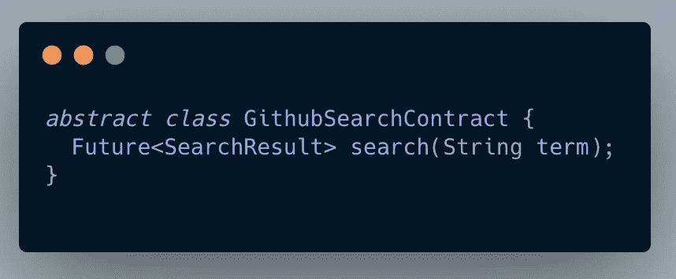
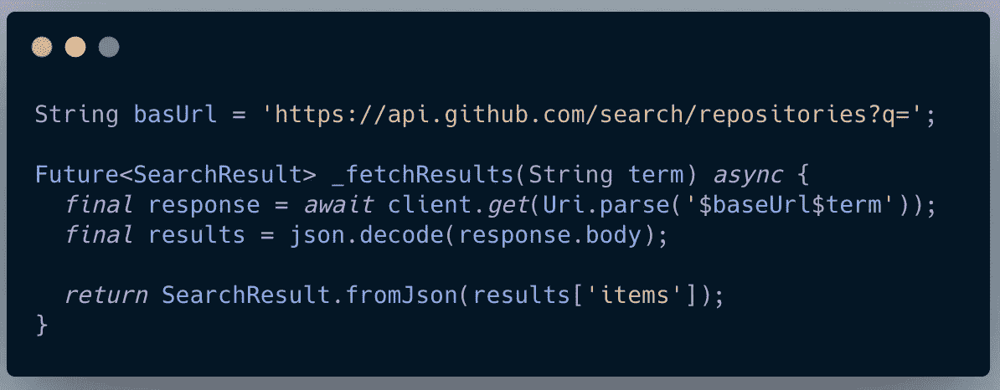
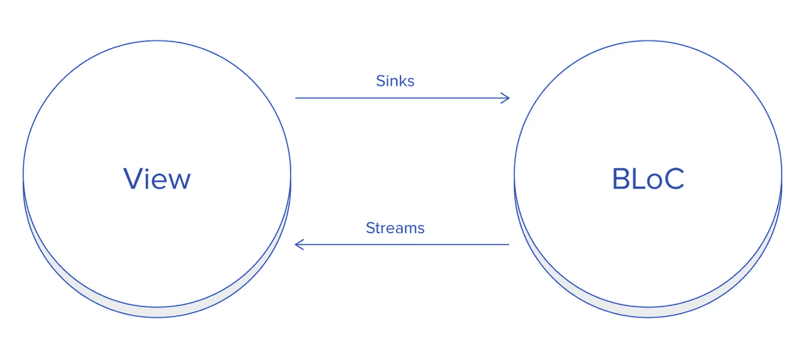
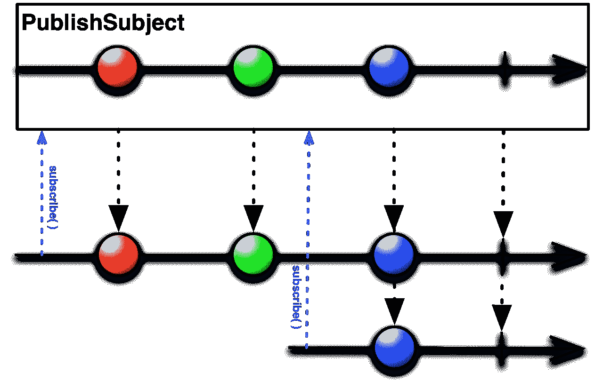

# Github 搜索和拦截

> 原文：<https://levelup.gitconnected.com/github-search-and-bloc-523d51848c68>

## 使用 BLoC 模式实现 Github 搜索

Github 搜索和拦截

# 介绍

***等级:中级***

本文假设读者已经了解了**集团模式。**

我们将涵盖:

1.  集成 Github API
2.  定义用户界面状态
3.  创建搜索块
4.  根据状态更新用户界面

点击此处观看演示

***网址:***[***https://web.flatteredwithflutter.com/#/***](https://web.flatteredwithflutter.com/#/)


# 集成 Github API

我们定义了一个抽象类(又名**契约**)，其中包含一个方法。



Github 搜索和拦截

Github 有一个[公共端点](https://stackoverflow.com/questions/53747159/whats-the-correct-endpoint-to-access-github-repositories-on-github-api)用于搜索存储库，我们将用户定义的搜索词附加到它上面。

```
https://api.github.com/search/repositories?q='YOUR SEARCH TERM'
```

所以现在，我们在我们的 **GithubApi** (我们的实现类名)中实现抽象类。

```
class GithubApi implements GithubSearchContract
```

我们的搜索功能是这样的



在这里我们调用 API，获取结果，并将它们转换成 **SearchResult** 模型。

# 定义用户界面状态

我们用公式表达 UI 可能拥有的所有状态，然后定义它们。

```
enum States {
  noTerm,
  error,
  loading,
  populated,
  empty,
}
```

我们创建一个基类( **SearchState** )，每个状态(上面定义的)将实现这个基类。

```
@immutable
class SearchState extends BlocState {
  SearchState({this.state}); final States state;
}abstract class BlocState extends Equatable {
  @override
  List<Object> get props => [];
}
```

我们的 **SearchState** 类是内部扩展的[equivalent](https://pub.dev/packages/equatable)。Equatable 完成了两个对象之间相等比较的繁重工作。

[](https://medium.com/flutter-community/dart-equatable-package-simplify-equality-comparisons-1a96a3fc4864) [## Dart 等价包:简化等式比较

### 如果您一直在编写 Dart，那么您可能不得不重写==操作符和 hashCode，以便比较…

medium.com](https://medium.com/flutter-community/dart-equatable-package-simplify-equality-comparisons-1a96a3fc4864) 

## 实现用户界面状态

枚举中的所有值对应于一个 UI 状态，目前，我们的枚举中有 **5 个值，因此我们将**创建 5 个状态**。**

```
class SearchNoTerm extends SearchState {
  SearchNoTerm() : super(state: States.noTerm);
}class SearchError extends SearchState {
  SearchError() : super(state: States.error);
}class SearchLoading extends SearchState {
  SearchLoading() : super(state: States.loading);
}class SearchPopulated extends SearchState {
  final SearchResult result; SearchPopulated(this.result) : super(state: States.populated);
}class SearchEmpty extends SearchState {
  SearchEmpty() : super(state: States.empty);
}
```

正如我们在这里看到的，每个 UI 状态还包括来自 enum 的相应值。举个例子，

> **SearchNoTerm state** 具有 **States.noTerm** 的值，依此类推

结果只包含在 **SearchPopulated** **状态**中，其中有一个 **SearchResult(我们的模型类)**参数。


# 创建搜索块

创建我们期待已久的集团的时候到了。



Github 搜索和拦截

bloc 背后的想法是**暴露** **接收器**(对于用户定义的事件)并通过**发出各自的状态**根据这些事件做出反应。

我们定义了搜索块，它将 Github API 的**实现作为参数。**

```
class SearchBloc {
  factory SearchBloc(GithubSearchContract api) {
   //.....
  }

  // Sink exposed to UI
  final Sink<String> onTextChanged; // State exposed to UI
  final Stream<SearchState> state;
}
```

> 我们公开了 onTextChanged sink 的**并发出 searchstate 的**流**。**

## 1.onTextChanged 接收器

我们使用 [RxDart](https://pub.dev/packages/rxdart) 来定义什么进入了我们的接收器。

> RxDart 为 Dart [流](https://api.dart.dev/stable/dart-async/Stream-class.html)和[流控制器](https://api.dart.dev/stable/dart-async/StreamController-class.html)增加了额外的功能。

```
factory SearchBloc(GithubSearchContract api) {
  final onTextChanged = PublishSubject<String>(); final state = onTextChanged
        .distinct()
        .debounceTime(const Duration(milliseconds: 500))
        .switchMap<SearchState>((String term) =>                                                _helpers.eventTyping(term))
        .startWith(SearchNoTerm()); return SearchBloc._(api, onTextChanged, state);
}
```

我们创建一个字符串类型的[**publish subject**](https://pub.dev/documentation/rxdart/latest/rx/PublishSubject-class.html)，因为我们将搜索一个字符串术语。

**PublishSubject** :发出订阅时可观察到的源的所有后续项目。

> 与`BehaviorSubject`不同，`PublishSubject`不保留/缓存项目，因此，新的`Observer`不会接收任何过去的项目。

```
**final** subject = PublishSubject<int>();

*// observer1 will receive all data and done events*
subject.stream.listen(observer1);
subject.add(1);
subject.add(2);

*// observer2 will only receive 3 and done event*
subject.stream.listen(observe2);
subject.add(3);
subject.close();
```



发布主题

## 2.过滤槽

现在我们需要过滤进入我们的**接收器的项目。**我们使用 **distinct** 来跳过与前一个数据事件相同的数据事件。

返回的流提供与此流相同的事件，只是它从不提供两个相等的连续数据事件。

> [不同](https://rxmarbles.com/#distinct)的交互描述。

## 3.去抖

在运行搜索之前，我们等待用户停止输入 500 毫秒。这是通过使用[去抖](https://pub.dev/documentation/rxdart/latest/rx/DebounceExtensions/debounceTime.html)实现的。

```
Stream.fromIterable([1, 2, 3, 4])
  .debounceTime(Duration(seconds: 1))
  .listen(print); *// prints 4*
```

## 4.开关图

用给定的搜索词调用 Github API。如果输入另一个搜索词，switchMap 将确保放弃之前的搜索。

例如，当您只需要来自异步 API 的最新状态时，这可能很有用。

```
RangeStream(4, 1)
  .switchMap((i) =>
    TimerStream(i, Duration(minutes: i))
  .listen(print); *// prints 1*
```

最后，我们调用 Github API:

```
Stream<SearchState> eventTyping(String term) async* {
  if (term.isEmpty) {
    yield SearchEmpty();
  } else {
    yield* Rx.fromCallable(() => api.search(term))
        .map((result) =>
           result.isEmpty ? SearchEmpty() : SearchPopulated(result))
        .startWith(SearchLoading())
        .onErrorReturn(SearchError());
  }
}
```

*   其中如果项为空，我们发出 **SearchEmpty** 状态
*   否则，调用 API，将结果绑定到**搜索填充的**状态
*   出现错误时，发出 **SearchError** 状态

# 根据状态更新用户界面

我们的块公开了一个流(**称为状态**)。在我们的 UI 中，我们简单地监听这个流，并根据发出的状态做出反应。

```
StreamBuilder<SearchState>(
   builder: (context, model) {
      final state = model.state; if (state == States.loading) {
          return const _Loading();
      } else if (state == States.empty || state == States.noTerm) {
          return const _Empty();
      } else if (state == States.error) {
          return const _Error();
      } else if (state == States.populated) {
          return const _DisplayWidget();
      } return const _Internal();
   },
   initialData: SearchNoTerm(),
   stream: searchBloc.state,
)
```


```
*Hosted URL:* [*https://web.flatteredwithflutter.com/#/*](https://web.flatteredwithflutter.com/#/)[*Source code for Flutter Web App.*](https://github.com/AseemWangoo/experiments_with_web)
```

与 Flutter 相关的有趣文章在这里:

[](https://medium.com/flutter-community/flutterdesktop-and-c-7cd2e0106bd8) [## FlutterDesktop 和 C

### 从 FlutterDesktop MacOS 调用 C 库

medium.com](https://medium.com/flutter-community/flutterdesktop-and-c-7cd2e0106bd8) [](https://medium.com/flutter-community/flutter-web-and-wasm-49217497b0ed) [## 颤振腹板和 WASM

### 颤振腹板和 WASM

颤振腹板和 WASMmedium.com](https://medium.com/flutter-community/flutter-web-and-wasm-49217497b0ed) [](/dart-ffi-and-cli-app-8cc5ed2f8aae) [## Dart FFI 和 CLI 应用程序

### Dart FFI 和 CLI 应用程序

Dart FFI 和 Applevelup.gitconnected.com CLI](/dart-ffi-and-cli-app-8cc5ed2f8aae)