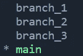

# Github:Github 备忘单第 1 部分

> 原文：<https://levelup.gitconnected.com/github-series-the-github-cheatsheet-part-1-2725a155d186>

## 打开你的代码！

Github 现在是当今科技界最流行的标准工具之一。你可以在每份简历、每份招聘启事上看到它，它甚至被称为世界上最大的代码宿主。在这里，我们将介绍我日常使用的基本 Github 命令，以及一些情景命令。

[图片](https://unsplash.com/photos/q1p2DrLBtko)由[穆罕默德·拉赫马尼](https://unsplash.com/@afgprogrammer)拍摄

**目录:**

*   Github 简介。
*   基本的 Git 命令。
*   结论。

**Github 简介:**

Github 是一个版本控制代码管理工具，被全世界的开发者所使用。它允许用户跟踪和控制代码的变更，甚至是在与其他开发人员合作的层面上。Github 上的每个项目都存储在自己的存储库或 repo 中。开发人员可以使用分支来更新他们的项目，或者开发新的功能并将其推至新的分支，以避免与主分支冲突。当自定义分支被项目所有者或高级开发人员批准后，他们可以将该功能分支与主分支合并。主分支充当团队中所有开发人员的真实来源，作为一个完整的工作项目版本，没有任何不完整的特性。

**基本 Git 命令:**

*   **用户凭证命令:**

— `git config --global user.name "enter username"` :
查看 git 版本历史记录时，设置用户的信用名称。

— `git config --global user.email "enter email"` :
设置用户查看 git 版本历史时的电子邮件地址。

*   **正在下载新的存储库:**

— `git clone` (HTTPS):
通过网络协议进行交流。允许您使用 HTTPS 克隆在线存储库。这里我们使用 HTTPS 从 Github 克隆了一个 open_weather_app 项目到我们当前的本地目录中。使用它可能会派上用场的一个原因是它不太可能被您的防火墙阻止。它提供了一个快速下载你需要的回购。

作者图片

— `git clone` (SSH):
使用唯一的长认证密钥。密钥的复杂性使其难以泄露，并且在数据泄露期间不会受到损害，从长远来看，这使其更加安全。虽然使用 SSH 需要一些初步的设置，但是它允许用户立即连接到最初克隆项目的远程存储库。

作者图片

*   **在命令行上创建新的回购:**

图片来自 Github

— `git init`
初始化你的项目文件。

— `git add {filename} OR git add .`
也称为“暂存文件”提交。添加您希望包含在上传到 Github 资源库的提交中的文件名。`git add .`中的`.`表示您希望将所有文件添加到提交中。请记住不要在文件名中包含`{}`。

— `git rm {filename}`或`git rm .` :
或者删除要提交到您的 Git 存储库中的文件。`git rm .`中的`.`表示您希望从提交中删除所有文件。请记住不要在文件名中包含`{}`。

— `git reset {filename}` :
卸载文件，但保留您在当前工作目录中所做的更改。请记住不要在文件名中包含`{}`。

— `git commit -m "first commit"`
暂存(设置)您想要上传到 Github repo 的文件。你也可以在写着“第一次提交”的地方写任何注释。理想的评论应该是关于你在这次上传中完成了什么，改变了什么，或者打算用这次新的推送做什么。

— `git branch -M main`
允许您检查您连接到存储库中的哪个分支。我们稍后将讨论分支到底是什么。

— `git remote add origin {url}`
在这里您将设置您试图上传项目文件的存储库的 url。在上面的例子中，url 是，`git@github.com:ra1993/project_3.git`
请记住不要在 url 周围包含`{}`。

——`git push -u origin main`
这就对了！这个命令将把您的提交从它的暂存区推送到您指定的在线存储库。

*   **将更改推送到现有存储库:**

图片来自 Github

— `git remote add origin {url}` :
我们在这里设置存储库的 url，以便上传我们的更改。请记住不要在 url 中包含`{}`。

— `git branch -M branch` :
再次确认，我们在正确的分支机构。

— `git push -u origin main` :
将您的更改推送到您的存储库中！

*   **检查&比较日志或对象信息:**

— `git log` :
显示当前分支的提交历史。每次提交都包含您在提交并推送到远程存储库之前或之时在本地存储库中所做的任何更改/更新。

作者图片

→ *提交:*
显示您的提交 id。在你所在的分支的历史中。

→ *作者:*
记入与提交的推送相关联的用户名和电子邮件地址。

→ *日期:*
提交时的日期和时间。

→ *comment:*
为每个提交发布的注释，描述在提交被推送到远程存储库时发生了什么、做了什么/需要做什么。

→ *HEAD - > main，origin/main，origin/HEAD):*
表示您被设置为哪个提交。如果您计划进行任何更改，或者想要恢复到分支的先前版本，您可以将您的提交更改为先前的提交。

— `git status`:

该命令显示临时区域中工作目录的当前状态。它向您展示了哪些更改是暂存的而不是未暂存的，以及哪些文件在 Git 上被跟踪而不是未被跟踪。

作者图片

→ *在主分支*上:
表示我们连接到我们存储库中的哪个分支。

→ *您的分支使用‘origin/main’更新* :
表示您的本地分支(在您的 pc 上)和远程分支(GitHub 存储库)指向同一个提交。该共享提交具有两个存储库上每个文件的当前匹配状态。

→ *未提交的更改:*
表示您尚未提交对暂存区中的文件所做的任何新更改。在这种情况下，在我的 g_drive.py 和 main.py 文件中所做的更改以及删除我的 py_drive.py 还没有提交到我的当前暂存区域。

→ *未跟踪的文件:*
告诉你哪些文件没有被 git 跟踪。当考虑需要向 git repo 添加什么类型的文件时，一般规则是该文件是否需要在 IDE 中编辑。这些文件可以包括但不限于编码脚本/文件、设置文件、txt 文件等，与您可能不想上传的文件相反，这些文件可以是数据集、api_keys 等。现在有一个我新创建的 py_drive_dir 目录，它没有被跟踪。可以用`git add py_drive_dir`或者`git add .`添加 py_drive_dir。

作者图片

一旦您再次运行 git status，您将会看到 git 将会识别出需要为您的下一次推送提交的新更改。现在我们看到 g_drive.py，main.py 正在为下一次推送做准备。

**分支和合并:**

— `git branch` :
列出您的存储库中的所有分支。星号表示您当前连接到远程存储库的哪个分支。

作者图片

— `git branch {branch_name}` :
在您的当前提交中创建新的分支。请记住不要在分支机构名称中包含`{}`。

— `git checkout {branch_name}` :
允许您切换到远程存储库中的另一个分支。请记住不要在分支机构名称中包含`{}`。这里我们从主分支到分支 _2。

— `git fetch` :
从远程 repo 下载新的提交、文件和更新。当试图查看其他人正在做什么，以及他们是否与当前工作分支有任何冲突时，这很方便。

— `git merge` 或`git merge {branch_name}` :
将当前或选定的分支历史与您的本地存储库合并成一个分支。必须确保接收分支和合并分支是最新的。合并合并了两次提交的更改。它还通过标记合并冲突并要求用户批准如何处理合并冲突来帮助避免任何合并冲突。

— `git pull` :
是`git fetch`和`git merge`的组合。它从远程回购中提取更新，然后将新的更新与您当前的回购合并。

**结论:**

Github 是面向所有级别、学科和组织的程序员的行业标准，对当今的技术产生了重大影响。它不仅简化了开发过程，还创造了许多冗余，以确保版本控制，提高代码稳定性，减少开发人员之间的协作时间，使用分支进行功能开发，集成和许多其他额外的好处！