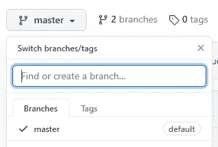

# Github:进入软件开发工作你需要知道什么

> 原文：<https://levelup.gitconnected.com/github-what-you-need-to-know-going-into-a-software-development-job-4c2a560e9c29>

Github 的赞誉被开发人员广为传颂。入门级开发人员要么被扔进了狼群，要么只是希望知道如何驾驭这项技术。鉴于 Git 的流行，我认为给出内部工作的概述是合适的。

Github 用于版本控制，但这是什么意思呢？当您在一个有多个开发人员的团队中工作时，版本控制就开始发挥作用，这样每个人的工作就不会重叠，并且所有的代码都会被保存。

我就用一个公司网站的例子。该网站的代码可能会托管在该公司的服务器上，但最新的代码也将放在 Github 上，作为其自己的存储库的主分支。所有在网站上工作的开发人员都将下载该代码，以便在他们各自的机器上本地运行。

在开始进行更改之前，需要创建一个分支来存储更改。对什么是分支的最简单的解释是回忆起上学时老师们使用投影仪的情景。笔记是用记号笔写在一张白纸上的，这样字迹就可以通过光线和透镜投射出来。分支机构基本上是在顶部放置第二张空白纸，以便保留原始副本。

可以在 Github 本身、终端或代码编辑器中创建分支。在 repo 中选择下拉菜单(如下所示)可以让您查看使用同一主数据库创建的所有分支机构。如果你决定通过 Github 创建一个分支，在使用' git branch *branchname* '命令切换到指定的分支之前，你需要' git pull '这个分支到你的计算机上。另一个有趣的提示是，分支不需要脱离主分支，可以使用另一个分支作为其基础。

点击主菜单以更改分支

当编码完成并且一切正常时，你会想把它上传到 Github。命令“git status”将显示所有被修改的文件。“git add”命令将打包所有已更改的文件。因为您是在本地运行网站，所以可能需要更改一些配置文件才能正确运行。这些不应该上传到 Github，所以你应该通过“git add *filepath* 单独添加每个文件。一条“git commit-m”*消息*“‘应该详细说明整体的改变是为了什么，是修正一个错误还是增加一个特性。最后一个命令是“git push ”,它会将整个包发送到 Github。

从那里，您将创建一个拉取请求，或简称为“PR”。pull request 是一个表单，它详细描述了分支上的变更，并对您的代码和出现在 master 中的内容进行了并排比较。根据公司的内部政策，您的许多同事将检查代码，以确保在主分支被合并之前没有任何东西会破坏它。

一个好的提示是，当同事查看您的预期更改时，提交历史将是可见的。因此，每次提交实现一个单独的部分时，清晰地跟踪代码的历史是可取的。回到网站的例子，一个“*实现的站点购物车*”、“*添加的购物* *页面刷新上的购物车持久历史*”和“*测试后修复的购物车价格错误*的提交历史允许其他人看到你所做工作的清晰进展。一次提交“ *Implemented 购物车*”是可以接受的，但是在您的整体方法中仍然非常模糊。

推送未完成的代码是相当麻烦的，同时要记住，你的工作将会受到同行的审查。清理你的历史记录是一件只需要在最后写一个拉取请求之前完成的事情。在终端内部,“git log”命令将显示该分支提交的历史记录。确定哪些提交消息是不需要的，以及它是在多少次提交之前发出的。如果不需要我之前的提交，我可以使用命令‘git reset HEAD ~ 1’。这将删除在此分支上进行的先前提交，并将提交的文件添加回我的已更改文件树中，其中我可以' git add *filepath '，*git commit-m*message '，*with*'*git push-f*'。*

在一个新的分支被合并到主分支之后，版本控制就开始起作用了。在您的代码已经被合并到主分支中之后，任何其他开发人员试图向上推送代码都会遇到合并冲突。这意味着 Github 上的主分支不同于本地计算机上的主分支，允许推送意味着您的更改在合并时会被删除。他们将需要重定基础，这意味着必须“git pull”来更新对本地主分支的更改，“git stash”来存储他们当前的更改，“git fetch”来用最新的更改更新分支，“git stash apply”来添加回他们之前的更改。