# GitLab CI/CD 操作指南

> 原文：<https://levelup.gitconnected.com/gitlab-ci-cd-how-to-706159edc997>

## 克里夫为想要实现这一飞跃的老前辈们写了笔记

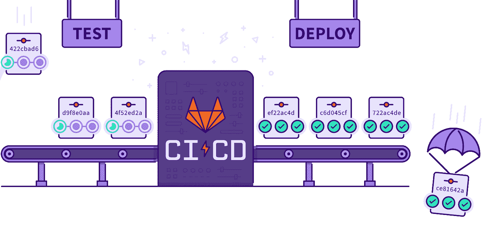

如今要成为一名工程师，不与 [Git](https://en.wikipedia.org/wiki/Git) 亲密接触几乎是不可能的；分布式版本控制的彻底改变者。当然，事情并不总是这样。当 [CVS 和 Subversion](https://en.wikipedia.org/wiki/Version_control) 仍然流行的时候，我做了我职业生涯的一部分。事实上，我可以追溯到工程师们压缩他们的代码库，通过软盘面对面地互相分享的时候…..但是我跑题了。

多年来，围绕 Git 构建的许多协作套件已经浮出水面，但三个最强有力的竞争者仍然存在， [GitHub](https://github.com) 、 [Bitbucket](https://bitbucket.org/product/) 和 [GitLab](https://gitlab.com) 。虽然我在 GitHub 上托管了很多开源项目，只是因为那里的社区，但我一直更喜欢将 GitLab 作为工作项目的解决方案。当然，GitLab 在任何特定领域都做得不太好，相比之下，像吉拉这样专注于功能的产品在问题管理方面做得更好，但它最全面地覆盖了管理和跟踪软件开发项目所需的所有基本功能，这也是我更喜欢它的部分原因。换句话说，它为我的团队提供了一种方式，使他们不必仅仅为了一个项目而登录到多个站点，因此，资产自然地落入一个单一的地方，以便更容易地引用。与此同时，如果你真的超出了 GitLab 功能所能提供的范围，它足够灵活，可以轻松地与其他工具集成，例如吉拉，这使得用 GitLab 扩展项目变得毫不费力。然后是我比其他人更喜欢 GitLab 的更大原因。它基本上是 CI/CD 的始祖，它允许在维护人员将新代码合并到特定的预定义分支时，自动构建、测试和部署更新。正如您从它听起来的方式可以看出的那样，CI/CD 为开发人员或 devops 工程师节省了大量的时间，因为他们不再需要手动构建、测试和部署更新，特别是对于那些必须频繁更新的人员。

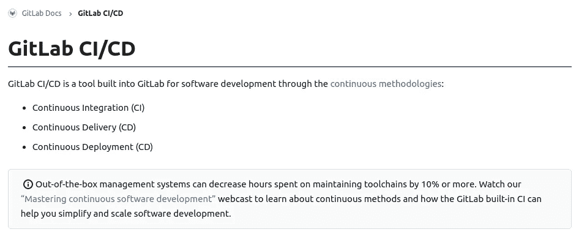

解释什么是 Ci/CD 的官方 GitLab 文档…

在 CI/CD 成为现实之前，我是一名具有基础设施背景的工程师，与开发人员密切合作，管理发布和部署超过 15 年，我花了一些额外的努力来掌握如何将这一新概念实际应用到现有项目中。当然，这并没有阻止我采用它，只是为了享受这个美妙的自动化工具，我付出了比我希望的更多的努力。所以今天，我决定写“快速入门教程”可能会很有趣，鉴于我的“老前辈”背景，也因为当我可以使用一个愚蠢的简单例子来贯穿整个过程时，我会学得更快，所以我可以在深入挖掘每个组件的细节之前获得大的图片。

除了满足我自己的兴趣来写这篇教程之外，也许这对那些还没有完全理解 CI/CD 的经验丰富的老手来说也是有用的。它甚至可以提供一些关于如何将 CI/CD 用于更多遗留环境的想法，因为大多数现有的教程都是面向现代架构的(例如 k8s，docker ),这给人一种错误的感觉，即它不适合较小规模或较旧的生产环境。

在这篇文章中，我假设您已经非常精通编写 bash 脚本和操纵 Linux 服务器。我还假设您已经在您的工作站上安装了 [GoLang](https://golang.org/) ，并且非常了解 Git/GitLab 的基础知识。

所以让我们开始吧！

## 在 GitLab 上创建一个项目

首先，让我们在 GitLab 上创建一个名为“ci-cd-demo”的项目来托管一个超级简单的 Go http 应用程序的 repo:

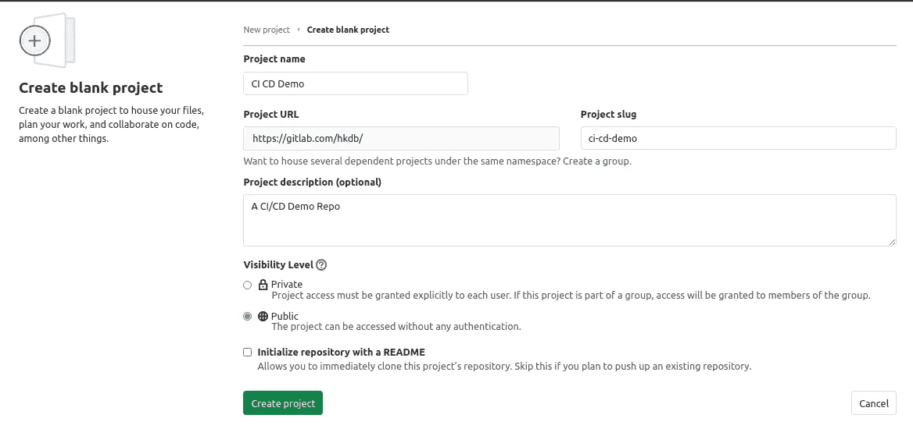

将 README.md 添加到主分支，提交并推送:

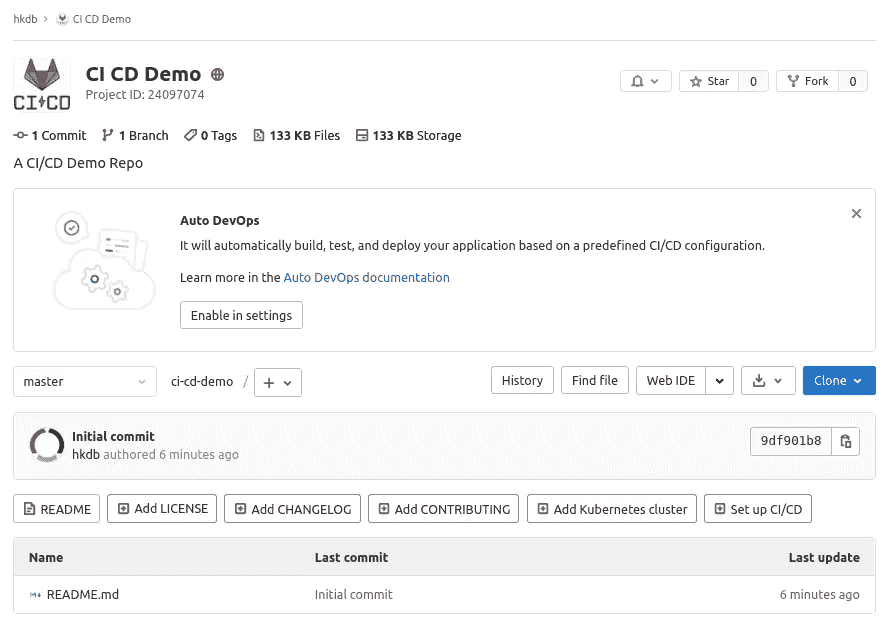

## 创建发展分支

现在我们有了一个带有主分支的项目，让我们创建一个“开发”分支，这样我们就可以开始创建示例应用程序了:

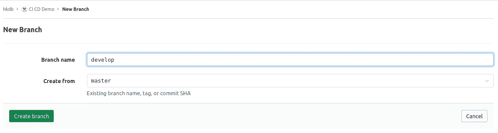

## 创建一个示例应用程序

接下来，签出 develop 分支并创建一个 main.go 文件。那么，让我们从这篇[博文](https://www.sohamkamani.com/golang/how-to-build-a-web-application/)中借用一些代码保存下来:

```
package mainimport (
 // Import the gorilla/mux library we just installed
 "fmt"
 "net/http""github.com/gorilla/mux"
)func main() {
 // Declare a new router
 r := mux.NewRouter()// This is where the router is useful, it allows us to declare methods that
 // this path will be valid for
 r.HandleFunc("/hello", handler).Methods("GET")// We can then pass our router (after declaring all our routes) to this method
 // (where previously, we were leaving the second argument as nil)
 http.ListenAndServe(":8080", r)
}func handler(w http.ResponseWriter, r *http.Request) {
 fmt.Fprintf(w, "Hello World!")
}
```

如果你很好奇该应用是否工作，可以在电脑上手动编译，运行，用浏览器查地址，[https://localhosts:8080/hello](https://localhosts:8080/hello)。

```
$ go get
$ go build
$ ./ci-cd-demo
```

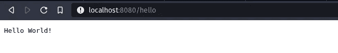

然后，让我们添加一个. gitignore 文件，这样任何本地构建都不会被推送到 repo，对于我来说，因为我使用 vim，所以我也会选择 ignore *。swp 文件也是如此:

```
*.swp
ci-cd-demo
```

好了，现在我们有了一个简单的 http 应用程序，它打印出“Hello World！”经过测试，浏览器内部工作正常，我们现在可以开始部署了。

我有一个临时的 web 服务器，设置如下，nginx 反向代理已经配置好，并指向 localhost:8080:

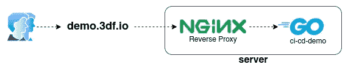

因此，要部署它，我只需将二进制文件 scp 到服务器的/home/demo 中，然后运行它，瞧！https://demo.3df.io/hello 正在播放“你好，世界！”：

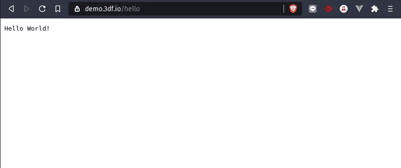

嗯，这很好，但是如果我不得不继续在这个网站上工作，不得不做各种回归测试，然后不得不频繁地反复向服务器部署新的更新，那该怎么办呢？这需要很多时间和工作，对吗？这就是我们可以依靠 CI/CD 来扭转局面的地方！

## 准备 CI/CD

要让 CI/CD 运转起来，其实超级简单。实际上，您只需编写一些 bash 脚本，在 repo 根目录下的. gitlab-ci.yml 文件中定义所有自动化任务，并在 GitLab web UI 上进行一些小的配置步骤，您就可以进入 DevOps 天堂了。

那么构成 GitLab 的 CI/CD 更重要的基础组件是什么呢？

*   **。gitlab-ci.yml** —定义需要做什么的文件
*   **Runner** —运行 Gitlab Runner“代理”来构建、测试和部署的机器或容器
*   **变量** —构建、测试和部署环境的环境变量

现在我们已经熟悉了 GitLab CI/CD 的基本组件，让我们列出我们希望如何自动构建、测试和部署应用程序，这样我就不再需要自己手动完成了:

*   **构建** —自动编译 main.go 的最新合并
*   **测试** —运行一个测试脚本，确保二进制代码返回 200 并输出“Hello World！”
*   **部署** —终止服务器上正在运行的二进制文件，用新的二进制文件替换服务器的二进制文件，然后运行二进制文件

## 自动化脚本

现在让我们自动化构建、测试和部署这个应用程序的步骤。

构建很容易，因为在任何新的 Linux 环境中它实际上只有两个命令，但是让我们把它放在一个名为“build.sh”的 bash 脚本中:

```
#!/bin/bashgo get
go build
```

然而，测试稍微复杂一点，所以让我们编写一个名为 test.sh 的快速 bash 脚本来为我们自动测试:

```
#!/bin/bash# Test to make sure the application is returning code 200
CODE=$(curl -s -w "%{http_code}" "[http://localhost:8080/hello](http://localhost:8080/hello)" -o /dev/null)if [ $CODE == '200' ]; then
 echo "Yay! Application returned code 200"
else
 echo "Argh! Application returned error code: $CODE..."
 exit 1
fi# Test to make sure the application is returning the string "Hello World!"
MSG=$(curl -s "[http://localhost:8080/hello](http://localhost:8080/hello)")if [ "$MSG" = "Hello World!" ]; then
 echo "Yay! Application Works!"
else
 echo "No! Application Failed! Code: $MSG"
 exit 1
fi
```

既然我们已经有了一个测试脚本，我们可能还应该为名为“deploy.sh”的部署编写一个脚本:

```
#/bin/bash## Find the PID of existing binary running on server
PID=$(ssh [demo@demo.3df.io](mailto:demo@demo.3df.io) "ps -eaf |pgrep ci-cd-demo")## If PID is empty, then we can just move ahead
## but if not, then kill the process
if [ "$PID" = "" ]; then
 echo "ci-cd-demo is not running on this server"
else
 ## Kill existing process
 ssh [demo@demo.3df.io](mailto:demo@demo.3df.io) "kill -9 $PID"
 echo "Killing ci-cd-demo process"
fi## Upload new binary
echo "Uploading new binary..."
scp /builds/hkdb/ci-cd-demo/ci-cd-demo [demo@demo.3df.io](mailto:demo@demo.3df.io):/home/demo/
echo  "done..."## Run new binary on server
echo "Run binary..."
ssh [demo@demo.3df.io](mailto:demo@demo.3df.io) "nohup /home/demo/ci-cd-demo &> /dev/null & exit"
echo "Deployment complete..."
```

剧本到此为止！

## SSH 认证

您现在可能在想，在部署阶段，运行人员如何访问服务器，您是完全正确的。

让我们专门为 CI/CD 制作一个 ssh 密钥对，这样我们就能够让 runner 访问我们的服务器。请确保创建不带密码的密钥，因为不支持带密码的密钥:

```
$ ssh-keygen
Generating public/private rsa key pair.
Enter file in which to save the key (/home/hkdb/.ssh/id_rsa): /home/hkdb/.ssh/ci-cd-demo
Enter passphrase (empty for no passphrase): 
Enter same passphrase again:
...
```

从上面可以看出，我生成了一个名为 ci-cd-demo(.pub) in ~/。ssh/。然后我们复制公钥并把它放在~/中。服务器上的 ssh/authorized_keys。

## 变量

现在，这就是上面提到的“变量”出现的地方。接下来，我们将复制私钥，前往我们在 GitLab.com 的项目，进入设置→ CI / CD，然后单击“扩展”按钮。然后，会出现一个“添加变量”按钮。单击它并在 KEY 字段中输入“SSH_PRIVATE_KEY ”,然后将您复制的私有密钥粘贴到 value 字段中。

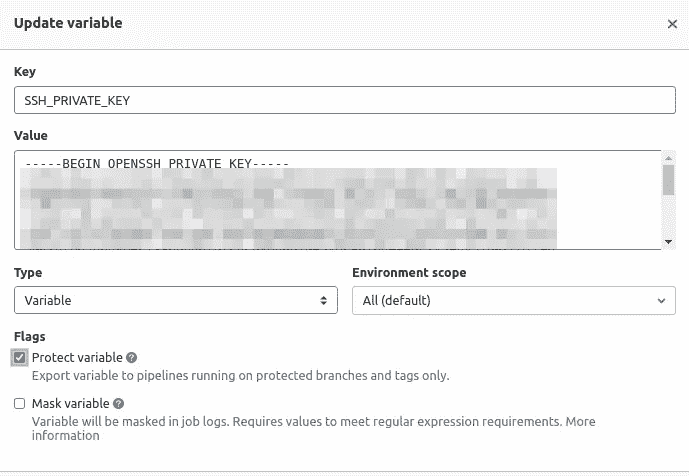

其余的可以保持默认，所以你只需点击“添加变量”。不过有一点要注意，屏蔽你的私钥本质上是一个好主意，但不幸的是，屏蔽私钥有一个问题。所以我想我最好的建议是，如果你真的要这么做的话，用一个已经安装好的钥匙来设置你自己的跑步器，但是为了这个教程，我们还是继续吧。

接下来，只需添加另一个变量“SSH_KNOWN_HOSTS”，就可以为 runner 设置 known_hosts。首先，从您的工作站执行以下命令，以便您可以复制 SSH_KNOWN_HOST 值的输出:

```
ssh-keyscan -t rsa demo.3df.io
```

然后，返回 GitLab.com web 用户界面，添加另一个变量:

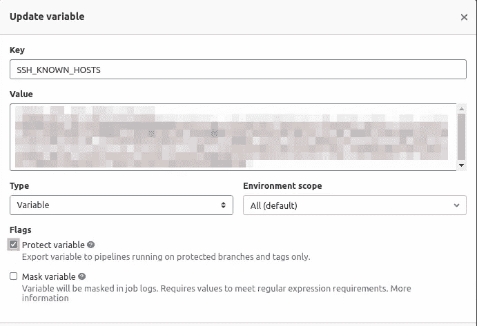

## 定义 CI/CD

好了，我们现在已经涵盖了构建、测试和部署。现在我们只需要告诉 GitLab CI/CD，在每次将代码合并到主分支时，按照我们想要的顺序运行它们。出于简化本教程的目的，我们将在 GitLab.com 上使用默认的“共享 runner ”,而不是构建我们自己的。另外，作为旁注，每个阶段都创建了一个新的环境，所以除非您指定了“工件”，否则您不能期望编译后的二进制文件会被带到下一个阶段。也就是说，是时候把。gitlab-ci.yml 文件。我们想要的如下:

*   仅对主分支自动运行
*   在每个阶段安装所有必要的软件包
*   在每个阶段运行各自的 bash 脚本
*   使构建在一周内可用(aritifact)
*   进行手动部署——这允许我们在点击按钮进行部署之前审查构建和测试
*   使用变量为部署阶段正确设置 ssh 验证

基于以上所述。gitlab-ci.yml 文件将如下所示:

```
build-job:
  stage: build
  ## Install necessary packages and compile code
  script:
    - apt-get update -y
    - apt-get install golang -y
    - ./build.sh
  ## Upload binary to GitLab and make available for 1 week and also to make accessible to test job to run and test
  artifacts:
    paths:
      - ci-cd-demo
    expire_in: 1 week
  ## Only when code merges into master
  only: 
    - mastertest-job:
  stage: test
  script:
    - apt-get update -y && apt-get install curl
    ## Run Binary
    ## Builds are stored in /builds/<gitlab user>/<project name>/
    - /builds/hkdb/ci-cd-demo/ci-cd-demo &
    - ./test.sh
  ## Only when code merges into master
  only:
    - masterdeploy-prod:
  stage: deploy
  when: manual
  script:
    ## Install ssh-client and load ssh key
    - 'command -v ssh-agent >/dev/null || ( apt-get update -y && apt-get install openssh-client -y )'
    - eval $(ssh-agent -s)
    - echo "$SSH_PRIVATE_KEY" | tr -d '\r' | ssh-add -
    - mkdir -p ~/.ssh
    - chmod 700 ~/.ssh
    ## Add known server to known hosts
    - echo "$SSH_KNOWN_HOSTS" >> ~/.ssh/known_hosts
    - chmod 644 ~/.ssh/known_hosts
    - ./deploy.sh
  only: 
    - master
```

瞧啊。我们现在准备给它一个机会。

## 真正行动的时间到了

现在让我们提交并推送所有这些新代码，然后合并到 master 中。一旦你合并到主分支，回到 GitLab.com 的 web 用户界面，点击你的项目页面左侧栏上的 CI/CD→“Pipelines”。您会注意到一个新的渠道已经启动:


点击蓝色的“正在运行”徽章，您将看到更详细的管道视图:

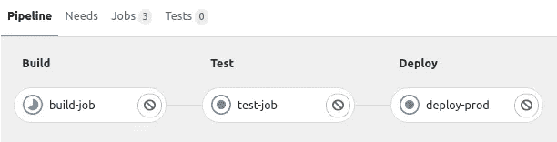

您还可以通过单击它们来查看每个阶段内部发生了什么，因此让我们单击正在运行的构建作业:

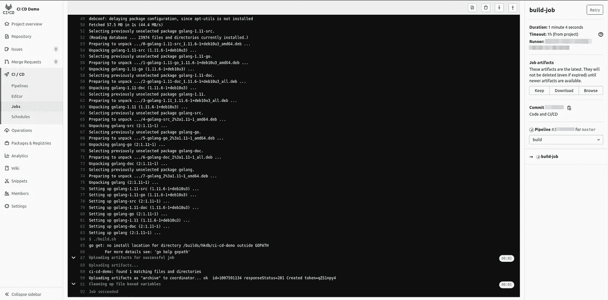

太好了！生成作业成功！现在让我们回过头来看看管道视图，我们会注意到测试作业已经自动启动:

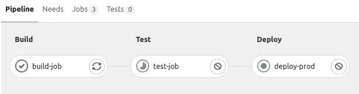

让我们点击进入测试作业:

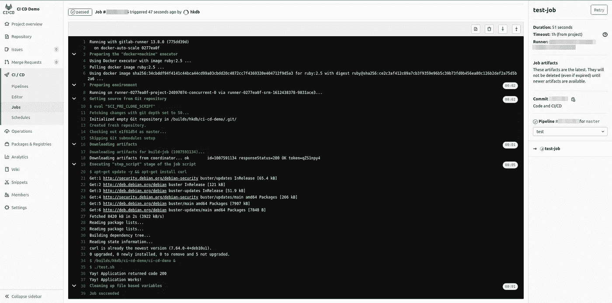

厉害！看来我们的测试工作也通过了！我们现在会在 pipeline 视图中注意到，部署作业尚未开始，我们还会看到一个 play 按钮，我们可以单击它来启动它:

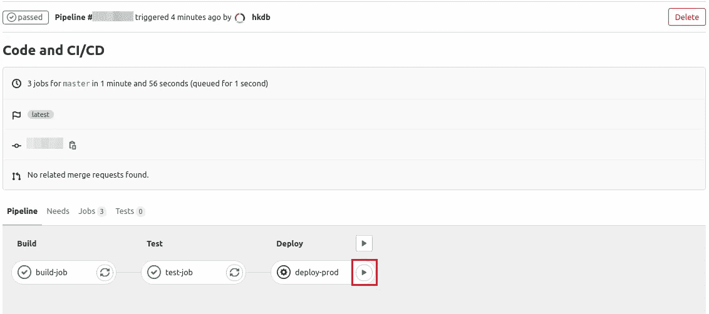

单击“播放”按钮后，让我们单击进入部署作业:

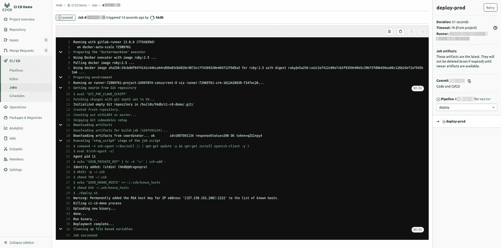

仅仅几分钟后…砰！成功部署，仅此而已！

## 推送更新

现在我们已经正确地设置了 CI/CD，让我们尝试做一些更改，并再次合并到 master 中。也许改变“你好，世界！”到“你好 CI/CD 世界！”？

所以让我们更新 main.go:

```
- 27         fmt.Fprintf(w, "Hello World!")
+ 27         fmt.Fprintf(w, "Hello CI/CD World!")
```

然后相应地更改 test.sh:

```
- 16 if [ "$MSG" = "Hello World!" ]; then
+ 16 if [ "$MSG" = "Hello CI/CD World!" ]; then
```

然后，提交，推动，合并，然后喝杯咖啡。回来后，检查构建和测试工作，然后点击 play on deploy。几分钟后，我们将看到管道已经完成:

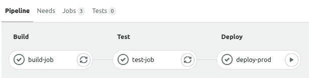

但是我们只有看到对了才会相信？所以让我们去看看这个网站:

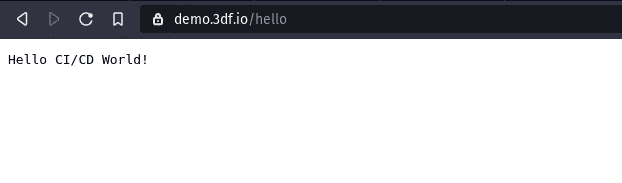

现在你知道了。我们刚刚在 GitLab 上为一个超级简单的 Go http 应用程序设置了 CI/CD，一切正常。当然，我在这篇文章中简化了一切，但我的想法是，第一次从头到尾获得完整的画面对我们学习更强大的功能产生了奇迹，因为我们现在已经在我们的脑海中准备好了整个过程，可以在我们更深入地进入 CI/CD 世界时进行交叉引用。