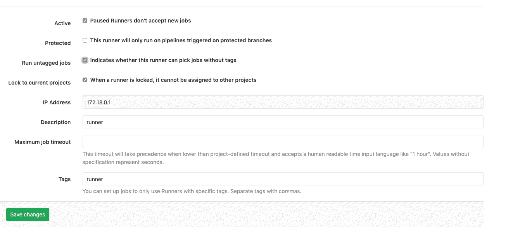

# Gitlab 安装、注册和运行

> 原文：<https://levelup.gitconnected.com/gitlab-installation-registry-and-runner-with-docker-700549b93803>


这是我们与 Gitlab 和 Kubernetes 一起构建 CI 生态系统以部署基本 Go 服务的系列文章的第一部分。

注意:您需要安装 docker。

在这一部分，我们首先为 https 访问创建自签名证书，然后利用这些证书安装一个归档的 gitlab 和一个集成的注册表。然后，我们添加了一个 runner 和一个自定义 docker 映像，以允许在 CI 管道中运行 docker 命令。

# 自签名证书

`openssl req -x509 -newkey rsa:4096 -sha256 -nodes -keyout gitlab.lightphos.com.key -out gitlab.lightphos.com.crt -subj "/CN=gitlab.lightphos.com" -days 3600` *注意:如果/CN 不起作用(如在 windows git bash 中)，请省略它，然后在 CN 提示符下输入域名*

## IP 地址(ipconfig/ifconfig)

向/etc/hosts 添加条目

```
{host ip} gitlab.lightphos.com
```

# Gitlab 和注册表安装

详细内容详见:
*[*https://gitlab.com/lightphos/gitlabops*](https://gitlab.com/lightphos/gitlabops)*

*克隆上述 repo 或创建目录 gitlabops/gitlab，并根据需要进行复制。*

*将上述自签名证书步骤中的 gitlab 密钥和 crt 文件复制到目录 gitlabops/gitlab/ssl 中*

*在 gitlabops 中，使用以下内容创建文件*

```
***version: '2' 
services: 
  gitlab: 
    image: 'gitlab/gitlab-ce:latest' 
    restart: always 
    hostname: 'gitlab.lightphos.com' 
    container_name: gitlab 
    environment: 
      GITLAB_OMNIBUS_CONFIG: | 
        external_url 'https://gitlab.lightphos.com:30080' 
        registry_external_url 'https://gitlab.lightphos.com:5555' 
        gitlab_rails['gitlab_shell_ssh_port']=30022 
        registry_nginx['enable'] = true 
        registry_nginx['listen_port'] = 5555 
        registry_nginx['ssl_certificate'] = "/etc/gitlab/ssl/gitlab.lightphos.com.crt" 
        registry_nginx['ssl_certificate_key'] = "/etc/gitlab/ssl/gitlab.lightphos.com.key" 
    ports: 
      - '30080:30080' 
      - '5555:5555' 
      - '30022:22' 
    volumes: 
      - './gitlab/config:/etc/gitlab' 
      - 'gitlab-logs:/var/log/gitlab' 
      - 'gitlab-data:/var/opt/gitlab' 
      - './gitlab/ssl:/etc/gitlab/ssl' volumes: 
  gitlab-logs: 
    external: true 
  gitlab-data: 
    external: true***
```

***上述码头工人撰写文件包括建立综合码头工人登记处(端口 5555)和添加正确的证书和密钥。按如下方式启动它(注意在重启之间使用 docker 卷来保持持久性)。***

```
***cd gitlabops
docker volume create gitlab-logs
docker volume create gitlab-data 
docker-compose -f docker-compose-gitlab.yml up -d***
```

***需要一段时间才能开始，请检查进度***

***`docker logs -f gitlab`***

****(Ctrl+C 退出)****

***然后，您可以使用在浏览器上导航***

***[https://gitlab.lightphos.com:30080](https://gitlab.lightphos.com:30080)***

***添加主密码，注册(我选择的用户名是 sr，稍后使用)并创建一个项目。***

***将 ssh 密钥添加到 gitlab:***

***[*https://subscription . packtpub . com/book/application _ development/9781783986842/2/ch02 ll1 sec 20/add-you-ssh-key-to-git lab*](https://subscription.packtpub.com/book/application_development/9781783986842/2/ch02lvl1sec20/adding-your-ssh-key-to-gitlab)***

***然后，您可以像往常一样使用 git ssh 添加或更改文件等。***

## ***多个遥控器***

***如果您愿意，您可以拥有多个遥控器(除了原点):***

***在 gitlab.lightphos.com:30080 上创建相同的项目，然后添加另一个遥控器:***

```
***$ git remote add local ssh://git@gitlab.lightphos.com:30022/sr/gitlabops.git 
$ git pull local master --allow-unrelated-histories 
$ git push local master***
```

# ***码头工人登记处访问***

***对于 linux/mac:
将`gitlab.lightphos.crt`文件复制到~/。`docker/certs.d/gitlab.lightphos.com:5555/ca.crt`***

***在窗口中:右键单击证书，安装->本地->可信存储。***

***在 ubuntu:***

***`sudo cp gitlab.lightphos.com.crt /usr/local/share/ca-certificates/gitlab.lightphos.com.crt` `sudo update-ca-certificates`***

***重启 docker。检查您是否可以登录:***

```
***docker login gitlab.lightphos.com:5555 # username/password of gitlab account 
$ Login successful***
```

# ***Gitlab Runner***

***这是在 mac 上的(/Users/Shared 是一个 mac 目录，其他操作系统见下文)***

```
***docker run -d --name gitlab-runner --restart always \ 
-v /Users/Shared/gitlab-runner/config:/etc/gitlab-runner \ 
-v /Users/Shared/gitlab-runner/certs:/etc/gitlab-runner/certs \ 
-v /var/run/docker.sock:/var/run/docker.sock gitlab/gitlab-runner:latest***
```

***注册一个 docker runner(注意这个到主机的兄弟连接使用 docker.sock，也不使用共享目录/Users/Shared)***

```
***docker run --rm -ti -v /Users/Shared/gitlab-runner/config:/etc/gitlab-runner \ 
gitlab/gitlab-runner register \ 
--url https://gitlab.lightphos.com:30080/ \ 
--registration-token REGISTRATION_TOKEN \ 
--executor docker \ 
--description "Runner" \ 
--docker-image "docker:19.03.1" \ 
--docker-volumes /var/run/docker.sock:/var/run/docker.sock***
```

***url 和令牌的详细信息可以在您的 gitlab 项目->设置-> CI/CD -> Runners 中找到。***

***您应该在设置中看到一个活跃的(绿色)跑步者:***

******

***设置 runner 运行未标记的作业:
点击铅笔:***

******

# ***检查 CI 管道***

***创建一个. gitlab-ci.yml 文件。***

```
***variables: 
 CONTAINER_IMAGE: ${CI_REGISTRY}/${CI_PROJECT_PATH}:${CI_BUILD_REF_NAME}_${CI_BUILD_REF}
 CONTAINER_IMAGE_LATEST: ${CI_REGISTRY}/${CI_PROJECT_PATH}:latest DOCKER_DRIVER: overlay2 docker-build-master: 
  image: docker:19.03.1 
  stage: build 
  before_script: 
    - echo $CI_BUILD_TOKEN | docker login -u gitlab-ci-token --password-stdin ${CI_REGISTRY} 
  script: 
    - docker images***
```

***提交和推送。Docker 登录和图像应该在管道控制台中可见。***

***对于其他操作系统，您需要复制到相应的目录，如下所示:***

```
***VirtualBox	Linux	/home	        /hosthome 
VirtualBox	macOS	/Users	        /Users 
VirtualBox	Windows	C://Users	/c/Users***
```

***删除已退出的 docker 进程的有用命令:***

***`docker rm -f $(docker ps -aq -f status=exited)`***

***在[的下一篇](https://blog.ramjee.uk/deploying-a-go-service-to-the-integrated-docker-registry-in-gitlab/)文章中，我们将看看如何将 Go 服务部署到我们构建的 gitlab CI/registry 基础设施中。***

****原载于 2019 年 11 月 12 日*[*https://blog . ram JEE . uk*](https://blog.ramjee.uk/docker-desktop-gitlab-and-kubernetes/)*。****