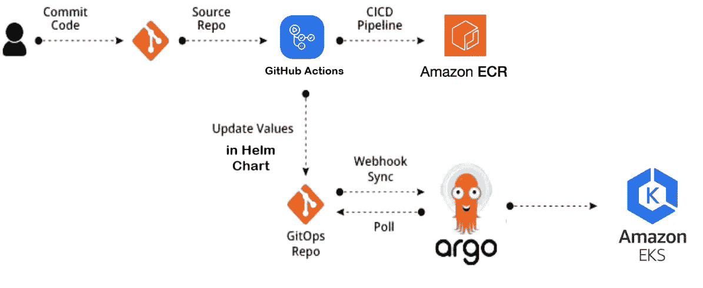
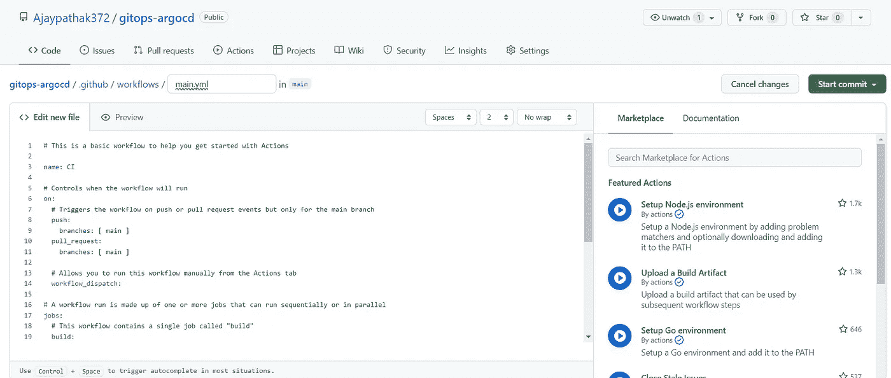
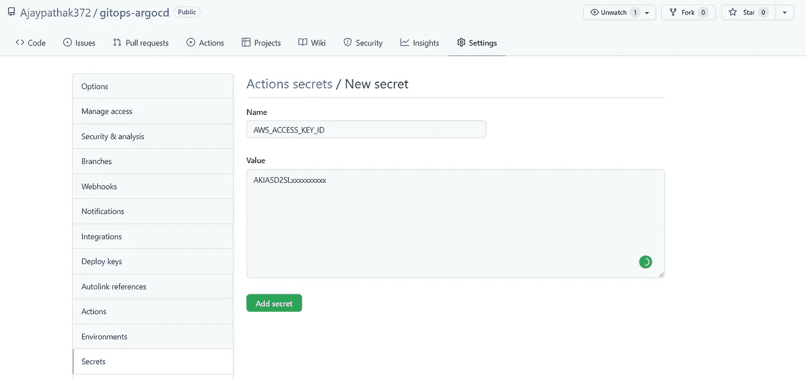
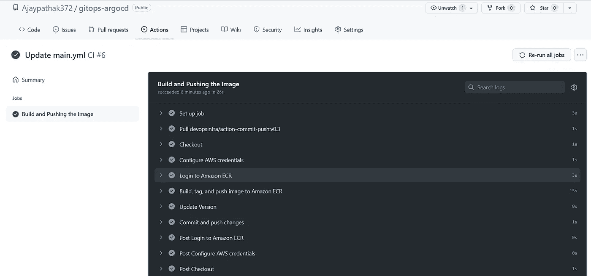
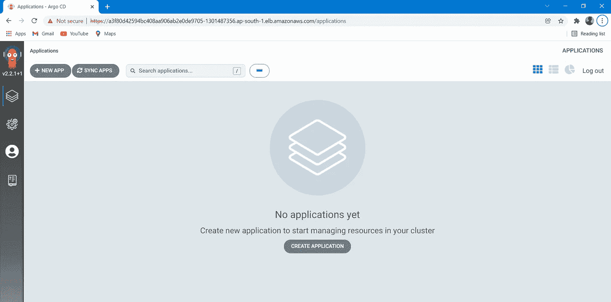
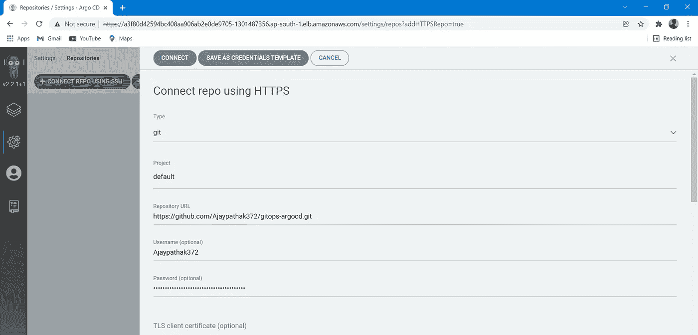
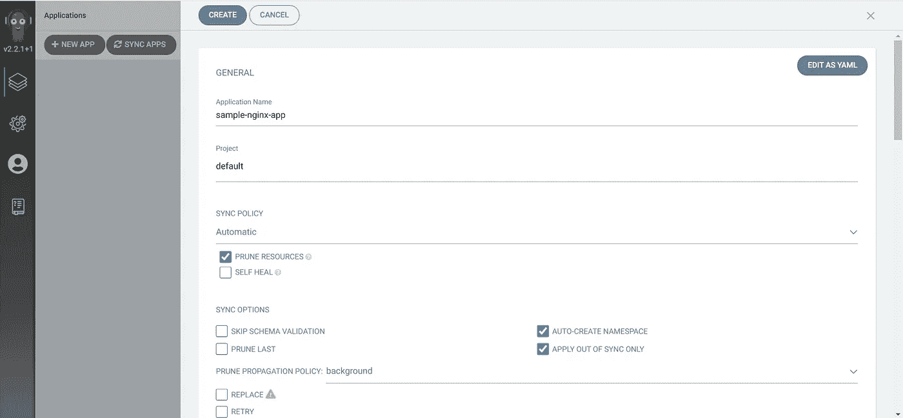
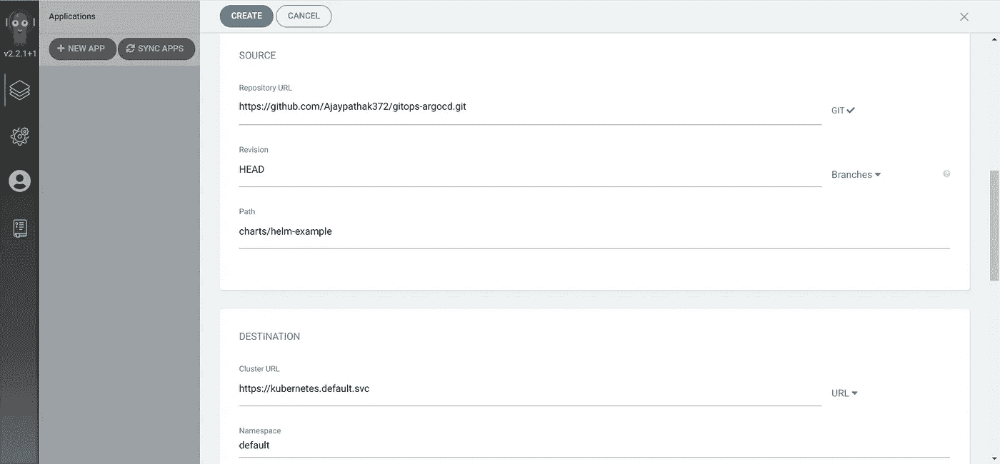
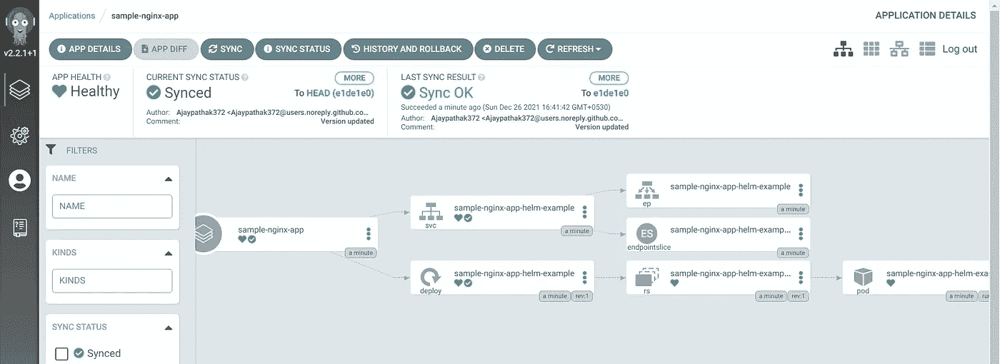
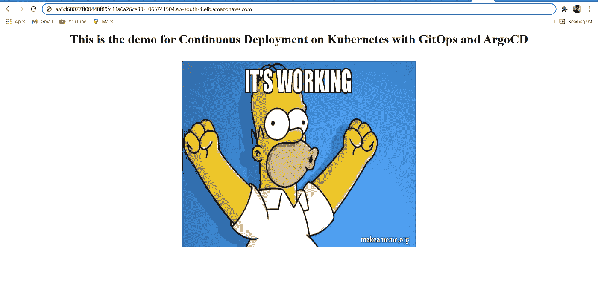

# GitOps:在 Kubernetes 上使用 GitHub 操作和 ArgoCD 的 CI/CD

> 原文：<https://levelup.gitconnected.com/gitops-ci-cd-using-github-actions-and-argocd-on-kubernetes-909d85d37746>

## 使用 ArgoCD 和 GitOps 在自动气象站 EKS 集群上部署舵图


约瑟夫·巴里恩托斯在 [Unsplash](https://unsplash.com/s/photos/ship-steering-wheel?utm_source=unsplash&utm_medium=referral&utm_content=creditCopyText) 上拍摄的照片

G 更简单地说，GitOps 是实现云原生应用程序持续部署的一种方式。

在当今的**敏捷**世界中，现代应用程序的开发都考虑到了速度和规模，而在现实世界中，我们每天都要将代码部署到生产环境中数百次，因此，为了实现这一点，我们需要获得 DevOps 最佳实践，比如 **GitOps 就是其中之一，因为它采用声明式方法。**

在本文中，我不会过多讨论什么是 GitOps，而是向您展示如何通过设置一个真实的 **CI/CD** 工作流来实现它，该工作流包含 **GitHub Actions** 和 **ArgoCD** ，这是一个非常著名的 **GitOps 工具，用于将应用程序部署到 Kubernetes** 。这是实现 GitOps 的另一种方式。

**注意:**在这篇文章中，我使用了 AWS EKS 集群，如果你不知道如何创建一个集群，那么你可以参考我的这篇文章 。

## 工作流程



从上图中，你可以看到我正在使用 **GitHub Actions** 来构建应用程序的 Docker 映像，然后将该映像推送到私有的 **ECR(弹性容器映像)**存储库。然后在 Git repo 中的 Helm 图表中更新新映像的版本。

一旦掌舵图发生变化， **ArgoCD** 就会检测到，并开始在 Kubernetes 集群中推出和部署新的掌舵图。支持 GitOps 的一个关键因素是将 CI 与 CD 分开。**CI 执行完成后，工件将被推送到存储库，ArgoCD 将负责保管 CD。最棒的是一切都将是私人的。**

# 履行

我们首先必须创建一个私有的 GitHub 存储库，并将应用程序源代码放入其中，或者您可以使用任何现有的存储库。这里只是为了演示，我使用 Nginx 服务器，所以在 GitHub repo 中放了一个简单的 HTML 网页和 docker 文件。

```
## index.html
<Html>
<body>
<center>
<h1>This is the demo for Continuous Deployment on Kubernetes with GitOps and ArgoCD</h1> <br>
<br>

</center>
</body>
</Html>## Dockerfile
From nginx:latest
COPY index.html /usr/share/nginx/html
```

## 设置 GitHub 操作

接下来，我们必须在存储库中设置 **GitHub Actions** 以从 repo 中的 docker 文件构建 docker 映像，然后将映像推送到 AWS ECR 私有存储库。这实际上是我们工作流程中的 **GitOps** 部分。

所以在 GitHub 库中点击**动作**并选择**自己建立一个工作流，**它会在路径**下创建一个 YAML 文件。github/workflows/main.yml。这是我们在 GitOps 部分需要创建和修改的唯一文件。**



下面是我们在这个工作流程中需要的文件

**。github/workflows/main.yml**

在上面的文件中，你可以清楚地看到，我已经给了我的 AWS 帐户 IAM 密钥和访问密钥，以便 GitHub 能够访问我的 ECR 存储库并推送图像。此外，我没有直接给出 AWS 凭证(即明文)，如果您在团队中工作，那么强烈建议您将凭证存储在 GitHub 存储库中的秘密位置，然后在文件中给出这些秘密环境变量的名称。

> 在 Github repo 中创建秘密非常简单，只需转到存储库**设置**选择**秘密、**并点击**新建存储库秘密**，然后给你的秘密变量和值起个名字。然后，您可以在存储库中的任何地方使用该变量。



另外，在上面的 main.yml 文件中，请注意我是如何更新**舵图**的 **Values.yml** 文件中新图像的版本的。我在这个演示中使用了一个样本舵图，你可以在我的[库](https://github.com/Ajaypathak372/gitops-argocd.git)中找到。或者你可以创建自己的舵图，并上传到 Github 库。

现在 **GitOps CI** 部分已经准备好了，所以当我们提交到主分支时，该文件将自动被触发，开始构建和推送映像，并更新 Helm Chart 中新映像的版本，最终触发 ArgoCD 在 Kubernetes 集群中部署 Helm Chart。在下图中，你可以看到我们的构建是成功的。



## 在 Kubernetes 集群中安装 ArgoCD

在这里，我们正在 EKS 集群中安装 ArgoCd 及其舵图。

```
helm repo add argo [https://argoproj.github.io/argo-helm](https://argoproj.github.io/argo-helm)
helm install argocd argo/argo-cd --set server.service.type=LoadBalancer
```

我已经公开了带有 HTTP 负载平衡器服务的 ArgoCD，只是为了演示的目的，你可以用 HTTPS 的**入口**来公开它，如果你愿意，我可以展示给你看。

现在你可以看到 ArgoCD 已经成功安装并运行。



接下来，我们必须在 ArgoCD 中创建一个应用程序，在这个应用程序中，我们基本上定义了我们的应用程序的舵图位于哪里，部署在哪里，以及一些其他的小配置。

但是由于我们的头盔图所在的 GitHub 存储库是私有的，所以我们首先需要将存储库与 ArgoCD 连接起来。这非常简单，只需进入 ArgoCD 中的**设置>存储库**并选择您想要的连接方式，这里我使用 HTTPS 进行连接。



在这里，我们必须放置**个人访问令牌(PAT)** 而不是密码，因为密码现在被 GitHub 禁用，你可以在这里看到如何创建 PAT 的[。](https://docs.github.com/en/authentication/keeping-your-account-and-data-secure/creating-a-personal-access-token)

我们可以通过在 YAML 文件中声明所有内容或从 WebUI 创建应用程序，这里我从 WebUI 创建应用程序。这就是我们如何在 ArgoCD 中创建应用程序。



图 1:在 ArgoCD 中创建应用程序



图 2:在 ArgoCD 中创建应用程序

在图 2 中，请注意我已经定义了 GitHub 库和我的应用程序导航图的路径。现在，当应用程序成功创建时，它看起来像这样



ArgoCD 应用程序

现在，我们可以从浏览器访问我们的 WebApp

BooooooM！！！



Nginx webapp 输出

现在，我们的 CI/CD 工作流已经完全准备好，完全自动化，所以当开发人员在主分支提交时，更改将自动反映在主站点上，我们不必做任何事情，一切都将完全自动化。是不是看起来很酷:)

这里有一个简短的视频，描述了这个工作流程是如何工作的。

我想现在您已经理解了如何通过使用 GitHub Actions 作为 CI 的一部分和 ArgoCD 作为 CD 的一部分来实现 GitOps，从而创建一个完全自动化的 CI/CD 工作流。以及如何在 Kubernetes 中用 ArgoCD 部署舵图。最棒的是，我们的 Github repo 和图像注册表都是私有的。

**但这只是实现 GitOps 工作流的一种方法，正如我已经说过的，GitOps 不只是关于 CI/CD 和 IaC，它是非常先进的……**

那都是我这边的…..

我希望你喜欢这篇文章，并了解一些有趣的概念。请与我一起关注更多这样的文章。

编码快乐！！

你可以在这里 找到完整的资源库 [**。**](https://github.com/Ajaypathak372/gitops-argocd.git)

在 [Linkedin](https://www.linkedin.com/in/ajay-pathak372) 上与我联系