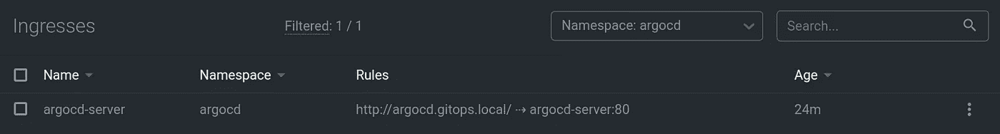
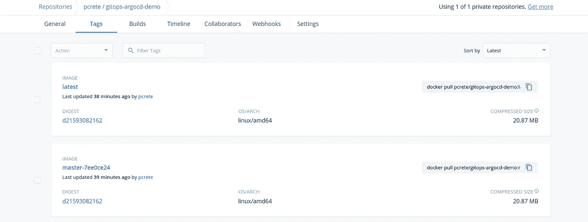

# 使用 GitLab CI 和 ArgoCD 的 Kubernetes 中的 GitOps

> 原文：<https://levelup.gitconnected.com/gitops-in-kubernetes-with-gitlab-ci-and-argocd-9e20b5d3b55b>

## 什么是 GitOps？

就一个简单的词，

> 这就是你在 Git 中做 DevOps 的方式。

您在 Git 存储库中存储和管理您的部署。这样，您将利用版本控制系统来跟踪部署中的变更，并像程序员一样协调基础设施团队之间的工作。当您在 Git 系统中将所有东西都声明性地配置为代码时，这种 Git 集中式工作流允许您大规模地管理基础设施，并为加速自动化做好准备，即“Git 作为真实的单一来源”。


在本例中，我们将学习如何使用 GitLab CI、ArgoCD 和 Helm Chart 构建端到端的 GitOps 工作流。该系列基于以下组件:

*   **GitLab** CI 管道
*   Kubernetes 模板使用**掌舵**图表
*   使用 **ArgoCD** 进行连续部署

# 先决条件

在我们开始之前，您需要设置并运行 Kubernetes 集群。如果没有，你可以按照我之前关于如何使用 **Kubespray** 设置 K8s 集群的文章中的说明来做。


还需要一个**入口控制器**(例如 **Nginx** )来访问 ArgoCD 仪表板和部署的 web 应用程序。另外，通过本指南，我们将使用 [**K8S Lens**](https://k8slens.dev/) IDE，因为它有助于更轻松地操作集群。

# 1.ArgoCD

> 用于 Kubernetes 的声明式 GitOps 连续交付工具。【argoproj.github.io/argo-cd】

## 1.1.安装

储存库:舵图: [argo/argo-cd](https://hub.helm.sh/charts/argo/argo-cd) ，GitHub:[Argo proj/Argo-Helm/charts/Argo-CD](https://github.com/argoproj/argo-helm/tree/master/charts/argo-cd)

```
$ kubectl create namespace argocd
$ helm repo add argo [https://argoproj.github.io/argo-helm](https://argoproj.github.io/argo-helm)
```

对于访问服务器 UI 的额外舵值配置，您有以下选项:

1.  `kubectl port-forward service/argocd-server -n argocd 8080:443`然后在 [http://localhost:8080](http://localhost:8080) 上打开浏览器，接受证书。
2.  在值文件`service.ingress`中启用入口，并为 [ssl 直通](https://github.com/argoproj/argo-cd/blob/master/docs/operator-manual/ingress.md#option-1-ssl-passthrough)添加注释:

注意，我还添加了`--insecure`标志以在 TLS 禁用的情况下运行，并将`installCRDs`值设置为`false` [以避免不存在的 web 挂钩](https://github.com/argoproj/argo-helm/tree/master/charts/argo-cd#helm-v3-compatability)。



第一次进入 UI 后，您可以使用`username: admin`登录，运行`kubectl get pods -n argocd -l app.kubernetes.io/name=argocd-server -o name | cut -d’/’ -f 2`即可获得密码


如果你已经到达这一页，现在你可以走了。

## 1.2. **ArgoCD CLI**

创建 CD 部署有两个选项，可以通过 CLI 或 UI。我们将使用 CLI，因为它更具声明性。详细的安装说明可以通过[https://argoproj.github.io/argo-cd/cli_installation/](https://argoproj.github.io/argo-cd/cli_installation/)找到。

```
# Linux users
$ VERSION=$(curl --silent "https://api.github.com/repos/argoproj/argo-cd/releases/latest" | grep '"tag_name"' | sed -E 's/.*"([^"]+)".*/\1/')
$ curl -sSL -o /usr/local/bin/argocd [https://github.com/argoproj/argo-cd/releases/download/$VERSION/argocd-linux-amd64](https://github.com/argoproj/argo-cd/releases/download/$VERSION/argocd-linux-amd64)
$ chmod +x /usr/local/bin/argocd
```

现在尝试登录 argo 服务器:

```
argocd login argocd.gitops.local --username admin --grpc-web
```

*   `--insecure`跳过服务器证书和域验证
*   `--grpc-web`启用 gRPC-web 协议。如果 Argo CD 服务器位于不支持 HTTP2 的代理之后，则非常有用。

## 1.3.ArgoCD 留言簿

现在我们将从已经建立的 gitops-repository 部署一个应用程序，这里是。这是我的分叉版本，添加一个入口示例。

使用 CLI 创建 Argo 应用程序

查看上面的命令，我们创建了指向存储清单文件的源`repo`和`path`的“argo app ”,定义了在集群中部署 app 的位置。

```
$ argocd app create --help
--repo, Repository URL
--path, Path in repository to the app directory
--dest-namespace string, K8s target namespace
--dest-server string, K8s cluster URL
```


[http://argocd.gitops.local/applications/guestbook](http://argocd.gitops.local/applications/guestbook)

为了演示 ArgoCD 如何工作，我们将通过向存储库添加一个`ingress.yaml`文件来更新存储库，并更新部署`3 replicas`。


之后，ArgoCD 将同步清单并部署对应于这些 git 提交更改的 Kubernetes 资源。因此，在将主机映射到 ip 地址时，我们可以通过`http://guestbook.gitops.local` *访问留言簿。*

# 3.具有 GitLab CI 的 CI/CD 管道

为了演示完整的管道，我创建了**一个** [**Python web 应用程序**](https://gitlab.com/gitops-argocd-demo/webapp) ，并将其封装为在 Kubernetes 集群中运行。您可以检查项目中的 [**dockerfile**](https://gitlab.com/gitops-argocd-demo/webapp/-/blob/master/Dockerfile) 以了解更多上下文。将应用程序构建为容器有助于 CI/CD 管道，其中 GitLab CI 可以简单地运行`docker build`命令来集成代码并将其推送到注册表。

## 3.1.连续累计

让我们来看看管道是如何构建的。首先，我们需要在存储库的根目录下创建一个`[**gitlab-ci.yml**](https://gitlab.com/gitops-argocd-demo/webapp/-/blob/master/.gitlab-ci.yml)`文件，它定义了作业执行的[](https://docs.gitlab.com/ee/ci/yaml/README.html#stages)**阶段(例如，构建、测试和部署)。**

**从上面的例子可以看出，docker 映像是用映像版本(这是一个带有提交 sha 的分支名称)构建和标记的，然后再次用`latest`标记重新标记以重用缓存。**

**此外，您可能注意到我们正在使用**环境变量**。这些变量是动态的，以使作业可移植，并且是避免硬编码多个值的最佳实践。尤其是 GitLab 提供的内置或者 [**预定义变量**](https://docs.gitlab.com/ee/ci/variables/) 。你可以在这里找到完整的列表。最后，我们定义了**组级别的** **变量**，这些变量存储在项目存储库之外，可以被多个项目共享。最好存储*凭证*和*全局配置*，以便于更新。举个例子，**

*   **用于将 docker 映像推送到注册表的 CI_REGISTRY 凭据。**
*   **SSH_PRIVATE 用于更新清单存储库。**

****

**GitLab CI **组**级**变量****

**对于本部分的结果，Docker 图像在注册表中以下列模式发布:**

****

**[https://hub . docker . com/repository/docker/PC rete/gitops-argocd-demo/tags](https://hub.docker.com/repository/docker/pcrete/gitops-argocd-demo/tags)**

## **3.2.连续交货**

> **这里是 GitLab CI 与 ArgoCD 相遇的地方。**

**在我们开始之前，让我们回到这张图片，删除线文本代表我们在 CI 部分中所做的工作。**

****

**正如 ArgoCD 简介从 Kubernetes 清单部署留言簿应用程序一样，ArgoCD 也支持各种类型的[模板工具](https://argoproj.github.io/argo-cd/user-guide/application_sources/)，如 Kustomize 和 Helm。这里我们使用 Helm 来定义模板或 K8s 资源的集合。使用可配置的值文件来表示不同类型的应用程序或部署阶段非常灵活。**

## **舵图**

**为了进行设置，我们通过运行命令`helm create webapp-chart`创建名为 [webapp-chart](https://gitlab.com/gitops-argocd-demo/webapp-chart) 的舵图。该项目的结构如下:**

****

**舵图项目结构**

**如果你不熟悉 Helm，我推荐你看这篇帖子，“[如何在 10 分钟内制作一个 Helm 图表](https://opensource.com/article/20/5/helm-charts)”会给你一个很好的起点。**

**查看`**Chart.yaml**`文件，它描述了图表信息以及应用程序版本。这个`**appVersion**`参数是当推送新版本时 CI 将要更新的地方。接下来，`**values.yaml**`文件被声明——变量被传递到你的模板中。例如，你可以看到`**deployment.yaml**` 模板是如何使用来自`repository`和`appVersion`的值来定义容器图像的。**

****

**现在已经建立了两个[回购](https://gitlab.com/gitops-argocd-demo)，它们遵循以下模式:**

> **“一个用于应用程序源代码，另一个用于清单”， [5 个 GitOps 最佳实践](https://blog.argoproj.io/5-gitops-best-practices-d95cb0cbe9ff)**

## **更新清单阶段**

**我们再次回到 GitLab CI pipeline 来添加另一个作业，在`deploy`阶段命名为`**update_manifest**`。这将克隆并提交新的更改到舵清单库。为了更新`appVersion`，我们应用 [YQ](https://hub.docker.com/repository/docker/mikefarah/yq) ，一个轻量级的命令行 YAML 处理器，使用[路径表达式](https://mikefarah.gitbook.io/yq/commands/write-update#basic)系统地编辑`Chart.yaml`。**

**为了更新清单，将 **deploy key、**全局变量中 SSH_PRIVATE_KEY 对应的公钥设置为[**web app-chart**](https://gitlab.com/gitops-argocd-demo/webapp-chart)repo，以允许对 [CI](https://gitlab.com/gitops-argocd-demo/webapp/-/blob/master/.gitlab-ci.yml) 管道的写访问。**

****

**gitops-argocd-demo > web app-chart >设置>存储库>**部署密钥****

## **管道**

**GitLab 提供了一个图形，可视化了为该管道运行的作业。下面是它的两个阶段(构建和部署)。同样，在部署阶段，`tag_latest_image`和`update_manifest`被并行执行。**

****

**[https://git lab . com/gitops-argocd-demo/web app/-/pipelines/181908945](https://gitlab.com/gitops-argocd-demo/webapp/-/pipelines/181908945)**

# **4.ArgoCD 到 Kubernetes**

**我们将再次运行`argocd app create`来设置 ArgoCD 应用程序资源，启用[自动同步策略](https://argoproj.github.io/argo-cd/user-guide/auto_sync/#automated-sync-policy)、[修剪](https://argoproj.github.io/argo-cd/user-guide/auto_sync/#automatic-pruning)、[自我修复](https://argoproj.github.io/argo-cd/user-guide/auto_sync/#automatic-self-healing)。**

**因此，ArgoCD 应用基于资源的舵图。我们可以通过运行`kubectl get all — namespace hello-gitops`来验证它**

**为了测试该应用程序，它作为一个 web 服务器运行，该服务器被配置为在集群中运行时使用`valueFrom.fieldRef`从环境变量中读取 [pod 信息](https://kubernetes.io/docs/tasks/inject-data-application/environment-variable-expose-pod-information/)。例如:**

**我在`values.yaml`文件中添加了一些 env 变量，以查看 ArgoCD 如何同步和执行部署的滚动更新。**

****

**部署的滚动更新**

**恭喜你！我们已经结束了这次演示。通过将主机映射到`webapp.gitops.local`到达此 webapp 页面。**

****

**[http://web app . gitops . local](https://webapp.gitops.local/)**

**感谢阅读这篇文章，我希望你对这个 GitOps 工作流程有一个更清晰的了解。有了最小和简单的管道，您就可以修改它以适合您的系统。**

## ***我们学到了什么***

*   *****git lab****CI 管道***
*   ***Kubernetes 模板使用* ***掌舵*** *图表***
*   ***连续部署使用* ***ArgoCD*****
*   *****GitOps*** *仓库结构***
*   ***清单-更新工作流，其中 CI 符合 CD***