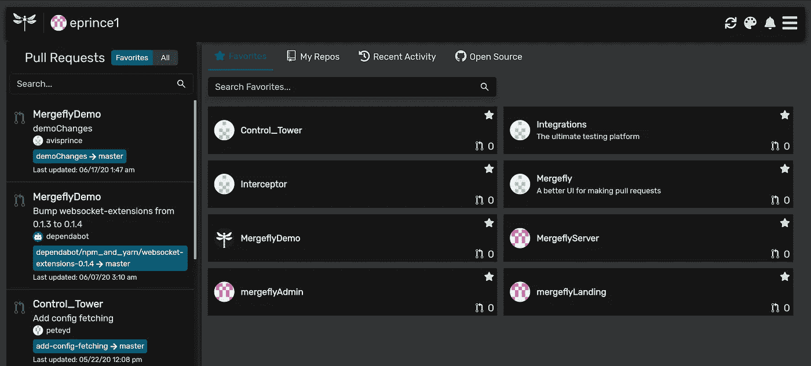
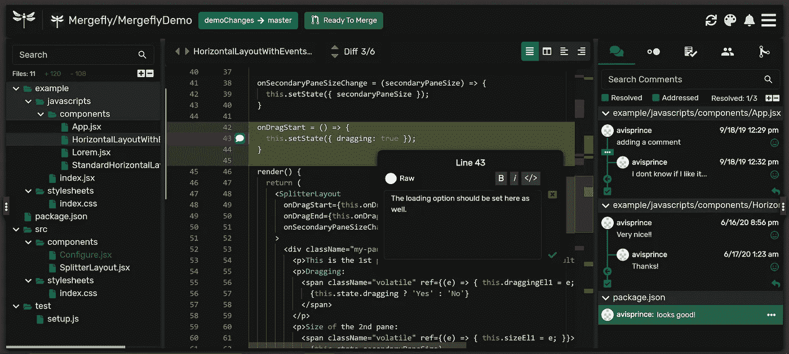
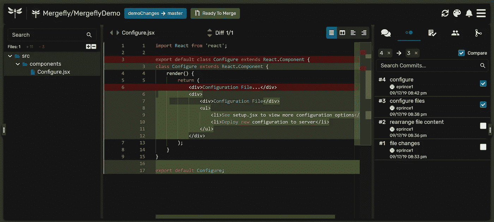

# 给 GitHub pull 请求一个急需的升级

> 原文：<https://levelup.gitconnected.com/giving-github-pull-requests-a-much-needed-upgrade-e0a925529fb1>

开发人员每天都会创建和审查无数的拉请求。Mergefly 简化并加速了拉取请求过程。

**想象一下这个场景:**您正在审查一个拉取请求，并且只能在数百行代码中看到修改后的五行代码，等待您的批准。你不知道新函数是什么，但是你注意到少了一个分号。您添加了一个注释来添加分号，批准了 pull 请求，代码就被合并进去了。

但问题是:

*   新功能在上下文中对代码的其余部分做了什么，评审者是否理解这些变化将如何影响代码库？
*   拉取请求是否得到了最大程度的审查，或者你的审查是否受到了 GitHub 用户界面的限制？
*   一个人审查代码够吗？

开发 GitHub 是为了管理云中存储库中的代码和版本。尽管有这个目标，但是构建拉请求的 UI 时并没有考虑到开发人员。虽然 GitHub 在存储开发人员的代码方面做得非常出色，但它会限制代码上下文，从而影响工作效率。作为开发人员，我和我哥哥觉得一定有更好的方法。

# 输入 Mergefly

我们创建了 [Mergefly](https://mergefly.com/) 来革新拉取请求流程。

[Mergefly](https://mergefly.com) 带浮动注释的拉请求

在 Mergefly 上，注释是浮动的，不会妨碍代码，更改是实时更新的，并且有一个非常需要的文件树。整个文件都是可见的，而不仅仅是大块的修改，这为代码和更改提供了完整的上下文。您可以选择收藏夹来更快地访问您正在处理的存储库。您的团队还可以设置时差通知，以便随时了解来自注释、提交和请求的更新。

比较提交

使用 Mergefly 的团队和个人已经看到了更快的合并时间和更少的错误合并到产品中。

Mergefly 对所有开源和私有库都是免费的。我们正处于旅程的起点，邀请您来看看我们，并分享您对我们如何改善整体用户体验的想法。

感谢您的阅读，我们希望您有机会升级您的拉取请求体验！期待更多的更新，因为我们分享了更多我们的故事，我们的路线图，以及我们对协作开发的想法！

快乐合并！