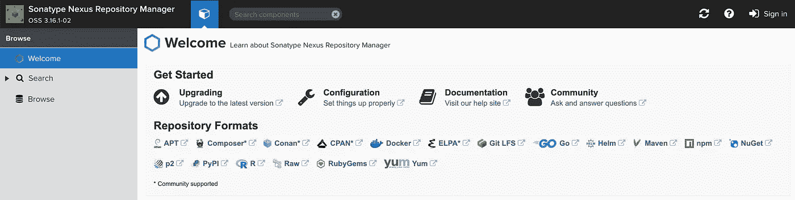
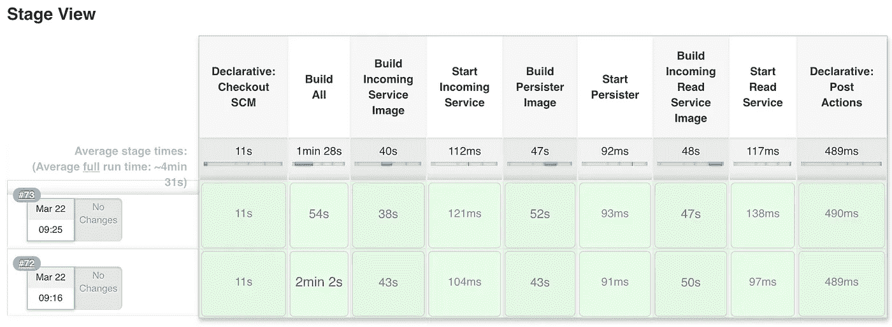

# 让 Maven Central 休息一下

> 原文：<https://levelup.gitconnected.com/giving-maven-central-a-break-e36978174712>

## 或者如何不被 Maven Central 列入黑名单


我的妻子玛丽从监狱逃跑了。

我一直在[研究](https://medium.com/better-programming/more-playing-with-pipelines-24a97f136722)如何让我的个人项目与 Jenkins 一起在 Kubernetes 中自动构建。我已经设法让许多零件一起工作来完成这项任务。我已经用 Kubernetes 插件设置了 Jenkins，它创建了 worker pods 作为 Jenkins 的执行者。worker pods 由包含您需要的任何编程环境的映像构建而成。这样做的一个巨大好处是，您不需要配置您的 Jenkins 主机来为您使用的每种表达式语言提供编译器和工具。

这种方法的一个问题是 worker pods 有一个生存时间，过了这个时间就会被删除。像 Maven 这样的编程语言在两次构建之间都有本地缓存，这样 Maven Central 就不会在每次执行构建时都被每个依赖项占用。我们可以为 Maven worker pods 附加一个带有缓存的卷。但是我将尝试一些稍微不同的东西，让 Nexus 服务器运行，并让 Maven worker pod 通过它代理 Maven Central。

为了跟进这篇文章，我假设你跟进了我的[前几篇文章](https://medium.com/better-programming/playing-with-vms-and-kubernetes-26ef93019c22)，并在你的主机上安装了 Kubernetes、Nginx 和 Jenkins。

首先，让我们运行 Nexus。我找不到一个不需要大量欺骗就能工作的舵图。所以我选择在我的主机上创建一个新的 VM。我将把它命名为 vm3 (vm2 是我正在试验的 GitLab 实例)，并给它 8g 的内存和 100 的驱动器空间。下面是我用来从主主机创建虚拟机的过程

我为安装更改了`--name vm3`和`--disk size=100`，并用默认值或合理值回答了大多数提示。

对于那些从一开始就一直在关注的人，我买了一台[翻新的机架式服务器](https://www.amazon.com/s?me=A1LNVK8DGUKDWP&marketplaceID=ATVPDKIKX0DER)，它一直表现很好！就我运行这台服务器的时间而言，我可能已经节省了购买这种规模的云服务器的费用。我希望我的 Jenkins 在工作中(来自一个不知名的云提供商)的表现和我在这台服务器上运行的一样好。然而，它只有 500 千兆字节的驱动器空间，我开始用完了。我可能需要购买一些网络连接存储。我觉得 100 千兆字节的驱动器空间对于二进制存储库来说太低了。但我稍后会处理空间问题。

一旦安装了新的虚拟机，就可以开始安装 Nexus 了。我发现[这个 Stackoverflow 答案](https://stackoverflow.com/questions/57028412/how-to-install-nexus-on-ubuntu-18-04)给出了如何安装 Nexus 的精确说明。一旦安装完毕，你就可以用通常的方式设置一个反向代理，将`/etc/nginx/sites-enabled/jenkins`复制到`/etc/nginx/sites-enabled/nexus`，将所有出现的 jenkins 改为 nexus，并设置 IP 地址。此外，不管出于什么原因，Nexus 监听 8081 而不是 8080，所以你也必须改变这一点。然后在你的本地计算机上添加 nexus 到你的`/etc/hosts/`文件，你应该能够浏览到 [http://nexus/](http://nexus/) 来设置它。



最好的一点是，如果您只想将它用作 Maven Central 的代理，您不需要配置任何东西。不过，您可能希望将管理员密码改为 admin123 以外的密码。

要设置 Maven 通过 Nexus 或任何其他 Maven 存储库进行代理，您需要在`~/.m2/settings.xml`文件中设置它。以下是我所知道的:

```
<settings ae lu" href="http://maven.apache.org/SETTINGS/1.0.0" rel="noopener ugc nofollow" target="_blank">http://maven.apache.org/SETTINGS/1.0.0"
  xmlns:xsi="[http://www.w3.org/2001/XMLSchema-instance](http://www.w3.org/2001/XMLSchema-instance)"
  xsi:schemaLocation="[http://maven.apache.org/SETTINGS/1.0.0](http://maven.apache.org/SETTINGS/1.0.0)
                      [https://maven.apache.org/xsd/settings-1.0.0.xsd](https://maven.apache.org/xsd/settings-1.0.0.xsd)"> <mirrors>
      <mirror>
        <id>central</id>
        <name>central</name>
        <url>[http://192.168.122.220:8081/repository/maven-public/](http://192.168.122.220:8081/repository/maven-public/)</url>
        <mirrorOf>*</mirrorOf>
      </mirror>
    </mirrors>
</settings>
```

如果您正在为本地开发设置一个 settings.xml 文件，您可以使用[http://nexus/repository/maven-public](http://nexus/repostiory/maven-public)URL，因为您正在通过反向代理，并且您已经在`/etc/hosts`中设置了 nexus。然而，我们正在尝试设置我们的 Kubernetes 构建来使用 Nexus，所以我们使用带有新虚拟机 IP 地址的直接 URL。

现在的问题是我们如何让 Maven worker pods 看到这个`settings.xml`文件？如果您还记得，worker pod 的定义是:

```
apiVersion: v1
kind: Pod
spec:
  containers:
    - name: maven
      image: maven:3.6.3-jdk-11-slim
      command: ["tail", "-f", "/dev/null"]
      imagePullPolicy: Always
      resources:
        requests:
          memory: "500Mi"
          cpu: "500m"
        limits:
          memory: "500Mi"
```

有几种方法可以使新的 settings.xml 就位。我们可以使用旧 maven 映像的`FROM`创建一个新映像，并将 settings.xml 复制到`/root/.m2`中，或者我们可以通过使用用于创建 maven 映像的`Dockerfile`创建一个新映像，并添加到`settings.xml`文件中。我采用了后一种方法。我在 GitHub 上分叉了[https://github.com/carlossg/docker-maven](https://github.com/carlossg/docker-maven)回购，并在我的 dockerhub 账户中制作了我自己的 maven 图像。新图像包括 settings.xml 文件。这是新的 Dockerfile 文件:

```
FROM openjdk:11-jdk-slimARG MAVEN_VERSION=3.6.3
ARG USER_HOME_DIR="/root"
ARG SHA=c35a1803a6e70a126e80b2b3ae33eed961f83ed74d18fcd16909b2d44d7dada3203f1ffe726c17ef8dcca2dcaa9fca676987befeadc9b9f759967a8cb77181c0
ARG BASE_URL=[https://apache.osuosl.org/maven/maven-3/${MAVEN_VERSION}/binaries](https://apache.osuosl.org/maven/maven-3/${MAVEN_VERSION}/binaries)RUN apt-get update && \
    apt-get install -y \
      curl procps \
  && rm -rf /var/lib/apt/lists/*RUN mkdir -p /usr/share/maven /usr/share/maven/ref \
  && curl -fsSL -o /tmp/apache-maven.tar.gz ${BASE_URL}/apache-maven-${MAVEN_VERSION}-bin.tar.gz \
  && echo "${SHA}  /tmp/apache-maven.tar.gz" | sha512sum -c - \
  && tar -xzf /tmp/apache-maven.tar.gz -C /usr/share/maven --strip-components=1 \
  && rm -f /tmp/apache-maven.tar.gz \
  && ln -s /usr/share/maven/bin/mvn /usr/bin/mvnENV MAVEN_HOME /usr/share/maven
ENV MAVEN_CONFIG "$USER_HOME_DIR/.m2"COPY mvn-entrypoint.sh /usr/local/bin/mvn-entrypoint.sh
COPY settings-docker.xml /usr/share/maven/ref/settings.xml
COPY settings-docker.xml /root/.m2/settings.xmlENTRYPOINT ["/usr/local/bin/mvn-entrypoint.sh"]
CMD ["mvn"]
```

为了建立新的形象:

```
docker build --tag <dockerhubname>/maven:3.6.3-jdk-11-slim-nexus .
docker push <dockerhubname>/maven
```

替换您自己的 docker hub 名称。您可能需要首先使用`docker login`登录

如果你一直在关注我以前的帖子，并且在 MondoReacto 项目中设置了 Jenkins 管道，你可以尝试一下。在 MondoReactoBuild 项目的`pod/docker-pod.yaml`中添加新图像:

```
apiVersion: v1
kind: Pod
spec:
  containers:
    - name: maven
      image: <dockerhubname>maven:3.6.3-jdk-11-slim-nexus
      command: ["tail", "-f", "/dev/null"]
      imagePullPolicy: Always
      resources:
        requests:
          memory: "500Mi"
          cpu: "500m"
        limits:
          memory: "500Mi"
```

再次替换您的 docker hub 名称。

现在在 Jenkins 中再次运行构建，您应该会看到它花费了通常的时间，但是第二次构建会减少，因为依赖项是从 Nexus 中提取的。



当然，您会问心无愧地意识到，您不会在每次构建时都碰到 Maven Central 一百万次。

另一件好事是，现在我已经安装了 Nexus，我可能还可以用它做更多的事情，是时候进行实验和玩更多的游戏了。

本文中使用的资源库有:[https://github . com/rkamradt/mondoreactbuild/releases/tag/v 1.1](https://github.com/rkamradt/MondoReactoBuild/releases/tag/v1.1)https://github.com/rkamradt/MondoReacto/releases/tag/1.1