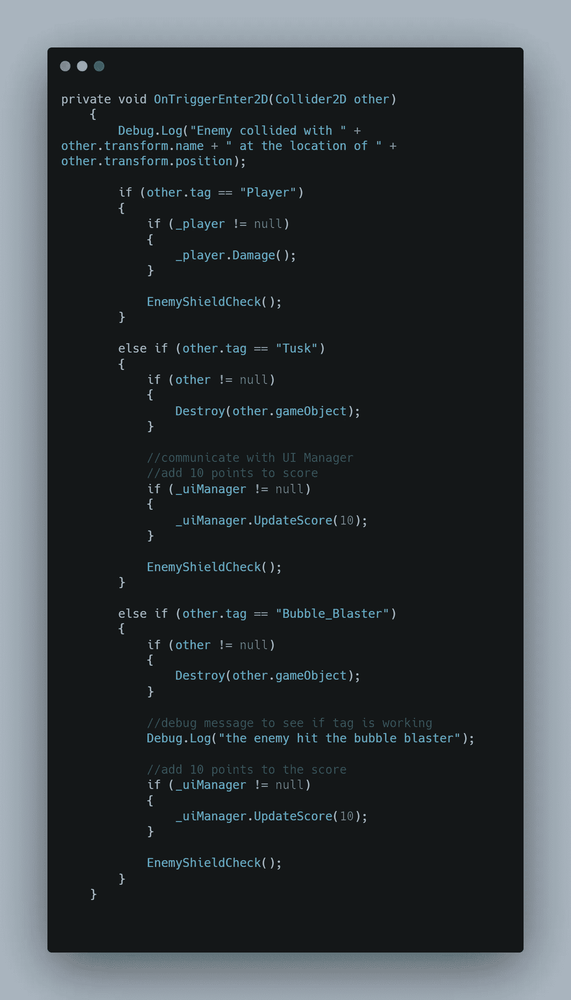

# 给随机的敌人一面盾牌

> 原文：<https://levelup.gitconnected.com/giving-random-enemies-a-shield-3508249756a7>

这些可怜的食人鱼在受到玩家攻击时毫无防备。我在这篇文章中的目标是给随机的敌人一个可以吸收一次攻击的盾牌。我们走吧！

我需要的第一件东西是一个艺术资产，它可以被制作成盾牌视觉的**精灵**。我使用了和玩家盾牌一样的泡泡资产，只是为敌人重新调整了大小。

在**层级**中导入并重命名敌人的盾牌游戏对象后，我将一条敌人的食人鱼拖入**场景视图**中，并通过拖放使盾牌对象成为食人鱼的**子组件**。

层中的**顺序被设置为 **1** ，因此它在视觉上出现在敌人上方。**

放置盾资产后，我**取消勾选**框，将其设置为**不活动** *(不可见)*，然后按**覆盖**和**将所有**更改应用到**食人鱼预设**。

现在在**敌方职业**中，我需要几个**变量**做盾。因为这个盾牌只能承受一次攻击，所以我不会像为玩家做的那样费心让盾牌恢复健康。我所需要的只是一个随机的盾变量，一个检查盾是否激活的布尔变量，以及一个对盾游戏对象的引用。

我**序列化**盾牌游戏对象的**域**，这样我就可以**通过拖拽将**分配给**检查员**中的敌人**预设**。我需要再次覆盖并接受**预设**的改变。

现在我有了盾牌视觉的参考，我回到了**敌人职业**。我将 **randomEnemyShield** 变量赋值为一个**随机范围**，在 **0** 和**4**T10【5 不包括】之间。当敌人被实例化时，在 void **start** 中调用一次。我打开一个 **if** 语句来检查 **randomEnemyShield** 的值是否等于**零**。如果是，屏蔽视觉为**使能**，屏蔽有效**布尔**设置为**真**。这边 **1** 中 **5** 敌人会有盾牌！

我没有为玩家和各种投射物的碰撞运行这些相同的死亡命令，而是调用死亡**方法**。

我创造了另一种方法来检查**防护罩是否激活。如果是，则**屏蔽视觉**设置为**无效**并且**布尔**翻转为**假**。 **return** 关键字阻止代码进一步运行。一旦护盾失效， **else** 语句在**碰撞**时调用敌人死亡行为方法。**

现在我可以开始使用**触发二维**方法，检查**长牙**、**玩家**和**气泡爆破器**的碰撞。我现在需要做的就是在每个标签的碰撞底部调用**屏蔽检查器方法**。

这是一个随机选择的拥有单击护盾的敌人的剪辑。感谢阅读！

