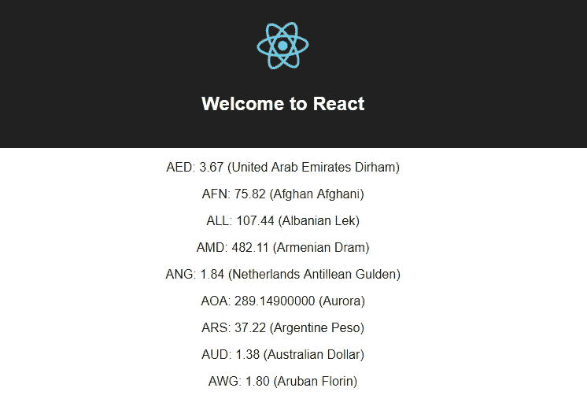
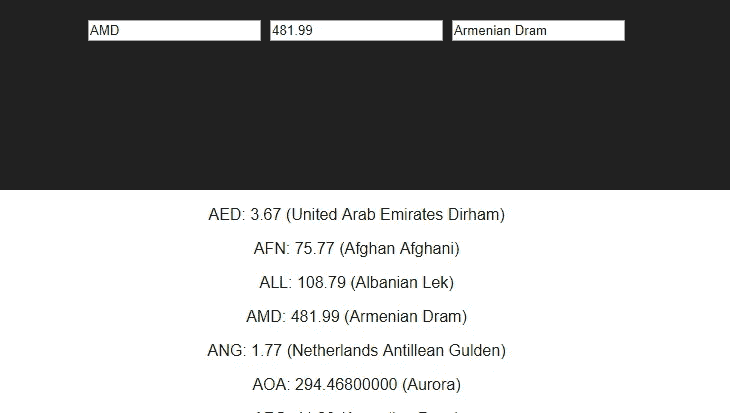

# 用 Apollo-Boost 提升 React + GraphQL

> 原文：<https://levelup.gitconnected.com/giving-react-a-lift-with-apollo-boost-74c6ff32894d>


如果你在项目中使用 [GraphQL](https://graphql.org/) ，你肯定会遇到 Apollo 和他们的 GraphQL 支持工具。

Apollo 引入的工具集之一是 Apollo-Boost(从现在开始我简称它为 Boost)。Boost 允许在应用程序中使用最少的 Apollo 客户端配置和样板文件。Apollo Client 本身是一个包装类，旨在简化与 GraphQL 服务器的交互(正如我们将看到的，客户端 GraphQL 也是如此)。

除此之外，他们还对 React 框架提供了工具支持。虽然客户端是独立于框架的，但是 [react-apollo](https://github.com/apollographql/react-apollo) 库具有与 apollo 客户端无缝集成的组件。

# 装置

为了快速启动并运行新的 react-apollo 客户端，我推荐使用 [create-react-app](https://github.com/facebook/create-react-app) :

```
npx create-react-app create_react_app
```

注意是 [**npx**](https://medium.com/@maybekatz/introducing-npx-an-npm-package-runner-55f7d4bd282b) ，不是**NPM**； **create_react_app** 是我为新项目选择的名字。生成的 package.json 文件将包含以下内容:

```
{
  "name": "create_react_app",
  "version": "0.1.0",
  "private": true,
  "dependencies": {
    "react": "^16.5.2",
    "react-dom": "^16.5.2",
    "react-scripts": "1.1.5"
  },
  "scripts": {
    "start": "react-scripts start",
    "build": "react-scripts build",
    "test": "react-scripts test --env=jsdom",
    "eject": "react-scripts eject"
  }
}
```

您会注意到提供了几个构建脚本，react-scripts 用作应用程序启动器。react-scripts 启动器以最小的配置提供了一个精选的依赖项列表。你可以在这里阅读[提供的内容。当执行`npm run start`时，它将启动一个 hot React 服务器(当检测到代码变化时重新启动的服务器),并将在您的浏览器中自动加载一个示例应用程序页面。](https://github.com/facebook/create-react-app#whats-included)

在继续之前，需要安装三个额外的软件包(已经提到过):

```
npm install --save apollo-boost react-apollo graphql
```

# 构建应用程序

Boost 提供的主要工具是 ApolloClient 类。这提供了查询、变异和订阅方法，通过承诺简化了客户端-GraphQL 的交互。

第一步是配置一个 ApolloClient 实例。我将使用 [Apollo 客户端安装说明](https://www.apollographql.com/docs/react/essentials/get-started.html#installation)中提供的 GraphQL 服务器设置。

```
import ApolloClient from "apollo-boost";

const client = new ApolloClient({
  uri: "https://w5xlvm3vzz.lp.gql.zone/graphql"
});
```

该服务器是使用 Apollo Launchpad(你应该随身携带的另一个 GraphQL 工具)构建的，你可以在这里在线访问它。请注意，在撰写本文时，Launchpad 中显示的查询是错误的，应该类似于:

```
query rates($currency: String!) {
  rates(currency: $currency) {
    currency
    rate
    name
  }
}
```

设置好客户端后，接下来将 ApolloProvider 组件插入到应用程序中:

(我已经从最初生成的应用程序中清理了一点语法。)

ApolloProvider 是 React 应用程序和 GraphQL 客户端之间的连接组件。从提供者内部，我们可以在应用程序中添加查询和变异组件，这些组件根据上下文进行操作。您可以将上下文视为应用程序的状态，但它是通过 GraphQL 脚本访问的。

# 使用查询

查询组件将 GraphQL 查询字符串作为属性。该查询字符串在组件呈现时执行，调用一个函数，该函数将**加载**状态、**错误**(如果有)和数据 ***结果*** 作为参数。通常会发生的是，一旦 **loading** 为 false(查询数据已加载完毕)，并且没有返回**错误**，那么数据属性将被传递给子组件。

以前面显示的查询为例，我们可以创建一个简单的显示:

然后，回到主应用程序:

```
**import ExchangeRates from './ExchangeRates'**const client = new ApolloClient({
  uri: "[https://w5xlvm3vzz.lp.gql.zone/graphql](https://w5xlvm3vzz.lp.gql.zone/graphql)"
});const App = () => (
  <ApolloProvider client={client}>
    <div className="App">
      <header className="App-header">
        
        <h1 className="App-title">Welcome to React</h1>
      </header>
      **<ExchangeRates/>**
    </div>
  </ApolloProvider>
)
```

您会注意到 ExchangeRates 会进行自己的查询，因此该组件是完全独立的。

生成的页面并不美观，但却很准确:



相对于美元的部分货币汇率列表(美元)

# 默认值和客户端上下文

下一步是更好地利用顶部显示 React 徽标的屏幕空间，将其替换为货币输入，这样用户就不必滚动一大串货币缩写来找到她感兴趣的缩写。

## 设置默认值

添加一个默认值(或多个值)来启动应用程序是对前面显示的 ApolloClient 配置的一个非常简单的修改:

```
const client = new ApolloClient({
  uri: "[https://w5xlvm3vzz.lp.gql.zone/graphql](https://w5xlvm3vzz.lp.gql.zone/graphql)",
 **clientState: {
    defaults: {
      currencyOfInterest: 'USD',
    }
  }**
})
```

**currencyOfInterest** 将存储在客户端的本地。我们通过 **@client** 指令通知查询位置。我稍微修改了原始组件布局，以便来自服务器的原始查询结果通过 props 传递给 ExchangeSelector。

```
const ExchangeRates = (client) => (
  <Query
    query={gql`
      {
        rates(currency: "USD") {
          currency
          rate
          name
        }
      }
    `}
  >
    {({ loading, error, data }) => {
      if (loading) return <p>Loading...</p>;
      if (error) return <p>Error :(</p>;return (<div>
        <header className="App-header">
          **<ExchangeSelector data={data}/>**
        </header>
          <ExchangeList data={data} />;
        </div>)
    }}
  </Query>
);
```

下面是新的 React ExchangeSelector 组件:

第 6 行的 **@client** 标识告诉 ApolloClient 可以在本地缓存中找到该值。通过查询和变异操作，可以访问和写入该值，就像它驻留在服务器上一样。然而，由于这是本地存储的，使用第 21 行所示的`client.writeData()`直接更新客户端缓存通常更方便。

ExchangeSelector 从其父容器中获取利率，当 currencyOfInterest 的输入发生变化时，所有三个输入元素都会更新(第 20–21 行)。onChange 处理程序直接写入客户端的缓存，这将触发 ExchangeSelector 本身的重新呈现。



# 包装它

这个例子的完整代码可以在这里找到[。README.md 详细介绍了 create-react-app(不是我写的，是它写的)。](https://github.com/JeffML/create-react-app)