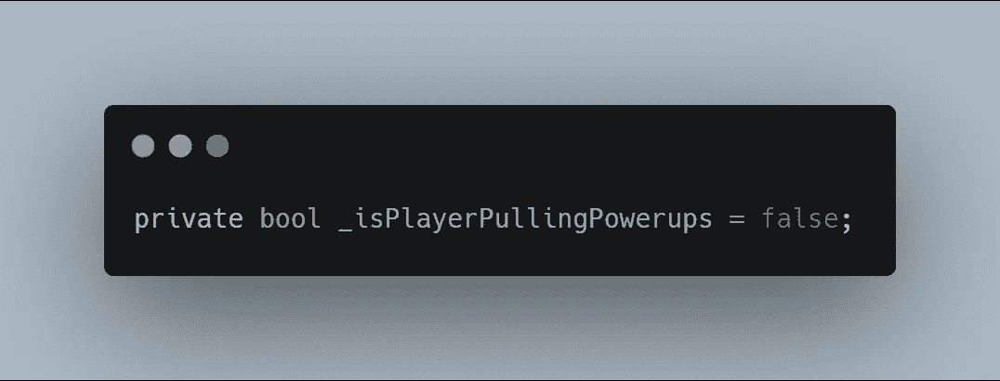

# 给玩家心灵遥控

> 原文：<https://levelup.gitconnected.com/giving-the-player-telekinesis-1a57fae03550>

能用意念移动物体不是很棒吗？在这篇文章中，我的**目标**是让玩家在按下 **C** 键时快速移动电源。

当玩家不召唤它的时候，我希望它能保持正常运动。当特定的键被按下时，让 powerup 从它自己的脚本改变运动是相当简单的。让玩家按下按键时的 powerup 改变动作还需要几个步骤，所以让我们开始吧。

首先，我在**玩家类**的顶部创建一个变量来存储一个**布尔值**。当付款人开始拉异能时，这将从假变为真，当玩家停止拉时，这将重置为假。

接下来是一个**方法** *(PullPowerupsToPlayer)，*当按下 **C** 键时改变 bool。这个方法在 void **Update** 中的每一帧都被调用。

当按下 **C** 键时，我使用 **GetKeyDown** 发送一条消息。该消息将布尔值更改为**真值**。当释放 **C** 键时，如果部分变元将**值**变回**假**则**否则。**

为了将这个值发送给 powerup，我创建了一个带有**返回值**的**公共 bool 方法**，因此 powerup 可以访问它来检查这个值。这个方法需要 **return** 关键字，否则你会得到一个**错误**告诉你这个方法需要一个返回值。

*我刚刚注意到我的* ***拼错了*** *中的* ***是 PullingPowerups*** *的变量名。啊！我会搞定的。*

现在转到**加电类**，我添加了一个**变量**来镜像玩家发送的公共布尔值。

我已经有了一个**播放器**的句柄和一个 **GetComponent** 在 void **Start** 中，但是我认为这里值得再提一下，因为这是加电检查播放器的公共值所需要的。

**powerup 类**中的 **Update** 方法真的很简单，现在只有一个移动方法。

在 **PowerupMovement** 方法中，我首先检查播放器是否为 **null** 。然后我**将**加电类**中**bool***(isPlayerPullingPowerups)*的**值**赋值为**等于从**播放器**通过**公共 void***(PoewerupPullCheck)*传递的 bool 值。现在我使用一个带有**条件**的 **if else** 参数来输入 **if** 语句。玩家必须**而非**为 **null** ，以确保我不会抛出游戏中断错误，并且**isPlayerPullingPowerups**值需要等于 **true** 。然后通电使用一个**矢量 2。向**方法移动，以给玩家加电。****

**else** 语句保存了玩家没有召唤时加电的标准行为。我还在**加电类**的顶部添加了一个**新的速度变量**，以使加电比正常速度更快。

这是一个新的玩家能力的剪辑，为自己绘制能量图。感谢阅读！

