# GloVe 和 fastText 解释清楚:从文本数据中提取特征

> 原文：<https://levelup.gitconnected.com/glove-and-fasttext-clearly-explained-extracting-features-from-text-data-1d227ab017b2>

## 数据科学

## 他们怎么比 Word2Vec 好？

```
**Table of Contents**[**🧤 GloVe**](#1229)
  [⚙️ The Basics](#429c)
  [🧮 Cost Function Derivation](#9f25)
  [🔮 Final Prediction](#6f74)
  [🪙 Advantages & Limitations](#e987)[**⏩ fastText**](#3a13)
  [📚 Skip-gram reviewed](#60c8)
  [📈 Improving Skip-gram](#3b6e)
  [🆚 fastText vs Word2Vec](#8378)[**🚀 Summary**](#18fc)
```

在大多数情况下， [**Word2Vec**](https://towardsdatascience.com/all-you-need-to-know-about-bag-of-words-and-word2vec-text-feature-extraction-e386d9ed84aa) 嵌入比文本的单词袋表示更好，它允许您自定义特征向量的长度，并使用**(中心，上下文)**单词对来捕捉记号之间的关系。

然而，Word2Vec 仍然有一些限制，其中四个是:

1.  Word2Vec 依赖于关于单词的本地信息，即单词的上下文仅依赖于其邻居。
2.  获得的单词嵌入是训练神经网络的副产品，因此特征向量之间的线性关系是一个黑盒(某种)。
3.  Word2Vec 无法理解词汇外(OOV)单词，即训练数据中不存在的单词。您可以分配一个用于所有 OOV 单词的 UNK 令牌，或者您可以使用对 OOV 单词稳定的其他模型。
4.  通过给每个单词分配不同的向量，Word2Vec 忽略单词的 [**形态**](https://en.wikipedia.org/wiki/Morphology_(linguistics)) 。例如，*吃*、*吃*、吃*吃*被 Word2Vec 认为是独立的不同单词，但它们来自同一个词根:*吃*，其中可能包含有用的信息。

在这个故事中，我们将介绍理论上可以解决这些限制的嵌入模型: **GloVe** 和 **fastText** 。从现在开始，我们将通过**文档**对文本进行单个观察，通过**语料库**对文档进行集合。

# 🧤手套

## ⚙️基础

与 Word2Vec 不同，GloVe (Global Vectors)的创建是为了直接找到特征向量的线性结构*。在这样做的时候，它直接捕获全局语料库统计数据，这利用了数据中的大量重复。GloVe 解决了 Word2Vec 的限制 1 和 2。*

**

*GIF 由[海绵宝宝](https://giphy.com/spongebob/)在 [giphy](http://giphy.com) 上*

*首先，一些符号！*

*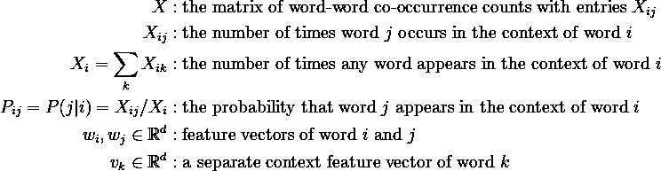*

*举个例子，假设你有一个文档集，上面写着“敏捷的棕色狐狸跳过了懒惰的狗”。那么在同现窗口大小为 1 的情况下， *X* 将如下。很容易看出 *X* 是对称的。*

*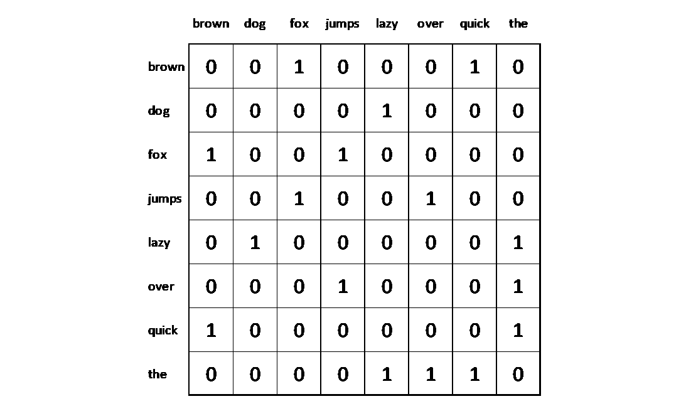*

*窗口大小为 1 的单词-单词共现计数矩阵示例|图片作者[作者](http://dwiuzila.medium.com/membership)*

*GloVe 的思路是将 *X* 转换成特征矩阵 *W* (其行由 *wᵢ* 或 *wⱼ* 填充)和 *V* (其行由 *vₖ* 填充)。最普通的手套模型采用以下形式*

*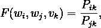*

*其中 *F* 关联 *W* 和 *V* 到 *X* 。我们来看看 *F* 如何区分相关词和无关词:*

1.  *如果字 *k* 与字 *i* 和 *j* 都相关( *Pᵢₖ* 和 *Pⱼₖ* 大)，或者与字 *i* 和 *j* 都不相关( *Pᵢₖ* 和 *Pⱼₖ* 小)，那么 *F* 的值将接近 1。*
2.  *如果单词 *k* 与*恰好是单词 *i* 和 *j* 中的一个*(pᵢₖ和 *Pⱼₖ* 中的一个小，另一个大)，那么 *F* 的值将远离 1。*

## *🧮成本函数推导*

*满足 *F* 的特征向量有很多代数运算。为了找到一个合适的成本函数，让我们缩小 *F* 的可能性数量，以便它是可计算的，但仍然有意义。这是一个 8 步流程:*

***①。**由于矢量空间本质上是线性结构，对 *Pᵢₖ* / *Pⱼₖ* 中出现的信息进行编码的最自然的方式是矢量差分。因此，你可以限制 *F* 为*

*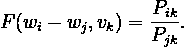*

***②。**注意 *F* 将矢量转换成标量。为了保持向量的线性结构，再一次限制 *F* ，以便它现在接收其参数的点积，*

*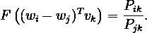*

***③。**没有什么特别的 *i* 和 *j* ，它们指向的是语料库中的任意词。因此，你可以将等式(2)中的 *i* 和 *j* 的角色对调，得到*

*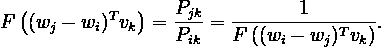*

*定义*u*=*wᵢ*wⱼ，你有*

*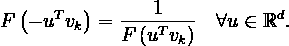*

***④。在 *X* 中，中心词和上下文词之间的区别是任意的，你可以自由交换这两个角色。为了始终如一地做到这一点，你不仅要交换 *W* ↔ *V* ，还要交换 *X* ↔ *Xᵀ* 。***

*该模型在这种重新标记下应该是不变的，但是等式(2)不是，因为 RHS 由于 *X* 的对称性而不变，但是 LHS 不是。为达到不变性， *F* 假设为从(ℝ，+)到(ℝ⁺，×)的一个 [**群同态**。是的，我们再一次限制 *F* 。因此](https://en.wikipedia.org/wiki/Group_homomorphism)*

*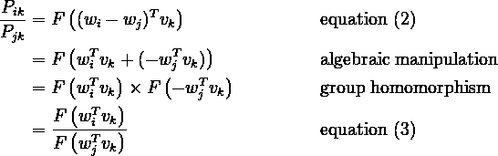*

***(5)。**方程(4)的一个解是*

*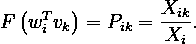*

**F* 的群同态由 *F* = exp 满足，所以*

*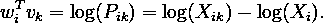*

***(6)。**由于对数( *Xᵢ* )这一术语并不依赖于 *k* ，所以它可以被看作是 *bᵢ* 对 *wᵢ* 的一个偏误术语。为了恢复交换对称性，还要为 vₖ 加上一个偏置 *aₖ* 。最终模型变成了*

*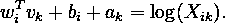*

***(七)。**第(6)部分的模型称为对数双线性回归模型。参数 *wᵢ* 、 *vₖ* 、 *bᵢ* 和 *aₖ* 的最佳值可以使用最小二乘法找到。*

*引入一个加权函数 *f* ( *Xᵢₖ* )来补偿任何时候 *Xᵢₖ* = 0，因为此时 log( *Xᵢₖ* )是未定义的，并且还平衡频繁和非频繁单词对模型的贡献。模型的成本函数变成*

*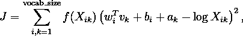*

*其中`vocab_size`是语料库的大小。*

***(8)。**什么是好的选择 *f* ？首先，出于第(7)部分解释的原因， *f* 要满足 *f* (0) = 0。同样，如果它是连续的，它应该比 log *x* 更快地接近零。其次， *f* ( *x* )应该是非递减的，这样罕见的同现(小的 *x* )就不会过重(有相对大的 *f* )。第三， *f* ( *x* )对于 *x* 的大值应该相对较小，这样才不会对频繁的同现进行过加权。一个好的简单选择是*

**

*其中 *x* ₘₐₓ和 *α* 是超参数。下面是 *f* ( *x* )的剧情。*

*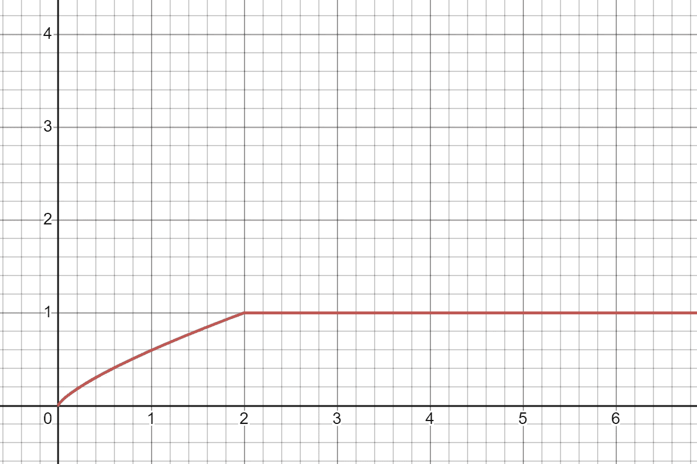*

*f(x)与 *x* ₘₐₓ = 2，α = 0.75。实际上， *x* ₘₐₓ应该大得多(比如 100) |图片由[作者](http://dwiuzila.medium.com/membership)*

## *🔮最终预测*

*所以，你已经:*

1.  *计算单词-单词共现计数矩阵 *X* ，以及*
2.  *随机初始化参数 *wᵢ* 、 *vₖ* 、 *bᵢ* 、 *aₖ* 。*

*经过一些迭代，你得到了优化的 wᵢ和 vₖ，它们分别构建了单词嵌入。现在怎么办？你选择哪一个作为你最终的单词嵌入？*

*由于 *X* 是对称的，因此 *W* 和 *V* 是等价的，不同之处仅在于它们的随机初始化。为了减少过拟合，最终的字嵌入被设置为 *W* + *V* 。*

## *🪙的优势和局限性*

*优势:*

1.  *因为 GloVe 试图直接捕获特征向量的线性结构，所以对于**单词类比**任务，它比 Word2Vec 表现得更好。在**相似度**任务和**命名实体识别**上也优于相关模型。*
2.  *GloVe 给予单词对适当的权重，使得没有单词支配训练过程。*

*局限性:*

1.  *GloVe 是在单词-单词共现计数矩阵上训练的，这需要大量的内存来存储，特别是如果你正在处理一个非常大的语料库。*
2.  *就像 Word2Vec 一样，GloVe 不识别 OOV 单词，并且忽略单词的形态学。*

# *⏩快速文本*

*顾名思义，fastText 是一种基于 Word2Vec skip-gram 模型的快速训练单词表示，使用标准的多核 CPU，可以在不到 10 分钟的时间内对超过 10 亿个单词进行训练。*

**

*由[克里斯·利维拉尼](https://unsplash.com/@chrisliverani?utm_source=medium&utm_medium=referral)在 [Unsplash](https://unsplash.com?utm_source=medium&utm_medium=referral) 拍摄的照片*

*fastText 可以解决本文开头提到的普通 Word2Vec 的局限性 3 和 4。该模型在学习单词表示的同时还考虑了词法，这是通过考虑子单词单元(character *n* -grams)来捕获的。*

## *📚跳过已审核的图表*

*skip-gram 的目标是找到对预测文档中的周围/上下文单词有用的单词表示。更正式地说，给定表示为单词序列 *w₁* ，…， *wₘ* 的训练语料库，skip-gram 的目标是最大化以下对数似然性:*

*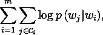*

*其中𝒞 *ᵢ* 是围绕中心词 *wᵢ* 的上下文词的索引集。定义概率 *p* 的一个可能选择是密集神经网络的输出层的 softmax。*

*下图解释了 skip-gram 的训练过程。这里，∑表示网络上一层输出的加权和，S 表示 softmax。*

*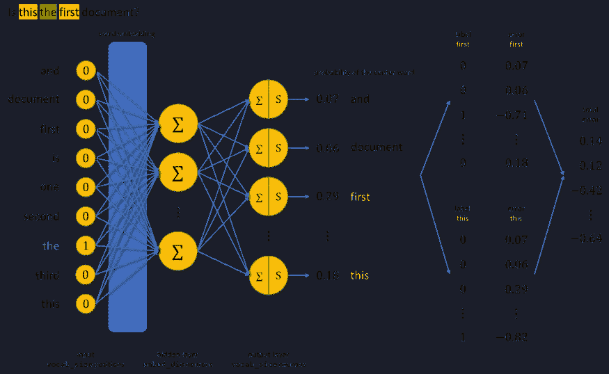*

*skip-gram 如何学习|图片作者[作者](http://dwiuzila.medium.com/membership)*

> *关于 skip-gram 和 Word2Vec 的更多信息:*

*[](https://towardsdatascience.com/all-you-need-to-know-about-bag-of-words-and-word2vec-text-feature-extraction-e386d9ed84aa) [## 关于单词包和 Word2Vec —文本特征提取，您需要知道的一切

### Word2Vec 为什么更好，为什么不够好

towardsdatascience.com](https://towardsdatascience.com/all-you-need-to-know-about-bag-of-words-and-word2vec-text-feature-extraction-e386d9ed84aa) 

由于计算量大，这个公式是不切实际的。然而，预测上下文单词的问题可以被构造为一组独立的二元分类任务，其中目标是独立地预测上下文单词的存在(或不存在)。

对于语料库中索引为 *i* 的中心词，所有对应的上下文词都被认为是正例，并且从语料库中随机选择负例(除上下文词之外的词)。使用二元逻辑损失，skip-gram 最小化以下目标函数:

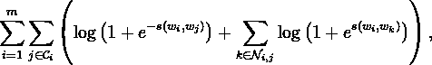

其中𝒩 *ᵢ* ， *ⱼ* 是从语料库中采样的负面例子的索引集合，而 *s* 是将对**(中心，上下文)**映射到ℝ.的评分函数对于 skip-gram，选择的 *s* 将是一个密集的神经网络。

## 📈改进跳跃图

因为 skip-gram 对每个单词使用不同的特征向量，所以它忽略了单词的内部结构。fastText 试图通过将每个单词视为其字符的集合来解决这个问题。一个单词的向量被简单地认为是其字符的所有向量的总和。

但是 T21 这个人物是如何被创造出来的呢？假设你把单词*写成*和 *n* = 3。那么字符 3-grams 的*写*就会是

```
<wr, wri, rit, ite, te>, <write>
```

有五个字符 3-grams 和一个特殊序列`<write>`。单词开头和结尾的符号`<`和`>`可以让我们将前缀和后缀与其他字符序列区分开来。

在创建了角色*n*-克数和你选择的 *n* 之后，你就有了一个主体*n*-克数大小 *G* 。让

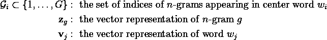

将快速文本的**(中心，上下文)**对的评分函数定义为中心词的 *n* -grams 和上下文词的矢量表示的点积之和，即:

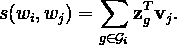

这个简单的模型允许跨单词共享表示，从而允许它学习罕见单词的可靠表示。因此，快速文本建模实际上只是解决

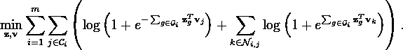

因为使用 *n* -grams 会增加语料库的大小，所以您需要解决内存问题。您可以使用一个散列函数，将*n*g 映射为 1 到 *K* 的整数，其中 *K* 是您选择的一个大数。

## 🆚fastText vs Word2Vec

与普通的 Word2Vec 相比，fastText 在 [**句法**](https://en.wikipedia.org/wiki/Syntax) 任务上表现明显更好，尤其是当训练语料库的规模很小时。尽管在语义任务上，Word2Vec 比 fastText 略胜一筹。随着训练语料库规模的增加，差异变得越来越小。

与 Word2Vec 不同，fastText 甚至可以通过对其组成字符*n*grams 的向量求和来获得 OOV 单词的向量，前提是在训练数据中至少存在一个字符*n*grams。

# 🚀摘要

祝贺你到达终点！

在这个故事中，向您介绍了两种有可能提高 Word2Vec 性能的方法:

1.  **GloVe** 也通过使用关于单词的全局信息直接找到特征向量的线性结构。
2.  **fastText** 通过 character*n*-grams of words 学习形态学，并能估计 OOV 词的特征向量。

对于**单词类比**任务，GloVe 的表现优于 Word2Vec。在**相似度**任务和**命名实体识别**上也优于相关模型。fastText 在**句法**任务上明显优于 Word2Vec，而 Word2Vec 在**语义**任务上略胜 fastText。

*

*🔥你好！如果你喜欢这个故事，想支持我这个作家，可以考虑 [***成为会员***](https://dwiuzila.medium.com/membership) *。每月只需 5 美元，你就可以无限制地阅读媒体上的所有报道。如果你注册使用我的链接，我会赚一小笔佣金。**

*🔖*想了解更多关于经典机器学习模型的工作原理，以及它们如何优化参数？或者 MLOps 大型项目的例子？有史以来最优秀的文章呢？继续阅读:**

*

[艾伯斯·乌兹拉](https://dwiuzila.medium.com/?source=post_page-----1d227ab017b2--------------------------------)* 

## *从零开始的机器学习*

*[View list](https://dwiuzila.medium.com/list/machine-learning-from-scratch-b35db8650093?source=post_page-----1d227ab017b2--------------------------------)**8 stories********

[艾伯斯·乌兹拉](https://dwiuzila.medium.com/?source=post_page-----1d227ab017b2--------------------------------)* 

## *高级优化方法*

*[View list](https://dwiuzila.medium.com/list/advanced-optimization-methods-26e264a361e4?source=post_page-----1d227ab017b2--------------------------------)**7 stories********

[艾伯斯乌兹拉](https://dwiuzila.medium.com/?source=post_page-----1d227ab017b2--------------------------------)* 

## *MLOps 大型项目*

*[View list](https://dwiuzila.medium.com/list/mlops-megaproject-6a3bf86e45e4?source=post_page-----1d227ab017b2--------------------------------)**6 stories********

[艾伯斯乌兹拉](https://dwiuzila.medium.com/?source=post_page-----1d227ab017b2--------------------------------)* 

## *我最好的故事*

*[View list](https://dwiuzila.medium.com/list/my-best-stories-d8243ae80aa0?source=post_page-----1d227ab017b2--------------------------------)**24 stories********

[艾伯斯乌兹拉](https://dwiuzila.medium.com/?source=post_page-----1d227ab017b2--------------------------------)* 

## *R 中的数据科学*

*[View list](https://dwiuzila.medium.com/list/data-science-in-r-0a8179814b50?source=post_page-----1d227ab017b2--------------------------------)**7 stories*******

*[1] Jeffrey Pennington，Richard Socher，Christopher d . Manning(2014):*GloVe:单词表征的全局向量*。[ [pdf](https://nlp.stanford.edu/pubs/glove.pdf)*

*[2] Armand Joulin，Edouard Grave，Piotr Bojanowski，Tomas Mikolov (2016): *高效文本分类的锦囊妙计*。[ [pdf](https://arxiv.org/pdf/1607.01759v3.pdf)*

*[3] Piotr Bojanowski，Edouard Grave，Armand Joulin，Tomas Mikolov (2017): *用子词信息丰富词向量*。[ [pdf](https://arxiv.org/pdf/1607.04606v2.pdf)*

*[4]拉迪姆·řehůřek(2022):*教程:面向学习的课程*。[快速文本模型](https://radimrehurek.com/gensim/auto_examples/tutorials/run_fasttext.html)*