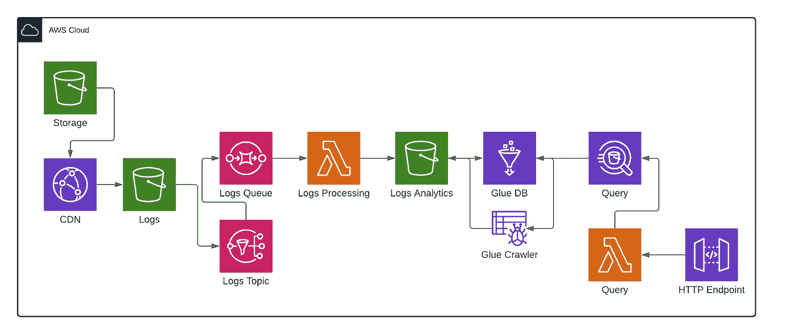
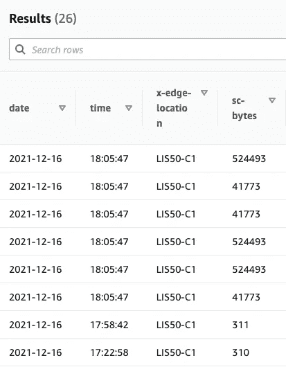

# 粘在一起！

> 原文：<https://levelup.gitconnected.com/glue-it-together-acb796655f8d>

## 使用 Athena 访问您在 S3 的数据，使用 Glue 作为中间人。


玛利亚·沙妮娜在 [Unsplash](https://unsplash.com?utm_source=medium&utm_medium=referral) 上拍摄的照片

分析可能是企业最重要的部分。有了它们，我们可以做出明智的决策，帮助一家公司领先于其他公司。但是生成和访问分析并不是一件容易的事情。它通常涉及生成和存储数据，将数据处理成对我们阅读有用的格式，并分析这些数据。所有这些都需要时间，而这些时间可能是不存在的。

但是有了云计算，有几个工具可以帮助减少完成这项任务所需的时间。我要描述一些 AWS 解决方案，而且都是无服务器的！

## [AWS 胶水](https://aws.amazon.com/glue)

> AWS Glue 是一种无服务器的数据集成服务，可以轻松发现、准备和组合用于分析、机器学习和应用程序开发的数据。AWS Glue 提供了数据集成所需的所有功能，因此您可以在几分钟内开始分析数据并投入使用，而不是几个月。

这听起来很奇特，可能有点复杂？但最酷的是 AWS Glue 自动完成了所有这些工作。我们设置好它，胶水会自动完成它的工作。

## [AWS 雅典娜](https://aws.amazon.com/athena)

> Amazon Athena 是一种交互式查询服务，它使得使用标准 SQL 分析亚马逊 S3 中的数据变得很容易。Athena 是无服务器的，所以不需要管理基础设施，只需为运行的查询付费。

这里 SQL 的使用非常强大，因为现在我们可以定义非常复杂的查询，并在需要时运行它们，比如在 cron 作业或 HTTP 端点中。

现在我们知道了可以用来从数据中生成和访问分析的工具，是时候考虑用例了。假设我们有一个视频托管解决方案。我们将客户的视频存储在 S3 桶上，然后通过 CDN (Cloudfront)交付给他们。但我们如何对这些视频进行分析，例如观看次数最多的视频或世界上哪个地方更活跃？

我们可以设计一个这样的解决方案:



视频托管平台访问分析的潜在解决方案。

1.  将视频储存在 S3 桶中。
2.  使用 Cloudfront 交付视频，并设置日志来跟踪使用情况。
3.  监听添加到 S3 存储桶的日志并设置通知。
4.  将带有 SNS/SQS 的通知发送给 Lambda 函数。
5.  Lambda 函数解压缩日志文件，处理文本文件中的数据，并将其以 parquet*格式保存到另一个 S3 存储桶中。
6.  创建一个胶水数据库，并选择其数据存储以前的 S3 桶。
7.  创建一个胶水爬虫，对着 S3 桶运行。crawler 将自动创建必要的表和列。它还将开始填充您的数据库。
8.  此时，为了快速测试您的解决方案，您可以在 AWS 控制台中访问 AWS Athena，执行一些快速 SQL 查询并获取数据。
9.  这可以实现为 APIGW + Lambda，这样您的客户端(比如 React 应用程序)就可以以用户友好的方式访问数据。

## *使用 Parquet 是因为它们的列数据存储格式提高了查询数据的速度。

但是我们如何建立这个基础设施呢？在 Terraform 的帮助下。我将只展示如何建立一个 Glue 数据库，它的数据存储和 Athena。如何设置你自己的 CDN，听日志和填充数据存储取决于你自己。我也不会为 APIGW + Lambda 写代码，因为有很多关于它的帖子。

## 创建 S3 存储桶

这将是我们胶水数据库的数据存储。

```
resource "aws_s3_bucket" "logs_analytics" {
  acl           = "private"
  bucket        = "logs-analytics"
}
```

## 创建胶水数据库

```
resource "aws_glue_catalog_database" "database" {
  name = "database"
}
```

## 创建一个胶水爬虫

但是首先指定其访问数据存储的权限。

```
data "aws_partition" "current" {}resource "aws_iam_role" "glue_crawler_role" {
  name               = "crawler-role"
  assume_role_policy = data.aws_iam_policy_document.glue_crawler_assume_role.json
}data "aws_iam_policy" "glue_crawler_glue" {
  arn = "arn:${data.aws_partition.current.partition}:iam::aws:policy/service-role/AWSGlueServiceRole"
}resource "aws_iam_role_policy_attachment" "glue_crawler_glue" {
  role       = aws_iam_role.glue_crawler_role.name
  policy_arn = data.aws_iam_policy.glue_crawler_glue.arn
}data "aws_iam_policy_document" "glue_crawler_s3" {
  policy_id = "crawler-s3"
  version   = "2012-10-17"statement {
    effect = "Allow"
    actions = [
      "s3:GetObject",
      "s3:PutObject"
    ]resources = [aws_s3_bucket.logs_analytics.arn, "${aws_s3_bucket.logs_analytics.arn}/*"]
  }
}resource "aws_iam_policy" "glue_crawler_s3" {
  name   = "crawler-s3"
  policy = data.aws_iam_policy_document.glue_crawler_s3.json
}resource "aws_iam_role_policy_attachment" "glue_crawler_s3" {
  depends_on = [aws_iam_role.glue_crawler_role, aws_iam_policy.glue_crawler_s3]
  role       = aws_iam_role.glue_crawler_role.name
  policy_arn = aws_iam_policy.glue_crawler_s3.arn
}resource "aws_glue_crawler" "glue_crawler" {
  depends_on = [
    aws_s3_bucket.logs_analytics,
    aws_glue_catalog_database.logs_analytics,
    aws_iam_role.glue_crawler_role
  ]database_name = aws_glue_catalog_database.logs_analytics.name
  name          = "crawler"
  role          = aws_iam_role.glue_crawler_role.arns3_target {
    path = "s3://${aws_s3_bucket.logs_analytics.bucket}"
  }
}
```

## 创建一个存储桶来存储 Athena 查询

```
resource "aws_s3_bucket" "athena_results" {
  acl           = "private"
  bucket        = "athena-results"
}
```

一旦你部署了你的 Terraform 代码，你就可以进入 AWS Glue，选择你的爬虫并手动运行它。如果您的 S3 桶中已经有拼花文件，爬虫将在 Glue 数据库中生成一个新表，并开始用数据填充它。您还可以[安排您的爬虫](https://registry.terraform.io/providers/hashicorp/aws/latest/docs/resources/glue_crawler#schedule)定期运行，避免手动执行这个过程。

现在，如果您转到 Athena，您可以选择 Glue 数据库并对其运行查询，例如:

```
SELECT * FROM "database" ORDER BY "timestamp" DESC
```

返回的数据可能如下所示:



Athena 查询返回的数据示例

您唯一要做的就是定义服务于您的业务的 SQL 查询，并为您提供有价值的信息，帮助您做出更好的决策。

SQL 是极限！🎉

[](https://blog.jagonzalr.com/membership) [## 加入我的介绍链接媒体-何塞安东尼奥冈萨雷斯罗德里格斯

### 作为一个媒体会员，你的会员费的一部分会给你阅读的作家，你可以完全接触到每一个故事…

blog.jagonzalr.com](https://blog.jagonzalr.com/membership)