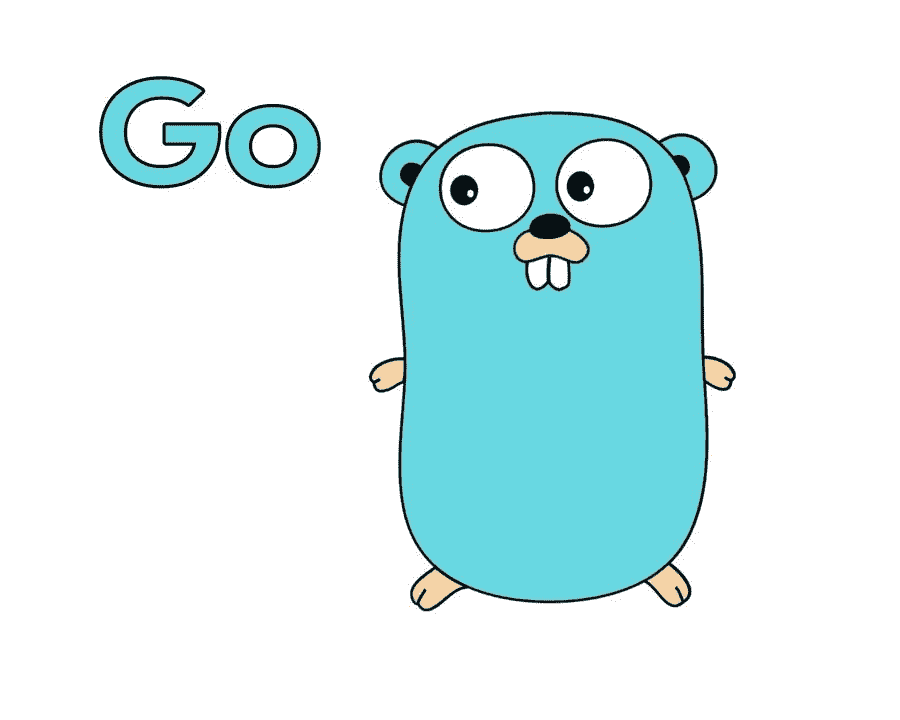

# Go 101:控制结构

> 原文：<https://levelup.gitconnected.com/go-101-control-structures-c0c34b681cac>



Gopher，官方围棋吉祥物。信用:雷尼·弗伦奇

尽管类型和变量是编程语言的基础，但它们本身还不足以构建强大的程序。在真实的程序中，您可能希望能够迭代一个元素数组，而不必通过索引显式引用每个元素。您可能还希望能够根据条件测试的结果执行特定的操作。由于所谓的控制结构，这些可能性得以实现。

因此，在本文中，我们将进一步了解 Go 的三个主要控制结构，即语句的**、if** 语句的**和 **switch** 语句。这些语句将允许我们构建更少的繁琐和更强大的程序。**

## For 语句

除了像 Haskell 这样的函数式编程语言或像 Prolog 这样基于递归的基于逻辑的语言之外，大多数编程语言都有循环结构，这些结构中最常见的是用于循环的**。**

与其他拥有多个循环结构的语言(例如的*和*，而【Python】的*)不同，Go 只支持**一个**内置循环结构，即*语句的*。*

这个 *for* 关键字用于重复**一系列语句，直到满足一个条件**(否则将是一个无限循环，意味着我们的程序将永远不会结束运行)。说明循环结构的一个常用示例是在控制台上打印从 1 到 10 的数字。如果没有循环，我们将不得不编写十次相同的打印函数，每次打印不同的数字。

```
fmt.Println(1)
fmt.Println(2)
fmt.Println(3)
fmt.Println(4)
fmt.Println(5)
fmt.Println(6)
fmt.Println(7)
fmt.Println(8)
fmt.Println(9)
fmt.Println(10)
```

感谢循环的*，我们现在只需编写一次打印函数，如下例所示。*

```
i := 1
for i <= 10 {
   fmt.Println(i)
   i += 1
}
```

在这个例子中，我们将变量 I 定义为等于 1。然后，我们有条件地检查 I 是否小于或等于 10。如果这个条件为真，我们将 I 输出到控制台。然后，我们将 I 增加 1，并重复这个循环，直到 I 大于 10(当 i = 11 时)。为了避免无限循环，最后一步非常重要。事实上，如果我们每次运行循环时不将 I 增加 1，I 将始终等于 1，我们将无限地将 1 打印到控制台。

这种工作方式比必须为每个要迭代的不同元素写一行代码要干净得多，也更具可伸缩性。正如您稍后将看到的，当您必须迭代一个数组的不同元素时, *for* 循环非常方便(它可能包含数千个元素或更多)。

在 Go 中，有一种为循环编写*的替代方法，需要更少的代码行。事实上，我们在一行代码中赋值变量，定义条件，定义增量。*

```
for i := 1; i <= 10; i++ {
   fmt.Println(i)
}
```

在第一行，我们将 I 赋值为 1，检查 I 是否小于或等于 10，如果前面的条件为真，我们将 I 增加 1。所有这些操作都应该用分号隔开。在第二行，我们有要执行的语句，放在括号中。在我们的例子中，如前所述，我们打印的是 I 的当前值。

## **If 语句**

Go 中的第二个内置控制结构是 ***if*** 语句(它与 ***else if*** 语句和 ***else*** 语句一起出现)。虽然 *for* 循环语句关心的是在条件保持为真时反复执行代码块**，但是 *if* 语句关心的是在底层条件为真的情况下执行一次**代码块**。**

一个 *if* 条件可以检查很多东西。我们可以检查一个变量是否小于(或大于)一个任意的数，我们可以检查一个变量是否等于一个特定的值，一个元素是否包含在一个数组中……可能性是无穷无尽的。

首先，让我们玩一个餐馆预订系统的玩具例子来说明 *if* 语句。让我们想象一下，我们正在经营一家餐厅，里面可以坐 60 个顾客。到目前为止，已经有 58 个客户在里面了，还有一个新的小组正在进入房间。那些人能在我们的餐馆里有一个座位吗？

```
peopleIn := 58
newGroup :=2 if peopleIn + newGroup <= 60 {
   fmt.Println("Welcome in our restaurant!")
} else {
   fmt.Println("Sorry, we don’t have enough seats for your group")
}
```

在这种情况下，在新的组已经进入之后，餐馆内的总人数将是 60，严格来说不大于 60。这意味着我们的 *if* 条件被评估为真，第一个代码块将执行。控制台中的输出将因此成为'*欢迎光临我们的餐厅！*’。

如果新组是一个 5 人组呢？那么，新组中的人数之和将等于 63。然后, *if* 条件将评估为 false，相关的代码块将不会运行。这时 *else* 语句就派上用场了。如果前面的条件都不为真，else 语句将执行其关联的代码块(这就是它应该放在条件语句序列末尾的原因)。在这种情况下，由于 *if* 语句为假，else 块将被执行，控制台中的输出因此将为“*对不起，我们没有足够的座位给你的组*”。

现在让我们想象一个不同的例子，在这个例子中，我们考虑了客户的偏好。这家餐馆提供三种不同的菜单。一个给只吃肉的人，一个给纯素食者，一个给不吃肉的人(他们要么吃肉，要么吃纯素食)。我们想知道我们应该给哪个顾客哪个菜单。这个问题可以用下面的条件语句序列来解决。

```
var preference string
fmt.Scanln(&preference)if preference == "meat" {
   fmt.Println("You will receive a menu for the meat")
} else if preference == "vegan" {
   fmt.Println("You will receive a vegan menu")
} else {
   fmt.Println("You will receive the complete menu")
}
```

在下面的例子中，我们在命令行中请求用户输入(他的偏好)。用户可以请求肉类菜单、素食菜单，或者给出将导致他接收完整菜单的任何其他输入。从上到下执行条件序列**。因此，我们将首先检查顾客的偏好是否是肉类。如果没有，那么我们将检查它是否倾向于选择纯素食。如果仍然不是这种情况，剩余( *else* )选项将被执行(客户将收到一个完整的菜单)。**

程序将从上到下测试不同条件的事实很重要，因为**只有一个选项将被执行**(或者没有，如果没有任何 *else* 子句并且没有一个条件解析为 *true* )。让我们举一个虚拟的例子来说明这一点。

```
number := 2if number < 5 {
   fmt.Println("Your number is smaller than 5")
} else if number < 10 {
   fmt.Println("Your number is smaller than 10")
} else if number < 20 {
   fmt.Println("Your number is smaller than 20")
} else {
   fmt.Println("You chose a number higher or equals to 20")
}
```

在本例中，前三个条件都解析为真(2 确实小于 5、10 和 20)。但是，程序将首先检查第一个条件。当解析为真时，将在控制台上打印一行“*您的数字小于 5* ”。之后，程序不会检查序列中的任何其他条件语句，也不会将任何其他内容打印到控制台(即使第二个和第三个条件也为真)。

这种行为向我们展示了正确地组织我们的条件语句，并正确地测试它们，以避免任何不可预测的输出或边缘情况是多么重要。

## 交换语句

类似于其他语言(如 JavaScript)，Go 允许使用一个 *switch* 语句。这个 *switch* 语句实际上是编写条件语句的另一种方式**(替代 if-else if-else 语句)。确实可能发生这样的情况，我们必须检查一长串条件语句，在条件解析为*真*的情况下，执行一个相关的操作。不得不多次编写多行语句很容易变得乏味和难以阅读，而 *switch* 语句可以被视为一种更优雅的替代方式。**

为了说明 Go 中的 switch 语句，让我们再次以我们的餐馆为例，它根据顾客的偏好提供菜单。这家餐厅提供五种不同的选择:肉、鱼、海鲜、披萨和素食。不得不编写多个 *else if* 条件来检查所有不同的可能性，这将非常繁琐。相反，我们可以使用下面的方法。

```
switch preference {
case "meat": fmt.Println("You will receive a menu for the meat")
case "fish": fmt.Println("You will receive a menu for the fish")
case "seafood": fmt.Println("You will receive the seafood menu")
case "pizza": fmt.Println("You will receive a menu for the pizzas")
case "vegan": fmt.Println("You will receive a vegan menu")
default: fmt.Println("You will receive the complete menu")
}
```

在*开关*关键字之后，我们有一个要检查的表达式(这里是首选项)。每个 *case* 关键字后面跟一个我们的表达式可能包含的特定值，后面跟一个在条件解析为真的情况下要执行的代码。在序列的最后，我们有了*默认的*关键字(它是可选的)，它的工作方式类似于前面看到的 *else* 关键字。同样，类似于 *if* 语句，我们的条件是从上到下检查的，只有第一个解析为真的条件才会执行其相关代码。

在本文中，我们介绍了 Go 的主要控制结构、它们的用法和实现。控制结构是每一种编程语言的基础部分，因为它们是构建简洁而强大的程序的关键。无论它们是用来重复一系列指令，还是在给定条件测试的情况下定位程序的执行，它们都是每个现实生活程序的一部分，为了理解围棋的基础，应该掌握它们。

## 资源

在这一节中，您可以找到与本文主题相关的有用资源。

*   switch 语句程序要点:[https://gist . github . com/Agilulfe/98 C4 f 90863 CBA 88 b 9 e5c 500 fff 256687](https://gist.github.com/Agilulfe/98c4f90863cba88b9e5c500fff256687)
*   查找 Go 101 系列的其他文章:[https://medium.com/@guillaumejacobs_76860](https://medium.com/@guillaumejacobs_76860)