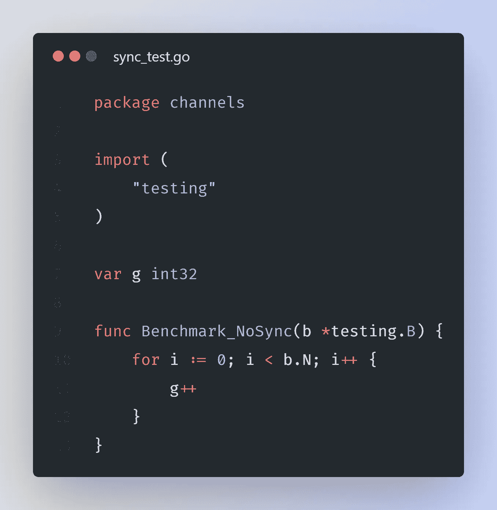
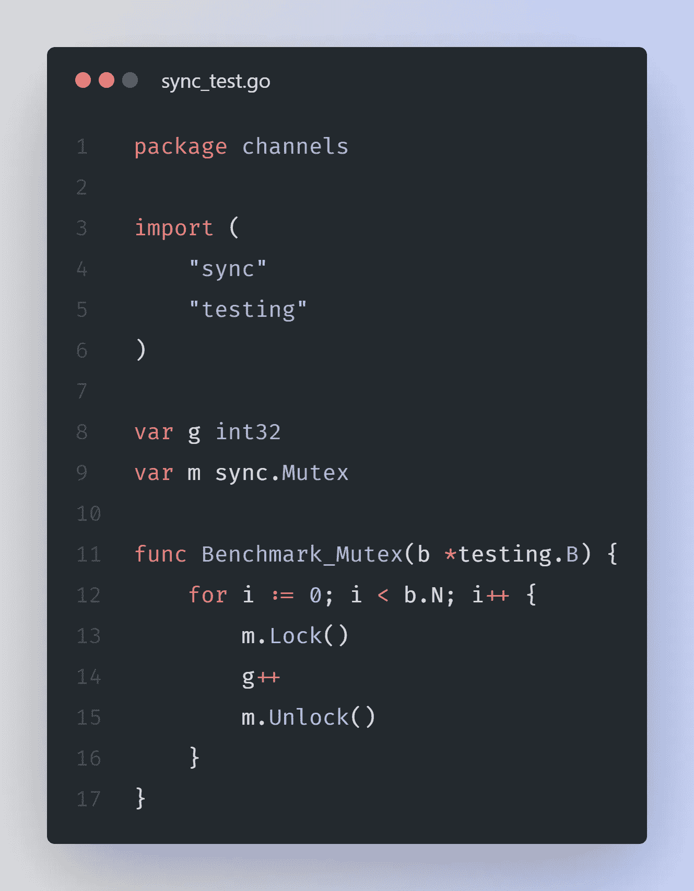
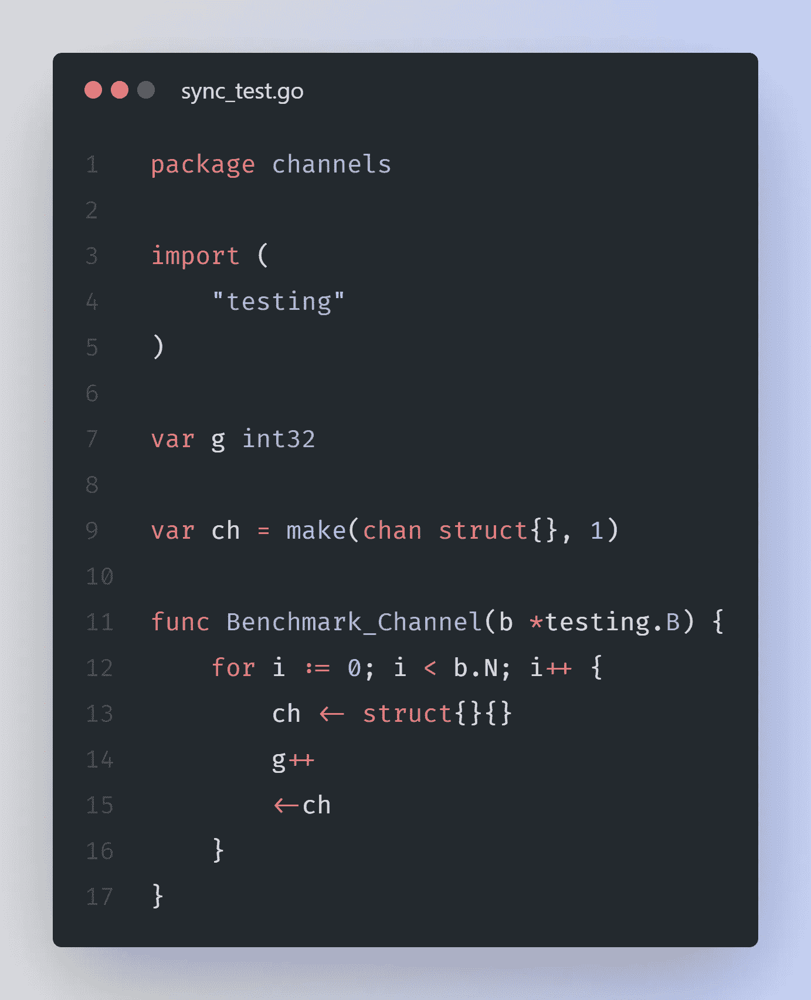

# Go —比较同步技术的基准

> 原文：<https://levelup.gitconnected.com/go-a-benchmark-to-compare-synchronization-techniques-ed73e118ec35>

## Golang 通过通道和同步包同步多个 go routine，防止多个 go routine 争夺共享数据。


照片由[詹姆斯·哈里森](https://unsplash.com/@jstrippa?utm_source=unsplash&utm_medium=referral&utm_content=creditCopyText)在 [Unsplash](https://unsplash.com/s/photos/programming?utm_source=unsplash&utm_medium=referral&utm_content=creditCopyText) 上拍摄

在 Golang 中，通过使用下面提到的同步技术，可以避免同时修改一个全局变量。

1.  使用同步/原子
2.  使用同步。互斥（体）…
3.  使用频道

在本文中，我们将研究如何做到这一点，以及它们的基准测试结果。

## 没有同步技术的基准测试。



代码清单-1

在基准测试中修改了一个全局变量`g`，并且没有应用同步技术。上述代码的基本基准测试结果如下

```
$ go test -bench=. -benchtime=5s
goos: windows
goarch: amd64
pkg: sync-benchmark
cpu: 11th Gen Intel(R) Core(TM) i5-1135G7 @ 2.40GHz
**Benchmark_NoSync-8      1000000000               1.802 ns/op**
PASS
ok      sync-benchmark  3.113s
```

## 同步/原子基准测试


代码清单-2

在 Benchmark 中修改了一个全局变量`g`，并使用了这种时间同步/原子同步技术。上述代码的基本基准测试结果如下

```
**$** go test -bench=. -benchtime=5s
goos: windows
goarch: amd64
pkg: sync-benchmark
cpu: 11th Gen Intel(R) Core(TM) i5-1135G7 @ 2.40GHz
**Benchmark_Atomic-8      1000000000               5.237 ns/op**
PASS
ok      sync-benchmark  6.880s
```

## 同步基准测试。互斥（体）…



代码清单-3

在基准和时间同步中修改了一个全局变量`g`。使用互斥同步技术。上述代码的基本基准测试结果如下

```
$ go test -bench=. -benchtime=5s
goos: windows
goarch: amd64
pkg: sync-benchmark
cpu: 11th Gen Intel(R) Core(TM) i5-1135G7 @ 2.40GHz
**Benchmark_Mutex-8       526245530               10.79 ns/op**
PASS
ok      sync-benchmark  7.885s
```

## 使用渠道进行基准测试。



代码清单-4

在 Benchmark 中修改了一个全局变量`g`，这次通道用于同步。上述代码的基本基准测试结果如下

```
$ go test -bench=. -benchtime=5s
goos: windows
goarch: amd64
pkg: sync-benchmark
cpu: 11th Gen Intel(R) Core(TM) i5-1135G7 @ 2.40GHz
**Benchmark_Channel-8     168880364               35.91 ns/op**
PASS
ok      sync-benchmark  10.809s
```

**基准比较**

这一次，我们尝试运行所有类型的基准测试&我们观察到以下结果。

```
$ go test -bench=. -benchtime=5s
goos: windows
goarch: amd64
pkg: sync-benchmark
cpu: 11th Gen Intel(R) Core(TM) i5-1135G7 @ 2.40GHz**Benchmark_NoSync-8       1000000000               1.695 ns/op
Benchmark_Atomic-8       1000000000               5.232 ns/op
Benchmark_Mutex-8        558550783                10.86 ns/op
Benchmark_Channel-8      168589561                35.56 ns/op**PASS
ok      sync-benchmark  25.421s
```

点击[这里](https://go.dev/play/p/-ZrRRZfASC5)看操场上的代码。你可以把它复制到你的本地并运行它。

## 结论

从结果中，我们可以看出，使用通道同时增加一个值比其他技术要慢得多。原子方式是最好的方式。

如果可能的话，我们应该尽量不要在多个 goroutines 之间共享一个值，这样我们就根本不需要对这个值进行同步。

目前就这些。快乐学习。😍