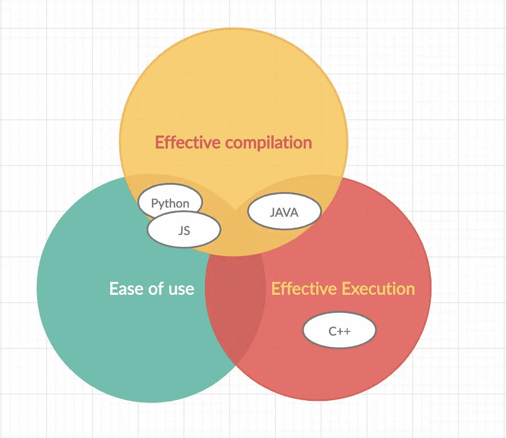

# Go —快速入门指南

> 原文：<https://levelup.gitconnected.com/go-a-quick-guide-for-getting-started-1f7a60c0512e>


创建 Go 是为了提供一种混合了高效编译、高效执行和编程简易性的单一语言。在过去的几年里，Go 的名气越来越大，这表明它满足了软件开发社会的需求。在这里，我们将从较高的层面来看一下围棋，并回答以下问题。

1.  什么是“去”？
2.  为什么你可能不得不选择“去”？
3.  在《围棋》里编程是什么感觉？

现在我们已经有了路线图，让我们开始回答这个问题，什么是 Go？

# 什么是围棋:

> Go 是一种开源编程语言，可以轻松构建简单、可靠、高效的软件。

Go 只是计算机编程世界中的另一种语言。但这可能会在你的脑海中引发一个问题，为什么我们需要另一种语言，而现在已经有一堆成熟且强大的语言了？



大多数现存的语言都是在一个没有任何线索的时代创造出来的，这个时代的问题正是我们试图解决的。所有这些语言都必须随着时间的推移而演变，以适应当前的时代。
一种新编程语言的诞生点亮了谷歌设计者的头脑，为我们现在面临的问题找到理想的语言，并在语言的效率和便利性之间取得平衡。

Go 已经变得非常流行，因为它能够将 Java 和 C++等古老语言的性能和类型安全与 Python 和 JavaScript 等脚本语言令人愉快的开发人员工效学和近乎即时的编译时间结合起来。

创建 Go 的主要目标是结合其他编程语言的最佳特性:

*   易用性和一流的工作效率
*   高水平的效率和静态类型
*   先进的网络性能和多核能力的充分利用

# 为什么选择 GO

> 语言的哲学和价值

首先要强调的是**简单。**在整个语言中，无论是设计、语法、包含的和排除的特性都是关于简单性的。

这里要提的下一个最好的就是**开箱体验**。许多传统语言在我们从它那里得到基本服务之前需要很多脚手架，另一方面，Go 专注于真正的开箱即用体验。Go 的标准库不仅内容丰富，而且旨在提供构建重要应用程序所需的核心和最强大的概念。这也包括用于压缩的包，一个装备良好的测试套件，用于 web 应用程序的 http/net 包等等。所有这些都是为了让整体用户体验变得无障碍。

这里要提到的下一件大事是**简化的跨平台部署**。交叉编译通过设置指定目标操作系统和架构的必需环境变量来工作。我们将变量`GOOS`用于目标操作系统，将`GOARCH`用于目标架构。仅仅通过改变环境变量，我们就可以将代码编译成期望的操作系统。

与其他语言相比，Go 更大的优势是它的**网络意识和内置并发性**。java、c++等传统语言的问题在于，它们在开发的后期获得了网络和并发等技能。它们在设计时从未考虑到网络和并发性。所以在设计 Go 的时候，这是设计团队要考虑的因素之一，他们真的想确保他们已经确定下来了。那么他们是怎么做到的呢？从网络感知的角度来看，我们看到核心标准库中有 net 和 net/HTTP 包。从并发的角度来看，我们有 goroutines，这是轻量级线程，允许在您的应用程序中管理大量并发。为了处理正在进行的多个并发任务之间的通信，Go 内置了通道，它支持通信顺序进程(CSP)的实现，并允许我们以线程安全的方式在并发 goroutines 之间传递消息。

## Go 的主要使用案例:

1.  web 服务和 web 应用——这是 Google 团队在设计这种语言时考虑的主要因素之一，他们确实能够利用 Go 语言的网络和并发感知特性。
2.  devo PS space——如果你熟悉 Docker 和 Kubernetes 之类的程序，这些程序实际上是在运行中编写的，已经证明在创建这些非常低级的系统工具时，它是 C 的一个非常强大的替代品。
3.  Go 也证明了自己是机器学习领域的一个有价值的工具，我们看到许多一直使用 Python 或 R 的应用程序开发人员开始转向 Go，因为它提供了高性能和内置的并发性

# 使用 Go 是什么感觉:

让我们看一个快速旋转

```
package main
import (
   "fmt"
   "net/http"
)func main() {
 http.HandleFunc("/", func(w http.ResponseWriter, r *http.Request) {
   fmt.Fprintf(w, "Hello, you've requested: %s\n", r.URL.Path)
})
http.ListenAndServe(":3000", nil)
}
```

上面的程序是在 go 中创建 web 服务的基本“hello world ”,你可以清楚地看到我们仅仅依靠核心标准库来创建它。仅仅通过编写 5 行代码，我们就能够用强大的语言旋转服务器。这就是围棋设计的简单程度，我说的简单是指最复杂的程度。

# 结论:

我们看到简单是围棋的核心概念。因此，即使有强大的语言功能可以真正使 Go 应用程序变得更强大，有时这些功能给语言带来的复杂性会给 Go 语言本身带来负担，因此编译器和工具链，以及编辑器环境和认知负载，学习语言的能力，为了简单起见，已经决定实际上省去一些更强大的功能。包含电池的工具是另一个重要的理念和价值。此外，Go 的一个关键理念和价值是向后兼容。因此，虽然不能保证向后兼容性会一直保持，但有一套非常非常严格的标准用来确定向后兼容性是否应该被打破；否则，向后兼容性非常稳定。

每一种编程语言都不仅仅是语法、编译器和库的集合。除了语言的机械性质，理解构建语言、构建社区的人的哲学和价值观也很重要，以确保他们的哲学和价值观真正与你的相吻合，这样你的用例更有可能被有效地解决。

感谢您阅读我的文章。如果你认为有用，请分享，鼓掌，评论✌😊

延伸阅读:

[](https://yalantis.com/blog/why-use-go/) [## 为什么在你的项目中使用 Go 语言？

### 如果你计划为你的企业创建或简化一个应用程序，从选择合适的技术开始。在…

yalantis.com](https://yalantis.com/blog/why-use-go/) [](https://www.digitalocean.com/community/tutorials/how-to-build-go-executables-for-multiple-platforms-on-ubuntu-16-04) [## 如何在 Ubuntu 16.04 | DigitalOcean 上为多个平台构建 Go 可执行文件

### Go 编程语言带有丰富的工具链，使得获取包和构建可执行文件…

www.digitalocean.com](https://www.digitalocean.com/community/tutorials/how-to-build-go-executables-for-multiple-platforms-on-ubuntu-16-04)