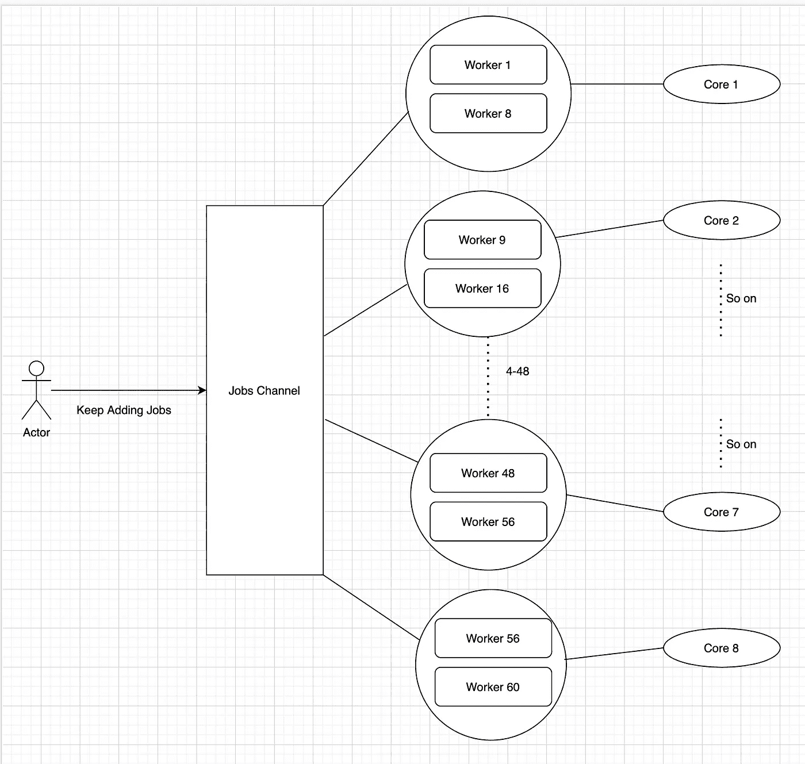

# go:30 分钟内气塞数据库达到 7000 万套

> 原文：<https://levelup.gitconnected.com/go-achieving-70-million-sets-to-aerospike-database-in-30-minutes-30d4018540ab>

在我之前的文章中，我详细介绍了 goroutines 的局限性，在这篇文章中，我想分享我们如何在 Go Worker Pool 模式的帮助下，通过利用整个系统核心，在 30 分钟内实现了 7000 万个数据集到 Aerospike 数据库。

**用例洞察**

*   目前，在 GoIbibo，我们有近 7000 万用户，我们有一套每个用户所属的类别。这些类别描述了用户是否是新用户|欺诈|定期交易用户|去年没有交易的用户等等…
*   用户类别根据他们的行为动态变化，我们有一个生成任务，我们从多个来源收集数据并保存到我们的数据库中，关键字作为用户 ID，值作为类别列表，每天必须为所有 7000 万用户生成。

**数据库洞察**

*   对于那些不知道 Aerospike 的人来说，它是一个多线程的分布式键值存储，存储基于 SSD。
*   我们有 3 个 Aerospike 实例，其中键被拆分并以期望的复制因子跨实例存储。

**优于 Redis**

*   这是一个多线程的键值存储，不会阻止所有的请求，如果有任何缓慢的查询，不像 Redis，如果一个请求变慢，就会阻止所有的请求
*   SSD 比 RAM 便宜，并且作为分布式数据库，我们总是有机会进行水平扩展，不像 Redis，我们需要随着数据的增长进行垂直扩展。

**弊端**

*   这不支持批处理集，这意味着如果我们需要插入 7000 万个键值，我们需要对每个键进行 1 次 DB 调用，这相当于 7000 万次 DB 调用。

**方法、陷阱和收购的**

我们聚集来自多个来源的数据，并将其作为映射数据结构存储在内存中，键是 userID，值是类别列表。我们最初通过遍历映射以同步方式开始，其中我们一次向数据库设置一条记录。当我们试图计算估计时间时，上面的解决方案是最坏的可能。为什么？

我们运行在 8 核 CPU 和支持多线程的数据库上，但是从应用程序来看，我们仍然是顺序处理的。我们既没有利用系统内核，也没有利用数据库资源。让我们来计算一个连续生成所需的总时间。

70，00，00，000 键* 2 ms(平均设定速度)= 140，00，000，000 ms = **39 小时**

我刚才到底看到了什么？一个每天都要生成两次的任务需要花费 40 个小时，接近 2 天。这可行吗？绝对没有。

这是我们分析顺序处理不起作用的地方，我们必须通过使用整个系统和数据库资源来并行化任务，这时我们遇到了 **Go Worker Pool 模式**。

让我们先接触一下代码，我会让你看完每一行，并详细解释上下文切换是如何发生的。

现在让我们看一下每一行代码。

首先，我们获得聚合数据，其中键作为用户 id，值作为类别的一部分。

**工人池模式(伪代码)**

*   首先，我们宣传说，在任何给定的时间点，我们将通过缓冲的作业通道拥有最多 100 个作业。
*   然后我们招募 60 名工人，他们一直在等待工作。
*   一旦我们把所有的工作都喂给了工人，我们就可以成功地终止工人。

**对代码的深入理解。**

当我们调用 **createWorkers** fn 时，它在内部产生了 60 个 Workers，也称为 8 核 CPU 上的 goroutines。我们生成的每个 worker 都一直监听来自 jobs 通道的事件，直到它接收到 for 循环中的事件代码(AerospikeWrapper)。Set)不会被执行。

既然我们已经有了足够多的工人，是时候给工人们提供一些工作了。在我们的例子中，到 worker 的提要应该包含一个 userID，特定用户的类别(通过 userData struct 传递),然后可以发送到 DB。

用一张图来表示这个场景，如下图所示。

由于我们在 8 个内核上产生了 60 个工作线程，每个内核平均负责处理近 7–8 个 goroutines。这些 goroutines 中的每一个都不断地监听 jobs 通道来寻找新的作业，一旦它得到了一个作业，它就按顺序执行数据库设置。但是这里有一个问题。

我们都知道一个 CPU 内核几乎一次只能执行一条指令，这是否意味着我们可以只对*个 CPU 内核并行处理？该死的不…

**这就是上下文切换发挥作用的地方。**

第一个内核处理的第一个 goroutine 获得一个事件，只要我们在 goroutine 中启动一个数据库调用，它就会被推送到进程队列，因为数据库调用是异步的，下一个 goroutine 将开始监听作业通道，这个循环会重复，直到进程队列中的一个项目执行完毕。

一旦进程队列中的项目执行完同步网络| I/O 操作，CPU 内核将再次选取进程队列中的该项目并执行该项目，直到它再次命中 I/O 或网络调用。如果没有，它将执行完该作业，并继续执行下一个作业。

如果您看一下我们所做的操作序列，在任何给定的时间点，我们都会并行进行大约 60 DB 的调用，这与池中的工作线程数成正比。

虽然上下文切换的过程比我所说的要复杂得多，但我只想给出一个关于它如何发生以及每个内核如何负责处理一组 goroutines 的顶级概述。

这样，我们达到了接近每秒 10000 个数据库集的 Aerospike/Instance，并且我们有 3 个 DB 实例。

所以 7，00，00，000 / 3 万= 35 分钟。

希望我已经传达了我想要的。如有任何问题，请发表评论，我一定会尽力回复。

在下一篇文章中，我将详细介绍如何使用 HTOP 可视化 CPU 利用率。

**敬请期待**