# 使用 Docker pt.1 进行开发并做出反应

> 原文：<https://levelup.gitconnected.com/go-and-react-development-with-docker-pt-1-9f734a5991fc>


*Go and React 系列的一部分*

# 介绍

最近，我一直在从 Node 迁移到 Go。使用 Node，我有了一个很棒的 fullstack 开发工作流，但是我很难在 Go 中实现。我想要的是在容器中实时重新加载 Go API 并使用断点调试它的能力。在本教程中，我们将使用 Docker 设置最终的 Go 和 React 开发设置。

我希望你熟悉全栈开发。我不会教你如何创建一个 React 应用程序甚至 Go API 的每一个细节。如果你是 Docker 的新手，没关系。需要的时候我会解释基本的。所以放轻松，您将能够随时复制和粘贴代码。

我们专注于:

*   [入门](#a676)
*   [码头工人基础知识](#d7f8)
*   [设置 VSCode](#9b40)
*   [多阶段构建](#4c4e)
*   [Docker 撰写](#5fdd)
*   [使用 Traefik](#2d2c)
*   [使用 makefile](#8264)
*   [使用 Postgres](#86c6)
*   [实时重装 Go API](#626f)
*   [钻研调试一个 Go API](#f500)
*   [测试](#4be6)

# 入门指南

## 要求

*   [VSCode](https://code.visualstudio.com/)
*   [码头工人](https://www.docker.com/products/docker-desktop)

克隆[项目回购](https://github.com/ivorscott/go-delve-reload)并检查`starter`分支。

项目启动程序是一个简单的 mono repo，包含两个文件夹。

```
├── README.md
├── api/
├── client/
```

# 码头基础知识

Docker 对操作人员、系统管理员、构建工程师和开发人员非常有用。

Docker 允许你打包你的应用程序并在任何操作系统上托管它。这意味着不再有“它在我的机器上工作”的对话。

Docker 支持从开发到生产的整个软件生命周期。有了 Docker，软件交付不必是一个痛苦和不可预测的过程。

# 3 个基本概念

使用 Docker 通常从创建 Docker 文件开始，然后构建映像，最后运行一个或多个容器。

这里有一些你应该知道的术语。

**1。图像**

Docker 映像是包含在单个实体中的应用程序的二进制文件、依赖项和元数据，由缓存以供重用的多个静态层组成。

**2。Dockerfiles**

docker 文件是制作图像的指导方法。每条指令都形成自己的图像层。

**3。容器**

Docker 容器是从 Docker 映像派生的应用程序实例。容器不是虚拟机。它们之所以不同，是因为每个容器不需要自己的操作系统。单个主机上的容器实际上将共享一个操作系统。这使得它们非常轻便。容器需要更少的系统资源，允许我们在一台机器上运行许多应用程序或容器。

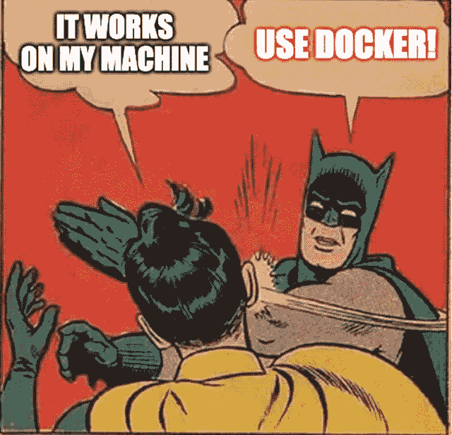

# 设置 VSCode

打开 VSCode 或[安装它](https://code.visualstudio.com/download)。

安装这三个扩展。

1)[Go 扩展](https://marketplace.visualstudio.com/items?itemName=ms-vscode.Go)
为 Go 语言增加了丰富的语言支持。

2)[Docker 扩展](https://marketplace.visualstudio.com/items?itemName=ms-azuretools.vscode-docker)
为 Docker 相关文件增加了语法高亮、命令、悬停提示和林挺。

3)[Hadolint 扩展](https://marketplace.visualstudio.com/items?itemName=exiasr.hadolint)
将[Hadolint](https://github.com/hadolint/hadolint)(docker file linter)集成到 VS 代码中。

# Go 模块

当在 mono repo 中使用 Go 模块时，当我们的 api 不是项目根时，VSCode 似乎会抱怨。

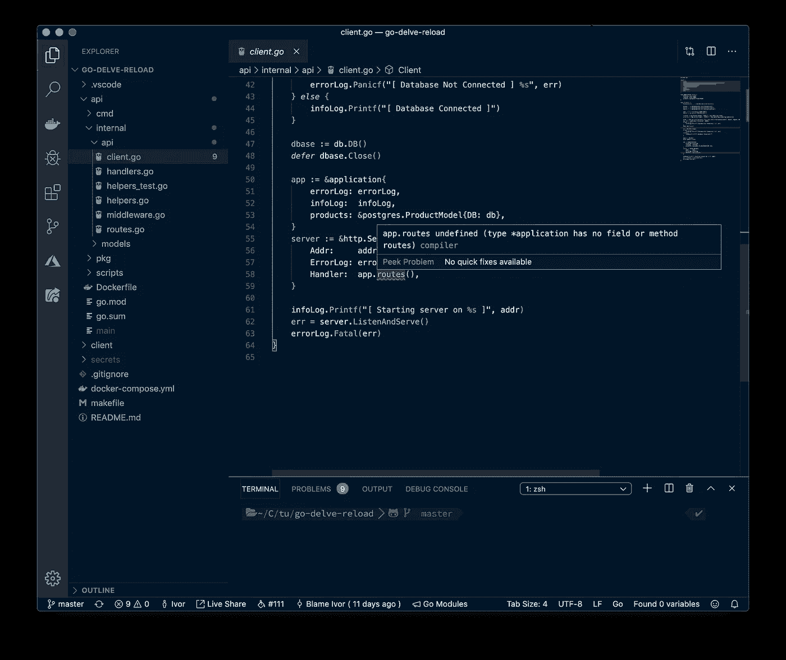

右键单击侧边栏区域中项目树的下方来修复这个问题。点击“将文件夹添加到工作区”并选择`api`文件夹。

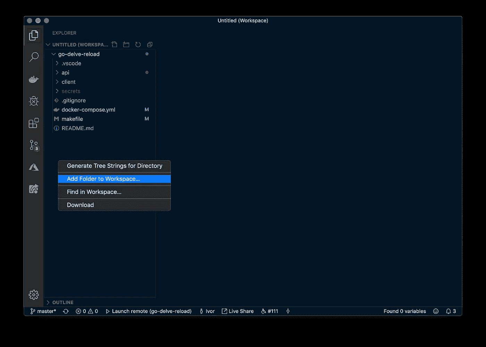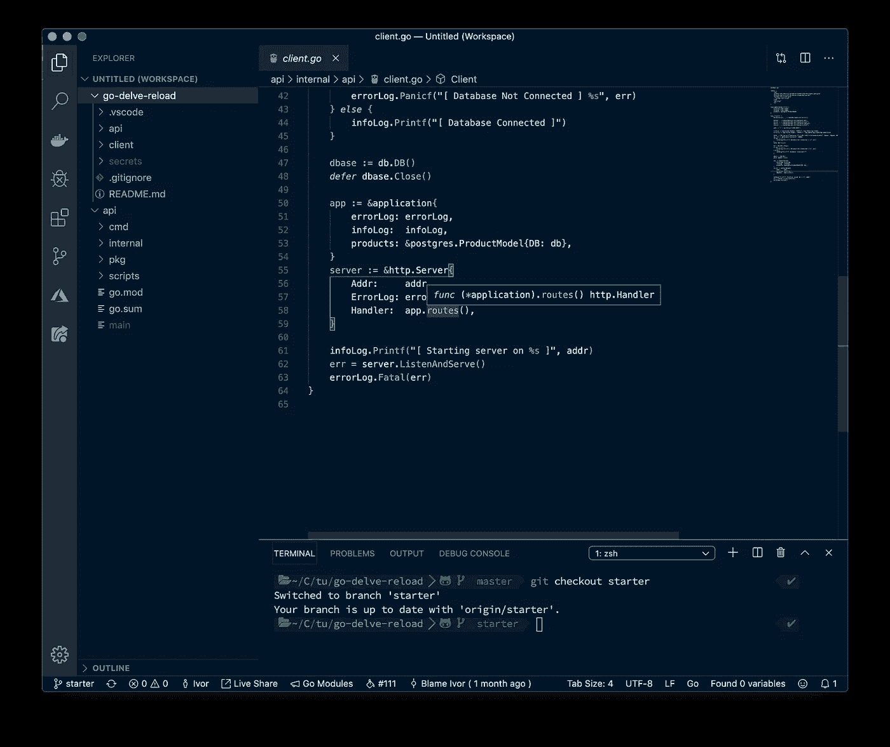

# 为 Delve 调试设置 VSCode

VSCode 需要连接到 go 容器中的 delve 调试器。

创建一个名为`.vscode`的隐藏文件夹，并将`launch.json`添加到其中。

```
mkdir .vscode
touch .vscode/launch.json
```

将以下内容添加到`launch.json`。

# 多阶段构建

## 创建 Golang Dockerfile 文件

添加一个新的`Dockerfile`到 api 文件夹并打开它。

```
touch api/Dockerfile
```

添加以下内容:

## 演示

在根目录中运行以下命令来构建 api 开发映像:

`docker build`命令参考我们的 docker 文件构建一个新的 docker 映像。

`--target`指定我们只想针对多阶段构建设置中的`dev`阶段。

[多阶段构建](https://docs.docker.com/develop/develop-images/multistage-build/)帮助我们应用关注点分离。在多阶段构建设置中，您可以定义单个 Dockerfile 文件的不同阶段。然后你参考后面的具体阶段。在我们的 api Dockerfile 文件中，我们声明了第一个阶段的名称`as base`。

`--tag`指定一个[图像标签](https://docs.docker.com/engine/reference/commandline/tag/)。图像标签只是一个我们可以用来引用图像的名称，它被标记为`demo/api`。

如果你的目标是发布到 [DockerHub](https://hub.docker.com/) 上，你可以制作私人或公共的图片。DockerHub 期望的基本格式是用户名/图像名。因为我们在本教程中不发布图片，所以`demo`不必是你的真实用户名。

`DOCKER_BUILDKIT=1`是一个新特性，支持并行构建处理，从而加快构建速度。你可以[在这里](https://brianchristner.io/what-is-docker-buildkit/)阅读更多。

我们的 Dockerfiles 利用 Aqua Security 的 [trivy](https://github.com/aquasecurity/trivy) 图像扫描仪。Docker 镜像偶尔会有漏洞。图像扫描仪可以通过提醒我们任何问题来提供帮助。与大多数图像扫描仪不同，trivy 在检测图像中的漏洞方面没有问题。其他图像扫描仪会遇到问题，因为轻量级图像会消耗产生精确图像扫描所需的资源。观看此[视频](https://youtu.be/UMtyHmu3_Do?t=211)了解更多信息。

## 创建反应 Dockerfile 文件

向客户端文件夹添加一个新的`Dockerfile`并打开它。

```
touch client/Dockerfile
```

增加以下内容:

## 演示

在根目录下运行以下命令来构建客户端开发映像:

在这一节中，我们看到了如何使用 Dockerfiles 将我们的应用程序二进制文件与依赖项打包在一起。我们还使用多阶段构建在一个 docker 文件中定义不同的映像:用于开发、测试和生产。构建图像是通过运行`docker build`命令手动执行的，我们提供了`--target`标志来选择多阶段设置中的单个阶段。在下一节中，我们将使用`docker-compose`来构建映像和运行容器。

# Docker 撰写

## 运行容器

随着 Docker 映像的成功构建，我们已经准备好运行我们的应用程序实例了。

`docker-compose`是运行容器的命令行工具和配置文件。您应该只将它用于本地开发和测试自动化。它从来不是为生产而设计的。对于生产，您最好使用 Docker Swarm 这样的生产级 orchestrator】下面是原因。

***注:****[*Kubernetes*](https://kubernetes.io/)*是另一个流行的制作级管弦乐手。在开发中，我通常不使用 orchestrator。在以后的文章中，我会谈到 Docker Swarm 和 Kubernetes 的产品。**

*使用 docker-compose 我们可以用一个命令运行一组容器。这使得运行多个容器变得更加容易，尤其是当容器之间有关系并且相互依赖时。*

*在项目根目录下，创建一个`docker-compose.yml`文件并打开它。*

```
*touch docker-compose.yml*
```

*添加以下内容:*

*在项目根目录下创建一个`secrets`文件夹。*

```
*mkdir secrets*
```

*添加以下秘密文件。*

```
*└── secrets
├── postgres_db
├── postgres_passwd
└── postgres_user*
```

*在每个文件中添加一些秘密值。*

*我们的 docker-compose.yml 文件中的以下代码告诉 docker-compose 卷和网络将被预先(或外部)创建。*

*所以我们需要提前创建它们。为此，请运行以下命令。*

```
*docker network create postgres-net
docker network create traefik-public
docker volume create postgres-db*
```

*导航到您的主机的`/etc/hosts`文件并打开它。*

```
*sudo vim /etc/hosts*
```

*添加包含以下域的附加行。*

## *演示*

```
*docker-compose up*
```

*在两个单独的浏览器选项卡中，导航至[https://api.local/products](https://api.local/products)，然后导航至 [https://client.local](https://client.local)*

****注:*** *在您的浏览器中，您可能会看到警告，提示您单击某个链接以继续访问所请求的页面。这在使用自签名证书时很常见，不应该成为关注的原因。**

*我们首先使用自签名证书的原因是为了尽可能地复制生产环境。*

*您应该看到 react 应用程序中显示的产品，这意味着`traefik`、`api`、`client`和`db`容器正在成功通信。*

*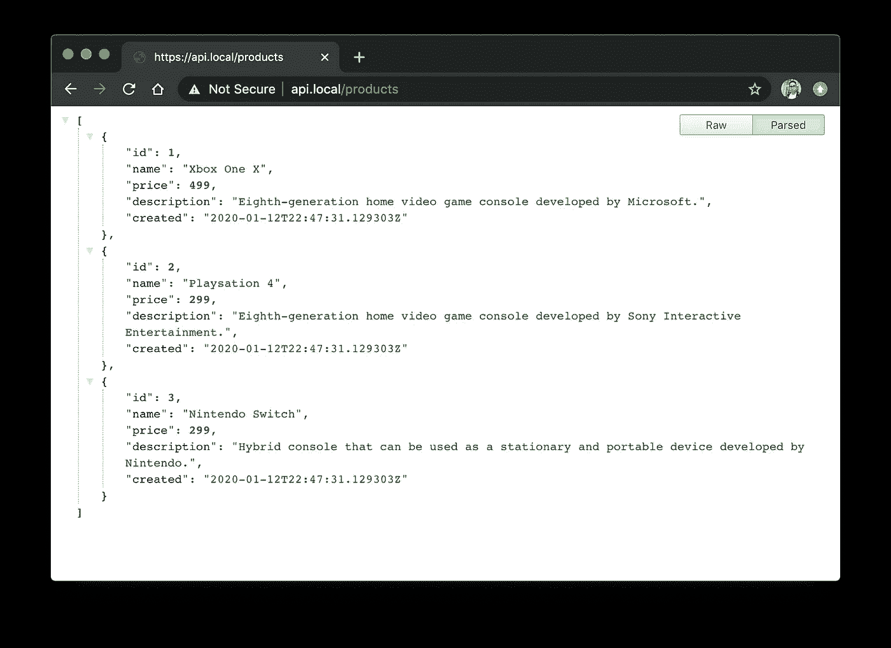**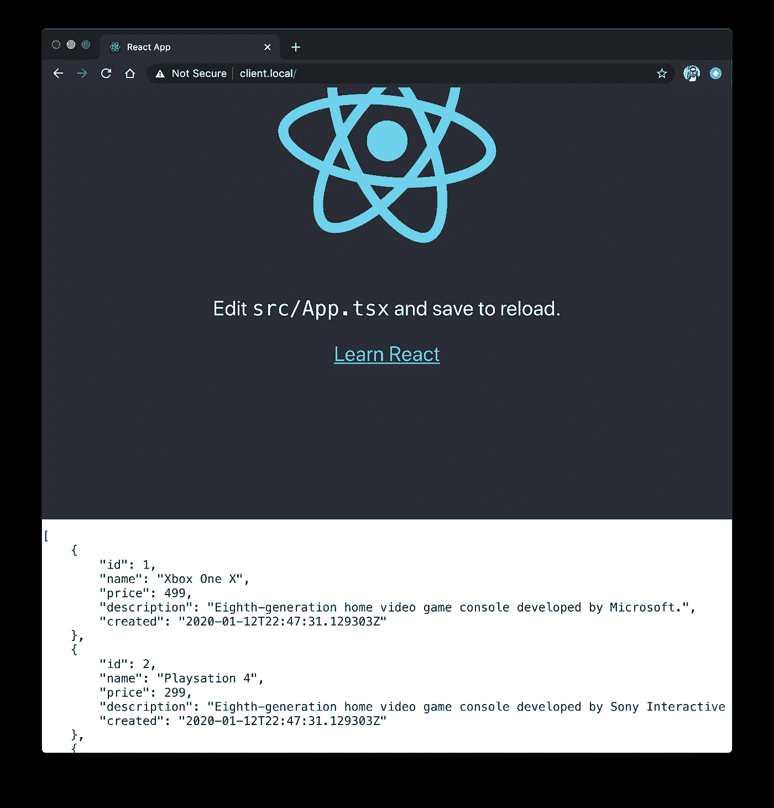*

## *清理*

*运行`docker-compose down`停止并删除我们用`docker-compose up`命令创建的所有容器。此外，还要删除我们创建的外部卷和网络。在*使用 makefile*部分，makefile 会为我们创建这些。*

```
*docker-compose down
docker network remove postgres-net
docker network remove traefik-public
docker volume remove postgres-db*
```

# *使用 Traefik*

*我们的 docker-compose.yml 文件已经配置为使用 Traefik 生成自签名证书。*

*你可能想知道什么是 Traefik 。*

*Traefik 的文件指出:*

> **Traefik 是一款开源边缘路由器，让发布您的服务变得轻松有趣。它代表您的系统接收请求，并找出哪些组件负责处理这些请求。**
> 
> **除了众多特性之外，Traefik 的与众不同之处在于它能自动为您的服务发现正确的配置。当 Traefik 检查您的基础设施时，神奇的事情就发生了，它会找到相关的信息，并发现哪个服务服务于哪个请求。**
> 
> **—*[*https://docs . traefik . io/# the-traefik-quick start-using-docker*](https://docs.traefik.io/#the-traefik-quickstart-using-docker)*

*在我们的撰写文件中重新访问`traefik`服务。*

*我们利用 DockerHub 版本 2.1.2 的官方 Traefik 映像。我们可以使用命令行标志和标签来配置 Traefik。*

****注意:*** *还可以使用 TOML 文件和 YAML 文件配置 Traefik。**

*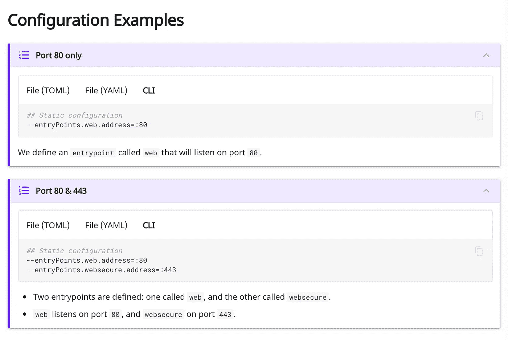*

*我更喜欢使用 CLI 标志，因为我不想担心在生产中存储 TOML 文件。我也喜欢只依赖一个 docker-compose.yml 文件来设置一切的想法。*

## *一行一行:它是如何工作的*

*让我们从命令行标志开始。*

```
*--api.insecure=true*
```

*该 API 在 traefik 入口点(端口 8080)上公开。*

```
*--api.debug=true*
```

*为调试和分析启用附加端点。*

```
*--log.level=DEBUG*
```

*将日志级别设置为调试。默认情况下，日志级别设置为错误。可选的日志记录级别有调试、紧急、致命、警告和信息。*

```
*--providers.docker*
```

*有各种提供者可供选择，这一行明确选择了 docker。*

```
*--providers.docker.exposedbydefault=false*
```

*默认情况下，限制 Traefik 的路由配置不公开所有容器。只有贴有`traefik.enable=true`标签的容器才会暴露。*

```
*--providers.docker.network=traefik-public*
```

*定义用于连接所有容器的默认网络。*

```
*--entrypoints.web.address=:80*
```

*在端口 80 上创建一个名为 web 的入口点来处理 http 连接。*

```
*--entrypoints.websecure.address=:443*
```

*在端口 443 上创建一个名为 websecure 的入口点来处理 https 连接。*

*接下来，我们将介绍 traefik 服务的标签。*

```
*- "traefik.enable=true"*
```

*告诉 Traefik 将该服务包含在其路由配置中。*

```
*- "traefik.http.routers.traefik.tls=true"*
```

*启用 TLS 证书。*

```
*- "traefik.http.routers.traefik.rule=Host(`traefik.api.local`)"*
```

*设置主机匹配规则，将所有匹配此请求的流量重定向到容器。*

```
*- "traefik.http.routers.traefik.service=api@internal"*
```

*如果启用 API，将创建一个名为 api@internal 的新的特殊服务，并且可以在路由器中引用。该标签附在 Traefik 的内部 api 上，因此我们可以访问仪表板。*

*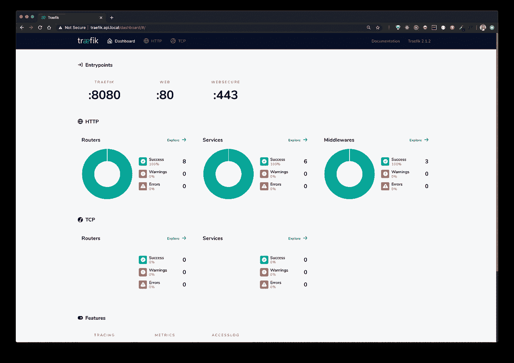*

*下一组标签创建了一个名为 http-catchall 的路由器，它将捕获所有 http 请求并将其转发给一个名为 redirect-to-https 的路由器。这具有将我们的流量重定向到 https 的额外好处。*

*现在再来看一下`client`服务。*

## *一行一行:它是如何工作的*

```
*- "traefik.enable=true"*
```

*告诉 Traefik 将该服务包含在其路由配置中。*

```
*- "traefik.http.routers.client.tls=true"*
```

*为了更新自动附加到应用程序的路由器配置，我们添加了以下列开头的标签:*

```
*traefik.http.routers.{router-name-of-your-choice}*
```

*后跟您要更改的选项。在这种情况下，我们启用 tls 加密。*

```
*- "traefik.http.routers.client.rule=Host(`client.local`)"*
```

*设置主机匹配规则，将所有匹配此请求的流量重定向到容器。*

```
*- "traefik.http.routers.client.entrypoints=websecure"*
```

*配置 Traefik 以在 websecure 入口点上公开容器。*

```
*- "traefik.http.services.client.loadbalancer.server.port=3000"*
```

*告诉 Traefik 容器将在内部 3000 端口上公开。*

*在 Traefik 之前，我从头开始配置 nginx 反向代理。每次我添加一个额外的服务，我必须更新我的 nginx 配置。这不仅不可扩展，而且很容易出错。使用 Traefik，反向代理服务很容易。*

# *使用 Makefiles*

*键入各种 docker 命令可能会很麻烦。 [GNU Make](https://www.gnu.org/software/make/) 是一个构建自动化工具，通过读取名为 Makefiles 的文件，自动从源代码构建可执行程序。*

*下面是一个 makefile 示例:*

```
*#!make
hello: hello.c
gcc hello.c -o hello*
```

*我们关心的主要特征是:*

> **【这种能力】构建和安装你的包，而不需要知道如何完成的细节——因为这些细节被记录在你提供的 makefile 中。**
> 
> **——*[*https://www.gnu.org/software/make/*](https://www.gnu.org/software/make/)*

*语法是:*

```
*target: prerequisite prerequisite prerequisite ...
(TAB) commands*
```

****注意:*** *目标和先决条件不一定是文件。**

*在命令行中，我们将通过键入`make`或`make hello`来运行这个示例 makefile。这两种方法都可行，因为当没有指定目标时，将执行 makefile 中的第一个目标。*

# *创建 Makefile*

*在您的项目根目录中创建一个`makefile`并打开它。*

```
*touch makefile*
```

*增加以下内容:*

## *演示*

```
*make*
```

*当您执行一个目标时，目标的命令体中的每个命令都将以自我记录的方式打印到 stdout，然后执行。如果您不想将某个命令输出到 stdout，但希望执行该命令，可以在它前面添加“@”符号。Makefile 注释前面有一个“#”符号。在一个命令前使用“@#”会隐藏它，使其不被输出，并且永远不会执行。*

*我使用`echo`向每个目标添加文档来描述每个目标做什么。*

*当我们运行`make`或`make api`时，我们的 makefile 创建了一个外部数据库卷和 2 个网络。我们不想再这样了。因此，我们需要一种方法来测试我们是否已经完成了这一步。*

*这是通过以下代码完成的:*

```
*ifeq (,$(findstring postgres-net,$(NETWORKS)))
	*# do something*
endif*
```

*如果我们在`$(NETWORKS)`变量中找到`postgres-net`网络，我们什么也不做，否则我们创建网络。这个条件语句可能看起来有点奇怪，因为条件中的第一个参数是空的，也许可以更好地理解为`ifeq (null,$(findstring A,$(B)))`，但实际上上面的代码是正确的语法。*

## *变量*

*变量可以在 Makefile 的顶部定义，并在以后引用。*

```
**#!make*
NETWORKS="$(shell docker network ls)"*
```

*使用语法`$(shell <command>)`是执行命令并将其值存储在变量中的一种方式。*

## *环境变量*

*只要将. env 文件中的环境变量包含在 makefile 的顶部，就可以引用它。*

```
**#!make*
include .env

target:
    echo ${MY_ENV_VAR}*
```

## *虚假目标*

*makefile 无法区分文件目标和虚假目标。*

> *虚假的目标是一个不是真正的文件名的目标；更确切地说，它只是当您发出明确请求时要执行的配方的名称。使用假目标有两个原因:避免与同名文件冲突，以及提高性能。*
> 
> **——*[*https://bit.ly/370xohe*](https://bit.ly/370xohe)*

*我们的每个命令都是`.PHONY:`目标，因为它们不代表文件。*

# *使用 Postgres*

## *在终端中调试 Postgres*

*我们还没有讨论如何与 Postgres 互动。最终，您会想要进入正在运行的 Postgres 容器进行查询或调试。*

## *演示*

```
*make debug-db*
```

*您应该会自动登录。运行几个命令来感受一下。*

```
*\dt*
```

*然后运行:*

```
*select name, price from products*
```

*`debug-db`目标使用 Postgres 的高级命令行接口，称为 [pgcli](https://www.pgcli.com/) 。*

*这太棒了。我们现在有一个用户友好的终端体验，语法高亮和自动完成。*

*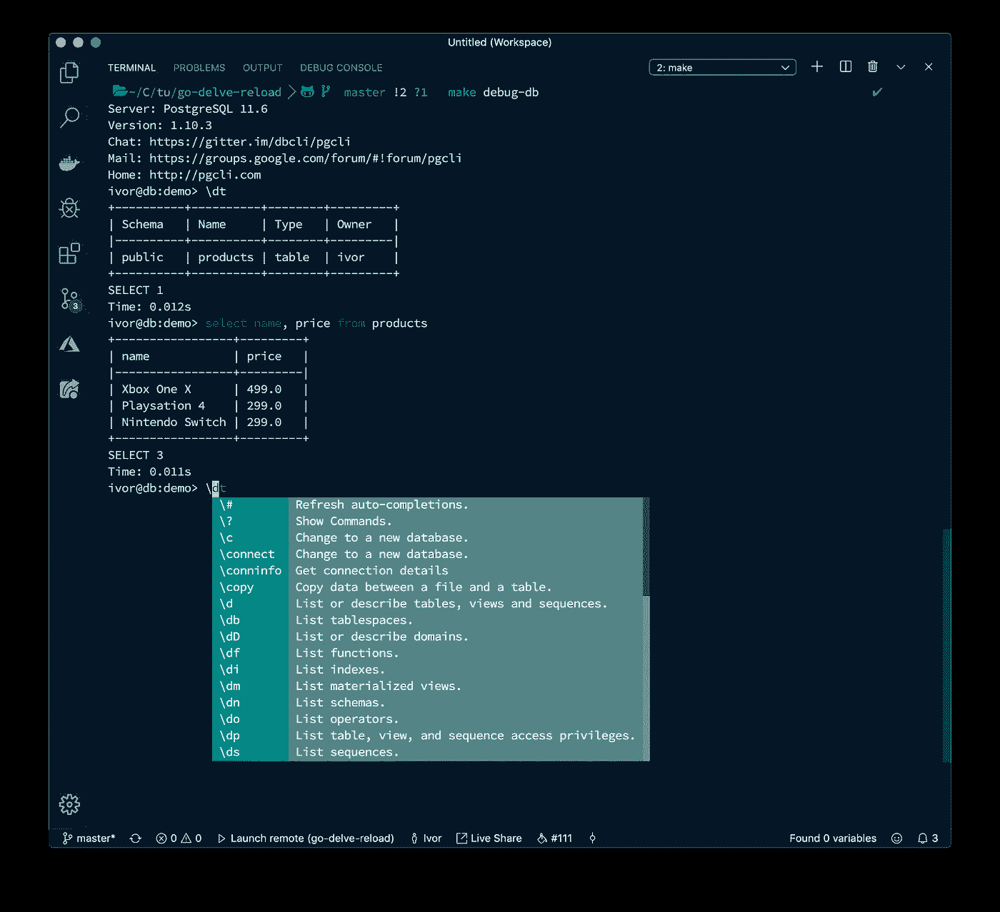*

## *PGAdmin4:在浏览器中调试 Postgres*

*不是每个人都喜欢使用 Postgres 时的终端体验。我们还有一个使用 [pgAdmin4](https://www.pgadmin.org/download/pgadmin-4-container/) 的浏览器选项。*

*要登录，电子邮件是`test@example.com`，密码是`SuperSecret.`，如果你想改变这些值，它们位于 docker-compose.yml 文件中。将环境变量`PGADMIN_DEFAULT_EMAIL`和`PGADMIN_DEFAULT_PASSWORD`更改为您想要的任何值。*

## *演示*

*在浏览器中导航至 [https://pgadmin.local](https://pgadmin.local) 并登录。*

*点击“添加新服务器”。*

*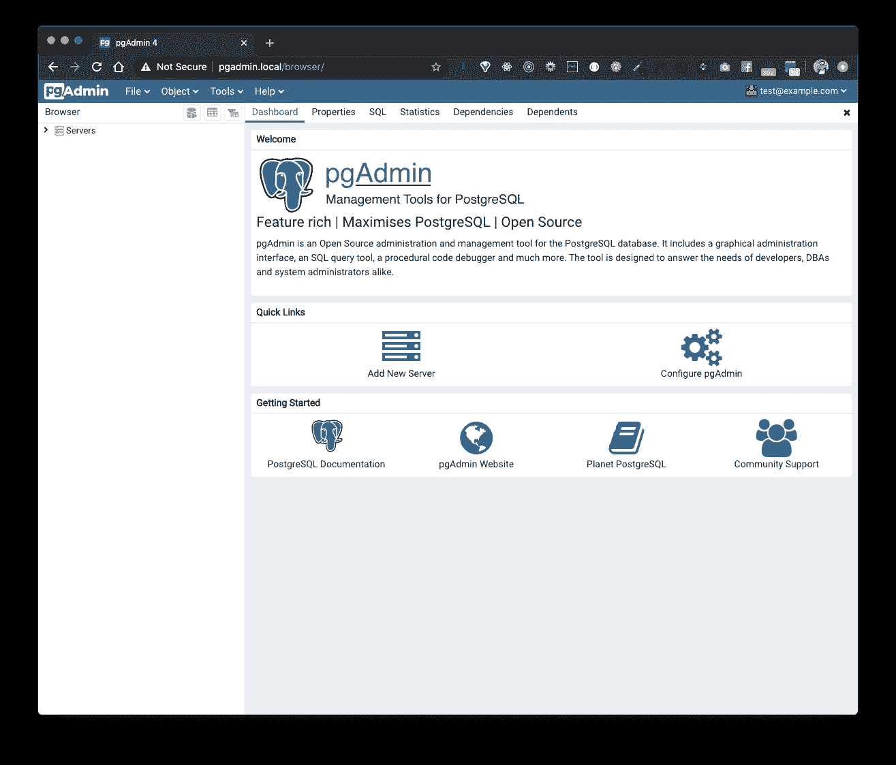*

*您需要修改的两个选项卡是“常规”和“连接”。在常规下添加数据库的名称。*

*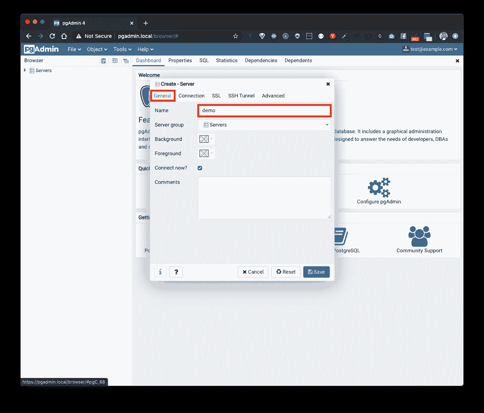*

*在“连接”选项卡下，填写主机名，应该是`db`，除非你在 docker-compose.yml 文件中更改了它。然后添加您的用户名，密码，并检查保存密码。最后，点击“保存”。*

*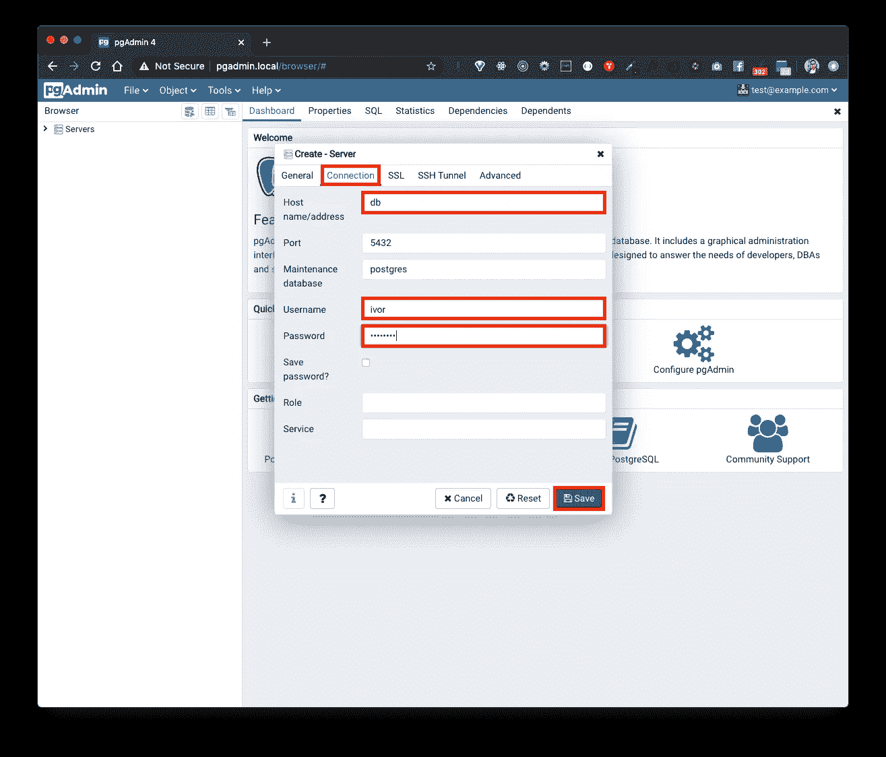*

*要查看数据库表，必须首先层叠嵌套的树结构，以找到要选择的表。然后选择页面顶部的表格视图图标。*

*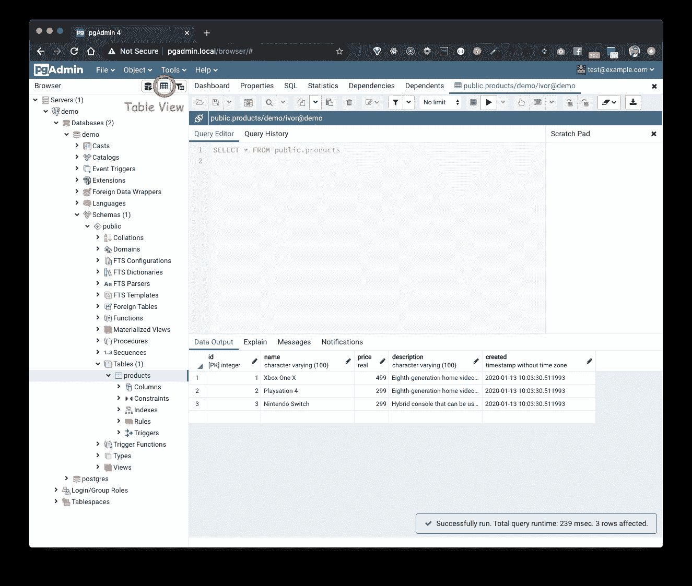*

## *制作 Postgres 数据库备份*

*对 Postgres 数据库进行数据库备份非常简单。*

## *演示*

```
*make dump*
```

*您可能想知道 Postgres 数据库最初是如何播种数据的。*

*官方的 Postgres 图片显示:*

> **如果您想在从此映像派生的映像中进行额外的初始化，请添加一个或多个*。sql、*.sql.gz 或*。/docker-entrypoint-initdb.d 下的 sh 脚本(必要时创建目录)。**
> 
> **entry point 调用 initdb 创建默认 postgres 用户和数据库后，会运行 any *。sql 文件，运行任何可执行文件*。sh 脚本，以及任何不可执行的源代码*。在该目录中找到的 sh 脚本在启动服务之前做进一步的初始化。**
> 
> **——*[*https://hub.docker.com/_/postgres*](https://hub.docker.com/_/postgres)*

*位于`api/scripts/create-db.sh`下的数据库创建脚本用于播种数据库。*

*在我们的 docker-compose.yml 文件中，`create-db.sh`被绑定到 db 容器中:*

*`create-db.sh`仅在备份不存在时运行。这样，如果您制作了一个备份(它被自动放置在`api/scripts`目录中)，并且您删除了数据库卷，然后重新启动数据库容器，下一次，`create-db.sh`将被忽略，并且将只使用备份。*

# *实时重新加载 Go API*

*由于 docker-compose.yml 文件中的这一行，我们的 go api 已经可以重载了。*

*如果你熟悉 Node，[编译器守护进程](https://github.com/githubnemo/CompileDaemon)会监视你的。像 nodemon 一样运行文件并重启服务器。*

*`--build`用于指定重建时我们要运行的命令(此标志是必需的)。*

*`--command`用于指定成功构建后运行的命令(该标志默认为 nothing)。*

## *演示*

*要看到这一点，请确保您的 api 正在运行。然后对任何 api 文件进行更改，查看它的重新构建。*

# *调试一个 Go API*

*Delve 已经成为 Go 编程语言事实上的标准调试器。为了与 VSCode 一起使用，我们需要添加一个启动脚本，以便 VSCode 可以附加到 go 容器中的调试器。安装 delve 后，下面一行是我们如何在容器级别执行它的。*

*我们使用`dlv debug`来编译并开始调试位于`./cmd/api/`目录中的主包。*

*`--accept-multiclient`允许一个无头服务器接受多个客户端连接。*

*`--continue`在启动时继续调试的进程，这不是默认设置。*

*`--headless`仅在无头模式下运行调试服务器。*

*`--listen`设置调试服务器监听地址。*

*`--api-version`当无头和时将指定 API 版本*

*`--log`启用调试服务器日志。*

## *演示*

```
*make debug-api*
```

*转到`api/internal/handlers.go`并在其中一个处理程序中放置一个断点。在 VSCode 中，单击调试器选项卡中的“启动远程”按钮。接下来，导航到触发处理程序的路由。您应该会看到编辑器在您放置断点的地方暂停。*

*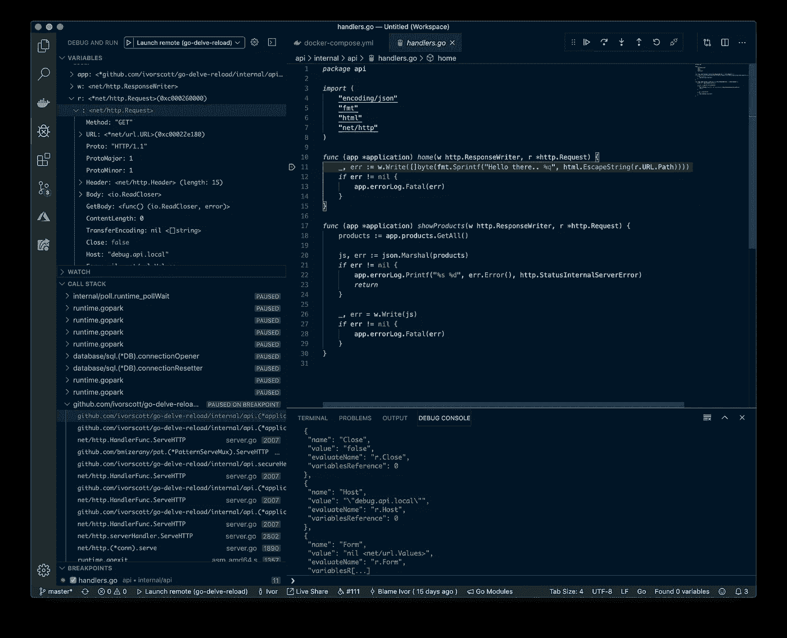*

# *测试*

*没有测试，我们的开发设置是不完整的。这里我们将运行两个命令来执行客户端和服务器端的单元测试。因为这些是单元测试，所以不需要运行应用程序来进行测试。*

## *演示*

```
*make test-client
make test-api*
```

*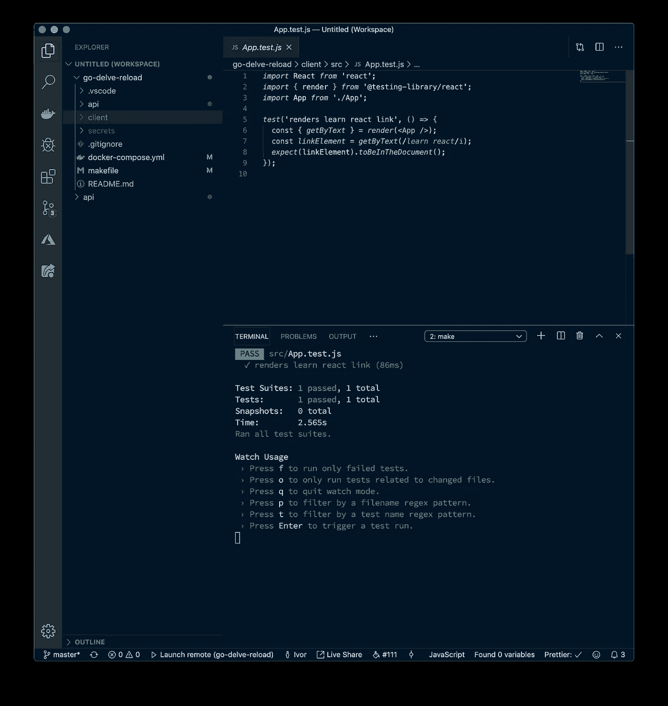**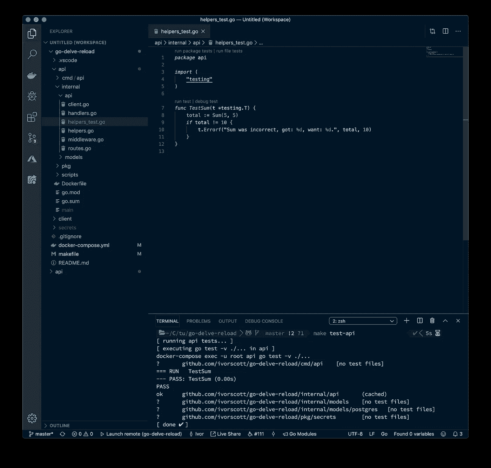*

*在您的 CI 构建系统中，您可以简单地构建 docker 映像的测试阶段来运行单元测试。*

*一月份，我参加了在柏林举行的 GoDays 2020。有一个精彩的演示，展示了如何在容器中运行集成和端到端测试。如果您希望这样做，请查看[幻灯片](https://speakerdeck.com/godays/integration-and-end-to-end-testing-with-testcontainers-go-nikolay-kuznetsov-and-erdem-toraman-zalando)。正在使用的库是 [testcontainers-go](https://github.com/testcontainers/testcontainers-go) 和 [moby-ryuk](https://github.com/testcontainers/moby-ryuk) 。*

# *结论*

*我希望您已经了解了如何使用 Docker 构建最终的 Go 和 React 开发设置。无论您在客户端或服务器端使用什么语言，基本原则仍然适用。如果你想从一个真正的码头船长那里学习码头工人，我强烈推荐 Bret Fisher 在 Udemy 上的[码头工人大师课程](https://www.udemy.com/course/docker-mastery)。快乐编码。*

**系列中的* [*下一篇文章*](https://medium.com/@ivorscott/transitioning-to-go-pt-2-31432d2a074f) *正在过渡到 Go 部分 2**

*[**在 Twitter 上关注我**](https://twitter.com/ivorsco77) 获取实时更新。*

**原载于*[*https://blog.ivorscott.com*](https://blog.ivorscott.com/ultimate-go-react-development-setup-with-docker)*。**

*[](https://skilled.dev) [## 编写面试问题

### 一个完整的平台，在这里我会教你找到下一份工作所需的一切，以及…

技术开发](https://skilled.dev)*