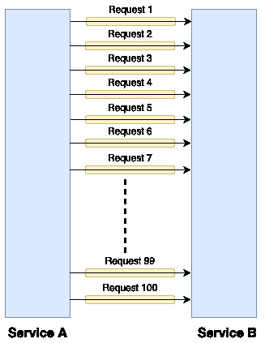
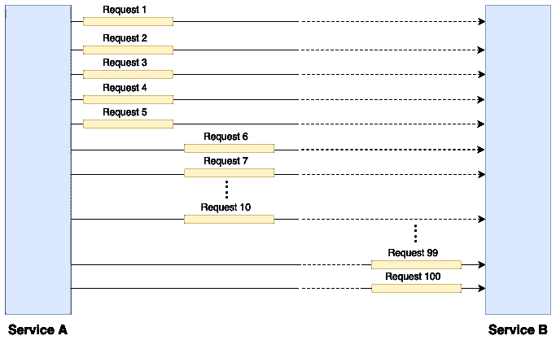
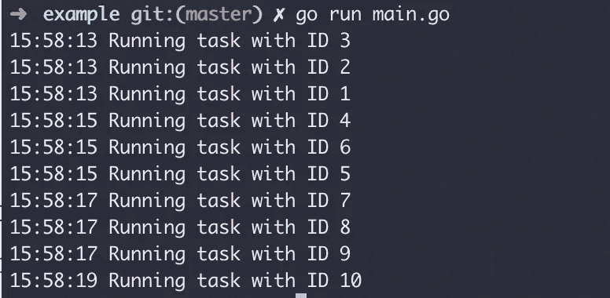

# Go 并发模式:信号量

> 原文：<https://levelup.gitconnected.com/go-concurrency-pattern-semaphore-9587d45f058d>


交通道路(图片由 [Pixabay](https://www.pexels.com/photo/buildings-cars-city-cross-harbour-tunnel-262100/) 提供)

用 Go 编程语言实现并发流程非常容易。只要用 go 前缀运行你的函数，砰的一声，你的函数不会阻塞你的主 G *例程*。

但是，如果您出色的并发函数负责机器的 I/O 呢？例如，您的函数将从其他服务向 REST API 发出 100 个并行 HTTP POST 请求。是的，您的网络 I/O 将忙于同时处理 100 个请求，这会降低您的 I/O 性能。

基于[维基百科](https://en.wikipedia.org/wiki/Semaphore_(programming))的救援信号来了，

信号量是一种变量或抽象数据类型，用于控制并发系统(如多任务操作系统)中多个进程对公共资源的访问。”。

基于我们的例子，我们可以将并发进程减少到 20 个，并重复这个过程 5 次，而不是同时处理 100 个 HTTP 请求。是的，这将比同时处理 100 个请求花费更多的时间，但是这将给你的 I/O 网络带来喘息的机会，因为你的网络只需要同时处理 20 个请求。



请求同时使用 100 个 goroutines



请求同时使用 5 个 goroutines

这就是信号量的强大之处，我们可以将 100 个并发请求分成 5 x 20 个并发请求。不幸的是，Golang 没有内置的信号量实现，但可以使用[缓冲通道](https://tour.golang.org/concurrency/3)轻松模拟。因为当缓冲通道已满时，通道将锁定 *Goroutine* 并使其等待，直到有缓冲区可用。

这对于一个基本的介绍来说已经足够了，让我们通过在 Go 中实现信号量来实践一下。首先，我们需要定义我们的信号量接口:

```
type Semaphore interface { Acquire() Release()}
```

我们的实现有两个方法 Acquire()和 Release()。**获取**方法用于锁定资源，并将在调用我们的繁重/长时间运行的进程之前被调用**。而 **Release** 方法应该在**长时间运行的流程处理完之后调用**。**

接下来是我们的实现:

```
type semaphore struct { semC chan struct{}}func New(maxConcurrency int) Semaphore { return &semaphore{ semC: make(chan struct{}, maxConcurrency), }}func (s *semaphore) Acquire() { s.semC <- struct{}{}}func (s *semaphore) Release() { <-s.semC}
```

就是这样，当通道已满时，我们通过将 **maxConcurrency** 参数设置为通道大小来利用 Go 缓冲通道上的阻塞行为。当我们调用 **Acquire()** ，时，该通道将被一个空结构填充，如果达到最大值，该通道将被阻塞。当我们调用 **Release()** 时，我们从通道中取出空结构，通道将可用于下一个值，通道将被解除阻塞。

让我们看看信号量的实际实现。

```
func main() { sem := semaphore.New(3) doneC := make(chan bool, 1) totProcess := 10 for i := 1; i <= totProcess; i++ { sem.Acquire() go func(v int) {            defer sem.Release() longRunningProcess(v) if v == totProcess { doneC <- true } }(i) } <-doneC}func longRunningProcess(taskID int) { fmt.Println(
        time.Now().Format(“15:04:05”), 
        “Running task with ID”, 
        taskID) time.Sleep(2 * time.Second)}
```

我们实例化一个大小为 3 的新信号量，这意味着我们的最大并发进程将被限制为 3。然后我们在 **longRunningProcess** 函数上模拟一些繁重的任务(我们使用 2 秒睡眠时间来阻塞进程)。最后，我们尝试同时运行**longRunningProcess****10g*例程。*让我们看看输出:**

****

**并发调用函数的结果**

**从上面的例子可以看出，我们的函数可以同时运行 3 个进程，因为我们使用了信号量，所以我们的例子需要 6 秒来完成这个进程，相比之下，如果没有信号量，这个进程只需要 2 秒就可以完成。通过使用信号量，我们可以控制对共享资源的访问，如数据库、网络、磁盘等。**

**参考:**

1.  **[https://en . Wikipedia . org/wiki/Semaphore _(编程)](https://en.wikipedia.org/wiki/Semaphore_(programming))**
2.  **[https://www . ardan labs . com/blog/2014/02/the-nature-of-channels-in-go . html](https://www.ardanlabs.com/blog/2014/02/the-nature-of-channels-in-go.html)**
3.  **[https://github . com/syaf dia/go-exercise/tree/master/src/concurrency/semaphore](https://github.com/syafdia/go-exercise/tree/master/src/concurrency/semaphore)**