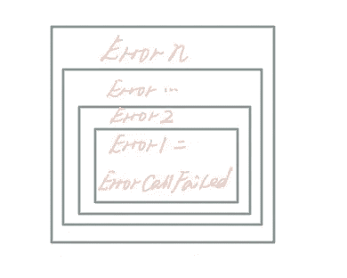

# Go 错误最佳实践

> 原文：<https://levelup.gitconnected.com/go-error-best-practice-f0864c5c2385>

## 以正确的方式创造和处理你的错误


来自 unsplash 的 Alexander Schimmeck， [@alschim](https://unsplash.com/photos/Aohf8gqa7Zc)

沉迷于围棋相当一段时间，实现了 web 相关的程序、grpc 接口、操作符，我现在好像是高级初学者了。

但是，我还是一个生产环境调试的新手，如果通过查询日志或错误消息来完成，会很麻烦。想象这样一个场景，当错误日志的特定位置丢失时，调用全文搜索。那么当那些错误日志不仅仅在一个地方时会发生什么呢？是的，我的错误日志不再能帮助我快速准确地定位错误。

显然，缺乏大多数其他高级语言支持的`[try {…} catch](https://github.com/golang/go/issues/40432)` [结构](https://github.com/golang/go/issues/40432)使得 Go 在错误处理上的设计备受争议。而下面的代码结构就是 Go 中随处可见的:每个错误都需要处理，错误是一层一层嵌套的。作为一名多年的 Java 开发人员，你无法逃避，只能适应。

```
a, err := fn()
if err != nil {
  return err
}func fn() error {
  b, err := fn1()
  if  err != nil {
    …
    return err
  }
  if _, err = fn2(); err != nil {
    …
  }
}
```

尽管如此，我们总能踩着前人的肩膀，想出解决困难的办法。在下面的部分中，我将分享一些错误处理的规则和一些第三方包，它们可以提高效率，这是我总结的。

# 什么是 Go 错误？

在 Go 中，错误只是一个接口。

```
type error interface {
  Error() string
}
```

所以，实现，创建，或者抛出一个错误，其实就是实现这个接口。三种最常见的方式是

*   `errors.New`
*   `fmt.Errorf`
*   `implement error interface`

```
var ErrRecordNotExist   = errors.New("record not exist")func ErrFileNotExist(filename string) error { return fmt.Errorf("%s file not exist", filename)}type ErrorCallFailed struct { Funcname string}func (*ErrorCallFailed) Error() string { return fmt.Sprintf(“call %s failed”, funcname)}var ErrGetFailed error = &ErrorCallFailed{ Funcname: "getName", }
```

并且在 Go 错误中只涉及以下两个逻辑。

*   **抛出错误**，这涉及到我们如何定义错误。在实现函数时，对于异常情况需要返回合理的错误。
*   **处理错误**。调用函数时，要根据函数的返回实现不同的逻辑，要考虑到是否有错误，错误是否属于某一类型，错误是否要忽略等等。

Kubernetes [decode.go](https://github.com/kubernetes/kubernetes/blob/29652248ebe229a9dc6f64c3e37c9980cd755bfd/staging/src/k8s.io/apimachinery/pkg/util/yaml/decoder.go#L94) 的这段代码不仅可以直接返回错误，还可以包装错误，要么返回`YAMLSyntaxError`，要么干脆忽略`io.EOF`。

通常，有三种方法可以确定错误类型。

*   直接按`**==**`、`if err == ErrRecordNotExist {}`。
*   **式推断**，`if _, ok := err.(*ErrRecordNotExist); ok {}`。
*   `**errors.Is**` 和`**errors.As**`方法，这是从 Go 1.13 开始增加的。`if errors.Is(err, ErrRecordNotExist)`涉及[错误包装](https://go.dev/blog/go1.13-errors)，解决定位嵌套错误的麻烦。

# 要遵循的规则

在理解了 Go 错误的基本概念之后，是时候讨论可以遵循的规则，以便更好地练习。让我们从定义开始，然后到错误处理。

## 定义错误

*   **用** `**fmt.Errorf**` **战胜** `**errors.New**`

`fmt.Errorf`提供拼接参数功能，并包裹错误。虽然在处理简单错误时，我们看不到这两种方法有什么不同，但是总是设置`fmt.Errorf` 因为您的偏好可以保持代码一致。

*   **封装类似错误**

封装同样的错误，比如上面提到的`ErrorCallFailed`，是一种常见的代码优化，结合`errors.Is`或者`errors.As`可以解包各层，更好的确定错误的真正原因。关于`errors.Is`和`errors.As`的区别，前者需要类型匹配和消息匹配，而后者只需要类型匹配。

*   **使用** `**%w**` **超过** `**%v**`

为了获得一个方法被多个地方调用时的完整调用链，开发者会在返回错误的地方层层包装，通过`fmt.Errorf`不断添加当前调用的独有特性，它可能是一个日志，也可能是一个参数。而在错误拼接中偶尔采用`%v`代替`%w`，会使 Go 的错误换行特性在 Go1.13 及以后失效，正确换行后的错误类型如下。



*   **使错误信息简洁**

合理的错误信息可以让我们远离层层包装的冗余信息。

许多人习惯在下面的内容中打印日志，添加参数、当前方法的名称和调用方法的名称，这是不必要的。

```
func Fn(id string) error {
  err := Fn1()
  if err != nil {
    return fmt.Errorf("Call Fn1 failed with id: %s, %w", id, err
  }
  ...
  return nil
}
```

然而，一个清晰明了的错误日志只包含**当前操作错误的信息，内部参数和动作**，以及调用者不知道的信息，比如当前的方法和参数。这里有一个[端点的错误日志，Kubernetes 中的 go](https://github.com/kubernetes/kubernetes/blob/master/pkg/controller/endpoint/endpoints_controller.go#L218) ，一个非常好的例子，只打印内部 Pod 相关的参数和`Unable to get Pod`的失败动作。

## 处理错误

黄金五法则。

*   `**errors.Is**` **胜过** `**==**`

`==`比较容易出错，只能比较当前错误类型，不能解包。所以，`errors.Is`或者`errors.As`是比较好的选择。

*   打印错误日志，但不打印正常日志

```
buf, err := json.Marshal(conf)
if err != nil {
  log.Printf(“could not marshal config: %v”, err)
}
```

新手的一个常见错误是使用`log.Printf`打印所有日志，包括错误日志，这使得我们无法通过日志级别正确处理日志，增加了调试的难度。并且我们可以从 [dependencycheck.go](https://github.com/kubernetes/kubernetes/blob/0ac956ff2bef9c84b17d4b9cae2cffe71d5c6386/cmd/dependencycheck/dependencycheck.go) 中学习正确的方法，这里应用了`log.Fatalf`。

```
if len(args) != 1 {
  log.Fatalf(“usage: dependencycheck <json-dep-file> (e.g. ‘go list -mod=vendor -test -deps -json ./vendor/…’)”)
}if *restrict == “” {
  log.Fatalf(“Must specify restricted regex pattern”)
}depsPattern, err := regexp.Compile(*restrict)if err != nil {
  log.Fatalf(“Error compiling restricted dependencies regex: %v”, err)
}
```

*   永远不要通过错误处理逻辑

这里有一个错误过程的例子。

```
bytes, err := d.reader.Read()
if err != nil && err != io.EOF {
  return err
}
row := db.QueryRow(“select name from user where id= ?”, 1)
err := row.Scan(&name)
if err != nil && err != sql.ErrNoRows{
  return err
}
```

我们可以看到，`io.EOF`和`sql.ErrNoRows`两个错误都被忽略了，后者是用错误表示业务逻辑的典型例子(数据不存在)。我反对这样的设计，但是支持`size, err:= row.Scan(&name) if size == 0 {log.Println(“no data”) }`的优化，通过增加一个返回参数来辅助，而不是直接抛出一个错误。

*   **底层方法返回错误，上层方法处理错误。**

```
func Write(w io.Writer, buf []byte) error {
  _, err := w.Write(buf)
  if err != nil {
    log.Println(“unable to write:”, err)
    return err
  }
  return nil
}
```

类似上面的代码有一个明显的问题。如果在打印日志后返回一个错误，则很可能有重复的日志，因为调用者也可能打印日志。

那怎么避免呢？让每个方法只执行一个功能。而这里常见的选择是底层方法只返回错误，上层方法处理错误。

*   **包装错误消息并添加有助于故障排除的上下文。**

在 Go 中没有原生 stacktrace 可以依赖，我们只能通过自实现或者第三方库来获取那些异常的堆栈信息。例如，Kubernetes 实现了一个相对复杂的 [klog](https://github.com/kubernetes/kubernetes/blob/0ac956ff2bef9c84b17d4b9cae2cffe71d5c6386/vendor/k8s.io/klog/v2/klog.go#L1473) 包来支持日志打印、堆栈信息和上下文。而你参考 Kubernetes 中的[结构化日志，如果你开发的是 Kubernetes 相关的应用，比如 Operator。除此之外，那些第三方的错误封装库，比如](https://github.com/kubernetes/community/blob/master/contributors/devel/sig-instrumentation/migration-to-structured-logging.md#structured-logging-in-kubernetes) [pkg/errors](https://github.com/pkg/errors) 也很受欢迎。

# 结束了

Go 设计哲学的初衷是简化，但有时会使事情变得复杂。然而，你不能认为 Go 错误处理一无是处，即使它不是那么用户友好。至少，逐错返回是一个好的设计，在最高层的调用位置统一处理错误。此外，我们仍然可以期待即将到来的版本中的改进，这将带来更简单的应用程序。

感谢阅读！

# 参考

[https://go.dev/blog/go1.13-errors](https://go.dev/blog/go1.13-errors)

[https://errnil.substack.com/p/wrapping-errors-the-right-way](https://errnil.substack.com/p/wrapping-errors-the-right-way)

[https://Dave . Cheney . net/2016/04/27/don ' t-just-check-errors-handle-these-gracefully](https://dave.cheney.net/2016/04/27/dont-just-check-errors-handle-them-gracefully)