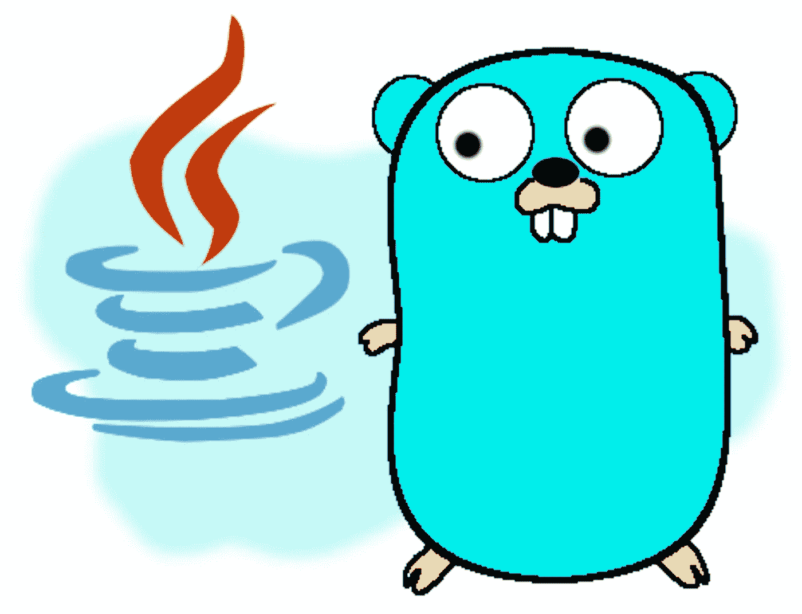

# 面向 Java 开发人员的 Golang 编译、包和模块以及内置功能

> 原文：<https://levelup.gitconnected.com/go-for-java-devs-compiling-packages-and-modules-and-built-in-functionality-672597c19ae4>

## 从 Java 角度看 Go 编程语言——第 3 部分



作者糟糕的草图

在这个系列的第一篇[第一篇](https://medium.com/p/348fa57f4100) [和第二篇](https://medium.com/p/493dad0c5129)文章中，我将自己描述为一名长期从事 Java 工作的工程师，最近决定尝试一下。尽管我将永远热爱 Java，但我知道继续学习语言很重要。我选择 Go 是因为它是一种静态类型的编译语言，不会面临 Java 面临的一些问题(比如编译时间和启动时间慢)。

这个系列不是要让 Java 和 Go 对立起来。两者都是强势语言，各有优缺点。相反，这是我作为 Java 开发人员对 Go 的第一次观察。鉴于我仍在学习 Go，如果任何读者认为我误解了 Go(或者 Java，就此而言)，我欢迎任何反馈。

在本系列的最后一篇文章中，让我们从 Go 编码的本质上后退一步，讨论 Go 的编译和启动时间，包和模块如何帮助组织代码和依赖关系，以及内置于 Go 核心的一些高级功能。

# 编译和启动时间

围棋最常被吹捧的好处之一是它的速度。不仅仅是它的运行时性能，还有它的编译和启动时间。事实上，解决其他语言的[构建时间慢的问题](https://talks.golang.org/2012/splash.article)被这种语言的创造者称为是创造 Go 的主要动力。

相比之下，Java 因其编译时间和启动时间而备受批评。我大部分时间都是从 Spring(一个很棒的框架，但是它的依赖连线会导致启动时间非常慢)转向更新的框架，比如 [Vert.x](https://vertx.io/) 和 [Quarkus](https://quarkus.io/) 。这些框架避开了 Spring 的大部分包袱，提供了显著的性能改进。但是仍然有明显的滞后，尤其是在云冷启动期间。

Java 社区正在努力解决这些问题，特别是使用 [GraalVM 和本机构建](https://www.graalvm.org/reference-manual/native-image/)的本机构建。目前，这种方法需要一个主要的权衡:虽然启动时间快如闪电，但编译要花很长时间(如果它没有耗尽内存并先被丢弃的话)。我相信，总有一天，这些问题会得到解决。但是 Java 还没有出现。

相比之下，围棋是。哦，是的，一旦你开始使用 Go，你会注意到这些性能优势。不管我的应用程序变得有多大，编译时间仍然明显比它们的 Java 类似物要短。并且启动时间保持接近瞬时。特别是，在将我的 Go 服务部署到 GCP 云运行时，我几乎没有注意到冷启动时间。

# 内置功能

Go 的标准库提供了数量惊人的内置功能；在 Java 中需要使用第三方框架的功能。考虑到 Go 旨在变得紧凑和简单易学，这一点尤其令人惊讶。然而，事实证明，这种内置的功能很容易掌握，感觉就像是语言的一部分。

让我们看下面两个例子:

## Http 服务器

Go 的标准`net/http`包允许我们轻松地启动一个相当强大的 HTTP 服务器。它允许我们做以下事情:

*   将 URL 路径与请求处理程序相关联
*   访问请求参数和主体
*   指定我们的服务器将监听的端口(或者，多个服务器将监听的多个端口)

从 Java 的角度来看，这有点像使用 [Vert.x Web](https://vertx.io/docs/vertx-web/java/) ，当然，这是第三方框架，不是 JDK 发行版的一部分。

然而，Go 的内置 HTTP 服务器产品有一定的局限性。我几乎立刻注意到，我不能指定 URL 路径参数(例如`/users/*{id}*/emails/*{emailId}*`)，也不能声明性地将请求处理程序与特定的请求方法关联起来(例如`GET`或`PUT`)。但是，也有第三方模块提供此功能。 [GorillaMux](https://github.com/gorilla/mux) 尤其符合`net/http`的 API，可以无缝地放置在适当的位置以扩展`net/http`的功能。

## 模板

Go 提供了一种内置的模板语言。这允许我们创建一个带有可替换标记的文本文件，然后将该文件与一个包含要换入的值的数据结构相结合，从而生成动态生成的内容。

它的用途多种多样。例如，我们可以将它与我们的`net/http`服务器结合使用，以便提供动态生成的网页。如果你已经为 Kubernetes 编写了[掌舵图](https://helm.sh/docs/chart_template_guide/)，你已经习惯了使用模板语言。在这方面，Go 的模板语言类似于 Java 的 [Apache Freemarker](https://freemarker.apache.org/) 库，可以用作通用的模板库(即不仅仅用于网页)。

鉴于 Go 的模板语言本质上是通用的，它在任何特定领域(例如动态网页)的功能都是不全面的。当然，[众多第三方](https://github.com/avelino/awesome-go#template-engines)模块的存在填补了这一空白。

# 包和模块

写代码是一回事；组织和包装是另一回事。Go 主要为此提供了两个构造:*包*和*模块*。Go 包类似于 Java 的包，而 Go 模块类似于 JAR 文件加 Maven(或者您最喜欢的依赖管理工具)。

## 包装

Go 包提供了一种将相关的结构、接口、函数、常量等分组的机制。与 Java 一样，我们将文件的包声明为文件中的第一行。然而，Go 包不像 Java 包那样遵循[反向域名符号](https://en.wikipedia.org/wiki/Reverse_domain_name_notation)。相反，Go 的惯例是使用简洁的单个单词的包名。此外，Go 包名称不必像 Java 那样与底层目录结构相匹配……尽管如果包中的所有文件都位于同一个目录中会非常有帮助(如下所述)。

下面是一个在`api`包中的简单 Go 文件的例子:

```
package apitype Person struct {
  Id    string
  Name  string
}
```

与 Java 导入类似，包被导入到驻留在其他包中的文件中。这是通过一个`import`声明来完成的。注意，在 Go 中，我们只导入包；我们不指定单独的类/结构(因此，我们不需要像在 Java 中那样使用通配符)。

一旦我们导入了一个包，我们就可以通过在它前面加上包名来引用从那个包中导出的任何元素。

如果一个文件从上面导入了`api`包(和`log`包一起)并使用了包的`Person`结构，那么这个文件可能是这样的:

```
package mainimport (
  "api"
  "log"
)func main() {
  p := api.Person{123, "Pat Smith"}  // we prefix Person with api.
  log.Printf("Person's name is %s", p.Name)
}
```

上面的例子位于`main`包中。可执行应用程序(即非库)必须驻留在`main`包中。

***记住，一个包里没有类***
在 Java 里，我们倾向于把包看成类的集合。围棋就不是这样的。记住，围棋是没有职业的。上面这个带有`Person`结构的`api`包的例子有点像 Java。但是回想一下，在 Go 中，我们可以定义正则函数(即非接收函数)。

在这种情况下，该函数的作用范围是整个*包*。假设我们要在`person.go`文件内的`api`包中创建一个这样的函数:

```
func Name(p Person) {
  return p.Name
}
```

好吧。但是现在，假设我们想在我们的`team.go`文件中为我们的`Team`结构做一些类似的事情，它也位于`api`包中:

```
func Name(t Team) {
  return t.Name
}
```

我们会得到一个编译错误。为什么？这是因为两件事:

1.  我们不能用不同的参数“重载”常规函数。在编译器看来，那两个`Name`函数是一样的。
2.  这两个函数都在`api`包的范围内，而不是在`User`和`Team`包的范围内。

实际上，我们已经声明了两次`Name`函数。

## 模块

我在 Go 社区中看到了很多关于模块的夸大，我一直试图理解这种炒作。我想我现在明白了:

*   模块是相对较新的语言。在模块出现之前，构建和组织不同的项目——然后与其他开发人员共享这些项目——显然是一场噩梦。
*   对于它们所做的，模块实际上使用起来非常简单，并且许多潜在的手动/繁琐的工作自动发生。
*   与其他语言中的许多类似工具不同，modules 附带了核心 Go 工具集。

模块有效地充当了 Go 依赖管理系统的基础。模块本身是一个简单的构造:它只是一个目录，包含:

*   一个或多个包
*   这些包所在的根目录下的一个`go.mod`文件

`go.mod`文件描述了一些事情:

*   *模块路径。*模块路径作为模块的规范名称。它还用作前缀，通过该前缀引用模块中包含的任何包。回想一下，包名不使用反向域名语法；模块路径，但是，*确实*通常使用它。
*   *Go 版本。* `go.mod`文件可以指定用来打包模块的 Go 版本。
*   *依赖性要求。*这些是模块所需的外部库(及其版本)。这大致等同于 Maven `pom.xml`文件的`<dependencies/>`部分。

让我们看一个例子:

```
module taubler.com/myappgo 1.16require (
  github.com/go-sql-driver/mysql v1.5.0
  github.com/gorilla/mux v1.8.0 // indirect
  github.com/satori/go.uuid v1.2.0
  gopkg.in/check.v1 v1.0.0-20201130134442-10cb98267c6c // indirect
)
```

上面显示了我的一个项目中的一个有点混乱的`go.mod`文件。模块路径在第一行(`taubler.com/myapp`)。当然，下一行显示的是 Go 版本。并且在`require`块中详细说明了依赖关系。

请注意，我没有自己打出来。相反，我用我的前几个 Go 文件创建了一个项目目录，然后运行:

```
go mod init
```

瞧啊。这个`go.mod`文件是为我创建的。后来，我开始使用依赖项(比如上面显示的 SQL 驱动程序、Gorilla-MUX 和 UUID 包)。与 Maven POM 文件不同，我也没有手动添加这些文件。相反，我使用惯用的方式引入依赖项，这就是`go get`命令:

```
go get github.com/go-sql-driver/mysql
```

这下载了指定的 MySQL 驱动程序的最新版本。如果你注意的话，你会注意到这个包是从 github 得到的。与使用 Maven Central(或其他类似的依赖管理器)的 Java 不同，go 包没有专用的中央存储库。相反，使用第三方存储库； *GitHub* 似乎是最常见的一个。

然后，我简单地从驱动模块中导入所需的包，并在我的代码中使用它。构建并运行我的应用程序后，驱动程序出现在我的`go.mod`文件中(运行`go mod tidy`也会更新你的`go.mod`文件)。

一切都应该这么容易！

***模块路径和包导入***
从 Go 标准库中导入包时，我们只需要指定包名。例如，我们经常想要记录日志，所以我们经常导入 Go 标准日志包:

```
import (
  "log"
)
```

但是当从一个模块导入一个包时——这包括第三方模块*以及我们自己的应用程序模块*——我们需要在包名前面加上模块路径和文件路径。

在我的项目中，我有许多独立的包。例如，我在一个`api`包中定位我的域实体。重要的是，属于每个包的文件都驻留在它们自己的目录中(例如，我的`api`包中的所有文件都驻留在`api/`目录中)。这些目录都位于我的项目根目录下的一个`pkg/`目录中。比如说:

```
myapp/
    pkg/
        api/
        repository/
       * ... other packages ...*
```

如果我想在另一个包中使用我的`api/`包，我需要导入它。当我这样做时，我需要在导入前加上前缀

*   我的项目的模块路径，以及
*   包中文件的目录路径，相对于模块根目录

在许多第三方模块中，包的目录直接位于模块根目录中，所以第二点对于第三方模块来说是没有意义的。但它可以发挥作用，特别是我们自己的软件包。

回想一下我的项目的模块路径是`taubler.com/myapp`。因此，当从我的一个其他包中导入`api`包时，它看起来会像这样(见下面的**粗体**):

```
package mainimport ( 
  "log"
  "github.com/gorilla/mux"
  **"taubler.com/myapp/pkg/app"**
)
```

`“taubler.com/myapp/pkg/app”`是我的*模块路径* ( `taubler.com/myapp` ) +期望包 ( `/pkg/app`)的*路径。还要注意，当导入第三方 Gorilla-MUX 模块时，我指定了它的模块路径(`github.com/gorilla`)加上它的包路径(`/mux`)。*

# 向前去学习吧

我在本系列文章的开头就说过:Go 是一种很好的语言，非常值得学习。即使你没有决定用 Go 取代 Java 作为你的首选编程语言，它仍然是一个值得添加到你的工具箱中的工具。

觉得这个故事有用？想多读点？只需[在这里订阅](https://dt-23597.medium.com/subscribe)就可以将我的最新故事直接发送到你的收件箱。

你也可以支持我和我的写作——并获得无限数量的故事——通过今天成为媒体会员。