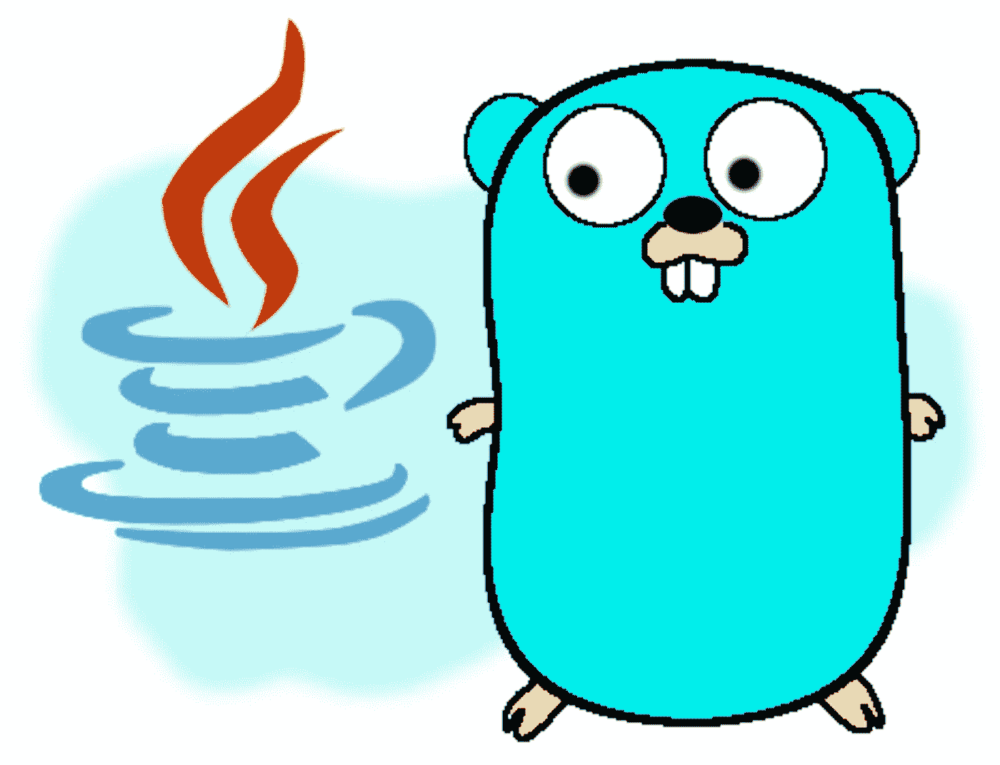

# 面向 Java 开发人员的 Golang 基础知识

> 原文：<https://levelup.gitconnected.com/go-for-java-devs-the-basics-348fa57f4100>

## 从 Java 角度看 Go 编程语言—第 1 部分



作者糟糕的草图

作为一个用 Java 编程的人，我一直认为自己是一个“Java 迷”。当然，作为业界的主流平台之一，Java 有时会被人瞧不起(“它太罗嗦了！”“慢了！”“老了！”)但我个人对这种语言和平台的未来感到兴奋。

也就是说，学习其他语言和技术很重要。所以在我学习谷歌云平台的同时，我也在学习围棋。我的学习方法是[跳过教程](https://medium.datadriveninvestor.com/how-to-write-tutorials-that-actually-teach-f46ae618890f)，直接开始设计和构建我的软件。当然，这有时会很慢，因为我经常需要停下来，看看如何用语言执行各种琐碎的任务。但是过了一小段时间，我觉得我对这门语言的掌握还不错。

所以我决定从一个长期 Java 爱好者的角度，概述一下我对 Go 的看法。事实证明，我有很多想法。所以我把这篇文章分成三部分:

*   这篇文章是第 1 部分，介绍了 Go 的基础知识，主要关注该语言的语法
*   [第 2 部分](https://medium.com/p/493dad0c5129)，涵盖指针、错误处理和并发性
*   [第 3 部分](https://medium.com/p/672597c19ae4)，从编码的实际本质退一步，讨论编译、包和模块，以及内置到 Go core 中的一些高级功能

## 一些需要解决的问题

在我开始之前，让我澄清一些事情。很明显，我对 Java 的熟悉程度远远超过了对 Go 的熟悉程度。所以我会很自然地把 Java 作为一种基线，和 Go 进行比较。这并不意味着一种语言优于另一种语言。然而，这确实意味着我可能会错过一些关于围棋的要点，或者弄错一些细节。在这种情况下，我欢迎任何反馈和纠正；我还在学！

另外，本文有意不冠以“ *Java vs Go，哪个更好？“我现在就告诉你:这两种语言都很好，各有优缺点。我打算放弃 Java 转围棋吗？没有。我会在未来的项目中使用 Go 吗？你打赌。我建议你作为一个 Java 开发人员，学习一些围棋吗？绝对的。*

## 我为什么选择 Go？

最后，有了过多的语言；我为什么选择学围棋？这部分源于 Java 当前的一个弱点:启动时间。在无服务器云产品的世界里——容器是短暂的，可以随时重启——这变得很重要。从像 Spring 这样的重型 Java 框架转移到像 Vert.x 这样的轻型框架肯定会大大缩短启动时间。但是 JVM 启动仍然存在。

Java 社区正在解决这个问题。但还没到那一步。所以与此同时，我想我会探索其他的解决方案。我是强类型编译语言的粉丝(大惊喜？)所以我对学习，比如说，Python，不感兴趣。从这个角度来看，Go——一种编译成本地可执行文件的强类型语言——似乎是一个很好的选择。

至于我在 Go 中开发的东西，它是微服务和网络应用(在 GCP 云上运行)以及少量云功能的结合。

说了这么多，让我们从 Java 的角度来看看 Go。

# 句法

当来自 Java 时，一些语言的语法感觉相当自然。至少在我的经验中，Go 不是这些语言中的一种。这两者之间的差异太大了，需要一点时间来适应。幸运的是，Go 的设计目标是简单易学，我可以说这个目标达到了。新手应该不会花太多时间来熟悉 Go 的语法。

我不会在这里详尽地回顾 Go 的语法，但是我会给出一些重点。

## 类型声明和推理

Go 是强类型的。然而，Go 也能够推断类型(类似于 Java 10 中添加的类型推断，带有`var`关键字)。因此，在声明类型时，类型放在变量名后的*处，就像这样:
`var name string = “Pat”`
这样，类型声明可以很容易地省略。由于*【Pat】*显然是一个字符串，我们可以省略类型声明，比如:
`var name = “Pat”`
`name`仍然很大程度上代表一个字符串。Go 提供了额外的点缀，允许我们省略`var`而使用`:=`赋值操作符:
`name := “Pat”`*

函数(由`func`关键字标识)也将它们的返回类型放在它们签名的末尾，比如:
`func countVowels(s string) int8 { ... }`

和 Java 一样，函数可以返回`void`。但与 Java 中不同的是，`void`关键字不包含在内:
`func setName(p Person, name string) { ... }`

注意，Scala 和 Typescript 等其他语言支持类型推断，因此也将类型定义放在最后。但是那些语言使用冒号(`:`)来分隔变量/函数名和类型，比如:
`powers: number[] = []
showName(inc: number, choice: Choice): void`

Go 的语法允许我们输入更少的字符。但是在使用了这两种方法之后，我希望 Go 采用冒号；它提供了额外的易读性。

## 多种退货类型

Go 允许函数有多个返回值。当调用这样的函数时，我们可以将变量赋给每个返回值。这是一个很棒的特性，而且在你使用几次之后，感觉这是一个很容易的特性。函数签名的返回值采用元组的形式(虽然 Go 在技术上不支持元组类型):

```
func splitName(fullName string) (string, string) { 
  fName := ...
  lName := ... 
  return fName, lName
}
```

当调用代码时，我可以像这样给 firstName 和 lastName 变量赋值:
`fName, lName := splitName(“Pat Smith”)`
然而，请注意，可能不清楚我的`splitName`函数是否打算返回 first name 和 last name。为了帮助解决这种情况，Go 提供了命名返回值:

```
func splitName(fullName string) (firstName, lastName string) { 
  firstName = ...
  lastName = ...
  return  // "return" must be called by itself
}
```

虽然这个特性主要是作为一种隐式文档的形式，但是当与并发结构结合使用时，它也提供了额外的好处。

## 不需要分号

在 Go 中，单行语句不需要分号。哦，Java…你什么时候采用这个规则？！！

## 有点太简单了？

围棋的一个既定设计理念是简单易学。所以设计者保持它的规格最小。这意味着在许多情况下，有一种单一的方法来执行任何特定的功能。

虽然这使得 Go 很容易学习，但我发现在执行普通任务时，它很快就会令人沮丧。虽然 Java 可能有冗长的名声，但它不断添加的特性和语法糖使编程变得不那么乏味，而且——我敢这么说吗？—更讨人喜欢。

典型的例子。假设我们想基于一个布尔条件给一个变量赋值。在 Java 和其他语言中，我们可以使用三元运算符:

```
var speech = (animal.type == Animal.DOG) ? “Woof” : “Blah”;
```

我们直到 Java 12 才开始使用它(即使在那时也只是一个预览特性)，但是我们现在可以使用[开关表达式](https://docs.oracle.com/en/java/javase/13/language/switch-expressions.html)来处理更复杂的表达式:

```
var speech = switch (animal.type) {
  case Animal.DOG -> "Woof";
  case Animal.CAT -> "Meow";
  case Animal.BIRD -> "Tweet";
  default -> "Blah";
}
```

所以我希望 Go——作为一门较新的语言——一开始就有这样的内置表达式。没有这样的运气。我们甚至没有三元运算符。相反，我们必须初始化一个变量，并在一个`if`语句中修改它:

```
var speech = "Blah";
if (animal.Type == DOG) {
  speech = "Woof"
}
```

值得庆幸的是，Go *至少提供了 switch 语句(尽管——同样——没有 switch *表达式*)。*

# 结构和函数，天啊

作为 Java 开发人员，我们习惯于按照对象来思考。作为一种面向对象语言，Java 为我们提供了诸如

*   遗产
*   富类型系统
*   包装

Go 不是一种 OO 语言；它也不假装是。那么 Go 在数据结构方面给了我们什么呢？乍一看，答案似乎是:

*   原始类型和结构
*   用于操作这些基元类型和结构的函数

我心想，“*天哪，这就是我们得到的全部吗？*

幸运的是，事实证明这肯定是我们用 Go 得到的全部。

## 接收器功能=方法

如果你以前使用过结构，你会知道它们代表了特定数据类型的简单记录。例如，这是 Go 中的一个结构:

```
type Team struct {
  id       int8
  name     string
  company  Company
  members  []Person
}
```

它允许我们创建由原始类型(`string`是 Go 中的原始类型)以及其他结构、数组、映射和其他数据类型组成的数据结构。历史上*不允许我们做的事情之一是将*行为*附加到数据结构上。*

*但是结果是，我们*可以*在 Go 中将行为附加到结构上。这是通过*接收器类型*的功能实现的。*

*为了说明这一点，让我们展示如何创建一个普通函数来计算团队成员的数量:*

```
*func countMembers(t Team) int {
  return len(t.members)
}*
```

*要使用这个函数，我必须将一个团队实例传递给这个函数，如下所示:*

```
*var c = countMembers(t)*
```

*不可怕，但也不特别自然，尤其是对我们 Java 开发人员来说。幸运的是，我可以重写函数，将 Team 作为*接收者*:*

```
*func (t Team) countMembers() int {
  return len(t.members)
}*
```

*`Team`结构现在是`countMembers()`函数的接收者，我现在可以在`Team`的实例上调用它作为方法:*

```
*var c = t.countMembers()*
```

*这使得我们可以像操作对象一样操作结构体，使编码感觉更自然(并且在使用 IDE 的自动完成功能时帮助很大)。)*

****那么接下来，围棋应该给我们扩展方法了吧？虽然接收函数允许我们调用数据结构上的方法，但是我们声明它们的语法有点笨拙。在 Java 中，我们在类声明中包含字段和方法，使我们的类定义具有内聚性。在 Go 中，我们的“方法”是在我们的结构定义之外声明的，有效地将我们的数据与其逻辑分离开来。对我来说，这使得易读性和维护变得不必要的困难。****

*事实上，语法是如此的笨拙，我开始怀疑它背后是否有意图。我想:*嘿，也许 Go 允许我们创建扩展方法！**

*[扩展方法](https://en.wikipedia.org/wiki/Extension_method)是 C#、Scala、Objective-C 和 Swift 等其他语言中的一个有用特性。实际上，通过扩展方法，我们可以将新方法添加到现有的类中，甚至是第三方库中的类。我认为 Go 的接收函数语法会使扩展方法成为语言的一部分。*

*不幸的是，Go 不允许当前模块之外的结构使用接收函数。因此，Go 中没有扩展方法。*

## *接口*

*Go 允许我们定义接口。Go 的接口类似于 Java 和其他语言'；它们只是定义了一组方法签名。与 Java 不同，struct 不需要(事实上，*不能*)显式声明它实现了一个接口。如果该结构实现了接口中定义的所有方法，那么它隐式实现了该接口。*

*例如，我们可以创建以下接口:*

```
*type WithMembers interface {
  countMembers() int
}*
```

*我们前面的`Team`结构现在将自动隐式实现该接口。*

*你可能会问:*这是否意味着编译器不能强制接口实现？*嗯，当`Team`本身是*编译的*时，编译器无法验证`Team`实现了`WithMembers`。但是当`Team`被*用作*时，编译器会验证它。*

*例如，如果我有一个函数:
`func iterateOverMembers(w WithMembers) { ... }`
并且我这样调用它:*

```
*var t Team = ...iterateOverMembers(t)*
```

*编译器将确保`t`的类实现`WithMembers`中定义的所有方法签名。如果我将`WithMembers`中定义的方法改为类似`countAllMembers() int`的方法，那么上面的代码片段将无法编译。*

*我仍然没有决定我认为这是一个好主意还是坏主意(也许两者都是？)一方面，它消除了可能是不必要的声明，并帮助我们避免了一长串结构上的“实现”。另一方面，我想知道这是否会使维护变得更加困难，特别是如果我们修改我们的接口定义(比方说，通过添加新的方法签名)。*

*我还发现，这使得浏览和推理现有代码变得更加困难。例如，当我探索各种 Go 核心语言模块时，我发现自己必须记下某些结构打算实现哪些接口，以帮助自己理解整体代码结构。*

## *构造函数？*

*Go 结构不能有显式构造函数。要创建一个结构的实例，我们只需这样声明它:*

*`t := Team{123, “My Team”, abcInc, [],}`*

*我们也可以使用命名参数:*

*`t := Team{id: 123, name: “My Team”, company: abcInc, members: [],}`*

*使用命名参数有助于代替构造函数重载。如果省略了任何字段，那么这些字段将被初始化为它们的缺省零值(或者，如果该字段被声明为接口或指针，则为 nil)。所以如果我写*

*`var t = Team{ name: "Your Team"}`*

*`*t*`将代表一个带有`id=0`、`name="Your Team"`、一个空的`member`数组和一个被初始化为其自身缺省零值的`Company`的团队。*

*您可能会注意到，很有可能在非法状态下初始化结构；结构不提供在创建新实例之前验证特定字段是否正确初始化的机制。出现了一些成语来反驳这种说法，它们各有利弊。*

# *访问控制(或者，“没有任何命名约定吗？”)*

*当我第一次开始阅读 Go code 时，我对命名约定缺乏一致性感到震惊。具体来说，在命名接口、结构、变量和函数时，对于使用大写还是小写，似乎没有达成共识。仅仅这个事实就使得阅读 Go 代码比阅读 Java 代码要困难得多。例如:*

```
*func Run() {
  strategy := establishStrategy()
  teamRepo = repository.MakeTeamRepo(strategy) var tErr error
  Tmpl, tErr = template.ParseFS(Assets, "assets/index.html")
  if tErr != nil {
    log.Fatal(tErr)
  } router := mux.NewRouter()
  router.HandleFunc("/add", addHandler)
  if err := http.ListenAndServe(":8080", router); err != nil {
    log.Fatal(err)
  }
}*
```

*这是有原因的:Go 使用大小写来控制访问。Java 提供了`public`、`protected`和`private`修饰符(以及默认的说明符)，而现在，Java 9、*模块* —Go 提供了大写和小写。大写命名的元素被导出到它们的包之外，因此是可访问的；小写名字的就不是了。*

*简单？当然可以。但是好像有点…怪怪的。它也有一些缺点。*

## *易辨认*

*正如我提到的，大写和小写的搭配会影响可读性。Java 和大多数其他语言已经建立了命名约定，使得阅读代码更加容易。类名以大写字母开头，变量和方法名以小写字母开头，常量全部大写。*

*Go 的方法，IMHO，使得代码更加难以阅读。当然，一旦你使用 Go 一段时间，代码会变得更容易阅读。*

## *可量测性*

**

*我们的小猫 Spitfire 在被贴上绝育标签后(来源:我)*

*几年前，我家领养了一对小猫。我们收养它们的地方有一个有趣的方法来追踪哪些小猫已经绝育:他们剪下绝育小猫的左耳尖。*

*现在，除了看起来有点残忍(收养中心发誓动物们根本没有注意到少了一点耳朵)，这让我觉得是一个完全不可扩展的解决方案。毕竟，猫只有两只耳朵。如果收养中心需要开始追踪小猫病史的其他部分，它们很快就会失去耳朵(而且，我希望，它们不会转移到身体的其他部位)。*

*我对 Go 使用字母大小写来指定访问控制也有类似的反应。有两种选择:大写或小写。没有中格或超级小写。因此，Go 仅限于全局可访问的元素或仅限于其包的元素。它不能提供更细粒度的控制。*

## *可变性*

*可维护性也会受到影响。在 Java 中，如果我们决定修改一个变量的访问限制，我们只需要修改一个关键字。在 Go 中，我们实际上需要重命名变量。当然，这没什么大不了的，考虑到编译器应该捕捉任何未命中，大多数 ide 会提供*重命名*重构帮助。尽管如此，在我看来，除了提高清晰度之外，我们还需要为变量重新命名。*

# *其他现代语言特征*

## *不变*

*关于 Go 是否提供不可变数据结构的讨论比比皆是。例如，Java 通过`final`修饰符提供了不变性——虽然有点笨拙。较新的语言为创建不可变字段提供了更自然的机制。例如，Scala 允许我们定义`val` s(不可变字段)以及`var` s(可变字段)。*

*Go 没有提供这样的构造。例如，每个字段都是一个`var`，所以理论上，每个字段都是可变的。Go 确实提供了一个`const`关键字来创建常量值，但是这并不适用于结构；它仅用于定义全局常量。*

*然而，Go 确实提供了限制我们改变数据能力的方法。*

*   *如前所述，对以小写字母命名的字段的访问仅限于该字段所在的模块。因此，通常用小写首字母命名字段，然后提供大写的“getter”函数，如下所示:*

```
*type MyStruct struct {
  var secret string  // not accessible outside of MyStruct's module
}func (ms MyStruct) Secret() string {  // accessible everywhere
  return ms.string
}*
```

*   *结构是通过复制传递的(除非，正如我们后面将要讨论的，我们显式地传递指针)。这意味着我们通常在应用程序代码中处理我们自己的结构的本地副本。我们可以修改副本的字段，但是这些修改对原始结构没有影响。*

## *零安全*

*人们还会问 Go 是否是空安全的。同样，答案是一个四舍五入的“差不多”。结构和基元不能为空；在最坏的情况下，它们将被初始化为它们的缺省零值。*

*然而，其他类型可以为 null(或者更确切地说， *nil* )。这包括指针、接口、映射、数组和通道。*

## *枚举*

*枚举是 Go“差不多”拥有的另一个特性。围棋中没有*枚举*类型。然而，有一个结构叫做 *iota* 。iota 本质上是一个表示自动递增整数的关键字。无论何时声明它，它都会发出序列中的下一个整数。`iota`设计用于声明常量，每当关键字`const`出现时，它的值重置为`0`。*

*`iota`常用于模拟围棋中的枚举。这里有一个例子:*

```
*type Animal int  // we've created a type aliasconst (
  Dog Animal = iota
  Cat
  Fish
  Bird
)func printAnimal(a Animal) {
  log.Printf("Animal index = %d", a)func test() {
  printAnimal(Dog)   // Animal index = 0
  printAnimal(Cat)   // Animal index = 1
  printAnimal(Fish)  // Animal index = 2
  printAnimal(Bird)  // Animal index = 3
  printAnimal(99)    // Animal index = 99
}*
```

*请注意以下几点:*

*   *我们声明`Animal`类型的常量。`Animal`实际上只是`int`的别名，为了提高易读性/自文档化。*
*   *我们创建的每个`Animal`常量都被赋予一个递增的`int`值。*
*   *没有什么可以阻止我们传递任意的`int`来代替`Animal`。*

*最后一点相当重要。如果我们创建一个期望我们的常量之一的函数(比如我们的`printAnimal()`函数，它期望一个`Animal`)，我们不能强制我们的一个预定义值(`Dog`、`Cat`、`Fish`或`Bird`)实际上被传递。*

*此外，在 Java 和其他语言中，我们不会自动获得我们所期望的枚举功能。例如，没有每个常数都有标签的概念:*

*`log.Printf(“Label of Dog is %s”, Dog.Label()) // can’t do this`*

*当然，我们可以创建自己的函数来实现这一点:*

```
*func (a Animal) Label() string {
  switch a {
    case 0: return "Dog"
    case 1: return "Cat"
    case 2: return "Fish"
    case 3: return "Bird"
    default: "I don't know"
  }
}*
```

*但是这需要我们手工操作和手工维护。*

## *无商标消费品*

*我仍然记得在 5 之前用 Java 编程，在泛型被包含之前。即使没有在任何其他语言中使用过泛型，我也能清楚地感觉到对这种构造的需要。现在，我无法想象没有它们的编程。*

*所以如果你和我一样，你可能会问:*Go 支持泛型吗？答案是——在我写这篇文章的时候——还没有，但是会的。**

*与此同时，你不会感到像你想象的那么痛。Go 缺乏对象层次结构，这消除了对泛型的需求。Go 的核心库没有像 Java 那样的集合框架，这一事实也是如此。相反，它提供了数组、切片(其行为类似于可变数组)和映射:由它们包含的数据类型定义的容器。*

*尽管如此，仍有明确的用例需要泛型。例如，我试图创建一个非常简单的表单(或者应该是结构关系映射器(T21)？)作为我的数据访问代码。我发现如果不严重依赖空的接口声明(`{}`，这实质上相当于 Go 简单地将某个东西声明为`Object`)，我就是做不到。我把那个项目放到一边，直到 Go 1.18 发布。*

## *一流的功能*

*Go 中的函数是一级构造。这意味着我们可以将函数赋给变量，将函数传递给其他函数，或者从其他函数返回函数。我们还可以创建匿名函数(如果需要，可以立即执行它们)。这意味着 Go 允许我们做的事情至少和 Java Lambdas 允许我们做的一样多。*

*下面我们来看看一些用途:*

```
*type mathOp func(a int, b int) intfunc op(m mathOp, x int, y int) {
  log.Printf("Op result is %d", m(x, y))
}func main() {
  var add mathOp := func(a int, b int) int {
    return a + b
  }
  var mult mathOp := func(a int, b int) int {
    return a * b
  }
  op(add, 2, 4)
  op(mult, 2, 4) func(a float32, b float32) {
    log.Printf("Op result is %f", a / b)
  }(2.25, 4.25)
}// prints:
Op result is 6
Op result is 8
Op result is 0.529412*
```

*上面，我们定义了一个名为`mathOp`的函数 *type* (把它想象成一个描述函数的接口)，它接受两个 int 并返回一个 int。接下来，我们创建一个名为`op`的函数，它接受一个`mathOp`，以及两个 int 操作数: *x* 和 *y* 。`op`将依次通过将`x`和`y`参数传递给`mathOp`来执行`mathOp`参数中传递给它的函数。*

*在我们的`main`函数中，我们创建了两个变量，`add`和`mult`，每个变量都符合我们刚刚定义的`mathOp`类型。然后，我们可以将每一个和两个任意操作数一起传递给`op`函数。*

*最后，我们将利用 Go 尚不支持泛型的事实来演示匿名函数。因为我们想在除法运算中使用浮点数，所以我们将创建一个一次性的匿名函数。然后我们通过传递参数立即调用它(即`(2.25, 4.25)`)。*

# *让我们继续前进*

*在本系列的下一篇文章中，我们将讨论一些真正区别于 Java 的地方:指针、错误处理和并发性。*

*觉得这个故事有用？想多读点？只需[在此订阅](https://dt-23597.medium.com/subscribe)即可将我的最新故事直接发送到您的收件箱。*

*你也可以支持我和我的写作——并获得无限数量的故事——通过[今天成为媒体会员](https://dt-23597.medium.com/membership)。*