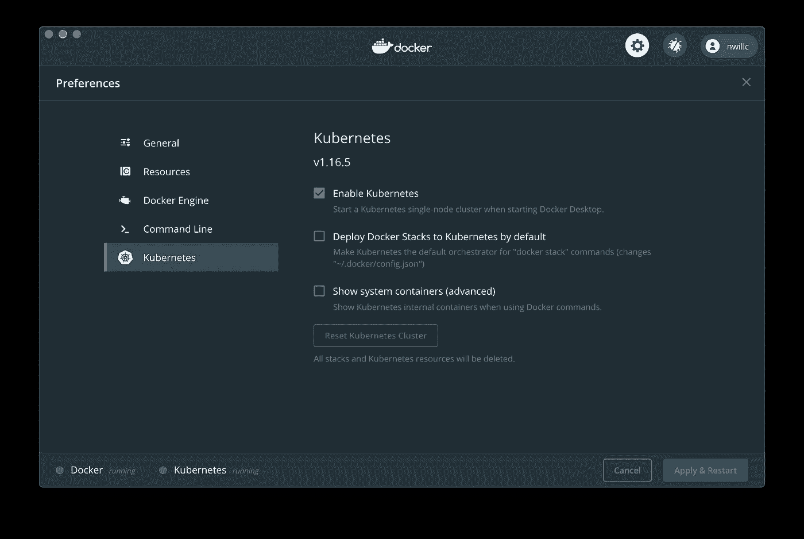
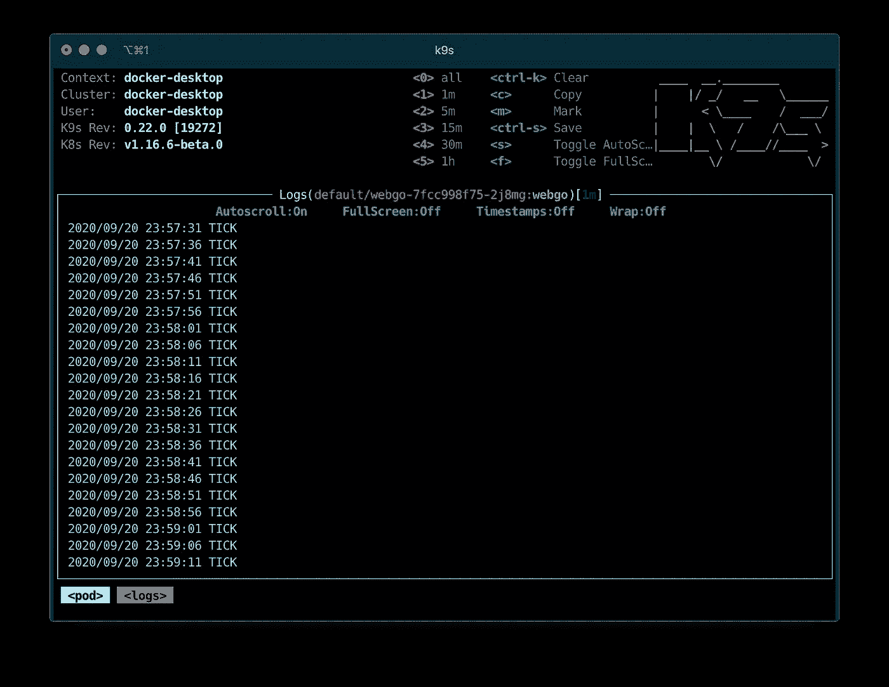

# Go: Helm，Kubernetes & Docker 桌面

> 原文：<https://levelup.gitconnected.com/go-helm-kubernetes-docker-desktop-bf59f4eb9e9d>


乔希·里德在 [Unsplash](https://unsplash.com?utm_source=medium&utm_medium=referral) 上的照片

我想在工作中真正理解 Go 代码到产品的流程。我看了看他们所有的 [IaC](https://en.wikipedia.org/wiki/Infrastructure_as_code) 代码，被淹没了——涉及这么多工具，这么多配置。所以我做了代码猴子的事情，走到一个黑暗的角落，自己实现了*最小的*来学习。

这是一篇很长的文章，但是请坚持下去，查看一下[相关的库](https://github.com/nwillc/webgo)，您将能够创建一个程序并将其部署到您自己的机器上的 Kubernetes 集群中——不会太差。

# 这个计划

这里的总体课程计划是在一台 Mac 上实现:

*   写一个简单的围棋程序
*   把它放进码头集装箱
*   使用头盔将容器放入 Kubernetes

我们将继续介绍上述每一项的其他具体目标。

# 先决条件

我们需要一堆工具，所有这些工具的最新版本都应该可以工作，但是我找到了:

*   Docker 桌面
*   戈朗 1.15.1
*   掌舵人 3.3.3
*   kubectl 1.19.2
*   kubectx 0.9.1

# 获取先决条件

对于 Docker Desktop，只需访问他们的网站并做必要的事情。我抓住了*边缘*但是*稳定*应该工作正常。对于所有其他人来说，有很多方法来处理安装，但我将推荐一个我喜欢的一站式购物解决方案— [asdf](https://asdf-vm.com/#/core-manage-asdf) 。是的，又一个安装工具！值了。前往他们的[安装指南](https://asdf-vm.com/#/core-manage-asdf?id=install)并做必要的工作。asdf 就位后:

```
asdf plugin-add golang [https://github.com/kennyp/asdf-golang.git](https://github.com/kennyp/asdf-golang.git)
asdf install golang 1.15.1asdf plugin-add helm [https://github.com/Antiarchitect/asdf-helm.git](https://github.com/Antiarchitect/asdf-helm.git)
asdf install helm 3.3.3asdf plugin-add kubectl [https://github.com/Banno/asdf-kubectl.git](https://github.com/Banno/asdf-kubectl.git)
asdf install kubectl 1.19.2asdf plugin add kubectx
asdf install kubectx 0.9.1# Go to the directory you'll be working in...
asdf local golang 1.15.1
asdf local helm 3.3.3
asdf local kubectl 1.19.2
asdf local kubectx 0.9.1
```

完成了。我为什么主张 *asdf* ？因为它允许您轻松地维护多个版本，并且对于这些工具，不同的项目将有非常具体的版本要求，我不想为整个机器强加一个单一的版本

# 拿到回购

我在所有这些工作中使用的 repo 在 GitHub 上( [nwillc/webgo](https://github.com/nwillc/webgo) )。我将从头到尾引用它，并且我涉及的一些内容更加精炼，所以如果您打算在我们进行的过程中一起玩，我会抓住它。

# 写一个简单的围棋程序

我想要一个可以在 Kubernetes 运行的非常简单的围棋程序。我想从它那里得到的只是读取一些配置值，然后继续运行，将周期性的*滴答*消息记录到它的日志中。

首先:

```
# Create a directory to work in:
mkdir webgo
cd webgo# Define the version of Go
echo golang 1.15.1 >> .tool-versions# Let asdf set up Go for us
cd .# Get Go Modules kicked off:
go mod init github.com/nwillc/webgo
```

好了，我们已经建立了项目文件夹，并进入其中。下面是一个简单的程序， *main.go:*

因此，上面的代码访问一个环境变量，每五秒钟调用一次 goroutine 来记录*消息*，然后在端口 8888 上设置一个 HTTP 响应器，以允许 Kubernetes 或您对其进行健康检查。

让我们构建并测试它:

```
$ go build
$ CONFIG_MESSAGE=tick ./webgo
2020/09/20 13:13:07 tick
2020/09/20 13:13:12 tick
```

# 码头集装箱

现在我们需要将 Go 程序放入 docker 容器中。我的目标是构建二进制文件并放到容器中。许多基于 Go 的容器使用了 [*多阶段构建*](https://docs.docker.com/develop/develop-images/multistage-build/) ，但是我特别想使用一个外部构建的二进制文件，因为那是我自己想要的。

因此，首先我们需要将 Go 构建为适用于容器的二进制文件:

```
*$ rm* -rf bin/amd64/webgo
$ GOOS=linux GOARCH=amd64 CGO_ENABLED=0 go build -o bin/amd64/webgo
```

这将构建一个 *amd64* 架构 *linux* 二进制文件，并将其输出到`bin/amd64/webgo`。现在我们需要一个`Dockerfile`来创建容器:

```
*FROM* alpine:3.12.0
*ADD* .*/*bin*/*amd64*/*webgo */*go*/*bin*/*webgo
*ENTRYPOINT /*go*/*bin*/*webgo
```

这就是全部。让我们构建它，另外*给*标记一个版本号以备将来参考:

```
*docker* build -t ***nwillc***/webgo:***1.0.0*** -f Dockerfile .
```

容器映像将被构建，命名为 *nwillc/webgo* 并标记为版本 *1.0.0* 。现在，让我们来测试一下:

```
$ docker run -e CONFIG_MESSAGE=ping **nwillc**/webgo:1.0.0
2020/09/20 17:47:18 ping
2020/09/20 17:47:23 ping
^C%
```

好的，这样码头工人就可以运行我们的集装箱了！

# 使容器可用

虽然您可以从本地 docker 服务器运行容器，但 Helm 希望从存储库中提取容器。最简单的方法是建立一个 Docker Hub 账户并使用它。所以去那里创建一个免费账户吧。我在那里的用户名是 *nwillc* ，这就是为什么我的容器名以`nwillc/`开头，但是你会想用你创建的那个替换它。

现在让我们将容器推到 docker hub:

```
$ docker login
*Login with your Docker ID to push and pull images from Docker Hub. If you don't have a Docker ID, head over to* [*https://hub.docker.com*](https://hub.docker.com) *to create one.
Username:* ***nwillc*** *Password:
Login Succeeded*$ *docker* push **nwillc**/webgo:1.0.0
*Successfully tagged nwillc/webgo:1.0.0
The push refers to repository [docker.io/nwillc/webgo]
8331a716ff6a: Pushed
e04313dfc306: Layer already exists
50644c29ef5a: Layer already exists
1.0.0: digest: sha256:6253c09bea106ce240ff64b9f9c6a076cd7a16bd33fa17de12efd60d3a2c43ef size: 950*
```

好了，现在您的容器映像可以从 docker hub repo 获得了！

# **舵和海图**

Helm 是 Kubernetes 的产品包经理。我们将使用它将我们的容器从 docker hub 部署到我们的 Kubernetes 集群。Helm 使用*图表*来定义一个包及其部署。由于库伯内特斯非常丰富和复杂，所以是头盔。我不打算尝试并详尽地介绍 Helm，但让我们来看一下基础知识。

首先，开始创建你的舵图:

```
$ mkdir charts
$ cd charts
$ helm create webgo
```

这将创建一个名为`webgo`的目录，其中有一个初始的*图表*。那是我开始的地方，但是我把它们剥离了很多。让我们来看看我的变化:

*   我删除了`templates/tests`文件夹，因为我们这里不需要它。
*   我删除了`templates/hpa.yaml`,因为它不会自动缩放。
*   我添加了`templates/_flattenmap.tpl`来提供一个实用程序，将地图中的 YAML 值转换成适合环境变量的字典——稍后会详细介绍。
*   我修改了`Chart.yaml`、`values.yaml`和`templates/deployment.yaml`。

要查看我的所有变化，请查看[我的回购图表](https://github.com/nwillc/webgo/tree/master/charts)，以下是重点。

*   在`Chart.yaml`中，我为图表设置了*版本*，并将 *apiVersion* 设置为对应于我的 docker 容器标记版本( *1.0.0* )。
*   在`values.yaml`中，我将*存储库*设置为与容器的 docker hub repo(*nwillc/webgo*)相对应，并将 I changer *端口*关联到我们的应用程序端口( *8888* )。
*   在`templates/deployment.yaml`中，我再次更改了*容器端口*来关联我们的端口( *8888* )，并添加了一点魔法:

```
imagePullPolicy: {{ .Values.image.pullPolicy }}
env: {{ list .Values.config "CONFIG" | include "flattenmap" | nindent 12 }}
ports:
```

在*imagepulpolicy*和*端口*之间以 *env* 开始的行使用我们添加的 *flattenmap* 实用程序。它将在我们的 helm 值中查找所有名为 *config* 的 YAML 地图，并将内容转换为程序可以在 Kubernetes 中访问的环境变量！因此，当您稍后运行 helm 并添加命令行参数`--values config.yaml`时，一个 YAML 文件如下所示:

```
config:
    message: "Ping!"
    database:
      name: "server.name.com"
      port: 2056
```

会向您的程序公开以下环境变量:

```
CONFIG_MESSAGE=Ping!
CONFIG_DATABASE_NAME=server.name.com
CONFIG_DATABASE_PORT=2056
```

这将让我们为我们的程序提供一个基于文件的配置，而无需将文件移动到容器中！

# 开始你的 Kubernetes

要让 Kubernetes 在本地运行，只需在 Docker 桌面*偏好设置*中打开它:



让它做它该做的事。重启后，让我们看看它是否启动了:

```
$ kubectx docker-desktop
*Switched to context "docker-desktop".*
$ kubectl get namespaces
*NAME              STATUS   AGE
default           Active   3d20h
docker            Active   3d20h
kube-node-lease   Active   3d20h
kube-public       Active   3d20h
kube-system       Active   3d20h*
$ kubectl -n kube-system get pods
*NAME                                     READY   STATUS    RESTARTS   AGE
coredns-5644d7b6d9-22pbx                 1/1     Running   0          3d21h
coredns-5644d7b6d9-b68tx                 1/1     Running   0          3d21h
etcd-docker-desktop                      1/1     Running   0          3d21h
kube-apiserver-docker-desktop            1/1     Running   0          3d21h
kube-controller-manager-docker-desktop   1/1     Running   0          3d21h
kube-proxy-p6qdv                         1/1     Running   0          3d21h
kube-scheduler-docker-desktop            1/1     Running   0          3d21h
storage-provisioner                      1/1     Running   0          3d21h
vpnkit-controller                        1/1     Running   0          3d21hIf you see something similar, you’ve got a cluster up and running!*
```

看到类似的东西，您就有了一个正在运行的集群！

# 用头盔展开

因此，我们有一个程序，它在一个容器中，该容器被推送到一个存储库，Kubernetes 是可用的，我们有一个掌舵图准备就绪。我们来验证一下:

```
# Got the binary?
$ ls bin/amd6
*webgo*# Got a container?
$ docker image ls | grep webgo
*nwillc/webgo     1.0.0   c6d89abedb96    6 hours ago    14.3MB**# Is it pushed?
$* curl [https://hub.docker.com/v2/repositories/nwillc/webgo/tags](https://hub.docker.com/v2/repositories/nwillc/webgo/tags)
*{"count":1,"next":null,"previous":null,"results":[{"creator":359475,"id":118144715,"image_id":null,"images":[{"architecture":"amd64","features":"","variant":null,"digest":"sha256:6253c09bea106ce240ff64b9f9c6a076cd7a16bd33fa17de12efd60d3a2c43ef","os":"linux","os_features":"","os_version":null,"size":8256287}],"last_updated":"2020-09-20T19:07:51.630637Z","last_updater":359475,"last_updater_username":"nwillc","name":"1.0.0","repository":9856000,"full_size":8256287,"v2":true}]}*# Kubernetes is running? We checked that above...# Got our charts?
 $ ls -1R charts
*webgo**charts/webgo:
Chart.yaml
templates
values.yaml**charts/webgo/templates:
NOTES.txt
_helpers.tpl
deployment.yaml
flattenmap.yaml
ingress.yaml
service.yaml
serviceaccount.yaml*
```

让我们配置最后一位。还记得掌舵图表中的*配置 _ 消息*变量和*环境*子句吗？让我们来设置一下:

```
$ cat <<! > config.yaml
config:
  message: "BEEP"
!
```

好的，我们准备好了。但是让我们先检查一下:

```
*$* helmupgrade --install --values config.yaml webgo --dry-run --debug ./charts/webgo
```

这将把所有东西缝合在一起，并向您显示输出。假设我们都很好:

```
*$* helmupgrade --install --values config.yaml webgo ./charts/webgo
*Release "webgo" does not exist. Installing it now.
NAME: webgo
LAST DEPLOYED: Sun Sep 20 22:54:24 2020
NAMESPACE: default
STATUS: deployed
REVISION: 1
TEST SUITE: None
NOTES:
1\. Get the application URL by running these commands:
  export POD_NAME=$(kubectl get pods --namespace default -l "app.kubernetes.io/name=webgo,app.kubernetes.io/instance=webgo" -o jsonpath="{.items[0].metadata.name}")
  echo "Visit* [*http://127.0.0.1:8080*](http://127.0.0.1:8080) *to use your application"
  kubectl --namespace default port-forward $POD_NAME 8080:80*
```

成功了吗？

```
$ helm ls
*NAME  NAMESPACE REVISION UPDATED                              STATUS   CHART       APP VERSION
webgo default   1        2020-09-20 22:54:24.523039 -0400 EDT deployed webgo-1.0.0 1.0.0*
```

赫尔姆是这样认为的。库伯内特公司有吗？

```
$ kubectl get pods
*NAME                     READY   STATUS    RESTARTS   AGE
webgo-67b895b98b-jd2tw   1/1     Running   0          3m45s*
```

检查日志…

```
$ kubectl logs webgo-67b895b98b-jd2tw
2020/09/21 02:54:30 BEEP
2020/09/21 02:54:35 BEEP
2020/09/21 02:54:40 BEEP
2020/09/21 02:54:45 BEEP
```

我们能从外面进入程序吗？

```
$ kubectl get services webgo
*NAME  TYPE       CLUSTER-IP       EXTERNAL-IP   PORT(S)          AGE
webgo NodePort   10.106.214.152   <none>        8888:30090/TCP   21m*
$ curl [http://localhost:30090](http://localhost:30090)
*ACK*
```

成功了。首尾相连。搞定了。看一下 repo 的 README.md，查看任何更新和执行我手动描述的步骤的脚本。

# 奖励积分:k9s

想要一种简单的方法来查看您的 Kubernetes 集群吗？轻松观看您的程序日志！Get *k9s* ！



它可以让你忘记 *kubectl* 的神秘命令。为此安装 *asdf* :

```
$ asdf plugin-add k9s [https://github.com/looztra/asdf-k9s](https://github.com/looztra/asdf-k9s)
$ asdf install k9s 0.21.1
$ asdf global k9s 0.21.1
```