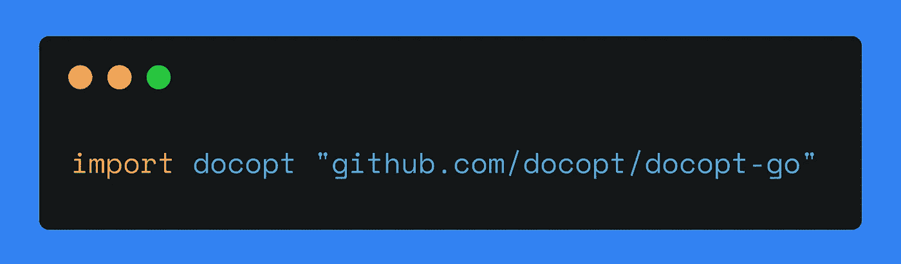

# 探索 Go 包:Docopt

> 原文：<https://levelup.gitconnected.com/go-libraries-docopt-9205414e75e9>

## 在本教程中，我们将介绍 Docopt 中的基本概念和帮助消息。您将了解一个您现在就可以编写代码的实际用例。



我的一张照片

# 简要介绍 Docopt

[Docopt](http://docopt.org/) 是一种命令行界面描述语言。它有许多不同编程语言的实现。在本教程中，我们将讨论 Go 版本: [Docopt Go](https://github.com/docopt/docopt.go) 。

这个库使程序员能够用结构良好的帮助消息来描述程序接口。

# 开始之前

使用以下命令在您的计算机上安装 Docopt:

```
$ go get -u -v github.com/docopt/docopt.go
```

*-u 标志指示 go get 使用网络来更新已命名的包及其依赖项。默认情况下，get 使用网络来检查丢失的包，但不使用它来查找现有包的更新。*

*-v 标志启用详细进度和调试输出。*

*参见本* [*资源*](https://golang.org/pkg/cmd/go/internal/get/) *了解更多关于 go get 命令的信息。*

将库导入您的*。按如下方式转到文件:

```
import docopt “github.com/docopt/docopt-go”
```

# 撰写帮助信息

帮助消息(或*用法消息*，或*文档*)是用户在

*   调用程序，
*   键入类似于`--h`或`-h`的标志，
*   键入无效的参数。

该消息包括程序的名称、用途和选项。如果您使用命令行，您已经熟悉帮助消息或用法消息。在 Linux 中，你通常可以输入`program --help`来获得程序可接受的参数列表。

在本教程中，我们为一个程序编写了一条帮助消息，它输出:

*   指定数量和范围的随机数列表，或
*   特定数量和语言的随机字母列表。

这是我们的使用信息:

让我们分析前面消息中的命令 numbers:

`randx numbers --count <count> [--range <range>...]`

*   `randx` —一个程序的名字，
*   `numbers` —一个命令，
*   `--count` —该命令的一个选项，
*   `<count>` —选项的一个值—计数，
*   `[--range <range>…]` —需要一个或多个值的可选参数。
*   `[--verbose]` —可选标志。

我们有两个命令，`numbers` 和`letters` ( *布尔*)，分别启用数字或字母模式。如果其中一个是*真*，另一个是*假*。

`numbers`和`letters`命令都需要`— count` *(int)* 选项。该程序输出一个指定计数的数字或字母列表。

`$ randx numbers --count 1`

`$ randx letters --count 1`

声明可选参数`--range` *(【字符串】)*我们用方括号。方括号中的三个点表示您可以向命令提示符传递几个参数。举个例子，

`- — range 1,10 --range 1,11`或
或`--range 1-10 --range 1-11`或
或`--range 1:10 --range 1:11`

此选项设置随机数的范围。如果有两个参数，程序将输出两个具有指定范围的列表。

可选参数，`--lang` 、*(字符串)、*也在方括号*中。*选项接受一种语言。因此，程序输出指定语言的字母。

当未设置必需选项和/或参数无效时，程序必须返回帮助消息。`--range`和`--lang`选项都可以省略。

同样，我们有三个选项(或者只有*标志*)在用法信息中没有操作数:

*   `-h / --help` —输出使用信息，
*   `--verbose` *—* 输出一个程序做什么的细节；该标志用于通知用户程序实际做了什么，包括执行所需操作时的错误。这有助于解决问题。
*   `--version` —输出您使用的程序版本。

# 编写代码

Docopt 可以解析结构中的所有命令行参数。为了实现这一点，创建一个新的结构，将其命名为 config，并根据前面讨论的文档定义所有字段:

在这个结构中，我们指定了每个命令、标志和选项。如果您想声明短选项名和长选项名，请键入
`docopt:"-short_name,--long_name".`例如:`docopt:"-c,--count".`

在 var()部分声明您的帮助消息:

用`docopt.ParseArgs()`方法解析参数。返回值是一个包含所有参数的映射。然后，将映射绑定到给定的结构。当程序初始化时，我们需要解析所有的参数。

我们将程序的版本指定为`docopt.ParseArgs(usage, nil, "version_is_here")`方法中的最后一个参数。当选项`--version`被调用时，程序打印版本。

若要访问结构字段，请使用点:

# 用法

在本节中，您可以找到在命令行中使用 Docopt 的几种情况。

## 字母模式

```
$ go run main.go letters --count 9 
$ go run main.go letters -c 9letters: true
--count: 9
--lang:
--verbose: false$ go run main.go letters --count 9 --lang en 
$ go run main.go letters -c 9 -l enletters: true
--count: 9
--lang: en
--verbose: false
```

## 数字模式

```
$ go run main.go numbers --count 9 
$ go run main.go numbers -c 9numbers: true
--count: 9
--range: []
--verbose: false$ go run main.go numbers --count 10 --range 9,10 
$ go run main.go numbers -c 10 -r 9,10numbers: true
--count: 10
--range: [9,10]
--verbose: false$ go run main.go numbers --count 10 --range 9,10 --range 0,15numbers: true
--count: 10
--range: [9,10 0,15]
--verbose: false
```

## 冗长

```
$ go run main.go numbers --count 18 --range 9,19 --verbose 
$ go run main.go numbers -c 18 -r 9,19 --verbosenumbers: true
--count: 18
--range: [9,19]
--verbose: true
```

# 关于作者

Jane 是一名围棋程序员和软件工程方面的技术作家。她已经用英语和俄语写了 5 年的技术资料。她从新西伯利亚国立技术大学获得了信息安全专业学位，专攻自动化系统的信息安全。你可以在 [*Twitter*](https://twitter.com/enthusiastic_io) *上关注她，在*[*publications . excellent . io*](https://publications.enthusiastic.io/)*上看她的其他文字作品。*