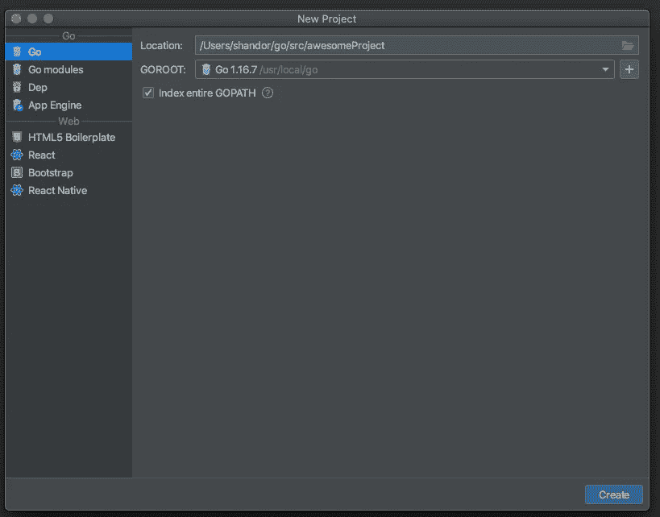

# Goland 中的 Go 模块

> 原文：<https://levelup.gitconnected.com/go-modules-in-goland-8af712adbcc6>

你到底是怎么做到的？

我想在这篇文章的开头明确声明我是 Golang 和 Goland 的新成员。我喜欢 Jet Brains IDE 支持如此多的语言，尤其是 Pycharm。我怎么推荐他们的产品都不为过。所以我真的很想让 Goland 开始工作。我写这个是为了帮助我记下一个过程，希望对你有所帮助。

# 问题是

目前，围棋模块相对较新，JB 对它们的实现甚至更新，他们的在线文档已经过时，他们的[教程](https://www.youtube.com/watch?v=AufkDPEI2qA)不值得一看，他们做出了一个糟糕的决定，将他们的围棋 IDE 命名为与围棋的官方名称相似。因此，当你正在使用的语言被称为 *Golang* 时，让你的搜索结果集中在 *Goland* 附近是很困难的。这导致了我的愤怒和沮丧(因此，介绍图片)。

除了我的朋友 Richard(令人惊叹的用于 crypto 的 box wallet 的开发者)的帮助之外，还有两篇关于 Go 模块的文章，我发现它们真的很有帮助，但都没有关注 Goland 的实现。所以“感谢”Jody LeCompte 和 Ulas Turkmen 的努力！后一篇文章是在当时真正吸引我的一个域名。

# 开始

你已经下载了 Goland 并安装好了(我在 Mac 上，只能假设 Windows 体验差不多)。所以，选择文件->新建… ->项目，你得到这个窗口。

嗯，我不知道你怎么想，但是我对我所有的项目都有自己的文件结构，用我工作的所有语言。所以那个位置对我来说不合适。我发现使用像“golandmodules”这样的名字变得令人困惑，因为很难确定什么是独特的，什么是过程的需求。所以…

我们要做一个名为“footodor”的项目。按下“创建”按钮。现在您得到一个项目窗口，项目结构在左侧。让我们按照推荐的[标准 Go 项目结构](https://github.com/golang-standards/project-layout)，创建他们推荐的两个文件夹，cmd 和 internal。您可以通过右键单击“footodor”项目名称并创建这些目录来完成此操作。

接下来才是真正让我燃烧的一步。(对我来说)如何用 Goland 接口做到这一点并不明显。在我看来，这就应该发生，你不应该做任何事情。相反，我们需要在命令行终端输入一个命令来使项目工作。我们开始吧:您需要初始化 go 模块。因此，在项目屏幕的左下方，您会看到一个“终端”选项卡。这将启动一个终端，把你放在“footodor”目录中。键入以下命令:

## go mod init fish . smell . bad 123/footodor

现在，我又做了一次这样的蠢事，这样你就能看出什么是必需的，什么不是。使用你的 github 帐号(就像我的 github.com/hirscr)作为模块的标签已经变得很正常了。但是我发现这也令人困惑，所以为了指出需要什么，我做了“fish . smear . bad 123”的事情。你不需要月经。只是个标签，不是网站。挑一个，什么都用。你的 github 地址没问题。如果你有自己的域名，就使用它。只是一个标签，需要独一无二。确保您在项目的顶层目录中，并且将项目名称放在斜杠后面。你会看到这个:

当然还会有其他文本，你现在不需要担心这个。现在，您应该会在顶层项目目录中看到一个新的 go.mod 文件。在某个时候，你会在右下角看到一个小窗口，就像这样:

继续并启用集成。我不知道为什么它不这样做。之后，它会警告您 GOPATH 不再索引。太好了。别管我。

# 制作一个程序

我们要做一个非常蠢的程序(但不像 Hello World 那么蠢)。我们需要一个 main.go 程序(和主包)，我们需要另一个包。在 Goland(和 Golang)中，当你想要一个包时，它应该在自己的同名文件夹中。所以，如果我们想要很多包，它们应该在它们自己的文件夹里。在标准结构中，我们希望“内部”包是项目特有的定制包，而不是外部使用的包。所以让我们制作两个包，“内部”目录中的“toejam”和“真菌”以及“cmd”目录中的“主”文件夹。现在我的结构看起来像这样:

所以，现在我们要写一些 Go 代码。在每个最低的目录中(main，真菌，toejam)，制作一个 Go 文件。您将看到您创建的每个文件都是该目录包的一部分。如果你在这些目录中创建了更多的文件，Goland 会认为它们应该是同一个包的一部分。最后，我们为哑程序做好了准备。

首先，让我们在内部包中创建函数:

是的，这些完全是愚蠢的，但它们是软件包中的功能。现在让我们创建一个调用这些函数的主函数。我这样展示的原因是，Goland 很好地为您完成了导入。你不需要在导入区写这些东西，它会写的。

你可以看到 Goland 把我们之前选择的标签放进去了。它还独立完成两个内部包的功能。所以现在一切都如你所料，我们可以编码了！最后，我的项目结构如下所示:

# 我们该怎么做呢？

当我想跑步时，又被推迟了。在 Pycharm 中有一个运行按钮，你只需按下它。在 Goland 中，一个运行按钮被淡出，似乎我需要设置一个配置，而这些配置似乎都不是我想要的。这些似乎都不对:

所以，我去了运行菜单，选择“运行…”然后这个窗口出现了。

通过这样做，它为我做了运行配置。一切都成功了！

# 结论

我一点也不觉得这很直观。我希望这篇文章对你开始使用 Goland 有所帮助，我希望这是为我写的。我希望 Jet Brains 能让这个过程比现在简单得多。

如果你有另一种开始的方法，或者你有一个比我放在这里更容易的过程，请把它放到评论里。