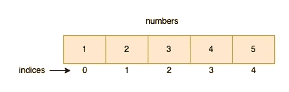
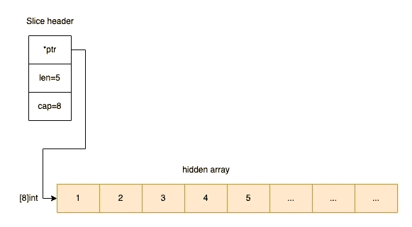

# 开始编程|数组和多维数组

> 原文：<https://levelup.gitconnected.com/go-programming-array-and-multi-dimensional-array-cd443c70331>

本帖演示了围棋中数组和多维数组的基本用法；切片和多维切片也包括在内。

# 排列

数组是一个固定长度的序列，它在内存中存储同类元素。



```
// declaration, type:[3]int, value: {0,0,0}
var a [3]int// short declaration
b := [4]int{1, 2, 3, 4}// mutable
b[0] = 1// compile error: cannot use [4]int as type [3]int in assignment
a = [4]int{1, 2, 3, 4}
```

当声明一个数组而没有实例化它时，该数组自动用**零值**初始化。

数组的大小是其类型的一部分；例如，`[10]int`和`[20]int`是截然不同的类型。

# 多维数组

多维数组是数组的数组，用于表示矩阵。

让我们创建一个二维数组作为例子。

```
// declaration
var a [2][3]int// type: [2][3]int
fmt.Printf("type: %T\n", a)
```

这里，就像一维数组一样，数组的大小也是其类型的一部分。

## 记忆表征

在 Go 中，数组总是一维的，这意味着为数组分配和使用的内存总是连续的。

然而，一维阵列可以被组合以形成多维阵列。

```
x := [3][3]byte{
  {1, 2, 3},
  {4, 5, 6},
 }fmt.Println(&x[0][1])    // 0xc0000140e3
fmt.Println(&x[0][2])    // 0xc0000140e4
fmt.Println(&x[1][0])    // 0xc0000140e5
```

如上所示，第二行从第一行最后一个元素的地址之后的内存地址开始。

# 薄片

与数组相比，切片是动态调整大小的、灵活的数组元素视图。

换句话说，片是底层数组的连续段的描述符。它由指向数组的指针、段的长度和它的容量组成。



# 多维切片

由于多维数组是数组的数组，类似地，多维切片是切片的切片。

```
sales := [][]int{
  {100, 200},
  {300},
  {400, 500},
 }for _, x := range sales {
  for _, y := range x {
   fmt.Println(y)
  }
 }
```

上面的示例是一个二维切片，它将内部切片存储在切片中。所以切片的每个元素都是另一个切片。

如果你喜欢这篇文章，请鼓掌，让其他人也能看到。💚