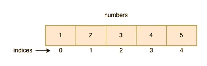
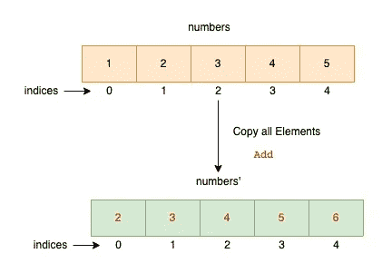
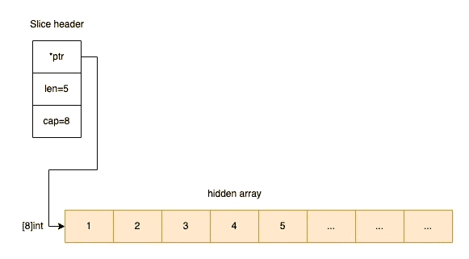

# 开始编程|数组与切片

> 原文：<https://levelup.gitconnected.com/go-programming-array-vs-slice-5902b7fdd436>

数组和切片是不同的概念，但在 Go 中是有联系的:数组是固定的，切片是动态的。

本帖将讨论围棋中数组和切片的区别和联系。

# 排列

一个数组是一个特定长度的编号元素序列。这是围棋的重要组成部分。我们举个例子来理解一下。



阵列

## 声明一个数组

首先，我们声明一个名为`numbers`的变量。变量的类型是`[5]int`。请注意，方括号也是类型的一部分。

```
var numbers [5]int
```

## 初始化数组

其次，我们用值 1，2，3，4，5 初始化数组。如果我们不初始化它，每个元素的默认值都是 0，因为默认情况下 int 的零值是 0。

```
fmt.Println("before numbers:", numbers)   // [0 0 0 0 0]
for i := 0; i < len(numbers); i++ {
    numbers[i] = i + 1
}
fmt.Println("after numbers:", numbers)    // [1 2 3 4 5]
```

## 作为函数参数的数组

如果我们将一个数组传递给一个函数，我们会复制所有的数组元素，而不是像大多数其他编程语言那样传递一个引用。这意味着改变函数中数组元素的值不会影响原始数组。

```
package main

import (
	"fmt"
)

func Add(numbers [5]int) {
	for i := 0; i < len(numbers); i++ {
		numbers[i] = numbers[i] + 1
	}
	fmt.Println("numbers in Add:", numbers)    // [2 3 4 5 6]
}

func main() {
	// declare and initialize the array
	var numbers [5]int
	for i := 0; i < len(numbers); i++ {
		numbers[i] = i + 1
	}

	Add(numbers)
	fmt.Println("numbers in main:", numbers)  // [1 2 3 4 5]

}
```



数组在 Go 中最常见的用途是保存切片的存储。让我们在下一部分探索最流行的数据结构。

# 薄片

切片是一种数据结构，描述与切片变量本身分开存储的数组的连续部分。 ***切片不是数组，它只代表*数组的一片。**

切片有三个基本属性:

*   `len`(切片中元素的数量)
*   `cap`(底层数组中元素的个数)
*   指向基础数组的指针。



切片标题

## 声明切片

首先，我们声明一个名为 numbers 的变量。变量的类型是`[]int`(整型切片)。

```
var numbers []int
```

## 填充切片

其次，我们用一些值填充切片。我们使用内置的 append 函数向切片添加值。

```
var numbers []intfor i := 0; i < 5; i++ {
     numbers = **append**(numbers, i+1)
}
```

## 切片作为函数参数

理解这一点很重要，即使一个片包含一个指针，它本身也是一个值。它不是指向结构的指针。在幕后，它是一个保存指针和长度的结构值。

这很重要。

```
package main

import (
	"fmt"
)

func Add(numbers []int) {
	for i := 0; i < len(numbers); i++ {
		numbers[i] = numbers[i] + 1
	}
	fmt.Println("numbers in Add:", numbers) // [2 3 4 5 6]
}

func main() {
	var numbers []int
	for i := 0; i < 5; i++ {
		numbers = append(numbers, i+1)
	}

	Add(numbers)

	fmt.Println("numbers in main:", numbers) // [2 3 4 5 6]
} 
```

这里我们看到函数可以修改切片参数的内容，因为切片结构有一个指向底层数组的指针。

# 有用的资源:

1.  [数组、切片:“追加”的机制](https://go.dev/blog/slices)
2.  [在 golang 中将数组作为参数传递](https://stackoverflow.com/questions/21719769/passing-an-array-as-an-argument-in-golang)