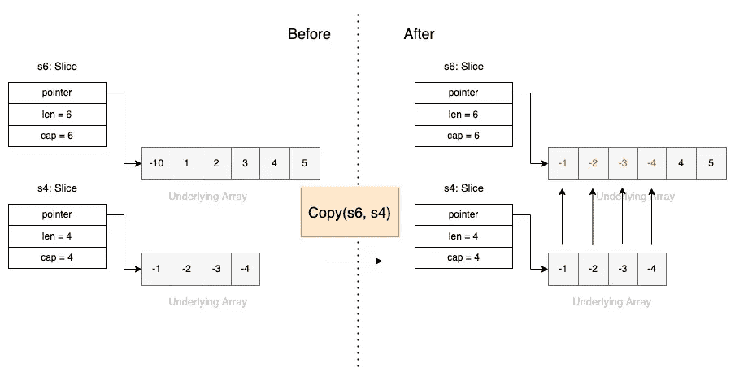
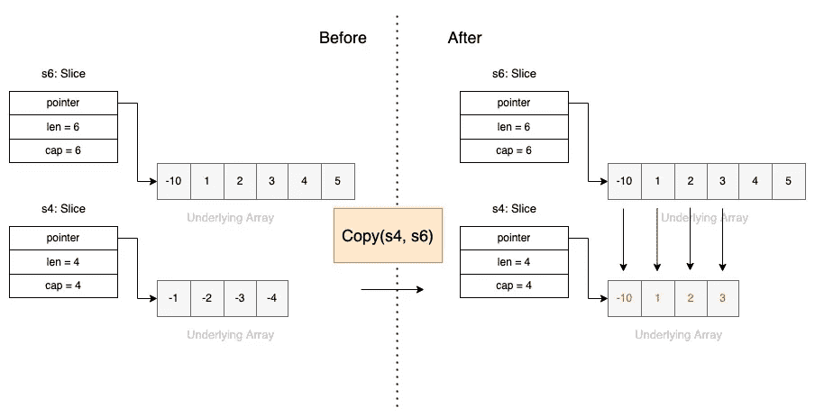
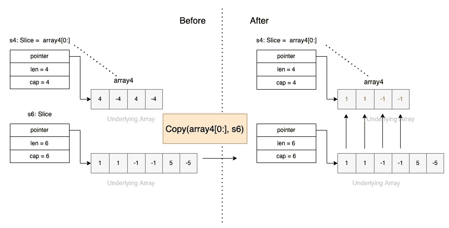
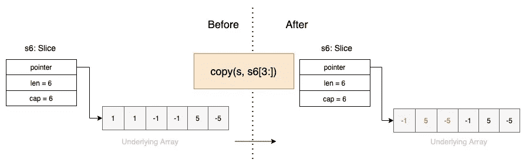
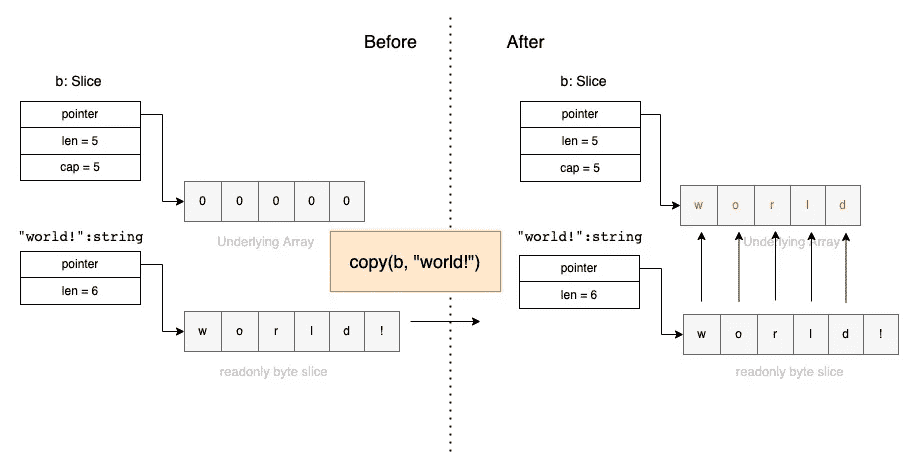

# 编程|复制功能说明

> 原文：<https://levelup.gitconnected.com/go-programming-copy-function-explained-d0493c4a9800>


Volodymyr Hryshchenko 在 [Unsplash](https://unsplash.com?utm_source=medium&utm_medium=referral) 上拍摄的照片

内置的[复制函数](https://pkg.go.dev/builtin#copy)用于**将**元素**从一个源片复制到另一个目的片。**

复制功能的签名是:

```
func copy(dst, src [][Type](https://pkg.go.dev/builtin#Type)) [int](https://pkg.go.dev/builtin#int)
```

*   它有两个参数，一个目标和一个源片，它们的元素类型是相同的。
*   这两个切片可以具有不同的长度。它返回复制的元素数量，这将是`len(**src**)` 和`len(**dst**)`的最小值。
*   作为一个特例，它也将把字节从一个字符串复制到一个字节片。
*   一旦复制完成，`**dst**`中的任何变化都不会反映在`**src**`中，除非`**src**`和`**dst**`都引用同一个片。

让我们通过下面的例子来进一步理解这个函数。

## 示例 1:从长切片复制到短切片

```
package main

import (
	"fmt"
)

func main() {
	s6 := []int{-10, 1, 2, 3, 4, 5}
	s4 := []int{-1, -2, -3, -4}
	fmt.Println("s6:", s6)
	fmt.Println("s4:", s4)

	**copy**(s6, s4)

	fmt.Println("s6:", s6)
	fmt.Println("s4:", s4)
}
```



从长切片复制到短切片

## 示例 2:从短切片复制到长切片

```
package main

import (
	"fmt"
)

func main() {
	s6 := []int{-10, 1, 2, 3, 4, 5}
	s4 := []int{-1, -2, -3, -4}
	fmt.Println("s6:", s6)
	fmt.Println("s4:", s4)

	**copy**(s4, s6)

	fmt.Println("s6:", s6)
	fmt.Println("s4:", s4)
	fmt.Println()
} 
```



## 示例 3:从短数组复制到长切片

我们可以从现有数组的元素中创建一个切片，然后将该切片复制到另一个数组中。

```
 package main

import (
	"fmt"
)

func main() {
	array4 := [4]int{4, -4, 4, -4}
	s6 := []int{1, 1, -1, -1, 5, -5}

	fmt.Println("array4:", array4)
	fmt.Println("s6:", s6)

	**copy**(s6, array4[0:])

	fmt.Println("array4:", array4)
	fmt.Println("s6:", s6)
} 
```


## 示例 4:从长切片复制到短数组

```
package main

import (
	"fmt"
)

func main() {
	array4 := [4]int{4, -4, 4, -4}
	s6 := []int{1, 1, -1, -1, 5, -5}

	fmt.Println("array4:", array4)
	fmt.Println("s6:", s6)

	**copy**(array4[0:], s6)

	fmt.Println("array4:", array4)
	fmt.Println("s6:", s6)
} 
```



## 示例 5:从一个切片复制到其自身

使用复制功能时，源和目标也可能重叠。因此，也可以从一个切片复制到其自身

```
package main

import (
	"fmt"
)

func main() {
	s6 := []int{1, 1, -1, -1, 5, -5}

	fmt.Println("s6:", s6)

	copy(s6, s6[3:])

	fmt.Println("s6:", s6)
} 
```



## 示例 6:从字符串复制到字节片(特殊情况)

我们知道字符串实际上是一个`byte`序列包装器。实际上，我们可以把一个字符串看作一个(元素不可变的)字节片。

```
var b = make([]byte, 3)
copy(b, "world!") // b == []byte("Hello")
```



我希望你喜欢读这篇文章😄。如果你想支持我☕作为一个作家，考虑报名参加[成为一个媒体成员](https://jerryan.medium.com/membership)。你还可以无限制地访问媒体上的每个故事。