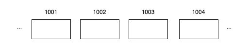
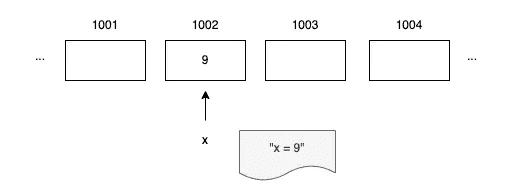
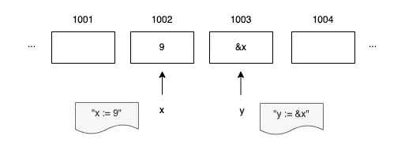

# Go 编程| Golang 中的指针

> 原文：<https://levelup.gitconnected.com/go-programming-pointer-in-golang-cd1d8803e25d>

指针是一种用于引用值的特殊类型。更好地理解它可以帮助你在 Go 中编写高级代码。


杰斯·贝利在 [Unsplash](https://unsplash.com?utm_source=medium&utm_medium=referral) 上的照片

在这篇文章中，我将尝试给出我的解释，希望对你有所帮助。

# 变量

计算机内存可以被认为是一系列盒子，一个接一个地放在一条线上。每个盒子都标有一个唯一的数字，数字按顺序递增。唯一的位置号被称为**存储地址**。



存储单元

一个**变量**只是一个方便的字母数字昵称，代表编译器分配的一块内存位置。当你声明变量时，你会从可用的空闲内存中得到一个内存位置来使用。



# 两颗北极指极星

一个*指针*值是一个变量的*地址*。因此，指针是存储值的位置。有了指针，我们可以间接读取或更新变量*的值*，而不需要使用甚至不知道变量的名字，如果它确实有名字的话。

在下面的例子中，

*   语句`&x`产生一个指向整数变量的指针。
*   `y := &x`我们说 y 指向 x，或者 y 包含 x 的地址。
*   表达式`*y`得出这个整型变量的值，这里是 9。



# 指针为什么有用？

> *“使用指针是为了提高效率，因为 Go 中的一切都是通过值传递的，所以它们让我们传递保存数据的地址，而不是传递数据的值，以避免无意中更改数据，这样我们就可以访问另一个函数中的实际值，而不仅仅是当我们想要改变它时它的副本。”*

我们来举个例子。

# 指针示例

## **按值传递**

该值的副本作为按值传递的参数发送给函数。函数中的任何变化只会影响函数的变量；它不会更新函数范围之外的原始值。

结果:

```
User[Name: John, Age: 30]
User[Name: John, Age: 25]
```

## **路过指针**

在围棋中，一切都是**按值传递。**我们

**这是另一个例子。**

**结果:**

```
User[Name: John, Age: 30]
User[Name: John, Age: 30]
```

**发现这篇文章很有用👏？看看我下面的其他文章吧！**

*   **[Golang 频道是如何工作的](/how-does-golang-channel-works-6d66acd54753?gi=4f31bb9efbc7)**
*   **[Golang 中的观察者设计模式示例](/observer-design-pattern-in-golang-with-an-example-6c24898059b1)**
*   **[如何永远记住所有这些分类概念](https://medium.com/swlh/how-to-remember-all-these-classification-concepts-forever-761c065be33)**

**资源:**

1.  **[懂围棋指点在 800 字以内还是退钱](https://dave.cheney.net/2017/04/26/understand-go-pointers-in-less-than-800-words-or-your-money-back)**
2.  **[围棋中指针的基本原理](https://betterprogramming.pub/pointers-in-go-9aa5c0682a)**