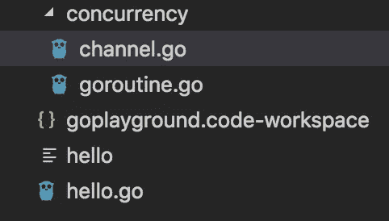

# Go —设置开发环境

> 原文：<https://levelup.gitconnected.com/go-setting-up-development-environment-93dd67c5dccf>

踏入围棋界(看了我之前的[文章](https://medium.com/@tech.enthusiast/lets-go-a-programming-language-in-trend-fc32158662d7))和看了一些教程之后，真的激励我去钻研编程语言。要精通任何一门语言，开始写代码比阅读任何数量的教程教会你更多。因此，我开始在我的系统上设置它来编写一些示例代码。事实上，这并没有我最初预期那么容易。

# 集成驱动电子设备

Go 感觉像是一种动态类型的解释语言，但它仍然是一种静态类型的编译语言。在任何情况下，拥有一个用于开发的 IDE 都将使它变得更容易，因为它通常提供自动填充、建议、快速编译，并且还有助于调试。此外，一些 ide 提供生成单元测试，当然，只是模板，但仍然是一个 nitty 特性。因此，总而言之，与其在文本编辑器或 vim 中编码，不如选择 IDE。

这里是所有 ide 和插件的详尽列表- [链接](https://github.com/golang/go/wiki/IDEsAndTextEditorPlugins)。大多数情况下，IDE 的选择取决于个人偏好，因此您可以查看所有 IDE 的列表，并可能选择您已经习惯的一个。无论如何，这里有一些建议，我觉得很好-

1.  [VS 代码](https://code.visualstudio.com/docs):微软开发的 IDE，是最流行的 IDE 之一，用于 JavaScript、TypeScript 和 Node.js，也为一般编程语言提供扩展，如- C++、Java、Python 和 now Go。这是我的选择，因为它是免费的，而且有一套很好的功能。
2.  创造 IntelliJ 的 JetBrains 公司为 Go 开发了一个新的编辑器。这不是免费的，但他们有 30 天的试用期。之后，个人使用的费用大约为 89 美元/年。尽管如此，这也是一个非常好的编辑器，尽管它相对较新。
3.  v [im-go](https://github.com/fatih/vim-go) :如果你已经使用过 vim 和 vim 中的 like 编码，这是一个简洁的扩展，它提供了语法高亮，以及构建和运行 go 程序的命令。
4.  [go-plus](https://atom.io/packages/go-plus) :和上面那个差不多，这是给 Atom 爱好者的。

这些是一些流行的方法，但是请仔细阅读详尽的列表，很可能您应该找到您已经拥有的 IDE 的扩展。

# 程序包结构

这些文件必须被组织成包，在包中你可以根据功能来构造你的文件。根据您的应用程序，将主文件放在父目录中并创建多个子目录是一个很好的做法。在主文件中，您可以导入其他包并调用它们。您可以将所有文件放在一个文件夹中，使用相同的包名，但是这对于大项目来说是不可维护的。最好遵循包结构，认为您会在某个时候将它发布到代码回购中。最佳实践最好是有原因的。

例如，我是这样创建文件的-

hello.go 是我的主文件，它定义了一个主函数。在你的包中，应该只有包含主函数的文件。我创建了一个目录“concurrency ”,并在其中放置了两个文件。一个目录中的所有文件应该共享相同的包名。

> hello.go ->包“主”
> 
> concurrency/channel . go-> package " conc "
> 
> concurrency/goroutine.go ->包“conc”

在 hello.go 中，可以导入其他包。

> 导入(
> 
> 并发性”。/conc "
> 
> )

使用它，您可以调用“conc”包中所有导出的函数。

# 导出函数

在 Go 中，如果一个名字以大写字母开头，它就会被导出。例如，`Pizza`是一个导出的名称，`Pi`也是，它是从`math`包中导出的。您可以导出变量和函数。与变量类似，即使是以大写字母开头的函数也会被导出。

> func Say(s 字符串){
> 
> fmt。打印
> 
> }

有趣的是，Go 还强制你在所有导出的名字上添加文档，不管是变量还是函数。否则，它会显示一个错误“导出的函数说应该有注释或未导出”。必须以这种格式添加注释-“对导出函数 Say 的注释应该是这样的形式—‘Say…’”。

通过使用包名或包名的别名，可以从其他文件调用导出的函数。例如，当我将“conc”包导入到“concurrency”别名时，我可以使用“concurrency”调用“Say”。

> 并发性。说(“你好”)

# 编译和执行

要进行编译，您需要进入终端并运行-“go build<mainfile>”。如果代码编译成功，这将为主文件创建一个 execute。代码构建完成后，您可以使用-"运行可执行文件。/ <executable name="">”。我没有找到直接从 VSCode 编辑器运行它的方法，尽管我可以从 VSCode 打开终端，我可以直接在其中运行这些命令。</executable></mainfile>

这将使您开始设置基本的包结构并运行程序。