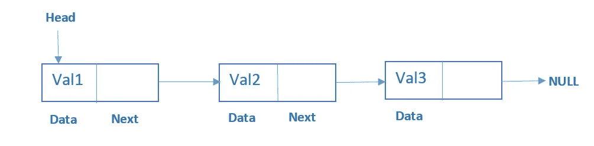
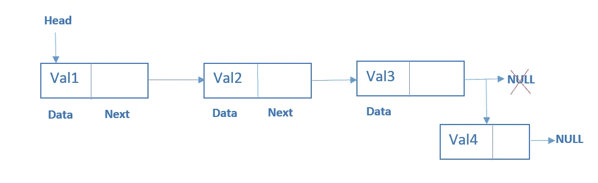
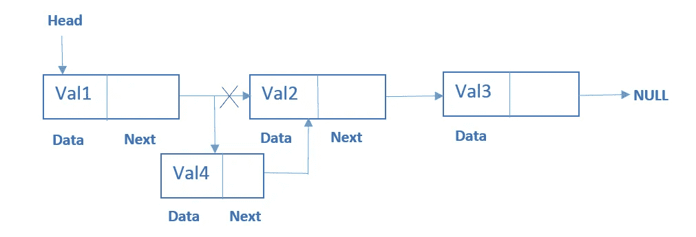
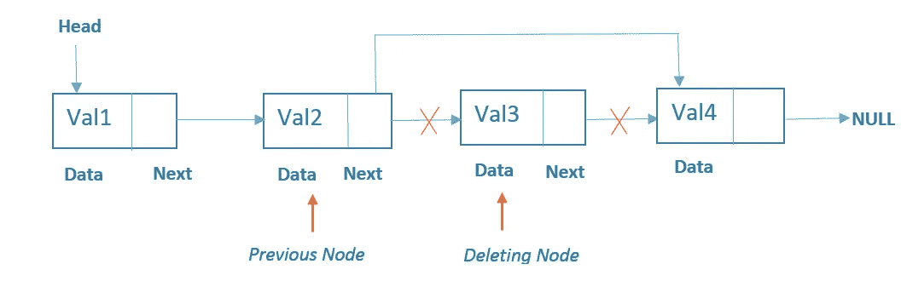

# Go:单链表

> 原文：<https://levelup.gitconnected.com/go-singly-linked-lists-with-insertion-deletion-traversal-e9da5bb0dbe1>

## 单链表在 go lang 中的实现

在 [Unsplash](https://unsplash.com/) 上应拍摄的“不锈钢链条倾斜移位镜头照片”

## 简介:

链表是一种类似数组的线性数据结构。然而，链表不像数组那样将元素存储在连续的位置。链表中的元素使用指针链接，如下图所示。

*图 1:链表表示*

简单来说，我们可以说，链表是节点的集合。**节点**由两部分组成:

1.  数据
2.  指针

我不再赘述，你可以[点击这里](https://en.wikipedia.org/wiki/Linked_list)阅读更多关于链表的详细信息。

一个**节点**和**链表**可以使用 Go 中的以下结构来表示:

*图 2:节点和链表结构*

## *1。在单链表中插入元素:*

让我们看看在列表末尾插入一个元素的实现。

为了在链表的末尾添加一个新的节点，我们必须遍历链表直到结束。

*图 3:*在单链表末尾插入一个元素的图示

> *简单来说，我们可以说****Head****是链表的开始(即 Head 是指向链表第一个节点的指针)&****End****是链表的结束(即 End 是最后一个节点的指针，该节点的值为***)。**

*如上图所示，通过将最后一个元素(即 Val3)的指针从 NULL 更改为 NULL，添加了一个新节点(Val4)。现在 **Val4** 节点的指针值为空。*

*参见下面的代码:*

*图 4:在单链表的末尾插入一个元素*

*现在让我们说，我们想在第 **n** 个位置添加一个新的节点，而不是在最后添加。*

*在这种情况下，我们必须遍历列表，直到提供的第 n 个**节点**改变它的指针指向新的节点。*

**

**图 5:*在单链表第 **n** 位插入元素的图示*

*如上图所示，通过更改 Val2 中第一个元素(即 Val1)的指针，添加了一个新节点(Val4)。现在 **Val4** 节点的指针值为 Val2。*

*参见下面的代码:*

*图 4:在单链表的第 n 个位置插入一个元素*

## *2.遍历并打印单链表:*

*现在我们已经看到了链表中节点的插入，让我们通过遍历链表来打印链表的所有节点。*

*以下代码将打印列表的所有节点:*

*图 5:打印链表中的所有节点*

*我们知道，链表的节点不是存储在连续的位置。因此，我们需要使用**头**指针开始遍历列表，直到列表的**尾**为止。*

## *3.从链表中搜索节点:*

*现在让我们看看如何使用节点的值来搜索节点，为此我们需要遍历列表&将每个节点的值进行比较。*

*参见下面的代码:*

*图 6:获取列表中节点的位置*

*让我们考虑一下**图 1** 中提供的列表，我们想要找出值为 **Val2 的节点。**以上方法将返回所提供值的位置，如果列表中没有找到所提供的值，则返回-1。*

*现在，我们知道如何找到一个节点的位置。找一个特定位置的节点呢。让我们找出出现在位置 2 的节点(参考**图 1** )。*

> ***注:**这里我们考虑 0 为第一位。*

*首先，我们将遍历列表，直到给定的位置&返回与该位置匹配的节点。*

*图 7:从列表中获取特定位置的节点*

## *4.从链接列表中删除节点:*

*从链表中移除一个节点就像插入一样简单。*

*要删除节点，我们需要执行以下步骤:*

1.  *查找删除节点的上一个节点*
2.  *将上一个节点的下一个更改为删除节点的下一个*

**

*图 8: *从链表中删除节点的图示**

*如上图所示，我们正在删除值为 **Val3** 的节点。为此，遍历列表，直到*位置-1* 节点，获取前一个节点，并用*位置出现的节点的参考值更改其参考值。**

*下面的代码会让事情变得更清楚😊*

*图 9: *D* 从链表中删除给定位置的节点*

*但是，如果我们不知道要删除的节点的位置呢？在这种情况下，我们可以使用它的值删除节点。*

*图 10: *D* 使用链表中的值删除节点*

*如上述代码所述，我们正在执行以下步骤:*

*   *遍历列表*
*   *将给定值与节点值进行比较*
*   *如果节点与给定值匹配，改变 *pos-1* 节点&的指针值，使其指向下一个要删除的节点*

*请注意，如果列表为空或者没有找到删除节点，delete val方法将返回错误。*

*你可以在这里找到完整的代码。*

# *结论:*

*在这个故事中，我们学习了链表的一些基本知识，比如:*

*   *链表也是一种类似数组的线性数据结构。*
*   ***头**是列表的开始& **尾**指定了列表的结束。*
*   *遍历一个列表从头部开始，直到我们发现引用值为 ***NULL。****
*   **插入* & *删除*操作非常简单，因为我们不需要像**数组那样移动所有的节点。***

*我这边就这样。欢迎任何建议和更正。*

*保持快乐😊&继续读。*