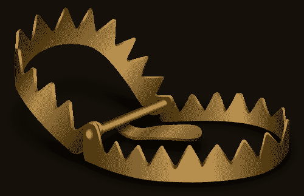

# Go 切片、地图、陷阱和泛型

> 原文：<https://levelup.gitconnected.com/go-slices-maps-pitfalls-and-generics-f7ced963ced>

不要落入切片陷阱

我不记得具体是怎么回事了——可能是我的 Twitter feed 或我过于混乱的收件箱里的东西——但我最近看到了[这条线索](https://medium.com/u/2b8679c5a2b0#!msg/golang-nuts/SjuhSYDITm4/jnrp7rRxDQAJ)到[伊恩·兰斯·泰勒](https://medium.com/u/df2718043abd?source=post_page-----f7ced963ced--------------------------------)写道

> 在很早的时候，我们现在称之为 map
> 的东西是作为指针写的，所以你写了*map[int]int。当我们意识到没有人不写“地图”而写“地图”的时候，我们就离开了
> 。

如果不是戴夫·切尼[的](https://medium.com/u/b702737d9239?source=post_page-----f7ced963ced--------------------------------)[这篇文章](https://dave.cheney.net/2017/04/30/if-a-map-isnt-a-reference-variable-what-is-it)，我永远也不会找到这个启发性的引用，你应该深入了解更多关于地图是如何实现的。

考虑到地图已经是一个指针了，就没必要担心用指针指向地图，万一它在你脚下变了。

# 泛型和这一切有什么关系？

想象一下，切片不是 Go 语言的基础部分，而是一个带有类似`append()`的方法的常规结构。作为一名 Go 程序员，你会看到[结构，以及它的指针、长度和容量字段值](https://blog.golang.org/go-slices-usage-and-internals)，你不需要非常有经验就能意识到当你调用一个方法时，所有这些字段值可能会改变。因此，你不太可能落入陷阱。

此时你可能会想“也许我应该在代码中直接使用切片头来增加透明度”，但这真的不值得。你不想这么做的一个重要原因是(缺少)泛型。切片和映射的好处在于，Golang 允许您使用它们来存储任何类型的数据，而您手工生成的手工切片头结构需要为该指针指定一种类型。然后你将需要一套不同的方法来存储你想要的不同类型的数据。很快就会变得很无趣。

# (重新)学会喜欢切片

我仍然希望 Go 不需要人们理解切片的底层实现。如果有一些微妙的视觉线索，比如使用不同的括号类型，来帮助我们区分我们谈论的是切片、数组还是映射，我可能会感觉更好。

我*可能*会接受泛型的概念:-)

如果你喜欢这篇文章，你可能也会喜欢这篇关于 Go *中* [*变量和函数的文章。*](https://medium.com/@lizrice/variables-and-functions-in-go-oh-my-18b71297657?source=friends_link&sk=492253deb2265879c2131e25a84e846a)