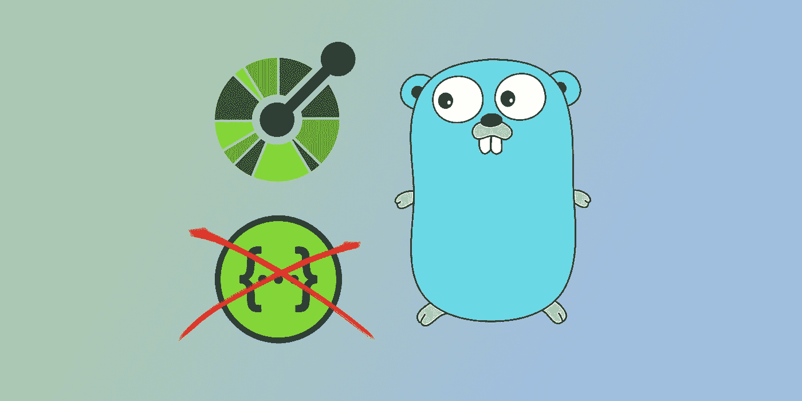

# Go，Swagger，并打开 API

> 原文：<https://levelup.gitconnected.com/go-swagger-and-open-api-e6b6ea4ce48f>

## 用 S̶w̶a̶g̶g̶e̶r̶开放 API 记录 Go REST 服务



想象一下您自己处于这样一种情况，您已经用 Go 构建了一个 REST 服务，现在您想为他人或未来的自己记录它。你要紧跟潮流，选择最流行的规范之一——s̶w̶a̶g̶g̶e̶r̶开放 API。

所以，你继续寻找能够从你的 go 代码中生成文档的工具，因为手工编写文档花费太多时间，你宁愿花在做其他更有趣的事情上…

最后，你找到两个流行的工具 [go-swagger](https://github.com/go-swagger/go-swagger) 和 [swaggo](https://github.com/swaggo/swag) ，它们能够做你想做的事情，你选择一个。然后添加必要的注释，添加必要的依赖项，点击那个神奇的🅶🅴🅽🅴🆁🅰🆃🅴按钮！好吧，好吧，在命令行中写下神奇的单词，然后按回车键…工具完成了工作，文档也可以访问了。幸福降临在你身上，你开始觉得生活又有了意义…

…直到你注意到文档是 Swagger(也称为 *v2* )并且你周围的世界都在使用更新的格式——开放 API(也称为 *v3* )。由于工具不支持新的格式，这导致你走进死胡同？或者也许还有一些希望？

当然有，如果您愿意在您的环境中添加一些额外的依赖项，还有很多其他工具可以提供帮助。有一个将旧格式转换成新格式的官方工具，由 [Swagger.io](https://converter.swagger.io/) 免费提供。

> 为了简单起见，在本文的剩余部分，我将把较老的 Swagger 格式称为`*v2*`，把较新的 Open API 格式称为`*v3*`。

有了前面提到的网站，我们可以将 *v2* 转换成 *v3* ，更新我们的 Go 源文件，从此过上幸福快乐的生活。几乎…

如果我们的服务是一个最终产品，并且永远不会改变，那么这个一次性的动作对于我们的用例就足够了。

但是，当 REST 服务更新并添加新内容或删除旧内容时，该怎么办呢？我们应该每次都手动调用这个服务吗？这是最好的方法吗？

依我看，这些问题的答案就是**自动化 IT** ！


为此，我们必须遵循以下步骤:

1.  生成文档
2.  将生成的文档发送给转换器
3.  用生成的文档替换现有文档
4.  用新的资源构建我们的程序

最棒的是，所有的工具都已经存在，可以在我们短暂的旅程中帮助我们。所以让我们开始吧

# 发生

这是简单的第一步，我们必须生成文档。为此，我们的服务将需要在代码中有必需的注释，它们根据我们使用的库而有所不同，所以请查看官方库并在代码中添加必要的注释。

## Swaggo

当使用 [swaggo](https://github.com/swaggo/swag) 并且我们的`main.go`文件在包的根目录中时，我们只需要运行下面的命令:

```
swag init
```

然而，如果我们使用更高级的东西，我们的`main.go`文件被放在`cmd/<service-name>`目录中，那么我们将不得不运行以下命令:

```
swag init -g cmd/<package-name>/main.go
```

如果这两个命令都不起作用，你可以查看官方库[问题页面](https://github.com/swaggo/swag/issues)，尤其是 [#428](https://github.com/swaggo/swag/issues/428) 以获得更多信息。

如果一切顺利，那么我们的包目录中应该会生成以下文件:

```
├── docs
│   ├── docs.go
│   ├── swagger.json
│   └── swagger.yaml
```

默认情况下， *v2* 内容由`docs.go`提供，而不是由这两个附加文件提供。这给我们带来了一些问题，但是让我们以后再讨论这个问题。

## Go-swagger

使用 [go-swagger](https://github.com/go-swagger/go-swagger) 时，我们需要运行以下命令:

```
swagger generate spec -o ./docs/swagger.json
```

这将在我们的包的`docs`目录下生成`swagger.json`文件。

# 转变

第二步是将 *v2* 文件转换成 *v3* 。现在有几种方法可以做到这一点，第一种是在 https://converter.swagger.io/[使用公开可用的服务，方法是调用:](https://converter.swagger.io/)

```
curl -X POST [https://converter.swagger.io](https://converter.swagger.io/)/convert -d [@docs/swagger](http://twitter.com/docs/swagger).json --header 'Content-Type: application/json' > openapi.json
```

这将把 *v3* 的内容保存到`openapi.json`文件中。

另一种方法是使用 docker 并在本地进行转换。为了做到这一点，我们将不得不[安装 docker](https://docs.docker.com/engine/install/) 本身并在本地运行 [swagger 转换器](https://github.com/swagger-api/swagger-converter)。然后，上述 curl 命令可以通过从公共 url 更改为本地 URL 来使用。

如果文档是由外部来源提供的，那么旅程就到此为止了。我们只需要将`openapi.json`文件放在可以到达的位置。

# 取代

然而，如果这个文档是由服务本身提供的，并且我们的服务使用默认方法(swaggo)，那么就有点问题了。我们必须将`docs.go`文件中的 *v2* 替换为 *v3* 。

为了省去所有的麻烦，这里有一个神奇的命令:

```
sed -i '/var doc = `{/,/}`/c\var doc = `'"$(cat openapi.json)"'`' docs/docs.go
```

这将用来自`openapi.json`文件的内容替换`doc`变量值。

# 建筑物

现在，剩下的最后一件事就是运行`go build`来重新生成二进制文件，当它运行时，我们将能够从我们的服务中访问 *v3* 文档。


顺便说一下，如果你想在你的 CI /CD 流中使用类似的方法，你可以检查这个 GitHub [库](https://github.com/b-pagis/medium-go-swagger2openapi)来看看它在 GitHub [动作](https://github.com/b-pagis/medium-go-swagger2openapi/runs/2495671850?check_suite_focus=true)中是如何工作的。

# 旁注

## #1

Swaggo 有内置的 swagger 页面，但是它不太支持 *v3* 文档，所以最好单独运行 swagger UI 或 swagger editor，并从其中提供服务文档。

## #2

我想在 GitHub 中也包含 go-sawgger 的例子，但是在花了几个小时，在处理各种错误的时候，发现自己在查看超过 2 年的[问题](https://github.com/go-swagger/go-swagger/issues/1772)并且被迫改变我的结构，只是为了看到不是错误，而是不完整和不准确生成的文档，我决定放弃这个想法，转而使用 swaggo。另外值得一提的是，IHMO，go-swagger 比 swaggo 更啰嗦。

# 许可证说明

地鼠图片由 https://github.com/golang-samples/gopher-vector 的上田拓也创作

swagger logo:[https://static 1 . smart bear . co/swagger/media/assets/images/swagger _ logo . SVG](https://static1.smartbear.co/swagger/media/assets/images/swagger_logo.svg)

开放 Api logo 来源:[https://www . open Api . org/WP-content/uploads/sites/3/2018/02/open Api _ Logo _ Pantone-1 . png](https://www.openapis.org/wp-content/uploads/sites/3/2018/02/OpenAPI_Logo_Pantone-1.png)

# 链接

 [## Swagger 转换器

### 将 1.x 或 2.x Swagger 定义转换为 OpenAPI 3.0.1 格式

converter.swagger.io](https://converter.swagger.io/) [](https://github.com/swaggo/swag) [## swaggo/swag

### 使用 Swagger 2.0 for Go 自动生成 RESTful API 文档。-斯瓦格/斯瓦格

github.com](https://github.com/swaggo/swag) [](https://github.com/go-swagger/go-swagger) [## 昂首阔步/昂首阔步

### 这个包包含了 Swagger 2.0(又名 OpenAPI 2.0)的 golang 实现:它知道如何序列化和…

github.com](https://github.com/go-swagger/go-swagger) [](https://github.com/swagger-api/swagger-converter) [## swagger-api/swagger 转换器

### 提供可通过 API 和 web UI 访问的 OpenAPI 2.0 和 3.0 规范之间的转换器。它可以在网上获得…

github.com](https://github.com/swagger-api/swagger-converter) [](https://github.com/b-pagis/medium-go-swagger2openapi) [## b-pagis/medium-go-swagger 2 open API

### 此时您不能执行该操作。您已使用另一个标签页或窗口登录。您已在另一个选项卡中注销，或者…

github.com](https://github.com/b-pagis/medium-go-swagger2openapi)