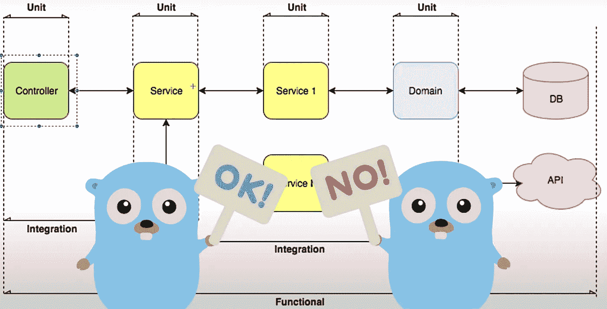

# 开始测试基本学习路径

> 原文：<https://levelup.gitconnected.com/go-testing-essential-learning-path-2b7bb61b1030>

背景图片由费德里科·莱昂提供:[https://www.youtube.com/watch?v=o0icpLRhFKQ](https://www.youtube.com/watch?v=o0icpLRhFKQ)

通常，当我第一次开始学习某样东西时，我会想到一些常见的疑点:Pluralsight、Udemy、Linkedin Learning 等。我真的很喜欢通过视频培训学习编程主题。对我来说，我发现导师通常会在整个课程中透露一些知识，而这些知识通常不会出现在博客帖子中。然而，当我真正尝试深入研究 Go 中的单元测试时，我发现这些资源很缺乏。

Go 中的单元测试是一项非常直接的任务，这很棒。这也是为什么你可以在 Go 中找到很多关于测试基础的资源。当搜索一些更有针对性的内容时，比如用界面来模仿，就很难找到高质量的内容。我把 Pluralsight、YouTube、文档和博客帖子的链接列表放在一起，这些链接确实帮助我更深入地测试 Go。

这不是一个确定的列表，当我遇到新的资源时，我会尽最大努力更新它。然而，如果你是 Go 测试的新手，或者还没有深入过标准测试包，这篇文章可能会对你有所帮助。

# 基础知识

你必须从某个地方开始，学习 Go 中单元测试的基础知识实际上是非常好的。以下是一些入门资源。

*   [开始——测试包文档](https://golang.org/pkg/testing/):我总是喜欢从官方文档开始，即使当你第一次开始时，它不是最好的资源。然而，请仔细阅读，因为一旦你深入其中，你会一遍又一遍地回到这个网站！
*   [plural sight——在 Go 中创建测试良好的应用程序](https://www.pluralsight.com/courses/go-create-test-applications):这是一门关于 Go 中单元测试基础的很棒的课程。这是对单元测试、基准测试和概要分析的精彩介绍。
*   [YouTube——Go Workshop 中的测试和基准测试](https://www.youtube.com/watch?v=ZeAkcs5g41k):这里与 Pluralsight 课程有一些重叠，但是如果你没有访问 Pluralsight 的权限，这是一门非常好的课程。就算你有权限，我还是推荐两个都看。

# HTTP 测试

我发现这些天我在 Go 中写的大部分代码都是 REST 服务。幸运的是，测试您的端点非常容易，这些链接可以引导您完成测试。

*   [Go — HTTPTest 包文档](https://golang.org/pkg/net/http/httptest/):还是从官方文档开始，熟悉一下里面的内容。你会经常回到这个页面！
*   [博客——在 Go](https://blog.questionable.services/article/testing-http-handlers-go/) 中测试你的(HTTP)处理程序:这是一篇关于如何在你的 Go REST 服务中测试端点和处理程序的精彩的、中肯的文章。这里的例子简单易懂，并提供了关于如何进行测试并将数据传递到您的端点的信息。这篇文章将会给你一个很好的测试起点。
*   [YouTube — justforfunc #16:单元测试 HTTP 服务器](https://www.youtube.com/watch?v=hVFEV-ieeew):与上面的博文类似，这个视频很好地介绍了如何使用`httptest`包测试 REST 服务。

# 基准测试和分析

我非常喜欢 Go 中的基准测试和分析工具。我可以很自信地说，这是大多数开发人员忽略的一个领域。这不是他们自己的错，因为大多数团队没有他们的产品负责人询问性能。然而，作为一名工程师，你真的应该关注它，并始终寻找潜在的关注领域。

*   [YouTube — justforfunc #28:基本基准](https://www.youtube.com/watch?v=2AulMm-hsdI&t=416s):围棋基准测试的好入门。这个视频将补充以上基础部分的 Pluralsight 和 YouTube 视频，但它是一些带评论的现场编码，我很喜欢！
*   [Blog——使用 pprof 评测 golang 性能:非常简单，并且简明扼要地介绍了如何使用 Go 的 pprof 评测工具。](https://medium.com/@felipedutratine/profile-your-benchmark-with-pprof-fb7070ee1a94)
*   [YouTube — GopherCon 2019:戴夫·切尼—两个围棋程序，三种不同的剖析技术](https://www.youtube.com/watch?v=nok0aYiGiYA):喜欢这个视频！现场编码，会出什么问题？！深入探讨如何分析您的应用程序，然后看看如何修复您可能会发现的问题。

# 模仿和接口

如果你是这门语言的新手，或者一般来说是软件工程的新手，这可能是一项艰巨的任务。然而，一旦你看到它练习并做了几次，神秘感就消失了，你将成为它的专家。这些资源提供了简明易懂的示例来帮助您入门。

*   [Go—Go 之旅(Interfaces)](https://tour.golang.org/methods/9) :这是 Interfaces 部分，它有一个很棒的文档和 Go 游乐场的分屏。它只有 6 页，但提供了理解界面和为接下来的链接做准备所需的所有基础信息。
*   [YouTube——如何在你的围棋测试中嘲笑他人——Golang 教程](https://www.youtube.com/watch?v=o0icpLRhFKQ):我非常喜欢这个视频，我从它那里取了一张图片，并把它作为这篇文章的图片。一个很好的例子，构建一个测试，然后重构它使用接口，这样你就可以模拟它。此外，它还很好地解释了什么时候使用接口/模拟，什么时候使用简单的单元测试。
*   [YouTube—dot Go 2014—Gabriel as zalos—在 Go 中嘲弄:使用界面获得乐趣和利润](https://www.youtube.com/watch?v=2_FMbcQJg0c):这是一个极好的闪电演讲，有一些界面的可靠例子，紧接着是你可以如何嘲弄和使用它。不到 5 分钟的长度，但充满了伟大的学习。

# 先进的

对于软件工程中的任何话题，你都可以浅尝辄止，或者深入探讨。幸运的是，我们中 99.9%的人可以待在水面附近，过得很好。但是如果你需要(或者想要)更进一步，请继续读下去！

*   [YouTube—GopherCon 2017:Mitchell Hashimoto—围棋高级测试](https://www.youtube.com/watch?v=8hQG7QlcLBk):在 HashiCorp 工作的 Mitchell Hashimoto 的精彩演讲，提供了围棋测试各个方面的精彩概述。他还详细介绍了 HashiCorp 如何使用他讨论的一些话题。这里没有什么太深入的内容，但这是一个很好的信息视频，有助于进一步学习。

# 包扎

我希望你和我一样发现这些资源很有帮助。如开始所述，这并不意味着是一个完整的链接列表。当我遇到他们的时候，我计划添加更多，并且将尽我所能保持这个页面的更新。如果你有真正帮到你的资源，请在评论里留下，我会在这里补充。我知道我会经常回到这个页面！

