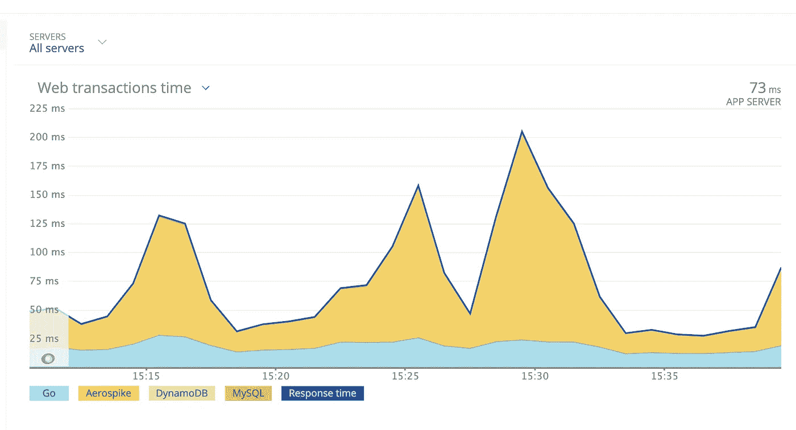

# go:CPU 上下文切换蒙住我们眼睛的时刻

> 原文：<https://levelup.gitconnected.com/go-the-moment-when-cpu-context-switching-blindfolded-us-a7a6eabb2bc1>

为一家拥有庞大客户群的电子商务公司工作，我们在编码时始终牢记的首要事情是保持它足够高的性能，以服务于巨大的流量。

作为一名开发人员，我们用 10 万个请求对应用程序进行基准测试，并试图找出一个断点，确定应用程序或数据库服务器在任何给定时间点可以处理的最大负载。我们称之为 SLA(服务水平协议),它规定了系统可以处理的最大请求数、99%的响应时间、正常运行时间以及其他一些统计数据。

无论我们对服务器进行了多好的基准测试，还是会有很多这样或那样的依赖服务被阻塞的情况，这会导致整个系统的 SLA 违约。这就是监控工具发挥作用的地方，它可以提供单个 API 和组件级别的实时统计数据。 **NewRelic** 就是这样一个监控工具，我们在 **GoIbibo** 使用它来测量应用程序性能，并在系统违反任何 SLA 协议时发出警报。

监控工具对我们来说工作得很好，直到我们在监控工具中发现了一个由 CPU 上下文切换引起的基本漏洞。

**语境**

假设您有一个 Post API，它获取请求、转换数据并将转换后的数据存储到数据库中。



对上述场景中的难点进行分析，我们可以得出结论，处理是应用程序级别的事情，不存在任何瓶颈。唯一的瓶颈在数据库层。数据库可能会因为多种原因而变慢，我们需要一些真实的统计数据以防出错。

为了用代码描述这个场景，我将展示一小段代码

为了说明获得大量并发调用的 post API，我用 1000 个并发请求开始了主进程，每个请求都试图进行一次数据库调用。

为了说明数据库调用被恒定时间延迟，我设置了一个 3 秒钟的休眠，这意味着当数据库模拟在 3 秒钟的恒定时间内返回数据时，在数据库调用之前创建一个事务，并且在数据库调用结束时立即结束，我的假设是，当我查看我的监控工具时，数据库事务花费的时间应该是 3 秒钟。

但这正是我的假设出错的地方。随着并发请求的数量不断增加，数据库的事务时间开始激增，这时我才知道，无论监控工具显示什么，都不仅仅是执行一段代码所花费的时间，而是遵循下面的等式。

```
Transaction Time = Time taken to make DB Call + Time taken by CPU Context Switching
```

迷茫？？？

好吧，让我进一步解释一下引擎盖下发生了什么。在上面提到的代码中，第 24 行

```
runtime.GOMAXPROCS(1)
```

我在一个内核上运行代码，这意味着 CPU 在任何给定的时间点只能运行一条指令。但是我们有成千上万的并发调用，CPU 不能先处理一个请求，然后再处理下一个。它必须确保空闲时间以这样一种方式减少，它可以 100%的效率工作。

在这样的过程中，每当它看到任何数据库调用或系统调用或任何文件 I/O 操作时，它就将这个特定的 goroutine 放在等待队列中，并开始处理其他请求。放在等待队列中的 goroutine 什么时候被服务完全取决于等待队列中已经有多少 go routine 准备被服务？


现在，在处理第一个请求时，我们收到了 5 个其他请求，因为只有一个内核为所有请求提供服务，所以其余的内核继续在队列中等待。一旦第一个 goroutine 遇到一个 DB 或 I/O 调用，它就会被放置在等待队列中。


这意味着 Go routine 1 一直等待数据库调用在后台完成，在我们的例子中是 3 秒钟。

假设队列中有更多的 Goroutine 在等待，处理所有这些需要 4 秒钟，然后返回到 Goroutine 1，之后执行下面的语句。

```
nrTxn.End()
```

完成数据库调用的实际时间只有 3 秒，但是当我们登录到 Newrelic 时，根据等待另一个 CPU 周期所花费的时间，我们记录了 4 秒或更长的时间。

这样，我们就知道在任何监控工具中显示的每个事务的时间是执行指令所用的总时间+如果指令不能在 1 个 CPU 周期内执行，等待获得 CPU 周期的指令所用的总时间。

因此，下一次无论何时您看到任何事务中的峰值，一定要检查系统中的 CPU 峰值。