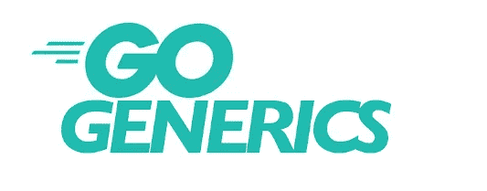

# Go:何时采用 1.18 和泛型

> 原文：<https://levelup.gitconnected.com/go-when-to-adopt-1-18-and-generics-67b55871cfb1>

我一直在急切地等待 Go 中的泛型，所以我一直在使用 1.18，因为它只在操场和测试版中可用。这是一次积极的经历。也就是说，直到最近我才推动我的工作场所升级。为什么？

## TLDR

现在升级发行版，并逐步加入新功能。

## 语言版本

一般用 Go，语言发布都是非常值得信赖的。一般原则使我倾向于等待任何东西的 dot one 版本，但如果我们只是谈论升级到 1.18，我已经在推动升级了。

## 但是它增加了泛型…

1.18 版本增加了泛型，这对于一些人来说是一个有争议的特性，并且增加了不兼容的*语法，所以采用它值得考虑一下。*

## *已解决的问题*

*   *泛型的性能是很多讨论的话题。大部分问题已经尘埃落定，普遍接受的结论是泛型本身不会减慢速度，事实上，它们可以量化地加快速度。它们本身也不是更快，它们确实包含了开销，所以它们应该用在真正需要的地方。*
*   *新语法。它经过仔细考虑，非常稳定，所以不用担心它会在你脚下发生变化。然而，新的泛型语法是一个突破性的变化，必须通过 ide、代码分析工具、文档工具等来解决。当我开始使用 1.18 时，我最喜欢的一些工具被泛型代码卡住了:IntelliJ、codecov、goreportcard、gomarkdoc。但是现在使用新的语法，一切似乎都很好。此外，基本语法没有变化，所以如果您不使用泛型特性，您的代码与以前的版本兼容。*

## *胜负未定*

*   *成语。有了新的功能和语法，新的习惯用法需要时间来适应。什么时候最好使用泛型？实现/命名泛型代码的最好方法是什么？泛型如何最好地适应 Go 的多态性和可变性？到目前为止，在我使用泛型的过程中，我一直摇摆不定，在某些情况下是反复摇摆不定，试图利用这一特性的好处，同时保持代码像习惯用法一样。*

## *那么什么时候领养呢？*

*   *至于语言版本，升级宜早不宜迟。*
*   *对于泛型特性本身，要循序渐进，避免冲动的大规模改变。慢慢地使用它会让你感觉到它真正为你工作的地方，如何避免不恰当地使用它，以及如何创建六个月后你不会觉得讨厌的代码。*