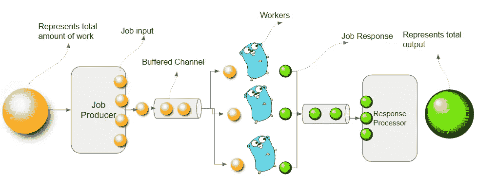

# Go Worker Pool:并发发电站

> 原文：<https://levelup.gitconnected.com/go-worker-pool-the-concurrency-powerhouse-2dc7971f4f15>

最好的“应用程序程序员”被培养成专注于业务需求，他们通常不总是考虑对并发性的需求——这是应该的。我们不会首先想到并发—我们首先想到的是“业务需求”。

编写并发代码所涉及的复杂性通常被抽象在 Go 库或第三方包(例如 HTTP 服务器处理程序)中，但情况并非总是如此。有时，需要以一种不能利用现有库的方式来扩展功能。每个程序员都必须知道如何编写并发代码——一个功能正确的代码如果不能扩展就毫无用处——反之亦然。

在这篇博文中，我将提供一步一步的指导，让“顺序”代码“并发”。我将从一个顺序代码开始，然后重构它，使它成为并发的。这是我在现实生活中的做法——我首先关注业务功能，编写一个顺序正确的代码版本，然后进行重构，使其更加并发。


工人池:Go 的并发模式

***解决业务功能—顺序码***

第一步是正确编写顺序代码。让我们将业务功能封装到一个函数中。

```
businessFunctionality() response
```

***分解业务功能***

想出一些聪明的方法把功能分成小块。如果不能模块化，就不能并行化。

对于探索数据，基于日期探索数据的选项是值得探索的。例如，业务功能可以浏览 1 月 1 日到 12 月 31 日的数据。这可以分为 365(或 366) ***个作业*** —其中每个作业负责一天的数据探索。

```
func businessFunctionalityJob(startTime, endTime time.Time) JobResponse
{
    ...
}
```

整个流程大概是这样的:

```
func businessFunctionality() response
{
    jobStartTime := //startTime
    jobEndTime := //endTime
    jobWindow := 24 * time.Hour var jobResponses []JobResponse
    for currentTime := jobStartTime; currentTime.Before(jobEndTime);        
           currentTime = jobStartTime.Add(jobWindow) {
        jobResponses = append(jobResponses,  
                  businessFunctionality(jobStartTime, jobEndtime)) } return combineResponses(jobResp)
}
```

或者，您可以考虑用某个数字范围来划分业务功能

```
func businessFunctionalityJob(start, end int64) response {
    ...
}
```

更一般地说，

```
type JobInput struct {
   startTime time.Time
   endTime   time.Time
}type JobResponse struct { //keeping this empty for this example. Real-world will be more complex.
}type Response struct {
   finalOutput string
}func businessFunctionality() Response {
   var jobInputs []JobInput //Create job input for each job
   var jobResponses []JobResponse
   for _, jobInput := range jobInputs {
      jobResponses = append(jobResponses,  
                      businessFunctionalityJob(jobInput))
   }
   return combineResponses(jobResponses)
}func combineResponses(jobResponses []JobResponse) Response {
   return Response{finalOutput: "Well done!!"}
}func businessFunctionalityJob(jobInput JobInput) JobResponse {
   return JobResponse{}
}func main() {
   fmt.Println(businessFunctionality().finalOutput)
}
```

***使其平行***

到目前为止，我们已经分解了功能，但在提高性能方面没有取得任何进展。我们可以通过启动多个 go 例程轻松实现并行。

参考:[https://go.dev/play/p/SvW4w7Hy97l](https://go.dev/play/p/SvW4w7Hy97l)

```
func businessFunctionality() Response {
   jobInputs := []JobInput{JobInput{}, JobInput{}}
   var jobResponses []JobResponse
   for _, jobInput := range jobInputs {
     go func() {
       fmt.Println("Executing job..")
       jobResponses = append(jobResponses,
              businessFunctionalityJob(jobInput))
     }()
   }
   return combineResponses(jobResponses)
}
```

但是上面的不行，原因很简单，我们不是在等着围棋套路过去。这是一个改进的版本。

参考:[https://go.dev/play/p/c2bUrYfi6ds](https://go.dev/play/p/c2bUrYfi6ds)

```
func businessFunctionality() Response {
   jobInputs := []JobInput{JobInput{}, JobInput{}}
   var jobResponses []JobResponse
   wg := sync.WaitGroup{}
   for _, jobInput := range jobInputs {
      wg.Add(1)
      go func() {
        defer wg.Done()
        fmt.Println("Executing job..")
        jobResponses = append(jobResponses,
                   businessFunctionalityJob(jobInput))
      }()
   }
   wg.Wait()
   return combineResponses(jobResponses)
}
```

但是现在，对于变量 jobInput 和 jobResponses，上面的代码有一个竞争条件的问题。以下是解决这一问题的方法:

```
func businessFunctionality() Response {
   jobInputs := []JobInput{JobInput{}, JobInput{}}
   jobResponses := make([]JobResponse, len(jobInputs))
   wg := sync.WaitGroup{}
   for idx, jobInput := range jobInputs {
       wg.Add(1)
       go func(jobInputParam JobInput, idx int) {
          defer wg.Done()
          jobResponses[idx] = 
                 businessFunctionalityJob(jobInputParam)
       }(jobInput, idx)
   }
   wg.Wait()
   return combineResponses(jobResponses)
}
```

通过为 jobResponses 创建一个固定长度的数组，我们消除了对数组进行追加的需要——这是一个线程不安全的操作。类似地，通过将 jobInput 作为参数传递给 go 例程，jobInput 也是线程安全的。以下是更新后的代码:

[https://go.dev/play/p/baBmYulv3cl](https://go.dev/play/p/baBmYulv3cl)

上面的方法对于较小的负载会工作得很好，但是你可能最终会创建大量的 go 例程。这可能会导致内存利用率、数据库性能或任何其他有限资源的性能问题。

**控制并行性—引入工人池**

我们将创建一个工人池，然后使用缓冲通道向工人池提供输入。工人将处理每个作业输入(在下图中用一个小黄色球表示)并产生一个作业输出(用一个小绿色球表示)



工池解释！！

响应处理器再次从缓冲通道中读取数据——通过组合响应产生最终响应。

参考:【https://go.dev/play/p/Xha20l7C66a】T4

```
func startWorker(jobInputChan <-chan JobInput, jobOutputChan chan<- JobResponse, wg *sync.WaitGroup) {
   defer wg.Done()
   for jobInput := range jobInputChan {
      jobOutputChan <- businessFunctionalityJob(jobInput)
   }
}func businessFunctionality(jobInputChan chan<- JobInput) {
   jobInputs := []JobInput{JobInput{}, JobInput{}}
   for _, jobInput := range jobInputs {
      jobInputChan <- jobInput
   }
   close(jobInputChan)
}func combineResponses(jobResponses []JobResponse) Response {
    return Response{finalOutput: "Well done!!"}
}func businessFunctionalityJob(jobInput JobInput) JobResponse {
    fmt.Println("Executing Job..")
    return JobResponse{}
}func main() {
    num_of_workers := 3
    jobsChan := make(chan JobInput, 10)
    resultsChan := make(chan JobResponse, 10)
    wg := sync.WaitGroup{} for i := 0; i < num_of_workers; i++ {
       wg.Add(1)
       go startWorker(jobsChan, resultsChan, &wg)
    } go businessFunctionality(jobsChan) var responses []JobResponse
    wgResp := sync.WaitGroup{}
    wgResp.Add(1)
    go func() {
       defer wgResp.Done()
       for resp := range resultsChan {
          responses = append(responses, resp)
       }
    }() wg.Wait()
    close(resultsChan)
    wgResp.Wait() fmt.Println(combineResponses(responses).finalOutput)
}
```

***使用同步。WaitGroup***

为了正确使用工作池模式，“等待组”是一个需要理解的重要概念。在上面的代码中，两次使用“等待组”来等待 worker“go routes”的并行执行和结果通道“go routine”的并行执行。

**结论**

“worker pool”在开始时可能不容易理解，它需要理解缓冲通道、 *sync.waitGroup* 和 goroutines。但是一旦你理解了事情是如何累加的——实现模式就变得非常直观了。我经常用它来扩展我的应用程序。