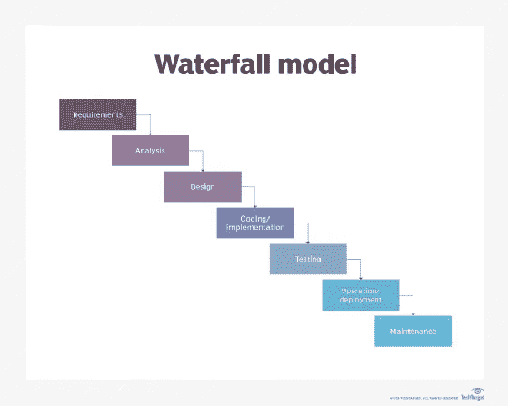

# 从零到极限编程

> 原文：<https://levelup.gitconnected.com/going-from-zero-to-extreme-programming-c6a34e2ed0be>

我是一名大学毕业生，在一家大公司从事企业级软件工作，每天独自坐在小隔间里至少 4-5 个小时。还有比这更好的吗？

Photo by [立志 牟](https://unsplash.com/@zhushuibuxing?utm_source=medium&utm_medium=referral) on [Unsplash](https://unsplash.com?utm_source=medium&utm_medium=referral)

如果你和我谈论极端的编程实践，比如测试驱动开发、结对编程，以及使用工作软件而不是复杂的需求文档，那么我会把它当成疯狂的谈话而不予理会。

> 极限编程(XP)是一种软件开发方法，旨在提高软件质量和对不断变化的客户需求的响应能力。

我以那个角色工作了几年，没有写任何测试，手动编译和测试软件，并在我的机器上检查它，然后将它合并到 SVN 或 [Rational Clearcase](https://en.wikipedia.org/wiki/Rational_ClearCase) 主分支。

*我非常擅长手工测试边缘案例。没有别的办法。*

我充其量是一个平庸的程序员，我知道一些算法，但只是在代码审查期间偶尔得到反馈。这是一个 2 小时的活动，有时至少有 3 个人坐在会议室里！

进展缓慢，项目启动需要几周或几个月，向客户交付主要版本需要几个月或几年。每个项目都是从[的提案请求](https://en.wikipedia.org/wiki/Request_for_proposal)开始的，客户会要求投标，看看谁能以最好的价格最好地解决他们的问题。

一个由来自会计、项目管理、工程和其他部门的不同人员组成的团队会在一个房间里呆上几个星期，敲定一份合同投标，然后提交给客户。几个月后，他们会收到客户的回复，说他们的投标被接受了，他们可以开始工作了。从那里开始，一个项目团队被组织起来，收集需求，计划工作，并找出人员需求，以便为项目配备人员。通常这最终会成为一个叫做*需求文档*的大文档。

*需求文档*将与客户一起工作，关于软件的一切都将敲定。这将是整个系统应该如何架构的实现指南。

如果这个过程听起来很熟悉，可能对许多人来说都是如此。它通常有另一个名字。

*瀑布*

正如您从图表中看到的，系统是以一种良好有序的方式构建的，您从一个阶段进入下一个阶段，最后您将您的软件系统交付给您高兴的客户，他当然是喜出望外！他们并没有因为开发时间比预期的长了 2 年而沮丧，他们得到了一个满足他们需求的系统！

瀑布的问题是缺乏反馈，没有办法学习新的东西并回到过程中的早期状态。

这是我学习构建企业软件的方式，直到我加入了一个敏捷团队，我才知道得更好。

这个团队不是拼凑一个巨大的*需求文档*，而是每周与客户交谈并向他们演示系统，以便他们可以提供反馈。团队中有了更多的交流，我们一直在尝试新的功能。这感觉很好，但仍然很慢。我们构建了一些特性，但是直到几个月后系统“处于良好状态”时才部署到生产环境中。

大约在这个时候，我有几个朋友加入了一家初创公司，在 Pivotal Labs 工作，他们整天都在配对编程，每天早上都有免费早餐！谁不想每天吃免费早餐呢？！？

我申请加入他们，但不幸的是，我主要从事 Java 工作，他们需要至少有一些 Ruby on Rails 经验的人。

*我被压垮了。*

照片由[弗朗西斯科·冈萨雷斯](https://unsplash.com/@franciscoegonzalez?utm_source=medium&utm_medium=referral)在 [Unsplash](https://unsplash.com?utm_source=medium&utm_medium=referral) 上拍摄

我在工作之余开始从事 Ruby on Rails 项目，尽可能多地学习测试和 Ruby 编程语言。

我在另一家公司获得了另一次机会，这家公司也与 Pivotal Labs 合作。我参加了面试，但还是没有足够的 Ruby on Rails 经验。 **FML** 。

我继续学习 Ruby on Rails，并开始参加一个新的 Ruby on Rails 聚会，地点和 Pivotal Labs 办公室在同一个办公空间。我去了这个聚会大约一个月，然后接到一个电话。

那是第二家公司，他们说如果我感兴趣，他们会给我一个机会。

**是的！**

**免费早餐解锁！**

照片由[甘](https://unsplash.com/@carissagan?utm_source=medium&utm_medium=referral)在 [Unsplash](https://unsplash.com?utm_source=medium&utm_medium=referral)

我在这家公司工作了 3.5 年多，学到了很多关于极限编程的知识。我们是一个 5-8 人的团队，维护着多个系统，大概有 50-100K 行生产代码，很少甚至没有生产问题。

结对编程的头几周令人难以置信地疲惫不堪，以至于我回家后甚至不想看电脑或视频游戏。但是我学到了很多，我能够向高级开发人员学习，学习他们十多年编程磨练出来的技巧和诀窍。

我学习了 TDD、Ruby、Ruby on Rails、面向对象编程和许多其他主题。我参加了更多的聚会，对 IntelliJ 中的键盘快捷键非常在行。我成了我手艺的主人。

极限编程改变了我对构建软件系统的看法。当我在一个立方体农场工作时，我会去工作，拼凑一些解决方案，回家，玩电子游戏或者和我的女朋友出去玩。编程只是我做的一份工作或一项任务，并不有趣。

现在构建软件系统正在解决一个现实世界的问题。我怎样才能以最好的方式解决这个问题？这是一个可能需要几周或几个月才能解决的难题，如果你可以不构建任何软件，有时甚至需要一天(感谢精益创业！).

如果你还没有尝试过极限编程的一些实践，那么我鼓励你尝试一下。我保证你会对自己有所了解，并有希望体验到合作解决问题的乐趣。

如果你想知道更多，请查阅[肯特·贝克关于极限编程的书](https://amzn.to/3ji8t3V)。

如果你喜欢这篇文章，考虑[订阅媒体](https://medium.com/@ascourter/membership)！

如果你或你的公司有兴趣找人进行技术面试，那么请在 Twitter ( [@Exosyphon](http://twitter.com/Exosyphon) )上给我发 DM，或者访问我的[网站](https://andrewcourter.com/)。如果你喜欢这样的话题，那么你可能也会喜欢我的 Youtube 频道。如果你喜欢 3D 打印的东西，可以去我的 [Etsy 商店](https://www.etsy.com/listing/1273702925/6-sided-fidget-cube)看看。祝您愉快！