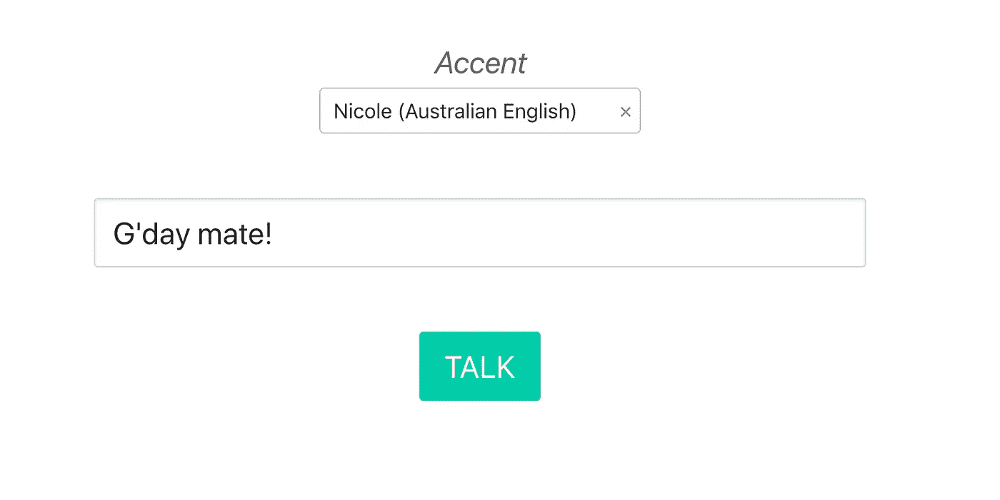
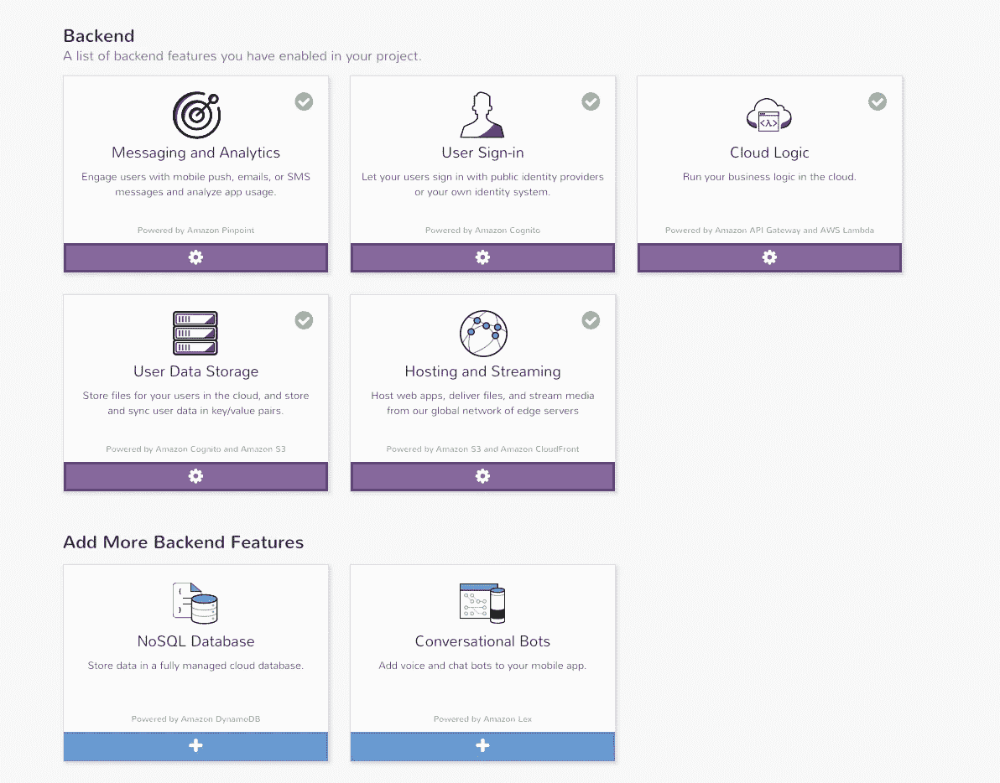
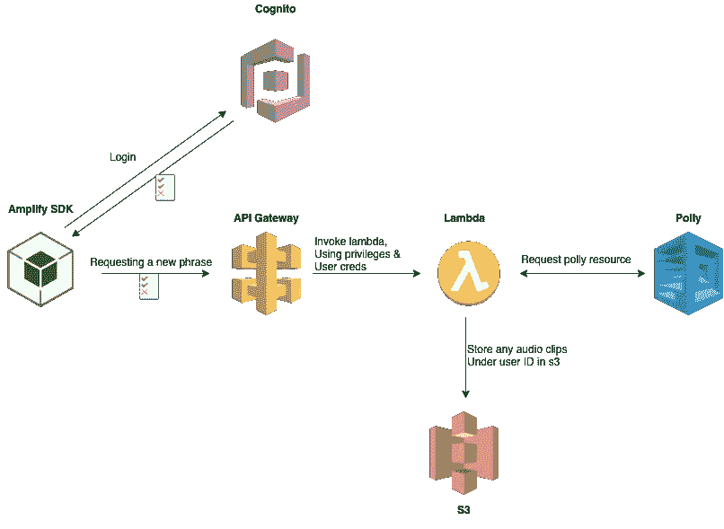
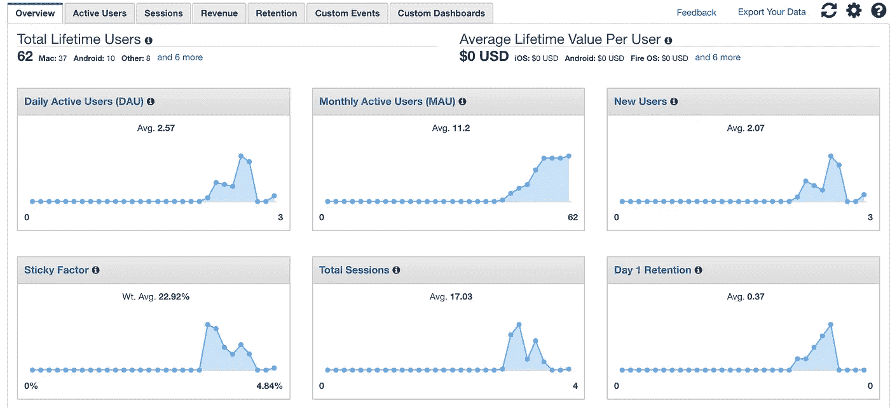

# 使用 AWS Cognito、Lambda、S3 和波利设计无服务器应用程序

> 原文：<https://levelup.gitconnected.com/going-serverless-on-aws-b6d78b43e691>

无服务器宣传列车已经存在了一段时间，我一直在寻找跳上去。几个原因

*   没有服务器管理！AWS 雇佣了一支军队来确保您的 99.x% SLA 得到保证
*   1000 个并发 lambda 作业，也称为无限规模
*   💸💸💸钱！不需要为没人用的应用运行服务器😿
*   通过使用预建服务(科宁托/波利/S3)节省开发人员的时间

在我的项目中，我决定用 AWS Polly 做一个口音应用程序。Polly 应该与源语言一起使用。但是使用外国声音会产生一些有趣的结果。在*查看，在查看[代码。](https://github.com/nathanmalishev/awsServerlessAccents)*

**

*参观 accents.nathanmalishev.com*

# *方法*

*当我开始这个项目时，我最初想使用 Cognito，Dynamodb & S3。但说实话，被这么多新服务搞得不知所措。这时候我发现 [AWS 移动](https://aws.amazon.com/mobile/) & [AWS 放大](https://github.com/aws/aws-amplify)。本质上，AWS Mobile 是使用各种 AWS 服务的快速入门，重点是构建应用程序(web/ios/android)。有一个 web UI，只需点击一个按钮，就可以自动提供 lambda 函数& api 网关、s3 存储桶等。同时，cli 代理可方便地发布在本地运行的应用程序&。*

**

*AWS 移动用户界面*

*AWS Amplify 只是一个 web sdk (javascript)，它使您的应用程序更容易集成到 AWS 生态系统中。它自动处理 s3 的验证、存储、调用 lambda 函数、分析等等。这是非常强大的，我会推荐它。AWS Mobile 是一种方便的入门方式，但还不太适合生产。我正在修改一个预配置的 API 网关，这时更改一个设置导致整个 cloudformation 堆栈中断并进入一个不可恢复的状态。*

***无服务器设计***

*amplify SDK 的加入简化了我最初的设计，因为它可以毫不费力地为来自 S3 的用户处理获取项目。这消除了对 Dynamodb 的需求，因为 amplify 处理用户和文件访问的授权。最后有一个生成音频文件的主流程，就像所有其他多余的动作一样，比如[获取可用的声音](https://github.com/nathanmalishev/awsServerlessAccents/blob/93e0c6279ade8bb99a63f2f8f6b21c86209aa009/src/Input.js#L86)，或者[获取以前的音频文件](https://github.com/nathanmalishev/awsServerlessAccents/blob/93e0c6279ade8bb99a63f2f8f6b21c86209aa009/src/List.js#L51)，这些都由 Amplify sdk 直接处理。*

**

*无服务器架构*

*Cognito 用作联合身份管理器来管理来自脸书或谷歌的用户身份验证。Amplify 然后存储这些凭证以备将来所有请求。这些凭证包含用户的角色和授权细节，并在每次连续请求时由 API gateway 进行检查。lambda 函数只是创建一个音频广告，并将其存储在 S3 的用户 id 下——只有特定用户才有资格访问该 id，并由 Amplify SDK 处理。*

***结果***

*我现在有一个部署我的口音应用程序，应该只花我几分钱运行！之前在我的 t4.micro stack 上部署它，每个月每台服务器的运行成本大约是 10 美元，而且你总是喜欢运行两台以实现冗余。Lambda 免费层每月有 1，000，000 个免费请求，价格为 0.2 美元，另外 100 万个请求。不用说，我会把我所有的应用程序都转移到 lambda。API Gateway、Polly & S3 也有相关费用，但它们要么免费，要么可以忽略不计。*

*此外，如果 accent 演示奇迹般地传播开来，它可以处理任何流量高峰，因为任何 AWS 服务都是为可扩展性而构建的。*

***分析***

*使用 AWS 移动堆栈的一个很酷的额外功能是所有内置的默认分析；从用户统计，人口统计，管理活动，跟踪广告管理和任何自定义事件，你能想到的。*

**

*AWS 分析仪表板*

***感谢**的阅读，如果你想了解这个项目，请点击这里的[源代码](https://github.com/nathanmalishev/awsServerlessAccents)并阅读自述文件！*